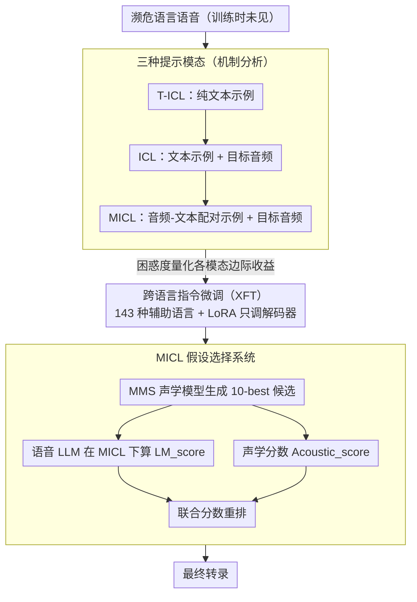

# Multimodal In-Context Learning for ASR of Low-Resource Languages

**会议**: ACL 2026  
**arXiv**: [2601.05707](https://arxiv.org/abs/2601.05707)  
**代码**: [github](https://github.com/ZL-KA/MICL)  
**领域**: 音频与语音 / 低资源语音识别  
**关键词**: 多模态上下文学习, 低资源 ASR, 语音大语言模型, 跨语言迁移, 假设选择

## 一句话总结

系统研究多模态上下文学习（MICL）能否使语音 LLM 学习未见过的濒危语言，并提出基于 MICL 的假设选择系统，结合声学模型与语音 LLM 的互补优势，在三种濒危语言上显著提升 ASR 性能。

## 研究背景与动机

**领域现状**：全球 7000+ 种语言中，当前 ASR 系统仅覆盖极小部分，主要瓶颈是标注数据稀缺。语音大语言模型（如 Phi4、Qwen3-Omni）虽具备强大的多任务能力，但其性能仍局限于训练时覆盖的高资源语言。

**现有痛点**：(1) 现有 ICL 研究主要聚焦文本模态和高资源语言；(2) 语音 LLM 的多模态 ICL（MICL）在未覆盖语言上的有效性未被充分研究；(3) 直接用语音 LLM 做 prompt-based ASR 对未见语言效果极差（WER > 100%）。

**核心矛盾**：语音 LLM 具有强大的上下文学习能力，但在数据稀缺的濒危语言上如何有效利用这种能力尚不清楚。

**本文目标**：验证 MICL 对未见语言的有效性，分析其内部机制，并构建实用的 ASR 系统。

**切入角度**：设计系统性实验——对比文本 ICL、音频+文本 ICL、多模态 ICL 三种模态设置，在三种不同语系的濒危语言上评估两个语音 LLM。

**核心 idea**：MICL 虽不能直接让语音 LLM 产生好的转录，但可以通过假设选择（hypothesis selection）的方式与声学模型结合，利用 MICL 的语言理解能力重排候选转录。

## 方法详解

### 整体框架

论文要回答的是：语音 LLM 能不能靠多模态上下文学习（MICL）去“现学”一门训练时从没见过的濒危语言，并把这种能力真正变成可用的 ASR 系统。整套工作分三步走。先做 MICL 机制分析：设计 T-ICL（纯文本）、ICL（文本+目标音频）、MICL（音频-文本对+目标音频）三种提示模式，用困惑度量化每种模态带来的边际收益。再做跨语言微调：在 143 种辅助语言（排除目标语言）上做 MICL 指令微调，看这种“学格式、不学语言”的迁移是否成立。最后落到假设选择系统：MMS 声学模型先生成 N-best 候选，语音 LLM 通过 MICL 算语言模型分数，两者联合重排选出最优转录。

### 关键设计

**1. 三种提示模态：把文本、目标音频、配对示例的贡献逐一拆开测**

直接拿语音 LLM 对未见语言做 prompt-based ASR，效果差到 WER 超过 100%，所以必须先搞清楚上下文里到底是哪一部分在起作用。论文用三种提示把模态贡献隔离开来：T-ICL 只给文本示例（$c_i = t_i$），测纯文本上下文的贡献；ICL 在文本示例外再加目标音频 $a^*$，隔离目标音频本身的作用；MICL 给出配对的音频-文本示例（$c_i = (a_i, t_i)$）再加 $a^*$，测“成对示范”相比纯文本的额外收益。三者用困惑度对比，就能量化每加一种模态边际上降了多少 PPL——结果显示 MICL 让两个语音 LLM 的困惑度都随示例数持续下降，证明这种现学是真的在发生。

**2. 跨语言指令微调（XFT）：让模型学会“怎么用上下文”，而不是去背目标语言**

濒危语言本身数据极少（每种只有 2–4 小时），不可能直接在目标语言上充分训练。论文转而在 ML-SUPERB 2.0 的 143 种语言（明确排除目标语言）上做 MICL 指令微调，用 LoRA 只更新解码器参数、冻结其余，训练时每条样本随机挑 1–10 个上下文示例。这样调出来的模型学到的是“如何遵循 MICL 提示格式、如何有效利用上下文示例”这套通用能力，而不是任何一门具体语言的知识——所以它在从没训练过的目标语言上依然能受益，实验里 Kichwa 上的 XFT 效果已经逼近直接在目标语言上微调。

**3. MICL 假设选择系统：用声学模型和语音 LLM 的互补性重排候选**

声学模型擅长基础的音到字识别，语音 LLM 擅长上下文层面的语言理解，谁都不完美。论文不强行让语音 LLM 端到端转写，而是让它做重排：给定 MMS 输出的 10-best 候选列表，用联合分数

$$\hat{h} = \arg\max_{h^{(k)}} \big[\text{Acoustic\_score}(h^{(k)}) + \text{LM\_score}_{MICL}(h^{(k)})\big]$$

选出最终假设，其中 $\text{LM\_score}_{MICL}$ 就是语音 LLM 在 MICL 条件下对该候选的 log-likelihood。声学分数保证候选不偏离发音，MICL 语言分数则借上下文示例把更通顺、更符合该语言习惯的那条候选顶上来，两者相加正好补齐彼此短板，且整套系统不需要端到端训练。

### 损失函数 / 训练策略

微调时只对目标转录 token 计算损失，上下文示例仅作为条件输入；适配用 LoRA，冻结其余参数。评估上用困惑度（PPL）做配置选择，用词错率（WER）做最终评估。

## 实验关键数据

### 主实验（Qwen3-Omni 困惑度，预训练模型）

| 语言 | 任务 | 0样本 | 1样本 | 5样本 | 10样本 | 50样本 | 100样本 |
|---|---|---|---|---|---|---|---|
| Khinalug | T-ICL | 1302 | 289 | 69 | 57 | 44 | 43 |
| Khinalug | ICL | 54 | 28 | 11 | 10 | 11 | 15 |
| Khinalug | MICL | 58 | 30 | 9 | 10 | 8 | 13 |
| Kichwa | ICL | 18 | 10 | 5 | 4 | 3 | 3 |
| Kichwa | MICL | 17 | 7 | 4 | 4 | 3 | 4 |
| Mboshi | ICL | 178 | 51 | 21 | 16 | 10 | 9 |
| Mboshi | MICL | 189 | 34 | 13 | 10 | 7 | 9 |

### 假设选择 WER 结果

| 模型 | Khinalug | Kichwa | Mboshi |
|---|---|---|---|
| 声学模型 (MMS) | 42.1 | 17.3 | 31.4 |
| Phi4 ASR-FT | 41.5 | 17.4 | 29.9 |
| Phi4 XFT | 41.0 | 17.1 | 29.6 |
| Phi4 TFT | 40.8 | 16.6 | 28.6 |
| Qwen3-Omni | 40.7 | 17.2 | 30.0 |
| N-gram LM | 39.6 | 17.7 | 30.6 |
| Oracle | 36.5 | 12.4 | 22.1 |

### 关键发现

- MICL 使两个语音 LLM 均能学习未见语言，增加上下文样本数持续降低困惑度
- Qwen3-Omni 在长上下文（100样本）下持续受益于音频示例，Phi4 则主要在短上下文（≤3样本）时受益
- 注意力分析揭示模型将更多注意力分配给文本（65-70%）而非音频（30-35%），且呈现层依赖模式
- 跨语言微调在 Kichwa 上接近目标语言微调效果，表明语言多样性可增强泛化

## 亮点与洞察

- **MICL 对未见语言有效**：首次系统证明语音 LLM 可通过多模态上下文学习未覆盖的濒危语言
- **注意力机制解析**：发现层依赖的模态偏好模式——浅层和深层偏好音频，中间层偏好文本
- **实用系统设计**：声学模型 + 语音 LLM 的假设选择系统简单有效，不需要端到端训练

## 局限与展望

- 受计算限制，跨语言微调仅在 Phi4 上进行
- 微调时上下文样本数限制为 1-10，可能限制了长上下文的效果
- 三种濒危语言的数据量极小（2-4 小时），结论的泛化性需验证
- 未来可探索更大规模的跨语言指令微调和更多濒危语言

## 相关工作与启发

- 与 text-based ICL for low-resource languages (Li & Niehues, 2025b) 的多模态扩展
- 假设选择思路可推广到其他低资源模态任务
- 注意力分析发现与视觉 LLM 中的文本偏向现象一致

## 评分

- **新颖性**: ⭐⭐⭐⭐ 首次系统研究 MICL 在濒危语言 ASR 中的效果，角度独特
- **实验充分度**: ⭐⭐⭐⭐ 3 种语言 × 2 个模型 × 多种 ICL 设置 × 注意力分析，覆盖全面
- **写作质量**: ⭐⭐⭐⭐ 实验设计清晰系统，各设置的对比逻辑严密
- **价值**: ⭐⭐⭐⭐ 为濒危语言的 ASR 提供了新的技术路径，具有社会价值

<!-- RELATED:START -->

## 相关论文

- [\[ACL 2026\] Hard to Be Heard: Phoneme-Level ASR Analysis of Phonologically Complex, Low-Resource Endangered Languages](hard_to_be_heard_phoneme-level_asr_analysis_of_phonologically_complex_low-resour.md)
- [\[ACL 2025\] GigaSpeech 2: An Evolving, Large-Scale and Multi-domain ASR Corpus for Low-Resource Languages](../../ACL2025/audio_speech/gigaspeech2_low_resource_asr.md)
- [\[ACL 2026\] DRInQ: Evaluating Conversational Implicature with Controlled Context Variation](drinq_evaluating_conversational_implicature_with_controlled_context_variation.md)
- [\[ICML 2026\] Algorithmic Recourse of In-Context Learning for Tabular Data](../../ICML2026/audio_speech/algorithmic_recourse_of_in-context_learning_for_tabular_data.md)
- [\[ACL 2026\] Indic-CodecFake meets SATYAM: Towards Detecting Neural Audio Codec Synthesized Speech Deepfakes in Indic Languages](indic-codecfake_meets_satyam_towards_detecting_neural_audio_codec_synthesized_sp.md)

<!-- RELATED:END -->
