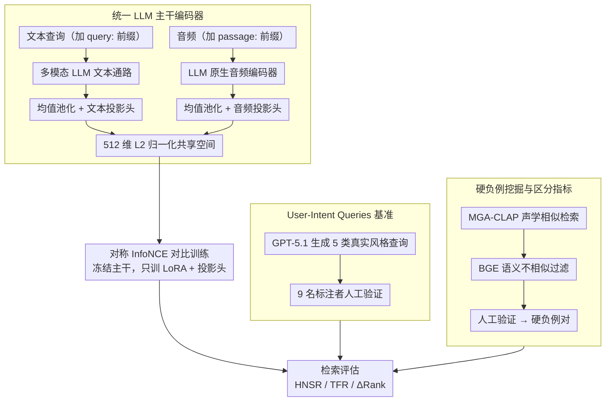

# Omni-Embed-Audio: Leveraging Multimodal LLMs for Robust Audio-Text Retrieval

**会议**: ACL 2026  
**arXiv**: [2604.18360](https://arxiv.org/abs/2604.18360)  
**代码**: [Web Demo](https://omni-embed-audio.github.io)  
**领域**: 多模态VLM / 音频检索  
**关键词**: 音频文本检索, CLAP, 多模态LLM, 用户意图查询, 硬负例区分

## 一句话总结
本文提出 OEA（Omni-Embed-Audio），利用多模态 LLM 作为统一编码器构建检索导向的音频-文本嵌入空间，并引入 User-Intent Queries（UIQ）基准和硬负例区分指标（HNSR/TFR），发现 LLM 主干在 T2T 检索（+22%）和硬负例区分（+4.3%p HNSR@10）上显著优于 CLAP 系列方法。

## 研究背景与动机

**领域现状**：基于对比语言-音频预训练（CLAP）的方法已成为音频文本检索的主流范式，最新的 M2D-CLAP 通过自监督掩码建模结合 CLAP 达到 SOTA。标准基准（AudioCaps、Clotho）上的性能持续提升。

**现有痛点**：（1）标准基准使用的是描述性标题式查询（caption-style queries），与真实搜索行为差异巨大——真实 Freesound 查询平均仅 1.8 个词；（2）面对释义查询时，现有模型性能下降高达 16%；（3）现有评估指标只检查目标是否被检索到，不衡量模型是否能抑制声学相似但语义不同的干扰项——即缺乏区分能力评估。

**核心矛盾**：CLAP 模型的文本编码器轻量且优化为与音频对比对齐，将整个查询压缩为"内容袋"向量——这使得它们无法处理否定语义（"不要雷声"）和细粒度语义区分，而这恰是真实搜索场景的核心需求。

**本文目标**：（1）构建基于多模态 LLM 的统一检索编码器；（2）系统化评估多种真实查询类型下的检索鲁棒性；（3）提出能衡量硬负例区分能力的新指标。

**切入角度**：LLM 在指令跟随预训练中接触了大量否定模式（"不要"、"除了"），其注意力机制可以保持复合语义结构——与 CLAP 的轻量文本编码器形成互补。

**核心 idea**：用具有原生音频理解能力的多模态 LLM 作为统一编码器，搭配 LoRA 适配和对比学习，在检索质量和语义区分上超越专用 CLAP 模型。

## 方法详解

### 整体框架
OEA 的核心是把一个原生支持音频理解的多模态 LLM 改造成"既能编码文本、又能编码音频"的统一检索编码器，从而绕开 CLAP 那种双编码器在文本侧表达力不足的瓶颈。输入端，文本查询加 "query:" 前缀走 LLM 文本通路，音频加 "passage:" 前缀走 LLM 原生音频编码器；两路都对最后隐层做均值池化，再经各自的模态投影头压到同一个 512 维 L2 归一化空间，使文本与音频可以直接做余弦相似度检索。训练时主干权重全程冻结，只更新 LoRA 适配器和投影头，整套方法配套提出了贴近真实搜索的 UIQ 查询基准与衡量"区分硬负例"能力的 HNSR/TFR 指标。

### 关键设计

**1. 统一 LLM 主干编码器：让音频检索吃到语言先验**

CLAP 系方法用一个轻量文本编码器把整条查询压成"内容袋"向量，处理不了"不要雷声"这类否定语义，也分不清细粒度差异。OEA 改用 Nemotron-3B、Qwen2.5-Omni-3B/7B 这类自带音频理解的多模态 LLM 作共享主干，文本和音频共用同一个 Transformer，音频表示因此直接继承了 LLM 在指令预训练中积累的丰富语言先验。落地上把 LoRA 适配器挂在注意力层、再加模态特定投影头映射到 512 维空间，主干完全冻结、只训 LoRA 与投影头——可训练参数仅占总量的 0.29–0.36%（约 11–16M），就把一个生成式 LLM 转成了对比检索编码器。

**2. User-Intent Queries（UIQ）基准：用真实查询风格压测鲁棒性**

标准基准只有标题式查询，而真实 Freesound 查询平均才 1.8 个词，二者差距导致评测严重失真。UIQ 定义 5 种查询类型并归为三大类：对话型（Question 自然问句、Imperative 命令式指令）、改写型（Keyphrase 关键词、Paraphrase 同义改写）、排除型（Negative 指定要排除的内容）。这些查询由 GPT-5.1 在词汇与长度约束下生成，并经 9 名标注者人工验证（均分 4.15/5）。命令式和排除式查询正是现有基准缺失、也最考验语义理解的部分，UIQ 把它们系统地补了进来。

**3. 硬负例挖掘与区分指标（HNSR/TFR）：检索到目标还要压住干扰项**

标准 R@k 只看目标有没有被检索到，但对排除式查询来说，能否同时把声学相似、语义不同的干扰项压到 top-k 之外才是真正的难点。为此论文设计了四阶段硬负例挖掘流水线——MGA-CLAP 声学相似检索 → BGE 文本语义不相似过滤 → 人工验证 → 构成（目标音频, 硬负例音频）对，并定义 HNSR@k 为"目标在 top-k 内且硬负例在 top-k 外"的比例，再用 $\Delta\text{-Rank} = \text{Rank(HN)} - \text{Rank(Target)}$ 量化二者的排名分离度。这两个指标填补了排除式查询评估的空白。

### 损失函数 / 训练策略
使用对称 InfoNCE 对比损失，温度 $\tau = 0.07$，并采用多阶段课程：先在 WavCaps（275K 样本）上做初始音频-文本对齐，再用 AudioCaps v2（91K 样本）精调，可选叠加 Clotho v2 数据（记为 +Cl）。优化器为 AdamW，训练走 PyTorch DDP + BFloat16。

## 实验关键数据

### 主实验（T2A 检索）

| 模型 | AudioCaps R@5 | Clotho R@5 | MECAT R@5 |
|------|-------------|-----------|----------|
| M2D-CLAP | **77.13** | 42.91 | 23.55 |
| OEA-Nemo3B | 72.64 | 40.57 | **24.53** |
| OEA-Qwen3B (+Cl) | 69.35 | **49.78** | 17.16 |
| OEA-Qwen7B | 72.25 | 44.78 | 23.29 |

### T2T 检索与硬负例区分

| 模型 | Clotho T2T R@1 | MECAT T2T R@5 | HNSR@10 |
|------|---------------|--------------|---------|
| M2D-CLAP | 55.85 | 38.74 | 30.3% |
| OEA-Qwen7B (+Cl) | **63.58** | **47.41** | **34.6%** |
| 相对提升 | +13.8% | +22.4% | +4.3%p |

### 关键发现
- T2A 检索上 OEA 与 M2D-CLAP 大致持平，M2D-CLAP 在 in-domain AudioCaps 上更强，OEA 在跨域（Clotho/MECAT）上泛化更好
- T2T 检索上 OEA 大幅领先（+22% 相对提升），因为 LLM 主干的文本理解能力远超 CLAP 的轻量文本编码器
- 命令式查询上 OEA 独占优势（+5.1%p），来源于 LLM 的指令跟随预训练
- 硬负例区分上 OEA 显著更强（HNSR@10 +4.3%p, TFR@10 +34.7%），LLM 的注意力机制保持了否定语义的复合结构
- 7B 模型不总是优于 3B——检索质量更受对比对齐和数据-主干匹配度的制约

## 亮点与洞察
- **"能力互补"论断**非常清晰——M2D-CLAP 在 in-domain caption-style 检索上更强，OEA 在 T2T 和语义区分上更强，两者适用场景不同，论文给出了明确的部署决策规则
- HNSR/TFR 指标的提出填补了排除式查询评估的空白——标准 R@k 无法区分"检索到目标但硬负例也混入"和"干净检索到目标"
- 仅训练 0.29-0.36% 的参数就能把 LLM 转化为检索编码器，极其参数高效

## 局限与展望
- OEA 依赖具有原生音频理解的多模态 LLM 主干，限制了可选基座的范围
- 内存占用远大于 CLAP（18.3GB vs ~0.6GB），边缘设备部署需要量化或蒸馏
- 硬负例用 MGA-CLAP + BGE 过滤可能遗漏某些类型的声学混淆
- UIQ 由单一 LLM 生成，虽有人工验证但可能未覆盖所有真实查询风格
- 未评估在多语言音频检索场景下的表现
- 音频编码延迟较高（Qwen7B 达 666ms/clip），实时场景需预计算

## 相关工作与启发
- **vs M2D-CLAP (Niizumi et al., 2025)**: M2D-CLAP 在 T2A 上更强但 T2T 和区分能力不足；OEA 在语义理解上的优势来源于 LLM 主干
- **vs RobustCLAP (Selvakumar et al., 2024)**: RobustCLAP 针对释义鲁棒性做了优化但未处理排除式查询；OEA 通过 LLM 天然处理否定语义
- **vs NevIR/ExcluIR (Weller et al., 2023)**: 这些工作发现文本检索模型在否定查询上表现接近随机，OEA 证明 LLM 主干可以部分解决这个问题

## 评分
- 新颖性: ⭐⭐⭐⭐ 用多模态 LLM 做音频检索编码器是新角度；UIQ 基准和区分指标有贡献
- 实验充分度: ⭐⭐⭐⭐⭐ 3个数据集、6个 OEA 变体、4个 CLAP 基线、5种查询类型、多维度分析
- 写作质量: ⭐⭐⭐⭐ 结论清晰、实验设计周全，部署建议实用
- 价值: ⭐⭐⭐⭐ 对音频检索评估范式有推进，UIQ 基准可被社区广泛使用

<!-- RELATED:START -->

## 相关论文

- [\[ACL 2026\] Protecting Bystander Privacy via Selective Hearing in Audio LLMs](protecting_bystander_privacy_via_selective_hearing_in_audio_llms.md)
- [\[CVPR 2026\] OmniRet: Efficient and High-Fidelity Omni Modality Retrieval](../../CVPR2026/audio_speech/omniret_efficient_and_high-fidelity_omni_modality_retrieval.md)
- [\[ACL 2026\] PlanRAG-Audio: Planning and Retrieval Augmented Generation for Long-form Audio Understanding](planrag-audio_planning_and_retrieval_augmented_generation_for_long-form_audio_un.md)
- [\[ACL 2026\] Music Audio-Visual Question Answering Requires Specialized Multimodal Designs](music_audio-visual_question_answering_requires_specialized_multimodal_designs.md)
- [\[NeurIPS 2025\] Node-Based Editing for Multimodal Generation of Text, Audio, Image, and Video](../../NeurIPS2025/audio_speech/node-based_editing_for_multimodal_generation_of_text_audio_image_and_video.md)

<!-- RELATED:END -->
