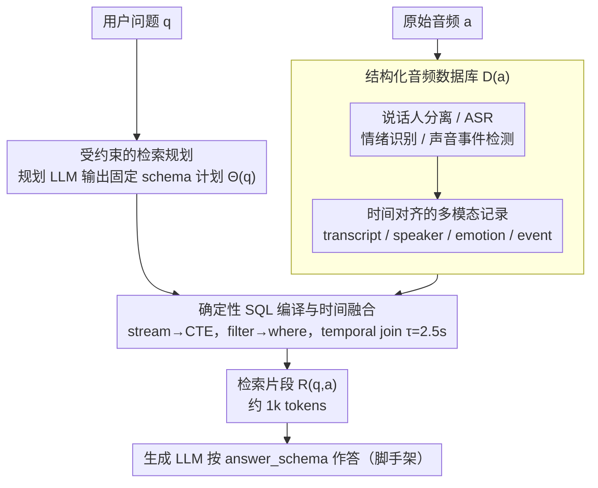

# PlanRAG-Audio: Planning and Retrieval Augmented Generation for Long-form Audio Understanding

**会议**: ACL2026  
**arXiv**: [2605.20414](https://arxiv.org/abs/2605.20414)  
**代码**: 论文称数据和代码将在接收后公开  
**领域**: 长音频理解 / Audio RAG  
**关键词**: 长音频理解、检索规划、结构化音频数据库、SQL 检索、多模态音频推理

## 一句话总结
PlanRAG-Audio 将长音频理解改写为“先规划要查哪些模态和时间片，再从结构化音频数据库检索证据”的问题，从而把 60 分钟音频的 LLM 输入从约 115k tokens 降到约 1k tokens，并显著提升说话人计数、事件排序和 speaker-constrained QA。

## 研究背景与动机
**领域现状**：大型音频语言模型可以处理语音内容、说话人、情绪和非语音事件，但长音频会迅速带来 token 和记忆瓶颈。例如一小时讲座大约对应 12k 文本 tokens，却可能超过 100k speech tokens。文本 RAG 已经证明“只取相关证据”能缓解长上下文问题，但音频 RAG 还需要处理多模态和时间对齐。

**现有痛点**：许多长音频方法先 ASR 成文本再做 NLP，这会忽略语调、说话人、情绪和背景事件。直接把整段音频交给长上下文模型又成本高、输出格式不稳定，且对 speaker diarization、emotion recognition、sound event detection 等非文本任务支持不足。

**核心矛盾**：长音频难点不仅是输入长，还在于问题常跨越多个异构线索。一个问题可能要求同时知道某个说话人的话、某段时间的情绪、背景事件顺序和输出格式。没有显式规划时，模型既不知道该看哪些流，也容易在无关信息里丢失关键证据。

**本文目标**：作者希望构建一个可复现、零样本、任务无关的长音频理解框架，让模型先产生结构化检索计划，再用确定性 SQL 从音频数据库中取回相关片段，最后用紧凑证据生成答案。

**切入角度**：论文把音频预处理结果组织成时间对齐的数据库。LLM 不再直接吃整段音频，而是生成一个 constrained retrieval plan，指定 stream、filter、fusion、return fields 和 answer schema。

**核心 idea**：用规划式结构化检索把长音频推理外部化为数据库查询，让 LLM 只处理与问题相关的少量跨模态证据。

## 方法详解

### 整体框架
PlanRAG-Audio 要解决的是“一小时音频塞进 LLM 又长又贵又不稳”的问题。它的关键不是换一个更强的音频 encoder，而是把“听完整段音频再回答”改写成“离线建库 + 在线规划检索 + 确定性执行 + 紧凑生成”，让模型只处理与问题相关的少量跨模态证据。

第一阶段，系统对原始音频做 speaker diarization、ASR、emotion recognition 和 sound event detection，把结果组织成时间对齐的音频数据库 $D(a)$。第二阶段，规划 LLM 根据用户问题生成检索计划 $\Theta(q)$，决定要查哪些 stream、用什么 filter、怎样融合多 stream、返回哪些字段，以及最终答案的 schema。第三阶段，规则式 SQL generator 把计划编译成 merged SQL query，在数据库上执行并返回片段 $R(q,a)$。第四阶段，generation LLM 只根据这批 retrieved segments 和输出 schema 生成答案。这样任务长度和 LLM 输入长度被解耦：60 分钟音频的输入从约 115k tokens 压到约 1k tokens。

### 关键设计

**1. 结构化音频数据库：把长音频拆成可时间对齐、可查询的多模态记录**

长音频问题常常要把“谁说的”“说了什么”“情绪如何”“背景发生了什么”对齐到同一段时间，而直接喂长上下文的模型只能在一长串 token 里隐式推断这些关系，既不稳定又容易丢线索。PlanRAG-Audio 先做感知再建库：speaker diarization 产生说话人同质的时间段，并作为 transcript、speaker、emotion 三个 stream 的共享边界；sound event stream 则用滑动窗口独立生成，记录自己的 start/end 和 label-score JSONB。一旦信息变成带时间戳的结构化记录，跨模态匹配就能用时间 join 精确完成，而不是让 LLM 去猜哪段情绪对应哪句话。

**2. 受约束的检索规划：检索前先显式想清楚“该查什么”**

复杂音频问题的难点其实在于“该看哪些流、用什么条件筛”，盲目把整库内容塞给模型既浪费又容易答错格式。PlanRAG-Audio 让规划 LLM 输出一个固定 schema 的检索计划，包含五类字段：streams、filters、fusion、output return_fields 和 answer_schema。比如一道 speaker-constrained MCQA，计划会选择 transcription 和 speaker 两个 stream、指定 text 或 speaker filter，并把 answer_schema 约束成只能输出 A/B/C/D。用固定 schema 框住规划，既减少了无效计划，也让后续 SQL 编译变得确定可控，还顺手压住了长上下文模型常见的“答得对但输出解析不了”问题。

**3. 确定性 SQL 编译与时间融合：高层规划交给 LLM，精确执行交给数据库**

生成式检索本身不稳定，让 LLM 直接“检索并对齐”很容易出错。PlanRAG-Audio 把计划编译成可执行 SQL：每个 stream 编译成独立 CTE，filter 编译成 where 条件，最终 SELECT 按 output contract 投影字段，并按 fusion 策略做 temporal join——附录里的时间融合采用中点距离最近的匹配，默认容忍窗口 $\tau=2.5$ 秒。这样 LLM 只负责高层规划，跨模态对齐被从易错的 prompt reasoning 转成可检查的查询逻辑，新增一个模态也只是多编译一条 stream，扩展性很好。

### 一个完整示例：一道 60 分钟讲座的 speaker-constrained MCQA

设问题是“关于某位说话人在讲座中说的内容，正确选项是哪个”。若直接把整段音频交给 Gemini，输入约 115.2k tokens，又贵又常出现格式不可解析。走 PlanRAG-Audio：离线阶段先把这一小时音频建成数据库，diarization 切出每位说话人的时间段，transcript/emotion 对齐到同样的边界，SED 另起滑窗记录背景事件。在线阶段，规划 LLM 看到问题后生成检索计划——streams 选 transcription 和 speaker，filters 锁定目标说话人，answer_schema 限定为 A/B/C/D。SQL generator 把它编成 CTE + temporal join 的查询，只取回该说话人相关的几段片段，约 0.9k tokens。generation LLM 拿到这点紧凑证据作答；如果库里根本没有该说话人的相关发言，结构化结果为空，模型据此选择 abstain（实验里这一设置的 abstention 从 0.54% 升到 94.90%），而不是硬编一个答案。

### 损失函数 / 训练策略
PlanRAG-Audio 不训练端到端模型，而是在零样本设置下组合现成感知模块和 LLM。主要配置包括 OWSM-CTC v4 medium 做 ASR，Pyannote community-1 做 diarization，Odyssey 2024 SER baseline 做 emotion recognition，BEATs iter3+ AS2M finetuned 做 SED，Qwen3-4B-Instruct 作为主要生成模型。长上下文基线包括 Gemini 2.5 Flash 和 Voxtral-Mini-3B-2507。作者明确不做任务特定 prompt engineering 或手写 SQL，而是依赖统一规划 schema。

## 实验关键数据

### 主实验
| 实验项 | 模型 / 设置 | 数值 | 说明 |
|--------|-------------|------|------|
| 60 分钟 MCQA 输入长度 | Gemini 直接音频 | 115.2k tokens | 长上下文直接处理成本高 |
| 60 分钟 MCQA 输入长度 | Gemini + PlanRAG-Audio | 0.9k tokens | 检索后输入近似常数 |
| 60 分钟 MCQA 输入长度 | Qwen + PlanRAG-Audio | 1.2k tokens | 小模型也能处理检索证据 |
| Gemini diarization parse failure | 10 到 540 分钟 | 17.92% 输出不可解析 | 长上下文下格式稳定性是显著问题 |

### 消融实验
| 任务 | 不用 PlanRAG-Audio | 使用 PlanRAG-Audio | 关键变化 |
|------|-------------------|--------------------|----------|
| Gemini speaker count | 14.20% | 69.40% | 显式说话人时间片让计数变成结构化推理 |
| Gemini event order | Spearman 0.30 | Spearman 0.68 | 事件时间戳检索后排序更稳定 |
| Qwen speaker count | 35.16% | 36.66% | 小幅提升，说明 Qwen 本身在该任务上有一定结构化证据利用能力 |
| Qwen event order | Spearman 0.11 | Spearman 0.34 | 时间结构外部化带来明显收益 |
| Gemini speaker-constrained MCQA | QA 68.13%，Abst. 0.54% | QA 70.96%，Abst. 94.90% | 检索规划极大提升不可回答场景的 abstention |
| Qwen speaker-constrained MCQA | 未报告直接基线 | QA 67.59%，Abst. 82.20% | 小模型结合结构化证据也能处理 speaker constraint |

### 关键发现
- PlanRAG-Audio 的主要收益来自“选择性检索”而不是更强生成模型。Qwen 不加 planning 时把整库内容交给 LLM，长音频下仍会退化；加 planning 后性能随时长更稳定。
- 在 OWSM + Qwen 的绝对结果里，MCQA parseable accuracy 不加 PlanRAG 从 10 分钟 66.24 掉到 300 分钟 30.69，540 分钟无法报告；加 PlanRAG 后 10 到 540 分钟保持在 65.67、67.23、65.09、63.87、56.70。
- 语义检索不一定优于关键词检索。附录中 30 分钟 MCQA keyword search 为 67.23，vector search 为 60.40；540 分钟 keyword 56.07，vector 57.39，说明检索规划比 retriever 表达能力更关键。
- 预处理成本随音频长度近似线性增长。它适合多次查询复用的离线索引场景，但对实时一次性查询会带来额外开销。

## 亮点与洞察
- 论文把长音频理解从模型上下文窗口问题转成信息系统问题。先把感知结果规范化进数据库，再用 LLM 规划查询，这个工程抽象很清晰。
- answer_schema 是容易被忽视但很重要的设计。长上下文模型失败不只因为答错，也因为输出无法解析；规划阶段约束输出格式能减少这类错误。
- 结果显示 speaker-constrained abstention 是 PlanRAG-Audio 的强项。不可回答时需要知道“指定说话人没有给出相关证据”，这正是结构化检索比全文输入更可靠的地方。
- 论文没有把复杂度藏进黑盒模型，而是用简单 keyword retrieval 做实验，反而凸显 planning 的贡献。

## 局限与展望
- 作者承认 Gemini 评估受 API 限制影响，包括长上下文不稳定和格式失败，可能影响对长上下文基线的精确判断。
- 当前使用简单关键词检索，虽然附录显示 vector search 没有稳定提升，但更强的混合检索、学习式 ranker 或 query rewriting 仍可能改善召回。
- 框架受制于上游感知模块。ASR、diarization、emotion recognition 和 SED 的错误会直接进入数据库，PlanRAG-Audio 本身并不优化这些模块。
- 预处理可复用但不免费。对于会议录音、播客归档等多次查询场景很合适；对于低延迟实时语音助手，还需要增量建库和流式规划。
- 风险也继承自预训练组件，例如 ASR 对口音/语言的偏差、情绪识别误判和说话人识别错误。

## 相关工作与启发
- **vs ASR-first long audio QA**: 传统方法把音频转文本后做 NLP，容易丢失说话人、情绪和非语音事件；PlanRAG-Audio 把这些信息作为平行 stream 保存。
- **vs direct long-context LALM**: Gemini/Voxtral 直接读长音频成本高且格式不稳定；PlanRAG-Audio 通过检索把输入压到约 1k tokens，并让任务长度和 LLM 输入长度解耦。
- **vs text PlanRAG / Plan*RAG**: 文本规划检索主要处理文档选择和推理步骤；PlanRAG-Audio 额外需要处理时间对齐、speaker constraint 和声学事件。
- **启发**: 对视频、传感器日志、机器人轨迹等长时序多模态数据，也可以先构建结构化事件数据库，再让 LLM 做查询规划，而不是把原始序列直接塞进上下文。

## 评分
- 新颖性: ⭐⭐⭐⭐ 把 planning RAG 系统化迁移到长音频，并用 SQL/数据库抽象处理跨模态时间对齐，思路很扎实。
- 实验充分度: ⭐⭐⭐⭐ 覆盖 QA、MCQA、摘要、SD、ER、SED 和高级组合任务；上游模块误差分析还有继续深入空间。
- 写作质量: ⭐⭐⭐⭐ 结构清楚，例子直观；部分绝对结果放在附录，主文相对结果需要对照阅读。
- 价值: ⭐⭐⭐⭐⭐ 对长会议、播客、课堂录音、客服录音等实际长音频检索问答场景很有落地价值。

<!-- RELATED:START -->

## 相关论文

- [\[ACL 2026\] Comprehensive Benchmarking of Long-Form Speech Generation in Diverse Scenarios](comprehensive_benchmarking_of_long-form_speech_generation_in_diverse_scenarios.md)
- [\[ACL 2026\] MARQUIS: A Three-Stage Pipeline for Video Retrieval-Augmented Generation](marquis_a_three-stage_pipeline_for_video_retrieval-augmented_generation.md)
- [\[ACL 2025\] WavRAG: Audio-Integrated Retrieval Augmented Generation for Spoken Dialogue Models](../../ACL2025/audio_speech/wavrag_audio-integrated_retrieval_augmented_generation_for_spoken_dialogue_model.md)
- [\[ICML 2025\] Long-Form Speech Generation with Spoken Language Models](../../ICML2025/audio_speech/long-form_speech_generation_with_spoken_language_models.md)
- [\[ACL 2026\] Omni-Embed-Audio: Leveraging Multimodal LLMs for Robust Audio-Text Retrieval](omni-embed-audio_leveraging_multimodal_llms_for_robust_audio-text_retrieval.md)

<!-- RELATED:END -->
