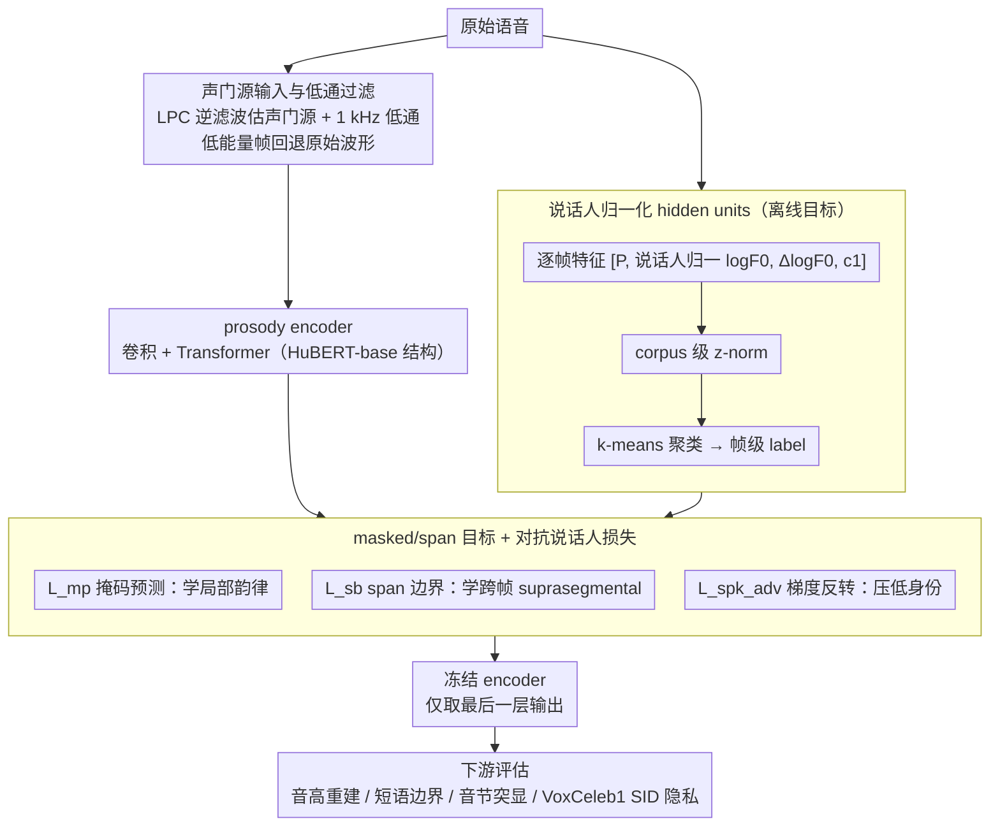

# Privacy-preserving Prosody Representation Learning

**会议**: ACL2026  
**arXiv**: [2606.00407](https://arxiv.org/abs/2606.00407)  
**代码**: https://github.com/kpeverson/speaker_disentangled_prosody  
**领域**: 语音隐私 / AI安全  
**关键词**: 韵律表征, 说话人解耦, 自监督学习, 隐私保护, 语音安全  

## 一句话总结
这篇论文提出一个以 glottal source 为输入的自监督 prosody encoder，通过 F0 说话人归一化和 adversarial speaker loss 减少身份泄露，在 phrase boundary、syllable prominence 和 pitch reconstruction 上优于 raw prosody/HuBERT baseline，同时把 VoxCeleb1 speaker identification accuracy 从 HuBERT 的 0.64 降到 0.14。

## 研究背景与动机
**领域现状**：语音中的 prosody 包括 pitch、energy、pause、duration lengthening 等非词汇信息，它可以表达信息焦点、讽刺、自我修正、疑问语气、兴奋程度等，对于语音理解和生成都很重要。现代语音模型常用自监督表征学习来获得通用 speech representation，但这些表征通常混合了词汇内容、韵律和说话人身份。

**现有痛点**：传统 prosody 特征依赖 F0、energy、duration 统计和音素对齐，但 F0 extraction、forced alignment 和能量特征都容易受噪声、说话人、录音条件影响。自监督模型如 HuBERT 对一些 prosody 任务有效，却没有显式保护说话人隐私。

**核心矛盾**：acoustic-prosodic cue 本身就携带说话人信息，例如平均音高、声门特性和声线质量。若模型需要 prosody 表达能力，又不需要身份信息，那么直接学习原始语音或原始 prosody 特征会让用户暴露在 speaker identification、voice cloning、deepfake 等隐私风险中。

**本文目标**：学习一个显式 prosody representation，让它保留语言相关的韵律事件和局部 pitch dynamics，同时尽量去掉 speaker identity 信息。作者希望证明 speaker disentanglement 不必以 prosody downstream performance 为代价。

**切入角度**：论文借鉴 ProsodyBERT/HuBERT 的 masked prediction + span boundary 目标，但把输入换成 estimated glottal waveform，并在训练目标和 hidden-unit target 构造中加入说话人解耦策略。

**核心 idea**：把 prosody encoder 的输入、目标和损失都围绕“去词汇、去身份、保留韵律”重新设计，而不是事后再对已有 speech representation 做隐私过滤。

## 方法详解
本文的模型是一个 frame-based prosody encoder，结构与 HuBERT-base 类似：先用卷积模块处理输入，再经过 transformer 输出帧级表示。训练时不需要转写监督，而是用由 acoustic-prosodic 特征聚类得到的 hidden units 做自监督目标。

### 整体框架
首先，系统从原始语音中估计 glottal source。作者用 LPC inverse filtering 提取声门源，低能量 non-speech frame 则直接返回 raw waveform 以避免 LPC 伪影；随后加 1 kHz low-pass filter，降低词汇信息泄露。

其次，离线构造 hidden units。每帧 acoustic-prosodic feature 包括 periodicity $P$、speaker-normalized $\log F0$、$\Delta\log F0$ 和第一 mel-frequency cepstral coefficient $c_1$。这些特征先做 corpus-level z-normalization，再用 k-means 聚类得到帧级 label。

然后，prosody encoder 用 masked prediction 学习局部 prosody cue，用 span-boundary objective 学习跨帧/跨 span 的 suprasegmental pattern，再用 adversarial speaker identification loss 压低 speaker identity 信息。

最后，训练好的 encoder 被冻结，下游任务只使用 final encoder output layer。作者在 pitch reconstruction、phrase boundary detection、syllable prominence detection 三个 prosody 任务上评估表征能力，并在 VoxCeleb1 speaker identification 上评估隐私泄露程度。

### 关键设计
**1. glottal source 输入与低通过滤：把隐私保护前移到输入层，不给模型学到身份 shortcut 的机会**

如果送进模型的还是原始波形，里面既有词汇内容又有说话人细节，后续无论加多强的 adversarial loss 都很难把身份信息彻底擦干净。所以本文在输入端就动手：先用 LPC inverse filtering 从原始语音估计 glottal waveform，把携带大量音素/词汇信息的声道共振滤掉，只留下声门源这种和韵律、voice quality 相关的成分；对能量低于 $10^{-4}$ 的帧则跳过 inverse filtering、直接返回 raw waveform，避免不可靠的 LPC 系数把训练带偏。之后再叠一个 1 kHz low-pass filter 进一步压低残留的词汇信息。这一层处理相当于在数据进模型前就把「身份捷径」堵掉，让后面的目标和损失只需要在已经偏韵律的信号上做更精细的解耦。

**2. speaker-normalized hidden units：从自监督目标端就抹掉说话人的平均音高**

输入处理得再干净，只要 masked prediction 的目标标签还保留说话人特有的音高范围，模型就会被训练信号反过来拉回身份信息。本文因此在构造 hidden units 时就做归一化：每帧的 acoustic-prosodic 特征取 $[P,\log F0,\Delta\log F0,c_1]$，其中 $\log F0$ 先减去该说话人的平均 log pitch，而这个平均值用 periodicity $P$ 加权计算（让清音/噪声帧不污染基频统计）；energy 也被替换成第一个 mel 倒谱系数 $c_1$，以降低对录音条件的敏感度。这些特征经 corpus 级 z-normalization 后用 k-means 聚成帧级 label。归一化之后，目标标签里只剩下相对的 pitch 动态而非绝对音高，等于从监督信号这一端再砍掉一刀身份泄露。

**3. masked/span 目标加 adversarial speaker loss：用主任务保住韵律、用对抗项压死身份**

单纯做 masked prediction，表征里会顺手保留 speaker cue；单纯上 adversarial，又容易把韵律任务一起拖垮。本文把三个目标合成一个损失同时优化：

$$L=L_{mp}+\alpha_{sb}L_{sb}+\alpha_{spk}^{adv}L_{spk}^{adv}$$

其中 $L_{mp}$ 是 HuBERT 式的 masked hidden-unit 交叉熵，负责学局部韵律线索；$L_{sb}$ 是 span-boundary 目标，用被 mask 的 span 左右两侧未遮盖的边界帧去预测距离中心的 label，逼模型捕捉跨帧的 suprasegmental 结构；$L_{spk}^{adv}$ 则通过 gradient reversal 一边训练 speaker classifier、一边让 encoder 学到反说话人的特征。主任务这两项保证表征仍然有 prosody 信息可用，对抗项负责让身份信息变得不可读，两者相互牵制才能同时拿到好的韵律表现和低的身份泄露。

### 损失函数 / 训练策略
模型在 GigaSpeech 的 transcribed portion 上训练。由于语料没有 speaker labels，作者先用 pretrained speaker encoder 提取 utterance-level embedding，再聚类为 1000 个 pseudo-speaker labels，用于 speaker normalization 和 adversarial objective。pitch/periodicity 由 torchcrepe 提取。训练使用 fairseq，在 4 张 NVIDIA A40 或 L40 GPU 上训练 500K steps，batch size 平均约 30/GPU，选择 validation loss 最低的 checkpoint 冻结用于下游任务。

## 实验关键数据

### 主实验
prosody modeling 任务上，本文 encoder variants 整体优于 raw prosody 和 HuBERT-base。最明显的是 syllable prominence detection，论文报告相对 HuBERT-base 有 15% F1 提升。

| 模型 / 设置 | speaker-normalized $\log F0$ | adv speaker loss | Phrase boundary F1 | Syllable prominence F1 | Pitch MSE | 0-mean Pitch MSE |
|-------------|------------------------------|------------------|--------------------|------------------------|-----------|------------------|
| most frequent class | 无 | 无 | 0.00 | 0.00 | 未报告 | 未报告 |
| HuBERT-base | 无 | ✗ | 0.79 | 0.74 | 0.056 | 0.011 |
| Raw prosody | ✓ | 无 | 0.49 | 0.66 | 未报告 | 未报告 |
| Ours | ✗ | ✗ | 0.82 | 0.86 | 0.027 | 0.012 |
| Ours | ✓ | ✗ | 0.82 | 0.86 | 0.048 | 0.012 |
| Ours | ✗ | ✓ | 0.73 | 0.82 | 0.024 | 0.012 |
| Ours | ✓ | ✓ | 0.82 | 0.85 | 0.025 | 0.008 |

speaker disentanglement 用 VoxCeleb1 speaker identification accuracy 评估，越低代表 final representation 中可读的身份信息越少。

| 模型 / 设置 | speaker-normalized $\log F0$ | adv speaker loss | Speaker ID accuracy |
|-------------|------------------------------|------------------|---------------------|
| HuBERT-base | 无 | ✗ | 0.64 |
| Ours | ✗ | ✗ | 0.41 |
| Ours | ✓ | ✗ | 0.42 |
| Ours | ✗ | ✓ | 0.22 |
| Ours | ✓ | ✓ | 0.14 |

### 消融实验
两种 disentanglement 策略有不同作用：speaker-normalized target 单独使用时对 SID accuracy 影响不明显，但和 adversarial loss 组合后达到最低身份泄露；adversarial loss 单独使用能大幅降低身份可识别性，但在没有 speaker-normalized target 时会损害 phrase boundary F1。

| 消融配置 | Prosody 表现 | 隐私表现 | 解释 |
|----------|--------------|----------|------|
| 无 speaker norm, 无 adv | phrase 0.82, prominence 0.86 | SID 0.41 | 已比 HuBERT 泄露少，但仍有身份信息 |
| 有 speaker norm, 无 adv | phrase 0.82, prominence 0.86 | SID 0.42 | target normalization 不足以单独降低 SID |
| 无 speaker norm, 有 adv | phrase 0.73, prominence 0.82 | SID 0.22 | 隐私提升明显，但下游 prosody 有损失 |
| 有 speaker norm, 有 adv | phrase 0.82, prominence 0.85 | SID 0.14 | 最佳 privacy-utility trade-off |

### 关键发现
- 本文 encoder 在 phrase boundary F1 上从 HuBERT 的 0.79 提升到 0.82，在 syllable prominence F1 上从 0.74 提升到 0.85/0.86，说明去身份不必牺牲韵律事件建模。
- 最终组合（speaker normalization + adversarial loss）把 SID accuracy 降到 0.14，相比 HuBERT-base 的 0.64 低很多，也比无解耦版的 0.41 低。
- 作者报告 adversarial objective 带来 46% 相对 SID reduction，两种策略合用带来 66% 相对 reduction。
- 0-mean pitch reconstruction 上，完整解耦模型 MSE 为 0.008，优于 HuBERT-base 的 0.011，说明它尤其擅长建模局部 pitch dynamics，而不是保留 speaker-specific pitch offset。
- 只用 final encoder layer 是一个隐私取向选择；SUPERB 常用所有 intermediate layers，但那可能重新引入身份信息。

## 亮点与洞察
- 这篇论文没有把“隐私保护”做成后处理，而是同时改输入、target 和 loss。这样的端到端解耦设计比单独加 adversarial classifier 更稳。
- glottal source 输入很有意思：它保留 prosody 和 voice quality 线索，但用低通和低能量处理减少 lexical leakage，符合“保留任务相关信息、去掉不必要身份信息”的最小充分表征思想。
- 结果里最有说服力的是完整模型的 trade-off：SID accuracy 最低，同时 phrase boundary F1 没掉，syllable prominence 仍大幅高于 HuBERT。这说明 privacy 和 utility 在这个设置下不是严格零和。
- 这类 prosody representation 可以服务 expressive TTS、语音理解、对话系统，同时给隐私敏感场景提供一个更安全的中间表示。

## 局限与展望
- 训练时使用的是 pseudo-speaker labels，而不是真实 speaker labels。作者指出，如果 GigaSpeech 发布真实 speaker metadata，speaker normalization 和 adversarial loss 可能更有效。
- 评估主要集中在局部 linguistic prosodic events，例如 phrase boundary 和 syllable prominence。paralinguistic 任务如 emotion、sarcasm、health diagnostics 尚未系统评估。
- 理解任务使用 hand transcriptions。若用自动语音识别转写，评估会更贴近真实系统，但需要更复杂的 scoring。
- 还没有在 speech generation 或 voice conversion 中做人类主观评估。隐私保护表征是否会影响生成语音自然度和表达力，仍需验证。
- 当前模型不是 causal，因此不能直接用于 streaming generation；作者认为迁移到 causal framework 较直接，但这需要实际实现和测试。
- 隐私评估假设攻击者数据量相对有限；伦理说明中也承认，如果攻击者拥有更多 speaker 数据，可能训练出更强 speaker recognition algorithm。

## 相关工作与启发
- **vs HuBERT / wav2vec 2.0**: 这些通用 SSL speech representation 对 prosody 任务有帮助，但没有显式 disentangle speaker identity；本文用 HuBERT 架构但换成 prosody-oriented input/targets/loss。
- **vs ProsodyBERT**: ProsodyBERT 使用 hidden units 和 span boundary objective 学习 prosody，本文继承这一路线，但加入 glottal source 输入和 speaker disentanglement。
- **vs PE-Wav2vec**: PE-Wav2vec 也使用 glottal waveform 思路，本文进一步把隐私目标纳入训练框架。
- **vs information bottleneck / pitch shifting / adversarial loss**: 这些是已有 speaker disentanglement 技术，本文的贡献是把 speaker-normalized target 和 adversarial speaker loss 结合到 prosody SSL 中，并用 prosody + SID 双评估验证 trade-off。

## 评分
- 新颖性: ⭐⭐⭐⭐☆ 将 prosody SSL 和隐私保护显式结合，设计虽不复杂但针对性强。
- 实验充分度: ⭐⭐⭐⭐☆ 有 prosody modeling、speaker ID 和关键消融，但缺少生成任务和更广泛 paralinguistic 评估。
- 写作质量: ⭐⭐⭐⭐☆ 方法简洁，表格清楚，limitations 也比较诚实。
- 价值: ⭐⭐⭐⭐☆ 对隐私敏感语音系统很有实际意义，尤其适合作为 downstream speech application 的中间表示。

<!-- RELATED:START -->

## 相关论文

- [\[ICLR 2026\] EmotionThinker: Prosody-Aware Reinforcement Learning for Explainable Speech Emotion Reasoning](../../ICLR2026/audio_speech/emotionthinker_prosody-aware_reinforcement_learning_for_explainable_speech_emoti.md)
- [\[CVPR 2026\] SAVE: Speech-Aware Video Representation Learning for Video-Text Retrieval](../../CVPR2026/audio_speech/save_speech-aware_video_representation_learning_for_video-text_retrieval.md)
- [\[ACL 2026\] Protecting Bystander Privacy via Selective Hearing in Audio LLMs](protecting_bystander_privacy_via_selective_hearing_in_audio_llms.md)
- [\[CVPR 2026\] Semantic Noise Reduction via Teacher-Guided Dual-Path Audio-Visual Representation Learning](../../CVPR2026/audio_speech/semantic_noise_reduction_via_teacher-guided_dual-path_audio-visual_representatio.md)
- [\[ACL 2026\] ImmersiveTTS: Environment-Aware Text-to-Speech with Multimodal Diffusion Transformer and Domain-Specific Representation Alignment](immersivetts_environment-aware_text-to-speech_with_multimodal_diffusion_transfor.md)

<!-- RELATED:END -->
