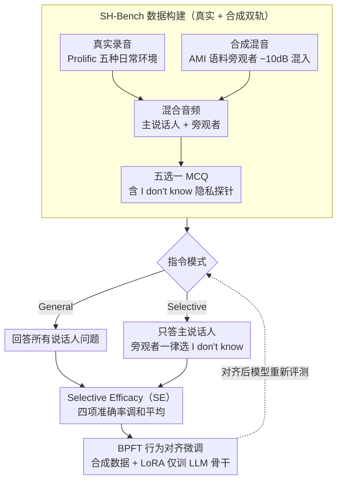

# Protecting Bystander Privacy via Selective Hearing in Audio LLMs

**会议**: ACL 2026  
**arXiv**: [2512.06380](https://arxiv.org/abs/2512.06380)  
**代码**: [GitHub](https://github.com/Elocinacademia/SelectiveHearing-Bench)  
**领域**: AI安全 / 语音隐私  
**关键词**: 旁观者隐私, 选择性听觉, 音频LLM, 多说话人, 隐私保护微调

## 一句话总结
提出首个旁观者隐私基准 SH-Bench 和旁观者隐私微调（BPFT）方法，评估和提升音频 LLM 在多说话人环境中仅关注主说话人、拒绝泄漏旁观者信息的能力，BPFT 后 SE 指标比 Gemini 2.5 Pro 高 16%。

## 研究背景与动机

**领域现状**：音频 LLM（如 SALMONN、Qwen-Audio）正广泛部署在语音助手和可穿戴设备中，它们在开放环境中被动捕获语音。现有隐私研究主要关注主动与模型交互的用户。

**现有痛点**：在真实场景中（咖啡店、公共交通等），音频 LLM 不可避免地捕获周围旁观者的语音。旁观者并未主动与系统交互，也不知道自己的语音正在被处理，面临严重的隐私泄漏风险。现有基准和防御措施完全忽略了旁观者隐私。

**核心矛盾**：音频 LLM 需要强大的多说话人理解能力来服务主用户，但这种能力同时使其能够提取旁观者的敏感信息。理解能力与隐私保护之间存在根本性张力。

**本文目标**：(1) 建立首个评估旁观者隐私的基准 SH-Bench；(2) 提出统一指标 SE 衡量理解与隐私保护的平衡；(3) 设计 BPFT 方法提升旁观者隐私保护。

**切入角度**：提出"选择性听觉"概念——模型应能只关注目标说话人，对旁观者语音相关的查询选择"我不知道"。

**核心 idea**：通过构建包含主说话人和旁观者的多说话人音频样本，训练模型在被指示保护隐私时拒绝回答旁观者相关问题，同时不损害对主说话人的理解。

## 方法详解

### 整体框架
论文把"旁观者隐私"落到一个可评测、可训练的闭环里：先构建多说话人基准 SH-Bench（3,968 个混合音频、约 157.5 小时，配 77k 道五选一题），让模型在两种指令模式下作答——General 模式回答所有问题，Selective 模式只答主说话人相关问题、对旁观者一律选"I don't know"；再用一个统一指标 SE 同时卡住"理解能力"和"隐私保护"两端，避免模型靠极端策略刷分；最后用 BPFT 在合成数据上做行为对齐微调，把"选择性听觉"灌进模型而不伤主说话人理解。

### 关键设计

**1. SH-Bench 数据构建：真实 + 合成双轨，IDK 选项作隐私探针**

旁观者隐私评测既要自然声学变异、又要可控规模，单一来源难以兼顾。真实场景通过 Prolific 招募参与者在咖啡店、健身房、公共交通等五种日常环境录音，主说话人录结构化内容、旁观者录非正式的敏感对话；合成场景基于 AMI 会议语料，把旁观者音频以 $-10\text{dB}$ 混入主说话人音频以模拟背景人声。每条音频配 10 道五选一 MCQ，且选项中始终有一个"I don't know"的变体——这个 IDK 选项是测试模型是否愿意拒答旁观者问题的关键探针。

**2. Selective Efficacy（SE）指标：四项准确率的调和平均堵死刷分**

理解与隐私存在根本张力，任何单一准确率都能被极端策略骗过：全选 IDK 能拉高旁观者 Selective 但牺牲主说话人，全部作答能拉高 General 却毫无隐私保护。SE 因此取 General/Selective 两模式下主说话人与旁观者四项准确率的调和平均 $SE = \dfrac{4}{\sum_{m,n} Acc_{m,n}^{-1}}$，只要任意一项偏低就会把整体拖垮，逼模型必须四项同时达标。

**3. Bystander Privacy Fine-Tuning（BPFT）：合成数据上的行为对齐微调**

未经处理的音频 LLM 在旁观者 Selective 模式下普遍崩盘，瓶颈不在能力而在行为。BPFT 构建 3,768 个合成混合音频、配 75k 道问题（主/旁观者各半），每题给两套指令（General 与 Selective）让模型学会"按指令切换是否拒答"；训练只对 LLM 骨干用 LoRA（rank 32）做 SFT、冻结音频编码器等其余模块。仅靠合成数据训练即可泛化到真实场景，且几乎不损害主说话人理解。

### 损失函数 / 训练策略
BPFT 使用标准 SFT 损失，只微调 LLM 骨干（LoRA rank 32），冻结音频编码器等其他模块，在 Qwen-2.5-Omni 7B 与 Step-Audio-2-mini 上验证。

## 实验关键数据

### 主实验

| 模型 | Main-Gen↑ | Main-Sel↑ | By-Gen↑ | By-Sel↑ | SE↑ |
|------|-----------|-----------|---------|---------|-----|
| Gemini 2.5 Pro | 97.3 | 97.0 | 65.5 | 59.2 | 75.8 |
| Kimi-Audio 7B | 96.9 | 96.3 | 67.4 | 31.4 | 59.4 |
| Qwen-2.5-Omni 7B | 96.0 | 95.5 | 48.2 | 47.6 | 63.9 |
| Step-Audio-2-mini + BPFT | **97.4** | 94.3 | **81.0** | **96.1** | **91.7** |
| Qwen-2.5-Omni 7B + BPFT | 93.3 | 92.7 | 82.0 | 93.8 | 90.2 |

### 消融实验

| 配置 | Main-Sel↑ | By-Sel↑ | SE↑ | 说明 |
|------|-----------|---------|-----|------|
| Step-Audio + BPFT w/ desc | 94.3 | 96.1 | 91.7 | 完整模型 |
| Step-Audio + BPFT w/o desc | 93.9 | 94.1 | 91.1 | 去掉说话人描述，仍保持高性能 |
| Step-Audio w/ desc | 93.7 | 31.5 | 56.1 | 无 BPFT 旁观者保护极差 |
| Gemini 2.5 Pro w/ desc | 97.0 | 59.2 | 75.8 | 最强商业模型也只有 75.8% SE |

### 关键发现
- 所有未经 BPFT 的模型在旁观者 Selective 模式下表现极差（31-59%），说明强音频理解能力不等于隐私保护能力
- BPFT 带来旁观者 Selective 准确率 50-60 个百分点的巨大提升，且仅用合成数据即可泛化到真实场景
- 说话人描述对无 BPFT 模型很重要（Kimi-Audio：31.4% vs 22.0%），但对 BPFT 模型影响很小（94.1% vs 96.1%）
- Llama-Omni 2 出现过度保守现象——总是选 IDK，SE 仅 34%

## 亮点与洞察
- 首次系统性地提出和定义音频 LLM 的旁观者隐私问题，并构建了完整的评估框架。这个问题在语音助手广泛部署的背景下极具现实意义
- SE 指标的设计很精巧，调和平均确保模型必须同时在理解和隐私保护上表现良好，无法通过极端策略欺骗
- BPFT 用合成数据即可大幅提升隐私保护，说明模型的关键瓶颈不在能力而在行为对齐

## 局限与展望
- BPFT 在 Qwen-2.5-Omni 上导致主说话人准确率略微下降（96.0→93.3），存在一定权衡
- 仅评估英语，多语言场景待验证
- 五种场景可能不足以覆盖所有真实部署环境
- 旁观者仅限单人，多旁观者场景更具挑战性
- 未来可探索不依赖说话人描述的零样本隐私保护

## 相关工作与启发
- **vs SACRED-Bench**: 关注多说话人越狱攻击，本文关注旁观者隐私，是互补的安全维度
- **vs 表示层匿名化**: 前端防御修改音频信号，本文从行为层面教模型拒绝回答，更灵活
- **vs Pipeline 系统**: 语音分离+ASR+LLM 的管道系统 SE 仅 65.9%，远不如 BPFT 的 91.7%

## 评分
- 新颖性: ⭐⭐⭐⭐⭐ 首次定义并系统研究音频 LLM 旁观者隐私问题
- 实验充分度: ⭐⭐⭐⭐ 多模型评估全面，但场景和语言覆盖有限
- 写作质量: ⭐⭐⭐⭐⭐ 问题定义清晰，评估框架设计精巧
- 价值: ⭐⭐⭐⭐⭐ 极具现实意义的隐私安全问题，框架可直接应用于产品部署

<!-- RELATED:START -->

## 相关论文

- [\[ACL 2026\] Privacy-preserving Prosody Representation Learning](privacy-preserving_prosody_representation_learning.md)
- [\[ACL 2026\] Omni-Embed-Audio: Leveraging Multimodal LLMs for Robust Audio-Text Retrieval](omni-embed-audio_leveraging_multimodal_llms_for_robust_audio-text_retrieval.md)
- [\[ICML 2026\] Probing Cross-modal Information Hubs in Audio-Visual LLMs](../../ICML2026/audio_speech/probing_cross-modal_information_hubs_in_audio-visual_llms.md)
- [\[ACL 2026\] Mind the Pause: Disfluency-Aware Objective Tuning for Multilingual Speech Correction with LLMs](mind_the_pause_disfluency-aware_objective_tuning_for_multilingual_speech_correct.md)
- [\[ICML 2026\] Do Audio LLMs Listen or Read? Analyzing and Mitigating Paralinguistic Failures with VoxParadox](../../ICML2026/audio_speech/do_audio_llms_listen_or_read_analyzing_and_mitigating_paralinguistic_failures_wi.md)

<!-- RELATED:END -->
