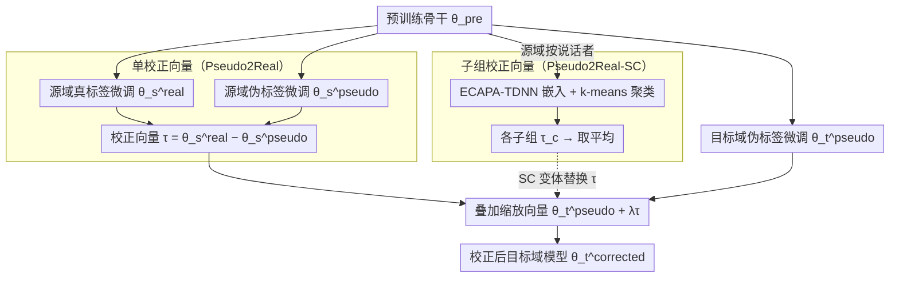

# Pseudo2Real: Task Arithmetic for Pseudo-Label Correction in Automatic Speech Recognition

**会议**: ACL 2026  
**arXiv**: [2510.08047](https://arxiv.org/abs/2510.08047)  
**代码**: 无  
**领域**: 语音处理 / 域适应  
**关键词**: 伪标签校正, 任务算术, 参数空间校正, 口音适应, Whisper

## 一句话总结

本文提出 Pseudo2Real，一种参数空间校正方法，通过在源域中计算真实标签模型与伪标签模型的权重差得到"校正向量"，将其应用于目标域伪标签微调模型以纠正系统性伪标签偏差，在 AfriSpeech-200 的十种非洲口音上最高实现 35% 相对 WER 降低。

## 研究背景与动机

**领域现状**：ASR 系统在遇到新域（如新口音）时，标注数据稀缺。伪标签方法（用教师模型生成标签）是常见的域适应策略，但伪标签继承了教师模型的系统性偏差。

**现有痛点**：(1) 置信度过滤和一致性检查只能抑制噪声，无法纠正结构化的偏差模式；(2) 迭代自训练（如 Noisy Student）需要多次训练且仍传播教师的重复错误；(3) EMA 等权重空间方法使用训练轨迹的平均，不针对伪标签偏差。

**核心矛盾**：当目标域没有真实标注时，如何识别和纠正伪标签中的系统性错误模式？

**本文目标**：设计一种可重用的参数空间校正方法，无需目标域标签即可纠正伪标签偏差。

**切入角度**：基于线性模式连接性——从相同预训练起点微调的模型处于共享低损失区域，权重差可被解释为有意义的方向而非噪声。

**核心 idea**：在源域中真实标签模型与伪标签模型的权重差捕获了伪标签偏差的方向，将缩放后的校正向量加到目标域伪标签模型上即可纠正。

## 方法详解

### 整体框架

Pseudo2Real 的思路是把"伪标签噪声"从样本空间搬到参数空间来处理：既然在有真实标签的源域上，可以同时训出一个"真标签模型"和一个"伪标签模型"，那么它们的权重差就刻画了伪标签带来的系统性偏差方向，而这个方向可以迁移去纠正没有标签的目标域。具体地，从同一预训练骨干 $\theta^{\text{pre}}$ 出发，源域分别用真实标签和伪标签微调得到 $\theta_s^{\text{real}}$ 与 $\theta_s^{\text{pseudo}}$，相减得校正向量 $\tau = \theta_s^{\text{real}} - \theta_s^{\text{pseudo}}$；目标域只有伪标签，微调得 $\theta_t^{\text{pseudo}}$，再叠加缩放后的校正向量得到 $\theta_t^{\text{corrected}} = \theta_t^{\text{pseudo}} + \lambda\tau$。整个过程无需目标域真实标注，也不需要迭代训练。SC 变体则用说话者聚类把单条校正向量细化成多条子组向量后取平均。

### 关键设计

**1. 单校正向量（Pseudo2Real）：把"伪→真"偏差刻成一个可迁移方向**

置信度过滤、一致性检查只能压噪声，治不了结构化的偏差模式。Pseudo2Real 的关键观察是：校正向量 $\tau = \theta_s^{\text{real}} - \theta_s^{\text{pseudo}}$ 恰好编码了"从伪标签结果指向真实标签结果"的参数空间方向，把它缩放后加到目标域伪标签模型上就完成了跨域校正。之所以这条减法有意义，是因为从同一预训练起点微调的模型落在共享低损失区域（线性模式连接性），权重差是结构化方向而非随机噪声，任务算术框架进一步保证了这类方向可被缩放、组合与迁移。

**2. 子组校正向量（Pseudo2Real-SC）：按说话者分组做更细的纠偏**

伪标签质量本身因口音、发音习惯、录音条件而异，一条全局校正向量会把这些差异抹平。SC 变体先用 ECAPA-TDNN 提取说话者嵌入并做 k-means 聚类，对每个子组单独估一个校正向量 $\tau_c$，最终取所有子组平均 $\theta_t^{\text{corrected}} = \theta_t^{\text{pseudo}} + \frac{\lambda}{C}\sum_{c=1}^{C}\tau_c$。聚类只看声学嵌入、不依赖任何域标签，因此完全自动化，却能捕获统一向量丢掉的细粒度偏差。

### 损失函数 / 训练策略

微调阶段用标准 ASR 损失，覆盖 Whisper tiny/base/small/medium/large-v2 五种规模；校正阶段只需调缩放系数 $\lambda$ 一个超参。

## 实验关键数据

评估刻意设计得有挑战性：把 AfriSpeech-200 里样本最多的 10 种口音按语系拆成两折（横跨尼日尔-刚果、亚非、印欧三大语系），交替充当源域与目标域互相校正，直接检验校正方向能否在差异较大的域间迁移。

### 主实验

**AfriSpeech-200 WER 对比（Whisper tiny，10 口音平均）**

| 方法 | 平均 WER |
|------|---------|
| 预训练 $\theta^{\text{pre}}$ | 106.5 |
| 源域真实 $\theta_s^{\text{real}}$ | 88.2 |
| 伪标签 $\theta_t^{\text{pseudo}}$ | 89.3 |
| 置信过滤 | 88.7 |
| 错误纠正 (EC) | — |
| **Pseudo2Real** | **~58** |
| **Pseudo2Real-SC** | **~55** |

### 消融实验

**不同模型规模上的校正效果**

| Whisper 规模 | 伪标签 WER | +Pseudo2Real WER | 相对降低 |
|-------------|-----------|-----------------|---------|
| tiny (39M) | 89.3 | ~58 | ~35% |
| base (74M) | — | — | 一致提升 |
| large-v2 (1.55B) | — | — | 提升幅度减小 |

### 关键发现

- Pseudo2Real 在 Whisper tiny 上实现最高 35% 相对 WER 降低
- 子组聚类（SC）进一步提升，说明伪标签偏差确实因说话者而异
- 校正向量在小模型上效果最显著，大模型自身纠错能力更强
- 所有 10 种口音上一致有效，即使跨越不同语系
- $\lambda$ 的最优值在 0.5-1.0 之间，对选择不太敏感

## 亮点与洞察

- 方法极度简单——仅需一次向量减法和一次向量加法，无需迭代训练
- "伪标签偏差可以被参数化"这一洞察有理论价值——将标签噪声从样本空间转移到参数空间处理
- 可与置信过滤、迭代自训练等现有方法正交组合

## 局限与展望

- 需要源域同时有真实标签和伪标签，限制了无标注场景的适用性
- 校正向量假设源域和目标域的伪标签偏差模式相似，对差异很大的域可能失效
- 仅在口音适应上评估，未验证在噪声环境、远场语音等其他域适应场景的效果
- 线性模式连接性假设可能在极端域差异下不成立

## 相关工作与启发

- **vs SYN2REAL (Su et al., 2024)**: 后者校正合成语音与真实语音的声学差距，本文校正真实标签与伪标签的标注差距——问题维度不同
- **vs Noisy Student**: 后者需多轮迭代训练，本文仅需一次向量运算
- **vs EMA**: EMA 平滑训练轨迹，不针对伪标签偏差；本文显式捕获"伪-真"方向

## 评分

- 新颖性: ⭐⭐⭐⭐ 将任务算术应用于伪标签校正的视角新颖
- 实验充分度: ⭐⭐⭐⭐ 10 口音 × 5 模型规模 × 6 基线 + 聚类消融
- 写作质量: ⭐⭐⭐⭐ 方法直觉清晰，实验设计严谨
- 价值: ⭐⭐⭐⭐ 简单有效，可与现有伪标签方法组合使用

<!-- RELATED:START -->

## 相关论文

- [\[ACL 2026\] \[b\] = \[d\] − \[t\] + \[p\]: Self-supervised Speech Models Discover Phonological Vector Arithmetic](bd-tp_self-supervised_speech_models_discover_phonological_vector_arithmetic.md)
- [\[ICLR 2026\] Pay Attention to CTC: Fast and Robust Pseudo-Labelling for Unified Speech Recognition](../../ICLR2026/audio_speech/pay_attention_to_ctc_fast_and_robust_pseudo-labelling_for_unified_speech_recogni.md)
- [\[ACL 2026\] Mind the Pause: Disfluency-Aware Objective Tuning for Multilingual Speech Correction with LLMs](mind_the_pause_disfluency-aware_objective_tuning_for_multilingual_speech_correct.md)
- [\[ACL 2026\] MCGA: A Multi-task Classical Chinese Literary Genre Audio Corpus](mcga_a_multi-task_classical_chinese_literary_genre_audio_corpus.md)
- [\[ACL 2026\] Speech-Hands: A Self-Reflection Voice Agentic Approach to Speech Recognition and Audio Reasoning with Omni Perception](speech-hands_a_self-reflection_voice_agentic_approach_to_speech_recognition_and_.md)

<!-- RELATED:END -->
