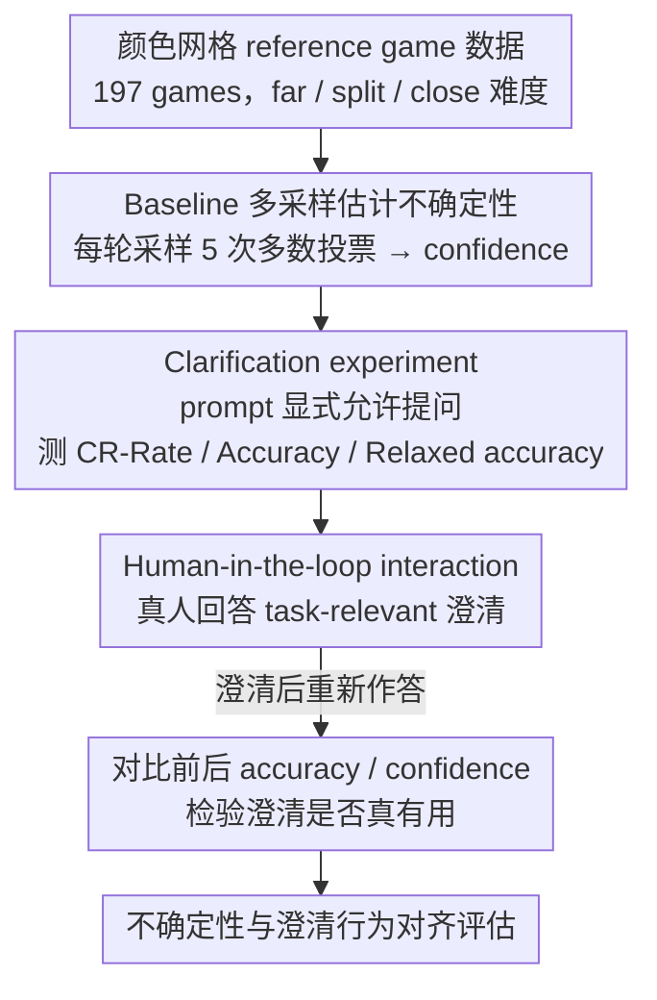

# Reference Games as a Testbed for the Alignment of Model Uncertainty and Clarification Requests

**会议**: ACL2026  
**arXiv**: [2601.07820](https://arxiv.org/abs/2601.07820)  
**代码**: https://github.com/Manarali-bit/reference-games-clarification  
**领域**: 多模态交互 / VLM 不确定性 / 澄清请求  
**关键词**: reference game, clarification request, VLM校准, pragmatic competence, uncertainty alignment  

## 一句话总结
这篇论文用颜色网格 reference games 检验 VLM 能否把内部不确定性转化为恰当澄清请求，发现即便任务很受控，Qwen2.5-VL 和 GPT-5-mini 也仍存在过度自信、澄清行为不稳定和澄清问题低质量等交互能力缺口。

## 研究背景与动机
**领域现状**：人类对话中，听者并不是被动接收者。当指称不清、信息不足或存在多个候选对象时，听者会发起修复，例如提出澄清问题，以维持共同理解。

**现有痛点**：语言模型和视觉语言模型能流畅回答，却未必知道自己何时不确定。流畅输出会掩盖理解失败，让用户误以为模型很有把握；同时，模型语言表达出的 confidence 往往和实际准确率不匹配。

**核心矛盾**：开放对话里很难定义“什么时候必须澄清”，因为用户意图和可能解释空间都不封闭。若没有明确 ground truth，就难以判断模型是否应该问问题。

**本文目标**：找到一个可控、闭合、可量化的测试场景，评估 VLM 作为 listener 时是否能识别内部不确定性，并用合适的 clarification request 表达出来。

**切入角度**：作者选择 reference games。该任务有固定候选 referents、明确目标和难度条件，因此可以直接判断模型是否选对对象、是否在困难样本上更应该提问。

**核心 idea**：把 reference game 从“指称解析能力测试”扩展成“模型不确定性与澄清行为对齐测试”，用 baseline confidence、CR-rate、relaxed accuracy 和人机交互实验共同评估。

## 方法详解
论文使用颜色网格 reference game：每轮有三个 $3\times3$ 色块网格，一个是目标，两个是干扰项；人类 speaker 给出目标描述，模型作为 listener 需要识别目标。作者设计三个实验：baseline 只要求模型选目标；clarification experiment 明确允许模型不确定时提问；interaction experiment 让人类回答模型的问题，检验这些澄清是否真的有帮助。

### 整体框架
数据来自 McDowell and Goodman (2019) 的 color-grid reference game，共 197 个 games，每个 60 rounds。样本按目标和干扰项颜色相似度分为 far、split、close 三种难度。作者测试 Qwen2.5-VL-7B、Qwen2.5-VL-72B 和 GPT-5-mini。Qwen 模型跑完整数据集并报告 500 子集结果；GPT-5-mini 因 API 成本只评估 500 轮子集，其中 19 个 null answers 被排除。三个实验逐级递进：先用 baseline 估出每轮的不确定性，再看模型在被允许提问后会不会、会不会问得对，最后让真人回答澄清、检验这些问题是否真的有用。

### 关键设计
**1. Baseline 多采样估计不确定性：用一致性信号给模型一个可解释的「我有多确定」**

单看一次输出根本看不出模型到底是胸有成竹还是在瞎猜。本文因此在 baseline 实验里对每个 round 采样 5 次，用多数投票当作最终预测，并把多数答案在 5 次采样中的占比定义为 baseline confidence——所以它只能取 $0.4,0.6,0.8,1.0$ 这几档。这个一致性比例虽然粗糙，却给出一个简单且可解释的不确定性代理：同一描述反复采样还摇摆不定，说明模型内部其实没把握。后面判断「模型该不该在困难样本上提问」，靠的就是这个 confidence 和实际难度是否对得上。

**2. Clarification experiment：把「允许提问」显式写进 prompt，再看模型会不会用、用得对不对**

光测准确率回答不了「模型知不知道自己不确定」这个问题。本文于是改 prompt，明确告诉模型不确定时可以反问，并用三个指标拆解它的行为：CR-Rate 是产生澄清请求的比例，Accuracy 只统计那些非澄清回答里答对的比例，Relaxed accuracy 则把「答对」和「恰当地提澄清」都算作可接受行为。这套指标的设计意图很直接——一个真正会用澄清的 listener，应该在困难、低 confidence 的样本上更频繁提问，在高 confidence 样本上直接作答；把这三个数和难度条件交叉看，就能判断模型的提问到底跟不确定性对不对齐。

**3. Human-in-the-loop interaction：让真人回答模型的问题，检验这些澄清是否真的有用**

CR-rate 高只能说明模型爱提问，不能说明它问到了点子上——它完全可能只是泛泛地说一句「请澄清」却没指出具体歧义。为此本文请人逐条审查 Qwen2.5-VL-72B 生成的 116 个 clarification request，标注是否 task-relevant：对相关的问题，真人直接给出回答；对不相关的，则改写原始描述。然后让模型基于澄清后的对话重新作答，比较前后的 accuracy 和 confidence。这一步把「会提问」和「会问有用的问题」彻底分开——如果澄清后准确率没涨甚至下降，就说明那些问题并没有帮模型缩小候选空间。

### 损失函数 / 训练策略
本文不训练模型，属于评估研究。关键“策略”是实验协议：baseline 用 5 次采样多数投票估计 confidence；clarification 只采样 1 次并解析是否提问；interaction 阶段由专家人类给出澄清响应，再重新评估 Qwen2.5-VL-72B。

## 实验关键数据

### 主实验
| 模型 | Baseline Accuracy | Baseline Confidence | CR-Rate | Clarification Accuracy | Relaxed Accuracy |
|------|-------------------|---------------------|---------|-------------------------|------------------|
| Qwen2.5-VL-7B | 0.53 (0.52 full) | 0.88 (0.87 full) | 0.0 (0.002 full) | 0.46 (0.42 full) | 0.46 (0.42 full) |
| Qwen2.5-VL-72B | 0.77 (0.71 full) | 0.91 (0.92 full) | 0.24 (0.24 full) | 0.73 (0.71 full) | 0.80 (0.78 full) |
| GPT-5-mini | 0.91 | 0.99 | 0.13 | 0.94 | 0.94 |
| Human | 0.92 full | 未报告 | 不适用 | 不适用 | 不适用 |

### 难度条件结果摘录
| 模型 / 条件 | Baseline Accuracy | CR-Rate | Relaxed Accuracy | 现象 |
|-------------|-------------------|---------|------------------|------|
| GPT-5-mini close | 0.87 | 0.17 | 0.92 | 困难条件下更常提问 |
| GPT-5-mini far | 0.98 | 0.06 | 0.99 | 简单条件下较少提问 |
| Qwen2.5-VL-72B close | 0.68 (0.65 full) | 0.24 (0.23 full) | 0.71 (0.73 full) | CR-rate 没有明显随难度变化 |
| Qwen2.5-VL-7B ALL | 0.53 (0.52 full) | 0.0 (0.002 full) | 0.46 (0.42 full) | 几乎不会提问 |

### 交互实验
| 设置 | Before Accuracy | After Accuracy | Before Confidence | After Confidence | 结论 |
|------|-----------------|----------------|-------------------|------------------|------|
| Qwen-72B CR-only ALL | 0.776 | 0.741 | 0.871 | 0.902 | 人类回答澄清后准确率反而下降 0.035 |
| Qwen-72B full ALL | 0.767 | 0.759 | 0.914 | 0.921 | 全集准确率小幅下降 0.008，confidence 小幅上升 |
| Qwen-72B CR quality | 42% task-relevant | 58% not task-relevant | - | - | 多数澄清问题没有抓住任务相关歧义 |

### 关键发现
- GPT-5-mini 的澄清行为最接近合理模式：困难条件 CR-rate 更高，非澄清回答 accuracy 从 0.91 到 0.94。
- Qwen2.5-VL-72B 会提问，但提问频率和任务难度、不确定性对齐不稳定。
- Qwen2.5-VL-7B 基本不会提问，说明“允许提问”本身不足以诱导小模型形成澄清行为。
- 交互实验说明，澄清请求必须具体、任务相关才有价值；泛化模板式提问可能提高 confidence，却不能提高 accuracy。

## 亮点与洞察
- 论文的贡献不在新模型，而在评估场景设计。reference games 把“该不该澄清”从模糊开放对话变成可测量问题，非常适合评估 pragmatic competence。
- Relaxed accuracy 是一个有用指标：它承认“不确定时提问”也是成功交互行为，而不是只奖励直接回答。
- 42% task-relevant 的人工分析很关键，说明仅统计 CR-rate 会高估模型能力。真正困难的是问出能缩小候选空间的问题。

## 局限与展望
- 人类数据来自 60 轮互动 dyads，人类参与者会逐步建立 common ground；VLM 只看到初始描述，比较上可能吃亏。
- baseline confidence 基于 diversity sampling，不一定等同模型内部概率不确定性。作者也指出 Qwen-72B 的信息论不确定性估计更细，但仍无法让澄清行为更好对齐。
- 数据中部分人类 speaker 描述可能有瑕疵，baseline 错误不一定全是 listener 模型问题。
- 后续可以扩展到多轮 reference games，让模型通过自身澄清逐步建立共同理解，而不是只评估第一轮。

## 相关工作与启发
- **vs 开放式澄清研究**: 开放对话很难判断何时需要澄清；reference game 的候选集封闭，能更干净地定义 clarification need。
- **vs 不确定性量化**: 熵或采样一致性可以测不确定性，但本文进一步问模型能否把不确定性转化成交互行为。
- **vs 指称解析 benchmark**: 传统 reference game 多看选对目标；本文把它拓展为“选择或提问”的交互质量评估。
- **启发**: 评估对话模型时，应把“会不会适时拒答、反问、澄清”纳入任务成功，而不只看一次性答案准确率。

## 评分
- 新颖性: ⭐⭐⭐⭐☆ 把 reference games 用作不确定性-澄清对齐测试很有启发，方法简单但问题定义好。
- 实验充分度: ⭐⭐⭐⭐☆ 覆盖三个模型、三种难度和人机交互实验；模型规模和任务类型还可扩展。
- 写作质量: ⭐⭐⭐⭐☆ 论文论证清楚，实验指标设计易懂，讨论也比较克制。
- 价值: ⭐⭐⭐⭐☆ 对构建更可靠的交互式 VLM 很有价值，尤其提醒我们“会提问”不等于“会问有用的问题”。

<!-- RELATED:START -->

## 相关论文

- [\[AAAI 2026\] A Text-Routed Sparse Mixture-of-Experts Model with Explanation and Temporal Alignment for Multi-Modal Sentiment Analysis](../../AAAI2026/audio_speech/text-routed_sparse_mixture-of-experts_model_with_explanation_and_temporal_alignm.md)
- [\[ICLR 2026\] AC-Foley: Reference-Audio-Guided Video-to-Audio Synthesis with Acoustic Transfer](../../ICLR2026/audio_speech/ac-foley_reference-audio-guided_video-to-audio_synthesis_with_acoustic_transfer.md)
- [\[NeurIPS 2025\] MGAudio: Model-Guided Dual-Role Alignment for High-Fidelity Open-Domain Video-to-Audio Generation](../../NeurIPS2025/audio_speech/model-guided_dual-role_alignment_for_high-fidelity_open-domain_video-to-audio_ge.md)
- [\[CVPR 2025\] UWAV: Uncertainty-Weighted Weakly-Supervised Audio-Visual Video Parsing](../../CVPR2025/audio_speech/uwav_uncertainty-weighted_weakly-supervised_audio-visual_video_parsing.md)
- [\[ACL 2026\] ImmersiveTTS: Environment-Aware Text-to-Speech with Multimodal Diffusion Transformer and Domain-Specific Representation Alignment](immersivetts_environment-aware_text-to-speech_with_multimodal_diffusion_transfor.md)

<!-- RELATED:END -->
