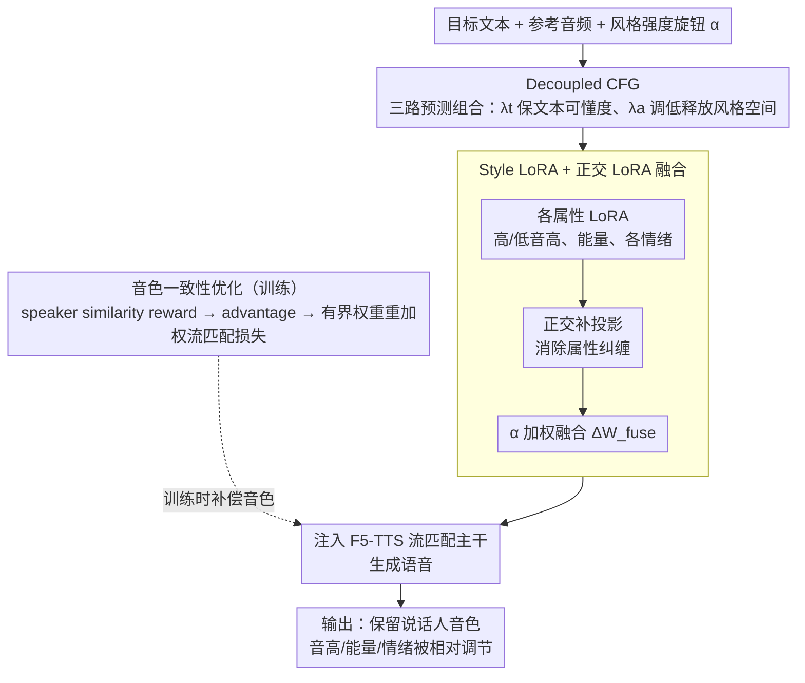

# ReStyle-TTS: Relative and Continuous Style Control for Zero-Shot Speech Synthesis

**会议**: ACL2026  
**arXiv**: [2601.03632](https://arxiv.org/abs/2601.03632)  
**代码**: https://cucl-2.github.io/Restyle-TTS  
**领域**: audio_speech  
**关键词**: 零样本语音合成、风格控制、LoRA 融合、相对控制、音色一致性

## 一句话总结
ReStyle-TTS 通过解耦文本/参考音频 guidance、可连续缩放的风格 LoRA、正交 LoRA 融合和音色一致性优化，让零样本 TTS 不再被参考音频风格锁死，可以相对地调高/调低音高、能量和情绪，同时保持文本可懂度与说话人音色。

## 研究背景与动机
**领域现状**：零样本 TTS 已经能用短参考音频克隆陌生说话人的音色。用户给一段 reference audio 和一段文本，模型就能生成同一说话人声音的语音，这使语音助手、配音和个性化朗读更灵活。

**现有痛点**：reference audio 不只包含音色，也包含当时的语速、音高、能量和情绪。模型为了克隆声音，往往同时继承参考音频的说话风格。若用户只有一段开心语气的参考音频，却想合成愤怒语气，就必须找到另一个匹配目标风格的参考样本，现实中很不方便。

**核心矛盾**：要控制风格，就要减弱参考音频对生成结果的束缚；但参考音频又是说话人音色的来源，减弱过头会让 speaker timbre 漂移。也就是说，风格可控性和音色一致性天然存在 trade-off。

**本文目标**：作者希望实现一种用户友好的 zero-shot TTS 控制方式：保留短参考音频提供的说话人身份，同时允许对音高、能量和情绪做连续、相对、可组合的控制。

**切入角度**：论文观察到，现有 controllable TTS 多依赖绝对目标风格或离散文本 prompt，例如“用开心语气说”。这不符合用户常见需求；用户更自然的操作是“比参考音频更高一点”“再生气一点”。因此控制应当相对 reference，而不是把所有样本推到同一个固定风格。

**核心 idea**：先用 Decoupled CFG 降低模型对参考风格的隐式依赖，再用 Style LoRA 提供显式风格方向，并用 Timbre Consistency Optimization 把被削弱的音色一致性补回来。

## 方法详解

### 整体框架
ReStyle-TTS 建在 F5-TTS 这类 flow-matching 零样本 TTS 之上，输入是目标文本、一段参考音频和一个或多个风格强度旋钮，输出是保留参考说话人音色、但音高/能量/情绪被相对调节过的语音。它不重训大模型，而是用三层改造串起整条生成链路：先用 Decoupled CFG 以较低 reference guidance 生成，让模型不完全复制参考音频的原始风格，从而腾出风格空间；再按用户指定的强度把对应 Style LoRA（必要时先做正交融合）加到 base model 上注入风格方向；训练阶段额外用 speaker similarity reward 对流匹配损失重新加权，把被削弱的音色一致性补回来。

### 关键设计
**1. Decoupled Classifier-Free Guidance：把文本 fidelity 和参考依赖拆成两个旋钮**

零样本 TTS 的核心矛盾在于参考音频既是音色来源又是风格枷锁，而标准 CFG 用 $f_{a,t}$ 与 $f_{\emptyset,\emptyset}$ 做组合时把文本和参考音频混进了同一个 guidance weight，无法单独松开其中一项。DCFG 的做法是额外计算一个 text-only 预测 $f_{\emptyset,t}$，把 guidance 拆成 $\hat{f}_{DCFG}=f_{\emptyset,t}+\lambda_t(f_{\emptyset,t}-f_{\emptyset,\emptyset})+\lambda_a(f_{a,t}-f_{\emptyset,t})$，其中 $\lambda_t$ 单管文本强度、$\lambda_a$ 单管参考音频强度。这样就能让 $\lambda_t$ 保持较高以维持可懂度，同时把 $\lambda_a$ 调低释放出风格空间，使下游 LoRA 真正有余地去改变音高、能量和情绪，而不是被参考风格牢牢锁死。

**2. Style LoRA 与 Orthogonal LoRA Fusion：用互不干扰的低秩方向当连续风格滑杆**

图像生成里 LoRA 早已被当作风格滑杆，但 TTS 的风格原本埋在 reference audio 里，必须先靠 DCFG 解耦才有注入的空间。作者为高/低音高、高/低能量以及多种情绪分别训练一个 LoRA，推理时每个 LoRA 的缩放系数 $\alpha_i$ 就是对应属性的强度旋钮，可连续调节甚至取负值。多个属性同时启用时直接相加会造成属性纠缠，于是 OLoRA 先把每个 LoRA 的更新向量投影到其他 LoRA 子空间的正交补上，再做加权融合 $\Delta W_{fuse}=\sum_i \alpha_i \tilde{\Delta W_i}$，让调一个旋钮主要只动目标属性，从而获得稳定、可组合的连续控制。

**3. Timbre Consistency Optimization：用有界 reward 重加权把音色拉回来**

DCFG 降低参考 guidance 会带来代价——speaker timbre 容易漂移，所以需要一条机制专门补偿。TCO 仍以 flow-matching loss 为主，但每生成一个样本后用 speaker verification 模型计算它与参考音频的 speaker similarity reward $r_t$，维护一个 EMA baseline $b_t$ 得到 advantage $A_t=r_t-b_t$，再以有界权重 $w_t=1+\lambda \tanh(\beta A_t)$ 重加权原始流匹配损失 $\mathcal{L}_{total}=w_t\mathcal{L}_{FM}$。相比高方差的 policy gradient，这种 advantage-weighted regression 不需要对生成过程或 reward 反传，既稳定又便宜，却能让高音色相似的样本获得更大训练权重，把 speaker identity 重新强调回来。

### 损失函数 / 训练策略
实验基座是 F5-TTS。作者在 VccmDataset 的不同子集上分别训练 style LoRA，属性包括高/低音高、高/低能量，以及 angry、disgusted、fear、happy、sad、surprised、neutral 等情绪；contempt 因数据不足被排除。LoRA 注入所有线性层，rank 为 32，alpha 为 64，AdamW 学习率 $1\times 10^{-5}$，batch size 为 30,000 audio frames，每个子集固定训练 250 小时。DCFG 训练中 masked speech dropout 为 0.3，masked speech + text dropout 为 0.2；常规 CFG 的 $\lambda_{cfg}=2$ 等价于 DCFG 的 $\lambda_t=2,\lambda_a=3$，实际为降低 reference 依赖设 $\lambda_a=0.5$。TCO 使用 $\lambda=0.2,\beta=5.0,\mu=0.9$。

## 实验关键数据

### 主实验
论文首先比较 controllable zero-shot TTS 的控制形态。ReStyle-TTS 的定位不是“另找风格音频”或“写文本风格描述”，而是用 LoRA 提供可连续调节的相对控制。

| 方法 | 音色来源 | 风格来源 | 连续控制 | 控制类型 |
|------|----------|----------|----------|----------|
| IndexTTS2 / Vevo | Reference Audio | Style Audio | No | Absolute |
| ControlSpeech / EmoVoice / CosyVoice | Reference Audio | Text Description | No | Absolute |
| StyleFusion TTS | Reference Audio | Audio or Text | No | Absolute |
| ReStyle-TTS | Reference Audio | Style LoRA | Yes | Relative |

在 reference 和目标情绪冲突的设置中，ReStyle-TTS 更能覆盖 reference 原有情绪，转到目标情绪。下表选取 Table 2 中若干 off-diagonal 情绪迁移案例，数值格式统一拆成各模型 ACC。

| Reference → Target | CosyVoice ACC↑ | EmoVoice ACC↑ | IndexTTS2 ACC↑ | ReStyle-TTS ACC↑ |
|--------------------|----------------|---------------|----------------|------------------|
| Happy → Angry | 65.2 | 73.5 | 88.5 | 100.0 |
| Fear → Happy | 82.9 | 85.7 | 90.4 | 100.0 |
| Surprised → Angry | 72.0 | 78.5 | 83.6 | 100.0 |
| Angry → Neutral | 58.4 | 74.2 | 78.9 | 84.6 |
| Disgusted → Happy | 83.5 | 86.5 | 89.3 | 96.8 |

对音高和能量的矛盾风格控制也很稳定。ReStyle-TTS 在四个方向上都明显高于 CosyVoice 和 EmoVoice。

| 控制属性 | Reference → Target | CosyVoice ACC↑ | EmoVoice ACC↑ | ReStyle-TTS ACC↑ |
|----------|--------------------|----------------|---------------|------------------|
| Pitch | Low → High | 74.9 | 72.4 | 90.2 |
| Pitch | High → Low | 76.9 | 73.1 | 92.8 |
| Energy | Low → High | 87.5 | 76.1 | 92.4 |
| Energy | High → Low | 88.6 | 75.9 | 93.0 |

### 消融实验
DCFG 是风格可控性的关键，TCO 是音色保持的关键。标准 CFG 即便 WER 和 Spk-sv 看起来不错，也几乎不改变属性；去掉 TCO 后属性控制仍在，但 speaker similarity 明显下降。

| 配置 | Attr Δ(rel.)↑ | WER(%)↓ | Spk-sv↑ | 结论 |
|------|---------------|---------|---------|------|
| default ($\lambda_t=2,\lambda_a=0.5$) | 51.2% | 2.31 | 0.79 | 风格控制、可懂度、音色较均衡 |
| w/o DCFG ($\lambda_{cfg}=2$) | 2.1% | 1.83 | 0.90 | 音色好但几乎不可控 |
| w/o DCFG ($\lambda_{cfg}=0.5$) | 7.6% | 2.67 | 0.85 | 稍可控，但仍受 reference 束缚 |
| w/o TCO | 51.0% | 2.32 | 0.71 | 可控性保留，音色一致性下降 |

### 关键发现
- 单属性控制曲线随 LoRA strength 平滑变化，WER 和 Spk-sv 基本稳定，说明 Style LoRA 更像连续滑杆，而不是离散标签开关。
- 负向缩放 high-attribute LoRA 可以自然产生相反效果，例如训练高音高 LoRA 后用负系数降低音高，这让数据需求更低。
- 多属性二维和三维控制表面显示，调一个 LoRA 主要改变目标属性，对其他属性影响较小；这验证了 OLoRA 对 disentanglement 的作用。
- 相对控制实验中，reference energy 和 generated energy 的回归斜率从 0.77 到 1.22 变化，截距接近 0，说明模型不是把所有样本推向固定能量，而是保留了样本间相对排序。

## 亮点与洞察
- DCFG 的设计非常实用：它没有把“参考音频影响”一刀切去掉，而是把文本 fidelity 和 reference dependency 分成两个可调系数，直接对应 zero-shot TTS 的核心 trade-off。
- 把 LoRA 作为语音风格滑杆很有迁移价值。相比文本 prompt，“调强度”更适合产品交互，也更容易做 UI 控件和连续插值。
- TCO 是一个克制的强化学习设计：不走高方差 policy gradient，只用 reward 重加权监督损失，既利用了 speaker verification 信号，也避免训练不稳定。
- 论文把“relative control”讲清楚了。很多 controllable generation 方法其实是 absolute target control，而真实用户更常要在当前样本基础上微调。

## 局限与展望
- 作者指出主要限制是扩展到新属性需要收集相应数据并额外训练 LoRA。也就是说，ReStyle-TTS 的控制空间不是开放式自然语言可无限扩展的。
- 目前实验集中在音高、能量和若干情绪，尚未覆盖语速、停顿、口音、语气强弱、角色风格等更复杂维度。
- DCFG 降低 reference guidance 后仍需 TCO 补偿，说明音色和风格并未完全可分。极端情绪或长语音中可能仍会有 timbre drift。
- 情绪分类准确率依赖 Emotion2Vec 等自动评估器，主观听感虽有 MOS-SA 附录，但真实用户偏好和自然度仍需要更大规模听测。
- 语音克隆与情绪操控带来明显滥用风险。论文建议水印、合成语音检测和明确授权流程，这应当成为此类系统的默认部署前提。

## 相关工作与启发
- **vs IndexTTS2 / Vevo**: 它们依赖额外 style audio 控制风格；ReStyle-TTS 不要求寻找目标风格音频，而是用 LoRA 强度相对调节。
- **vs ControlSpeech / EmoVoice / CosyVoice**: 这些方法用文本描述控制风格，交互友好但不连续、不稳定；ReStyle-TTS 用显式 LoRA 方向提供更可预测的滑杆式控制。
- **vs StyleFusion TTS**: StyleFusion 支持文本和音频风格输入，但控制仍偏绝对；ReStyle-TTS 的特色是 reference-relative control。
- **vs 图像生成 LoRA composition**: 图像 LoRA 可以直接改风格，但 TTS 中 reference audio 同时承载音色和风格；本文先用 DCFG 解耦再做 LoRA 融合，是把图像 LoRA 经验迁移到语音时必须补上的步骤。

## 评分
- 新颖性: ⭐⭐⭐⭐ DCFG + Style LoRA + OLoRA + TCO 的组合清楚解决了 zero-shot TTS 的相对风格控制问题。
- 实验充分度: ⭐⭐⭐⭐ 覆盖单属性、多属性、相对控制、矛盾风格、消融和主观评估；更多真实用户听测会更完整。
- 写作质量: ⭐⭐⭐⭐ 动机明确，公式和系统图都比较易懂；部分连续控制结果主要在图中呈现，表格数字不如矛盾风格实验充分。
- 价值: ⭐⭐⭐⭐⭐ 对可控语音合成非常实用，尤其适合需要在保留说话人音色基础上做细粒度风格编辑的产品场景。

<!-- RELATED:START -->

## 相关论文

- [\[ACL 2026\] FC-TTS: Style and Timbre Control in Zero-Shot Text-to-Speech with Disentangled Speech Representations](fc-tts_style_and_timbre_control_in_zero-shot_text-to-speech_with_disentangled_sp.md)
- [\[ACL 2025\] ControlSpeech: Towards Simultaneous and Independent Zero-shot Speaker Cloning and Zero-shot Language Style Control](../../ACL2025/audio_speech/controlspeech_zero_shot.md)
- [\[ACL 2025\] TCSinger 2: Customizable Multilingual Zero-shot Singing Voice Synthesis](../../ACL2025/audio_speech/tcsinger_2_customizable_multilingual_zero-shot_singing_voice_synthesis.md)
- [\[ACL 2026\] Style Amnesia: Investigating Speaking Style Degradation and Mitigation in Multi-Turn Spoken Language Models](style_amnesia_investigating_speaking_style_degradation_and_mitigation_in_multi-t.md)
- [\[ICML 2026\] MusicDET: Zero-Shot AI-Generated Music Detection](../../ICML2026/audio_speech/musicdet_zero-shot_ai-generated_music_detection.md)

<!-- RELATED:END -->
