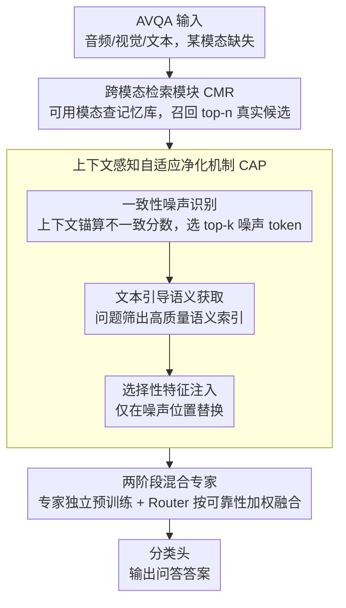

# Retrieving to Recover: Towards Incomplete Audio-Visual Question Answering via Semantic-consistent Purification

**会议**: ACL 2026  
**arXiv**: [2604.10695](https://arxiv.org/abs/2604.10695)  
**代码**: 无  
**领域**: 音频语音 / 多模态学习  
**关键词**: 音频视觉问答, 模态缺失, 检索恢复, 语义净化, 混合专家

## 一句话总结

本文提出R2ScP框架，将AVQA中缺失模态处理范式从传统的生成式补全转变为基于检索的恢复，通过跨模态检索和上下文感知自适应净化机制消除检索噪声，在模态不完整场景下显著提升了问答性能。

## 研究背景与动机

**领域现状**：音频视觉问答（AVQA）要求模型跨视觉、音频和文本进行推理以理解动态场景。当前方法通常假设所有模态数据完整可用，在设备故障、传感器遮挡或数据传输中断等实际场景下性能严重退化。

**现有痛点**：主流的模态缺失处理方法依赖生成式补全——用已有模态合成缺失模态的伪特征。然而，生成模型倾向于产生"共性知识"（common knowledge），即缺乏细粒度模态特有信息的泛化表示。例如，从音乐会的视觉场景推断缺失音频时，生成模型可能合成一个通用的"音乐"嵌入，却无法捕捉画面中可见的特定乐器音色，从而引入语义幻觉和噪声。

**核心矛盾**：生成式方法本质上是从已有模态"想象"缺失信息，其输出受限于跨模态共享知识，无法恢复模态特有的独特信息。这种信息损失直接影响需要精确推理的问答任务。

**本文目标**：将缺失模态处理范式从生成转向检索——从语义数据库中召回真实的、高质量的特征片段，而非合成不完美的幻觉。

**切入角度**：作者观察到真实世界的特征库中包含大量可复用的模态特有知识，关键在于如何精准检索和去噪。

**核心 idea**：用跨模态检索替代生成补全，并通过上下文感知净化机制过滤检索噪声，保留模态特有的细粒度知识。

## 方法详解

### 整体框架

R2ScP 处理的是某个模态可能缺失的 AVQA 输入（音频/视觉/文本），输出是问答答案，核心思路是把缺失模态从“生成补全”改成“检索恢复”。整条链路分三步：先由跨模态检索模块（CMR）在统一语义空间中用可用模态作查询，从外部记忆库里召回缺失模态的真实候选特征；再由上下文感知自适应净化机制（CAP）用可用模态上下文和文本问题双重约束，剔除检索噪声并注入高质量语义；最后由两阶段混合专家把原始模态与恢复模态按可靠性加权融合，送入分类头给出答案。

### 关键设计

**1. 跨模态检索模块（CMR）：用真实特征片段替代想象出来的伪特征**

生成式补全的根本缺陷是只能从已有模态“想象”出共性知识，丢掉了模态特有的细粒度信息（如画面里特定乐器的音色）。CMR 改走检索路线：预先用 ImageBind 这类预训练多模态模型把大量真实特征编成统一语义嵌入，构成外部记忆库 $\mathcal{B} = \{(\mathbf{k}_i, \mathbf{v}_i)\}_{i=1}^{M}$。当某模态缺失时，用可用模态作查询 $\mathbf{Q}_{avl}$，按余弦相似度 $S_i = \frac{\mathbf{Q}_{avl} \cdot \mathbf{k}_i}{\|\mathbf{Q}_{avl}\| \|\mathbf{k}_i\| + \epsilon}$ 召回 top-n 候选。因为键值都落在统一语义空间，视觉查询能直接对齐到语义相关的真实音频特征，从而把数据库里可复用的模态特有知识取回来，而不是合成一个泛化的“音乐”嵌入。

**2. 上下文感知自适应净化机制（CAP）：上下文约束加问题引导双重去噪**

检索不可避免会混入无关信息——为小提琴演奏可能召回大提琴或掌声特征，因此 CAP 分三步净化。先做一致性噪声识别：算检索特征与可用模态全局上下文锚的不一致分数 $\delta_i = 1 - \text{sim}(H_{miss} \cdot \mathbf{W}_{proj}, \mathbf{g}_{avl})$，挑出 top-k 不协调 token 组成噪声索引集 $\Omega_{noise}$。再做文本引导语义获取：通过多头交叉注意力和自注意力，让文本问题从共性知识里筛出对当前问答最相关的高质量语义索引 $\Omega_{salient}$。最后做选择性特征注入，只在噪声位置替换、保留其余原特征：$H_{miss}^{pur} = (\mathbf{1} - \mathcal{M}_{noise}) \odot H_{miss} + \mathcal{M}_{noise} \odot \text{Gather}(H_{guided}, \Omega_{salient})$。可用模态约束保证语义不跑偏，问题引导保证留下的是答题真正需要的信息。

**3. 两阶段混合专家训练：显式区分原始模态与恢复模态的可靠性**

恢复出来的模态终究不如真实模态可信，硬融合容易被不确定信息带偏，所以作者把训练拆成两阶段。第一阶段独立预训练视觉专家 $\mathcal{E}_v$、音频专家 $\mathcal{E}_a$、文本专家 $\mathcal{E}_t$，逼每个专家不靠跨模态捷径、单独提取判别性表示，避免特征坍缩。第二阶段冻结专家、只训门控网络 Router，按输入上下文动态算权重 $\alpha_{m'} = \frac{\exp(g_{m'})}{\sum_{m} \exp(g_m)}$，得到联合表示 $\mathbf{Z}_{joint} = \alpha_a H_a + \alpha_t H_t + \alpha_v H_v$。这样恢复模态可以被分配较低权重以反映其不确定性，而不必和真实模态平起平坐。

### 损失函数 / 训练策略

除标准交叉熵损失 $\mathcal{L}_{task}$ 外，引入语义排序损失 $\mathcal{L}_{rank}$ 强制正样本恢复的特征优于负样本但劣于真实特征：$\mathcal{L}_{total} = \mathcal{L}_{task} + \lambda(\mathcal{L}_{rank}^+ + \mathcal{L}_{rank}^-)$。这确保检索净化后的特征处于有效语义流形中。

## 实验关键数据

### 主实验

| 数据集 | 模态设置 | 本文R2ScP | 之前SOTA(IMOL) | 提升 |
|--------|---------|-----------|---------------|------|
| Music-AVQA | 缺音频 | 69.37 | 67.11 | +2.26 |
| Music-AVQA | 缺视觉 | 72.06 | 69.21 | +2.85 |
| Music-AVQA | 完整 | 73.19 | 71.86 | +1.33 |
| AVQA | 缺音频 | 63.25 | 61.32 | +1.93 |
| AVQA | 缺视觉 | 75.12 | 72.38 | +2.74 |
| AVQA | 完整 | 90.64 | 90.28 | +0.36 |

### 消融实验

| 配置 | Music-AVQA | AVQA | 说明 |
|------|-----------|------|------|
| 无CMR无CAP | 62.43 | 57.43 | 基线（缺音频） |
| +CMR only | 67.21 | 61.78 | 检索带来+4.78/+4.35 |
| +CAP only | 64.11 | 59.64 | 净化本身也有效 |
| +CMR+CAP（完整） | 69.37 | 63.25 | 两者结合效果最佳 |

### 关键发现

- 检索恢复比生成补全更有效，尤其在缺失视觉模态时优势更明显（+2.85 vs IMOL）
- CMR和CAP各自独立有效，但组合使用效果最优，说明检索和净化是互补的
- 在完整模态设置下，R2ScP仍优于对比方法，表明检索恢复框架不仅处理缺失场景也有助于模态融合
- 两阶段训练策略通过解耦专家预训练和门控混合避免了跨模态特征坍缩

## 亮点与洞察

- 范式创新：从"生成补全"到"检索恢复"的思路转变简洁有力，避免了生成式方法的幻觉问题
- CAP的三阶段净化设计（噪声识别→语义获取→选择性注入）逻辑严密，充分利用了可用模态和问题的引导信号
- 语义排序损失巧妙地建立了"真实 > 正检索 > 负检索"的质量梯度
- 在完整模态场景下也能提升性能，说明检索机制可作为通用的模态增强手段

## 局限与展望

- 外部记忆库的构建和存储开销较大，对于大规模部署可能是瓶颈
- 当前假设缺失模态完全不可用，未处理部分缺失或噪声退化场景
- 检索质量高度依赖于统一语义空间（ImageBind）的对齐质量
- 仅在AVQA任务上验证，泛化到其他多模态推理任务（如视觉问答、对话）有待探索

## 相关工作与启发

- **vs Missing-AVQA（ECCV 2024）**: Missing-AVQA使用关系感知生成器合成缺失特征，但生成的是共性知识；R2ScP通过检索保留模态特有信息
- **vs IMOL（ACL 2025）**: IMOL虽然也使用检索，但主要用于对比对齐而非直接特征恢复；R2ScP直接用检索特征替代缺失信息
- **vs MoMKE（MM 2024）**: MoMKE通过混合专家保存模态特有知识，但不处理特征恢复；R2ScP结合检索和MoE架构实现更完整的解决方案

## 评分

- 新颖性: ⭐⭐⭐⭐ 从生成到检索的范式转变是明确的创新，CAP净化机制设计精巧
- 实验充分度: ⭐⭐⭐⭐ 两个数据集、多种模态缺失设置、详细消融实验
- 写作质量: ⭐⭐⭐⭐ 问题动机清晰，方法描述详细
- 价值: ⭐⭐⭐⭐ 为多模态缺失处理提供了新的研究方向

<!-- RELATED:START -->

## 相关论文

- [\[ACL 2026\] Music Audio-Visual Question Answering Requires Specialized Multimodal Designs](music_audio-visual_question_answering_requires_specialized_multimodal_designs.md)
- [\[ICLR 2026\] Query-Guided Spatial-Temporal-Frequency Interaction for Music Audio-Visual Question Answering](../../ICLR2026/audio_speech/query-guided_spatial-temporal-frequency_interaction_for_music_audio-visual_quest.md)
- [\[ACL 2026\] Jamendo-MT-QA: A Benchmark for Multi-Track Comparative Music Question Answering](jamendo-mt-qa_a_benchmark_for_multi-track_comparative_music_question_answering.md)
- [\[CVPR 2026\] Semantic Noise Reduction via Teacher-Guided Dual-Path Audio-Visual Representation Learning](../../CVPR2026/audio_speech/semantic_noise_reduction_via_teacher-guided_dual-path_audio-visual_representatio.md)
- [\[AAAI 2026\] End-to-end Contrastive Language-Speech Pretraining Model For Long-form Spoken Question Answering](../../AAAI2026/audio_speech/end-to-end_contrastive_language-speech_pretraining_model_for_long-form_spoken_qu.md)

<!-- RELATED:END -->
