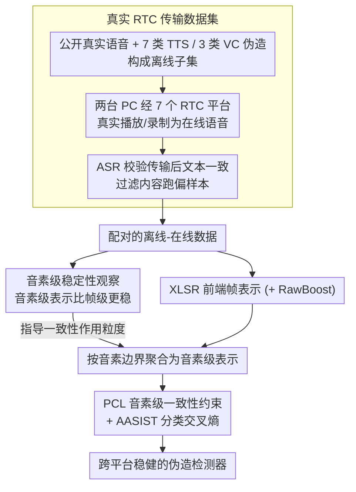

# RTCFake: Speech Deepfake Detection in Real-Time Communication

**会议**: ACL2026  
**arXiv**: [2604.23742](https://arxiv.org/abs/2604.23742)  
**代码**: https://huggingface.co/datasets/JunXueTech/RTCFake  
**领域**: AI安全 / 语音伪造检测 / 实时通信安全  
**关键词**: 语音深度伪造检测, 实时通信, 跨平台泛化, 音素一致性, EER

## 一句话总结
RTCFake 构建了约 600 小时面向真实实时通信平台的语音伪造检测数据集，并提出音素引导一致性学习 PCL，使 XLSR+AASIST 在离线、在线、跨平台和未见噪声场景下的平均 EER 从混合训练的 7.33% 降到 5.81%。

## 研究背景与动机
**领域现状**：语音深度伪造检测已有 ASVspoof、ADD、DFADD、CodecFake、SpeechFake、SpoofCeleb 等数据集，方法上常用手工声学特征、端到端检测器、自监督语音表示和 AASIST 类图注意力后端。

**现有痛点**：许多数据集主要模拟离线或单一失真，例如 codec 压缩、MP3、有噪环境等。但 Zoom、微信、QQ、钉钉、Lark 等实时通信平台内部有黑盒处理链路，包括降噪、回声消除、自动增益、编解码、网络抖动和丢包。这些耦合失真会改变伪造语音中的细粒度 artifact，使离线训练的检测器在真实通话环境下明显失效。

**核心矛盾**：语音伪造检测依赖帧级细节，但 RTC 系统恰恰会强烈扰动这些局部声学细节；与此同时，平台又会尽力保留语义可懂度。也就是说，帧级特征不稳定，语义结构相对稳定。

**本文目标**：作者希望提供一个真正经过主流 RTC 平台传输的数据集，并设计一种训练策略，让检测模型学习跨离线/在线、跨平台、跨噪声仍稳定的表示。

**切入角度**：论文通过 paired offline-online speech 发现，音素级表示比帧级表示在传输前后具有更高相似度和更小方差。因此作者把音素边界作为稳定锚点，在训练中约束离线和在线表示保持一致。

**核心 idea**：不要只依赖易被 RTC 黑盒处理抹掉的帧级伪造痕迹，而是用音素级一致性把模型拉向跨平台更稳定的语义结构表示。

## 方法详解

### 整体框架
RTCFake 由两部分组成：一个真实传输条件下的数据集，以及一个利用该数据集 paired offline-online 结构的训练方法，全文只讨论检测与鲁棒评测，不涉及生成或规避检测的操作流程。数据侧先从公开语料收集真实语音、用 7 类 TTS 和 3 类 VC 系统合成伪造语音构成离线子集（offline subset），再把它们通过两台独立 PC 在主流 RTC 平台真实播放/接收、用 OBS 录制成在线语音（online speech），并用 ASR 校验传输后文本一致性以过滤内容跑偏的样本。方法侧以 XLSR+AASIST 为检测器（XLSR 出前端表示、AASIST 做后端分类、RawBoost 增强鲁棒性），并在其上加一条音素引导一致性学习 PCL：训练时同时喂入配对的离线和在线语音，用音素边界把帧表示聚合成音素级表示后，约束两侧的音素表示保持一致。

### 关键设计
**1. 真实 RTC 传输数据集：用真平台采集替代模拟失真**

现有 benchmark 大多只模拟离线或单一失真（codec、MP3、加噪），无法复现 Zoom、微信、QQ 等平台内部降噪、回声消除、自动增益、编解码、抖动丢包耦合在一起的非线性黑盒处理，导致离线训练的检测器在真实通话下明显失效。RTCFake 的做法是让伪造语音真正走一遍 Zoom、QQ、WeChat、DingTalk、Lark、VooV、Telegram 七个平台，得到与离线样本严格配对的在线语音，总时长约 600 小时、覆盖 307 位说话人，并在评测中额外留出未见平台和未见噪声条件。只有这种真实传输数据，才能暴露检测器部署时会遇到的真实分布偏移。

**2. 音素级稳定性观察：为一致性约束选对作用粒度**

这一观察决定了 PCL 该约束在哪一层。作者用配对数据比较传输前后 frame-level 与 phoneme-level representation similarity，发现音素级表示在传输后均值更高、方差更低，说明 RTC 平台会尽力保留语义可懂度、却强烈扰动精细声学纹理。结论是：帧级伪造痕迹虽对检测有用，但在 RTC 传输中并不稳定，而音素级聚合能滤掉部分瞬时扰动，提供一个跨平台仍然可靠的 anchor，因此一致性约束应当落在音素级而非帧级。

**3. Phoneme-guided Consistency Learning：把跨平台稳定性写成显式训练约束**

单纯把离线和在线样本混在一起训练只能被动缓解分布偏移，并不能告诉模型哪些结构应该跨平台保持不变。PCL 用音素识别模型取得边界，对同一音素内的帧表示做平均池化，得到离线表示 $p^{(a)}$ 和在线表示 $p^{(b)}$，训练目标取两个分支的交叉熵均值再加 $\lambda \mathcal{L}_{pcl}$，其中 $\mathcal{L}_{pcl}$ 是音素级 MSE 一致性损失。这样既保留了帧级前端提供的判别能力，又把“传输前后音素结构应一致”显式变成监督信号，让模型主动向跨平台稳定的语义表示收敛。

### 损失函数 / 训练策略
实验使用 XLSR+AASIST，输入为 16 kHz 音频，Adam 优化器，学习率 $1\times 10^{-6}$，weight decay $1\times 10^{-4}$，最多 100 个 epoch，10 个 epoch 无提升则 early stopping。分类使用交叉熵，PCL 使用 MSE 一致性约束。评测指标为 Equal Error Rate，数值越低越好。

## 实验关键数据

### 主实验
主表对比了现有公开数据集训练、RTCFake 离线训练、在线训练、混合训练以及 PCL。公开数据集迁移到 RTC 条件后 EER 普遍很高，说明已有 benchmark 不足以覆盖真实通信分布。

| 训练数据 / 方法 | Offline EER | Online P01 | Online P02 | Online P05 | Online P07 | All Avg EER | 结论 |
|-----------------|-------------|------------|------------|------------|------------|-------------|------|
| ASVspoof2019 | 51.15 | 54.68 | 29.70 | 48.23 | 49.40 | 50.28 | 真实 RTC 下几乎失效 |
| SpoofCeleb | 29.56 | 40.05 | 30.70 | 32.48 | 38.55 | 34.06 | in-the-wild 数据仍不等价于 RTC |
| Off | 5.42 | 6.79 | 20.40 | 16.07 | 13.79 | 9.60 | 离线好，在线偏移明显 |
| On | 9.57 | 5.05 | 7.30 | 11.77 | 8.35 | 8.96 | 在线好，但损害离线泛化 |
| Mix | 6.09 | 4.93 | 8.85 | 11.65 | 8.57 | 7.33 | 混合训练更均衡 |
| PCL | 4.84 | 3.79 | 6.24 | 10.17 | 6.77 | 5.81 | 最佳整体 EER |

在未见噪声条件下，PCL 也最稳定。它在 clean-only S01 上 EER 为 3.88%，在 S02/S03/S04/S06/S07 等未见噪声上均低于 Off、On 和 Mix。

### 消融实验

| 配置 | 平均 EER | 说明 |
|------|----------|------|
| 仅音素特征 + FCL | 8.34 | 音素特征单独做帧级一致性效果较弱 |
| 仅音素特征 + PCL | 7.52 | 音素一致性优于帧级一致性 |
| 帧级特征 + FCL | 6.55 | 帧级特征仍提供强检测基础 |
| 帧级特征 + PCL | 5.81 | 保留细粒度检测信息，同时用音素约束稳定表示 |

### 关键发现
- RTCFake 证明真实通信平台造成的分布偏移不能被传统公开数据集充分覆盖。公开数据集训练模型在 RTC 条件下 EER 常处于 30%-50% 量级。
- 离线训练和在线训练各有偏差：Off 在离线测试好但在线退化，On 在线较强但离线退化，Mix 更均衡但仍不够稳。
- PCL 相比 Mix 把 All Avg EER 从 7.33% 降到 5.81%，在跨平台和未见噪声上都更稳，说明音素级 anchor 的确缓解了 RTC 黑盒处理带来的表示漂移。

## 亮点与洞察
- 数据集贡献很实用。很多安全论文只在模拟失真上验证，RTCFake 直接通过主流通信平台采集 paired online speech，更贴近部署环境。
- 方法的观察很关键：RTC 平台优先保留语义可懂度而牺牲局部声学细节，因此“音素级稳定、帧级易漂移”是合理的 inductive bias。
- PCL 没有改检测器主干，只增加训练约束，说明它可以作为通用插件迁移到其他语音伪造检测框架。
- 对 AI 安全系统的启发是，鲁棒评测必须覆盖真实管线中的黑盒后处理。只看 clean 或简单 codec 场景，容易高估模型部署后的可靠性。

## 局限与展望
- 数据虽然经过真实平台传输，但仍没有完全覆盖终端设备、麦克风/扬声器差异、房间声学、用户说话行为等真实变量。
- PCL 在极端未见噪声或更激进的平台非线性处理下仍有性能差距，说明音素级一致性不是万能解决方案。
- 论文主要以 XLSR+AASIST 为检测器验证，未来需要在更多前端、后端和多语种检测模型上确认泛化性。
- 数据集的生成源虽然覆盖 7 个 TTS 和 3 个 VC 系统，但未来生成模型更新很快，数据集需要持续扩展才能保持前沿性。

## 相关工作与启发
- **vs ASVspoof / ADD**: 这些 benchmark 对标准化评测很重要，但 RTCFake 更关注真实通信平台中的黑盒传输偏移。
- **vs CodecFake**: CodecFake 强调 codec 相关伪造或压缩因素，RTCFake 的范围更宽，包含平台级降噪、回声消除、增益和传输链路耦合。
- **vs SpoofCeleb / FakeSpeechWild**: in-the-wild 数据能覆盖公开视频或开放平台噪声，但不一定有 paired offline-online 结构，难以专门分析传输前后表示变化。
- **vs 常规数据混合训练**: Mix 只是把离线和在线样本放在一起，PCL 则利用配对结构显式约束稳定表示，因此在跨平台和噪声鲁棒性上更好。

## 评分
- 新颖性: ⭐⭐⭐⭐☆ 数据集场景切得很准，PCL 方法不复杂但和 RTC 表示稳定性观察高度匹配。
- 实验充分度: ⭐⭐⭐⭐☆ 平台、噪声、训练源和消融都比较完整，但主干模型覆盖还可以更广。
- 写作质量: ⭐⭐⭐⭐☆ 数据构建、失真动机和 EER 结果清楚，部分附录统计较长但有助于复现。
- 价值: ⭐⭐⭐⭐⭐ 对实时会议、在线身份验证和语音安全部署非常有参考价值，尤其提醒检测系统必须在真实传输条件下验证。

<!-- RELATED:START -->

## 相关论文

- [\[ACL 2026\] HCFD: A Benchmark for Audio Deepfake Detection in Healthcare](hcfd_a_benchmark_for_audio_deepfake_detection_in_healthcare.md)
- [\[ACL 2026\] XLSR-MamBo: Scaling the Hybrid Mamba-Attention Backbone for Audio Deepfake Detection](xlsr-mambo_scaling_the_hybrid_mamba-attention_backbone_for_audio_deepfake_detect.md)
- [\[NeurIPS 2025\] VITA-1.5: Towards GPT-4o Level Real-Time Vision and Speech Interaction](../../NeurIPS2025/audio_speech/vita-15_towards_gpt-4o_level_real-time_vision_and_speech_interaction.md)
- [\[ACL 2026\] Analyzing Reasoning Shifts in Audio Deepfake Detection under Adversarial Attacks: The Reasoning Tax versus Shield Bifurcation](analyzing_reasoning_shifts_in_audio_deepfake_detection_under_adversarial_attacks.md)
- [\[ACL 2026\] Semi-Supervised Diseased Detection from Speech Dialogues with Multi-Level Data Modeling](semi-supervised_diseased_detection_from_speech_dialogues_with_multi-level_data_m.md)

<!-- RELATED:END -->
