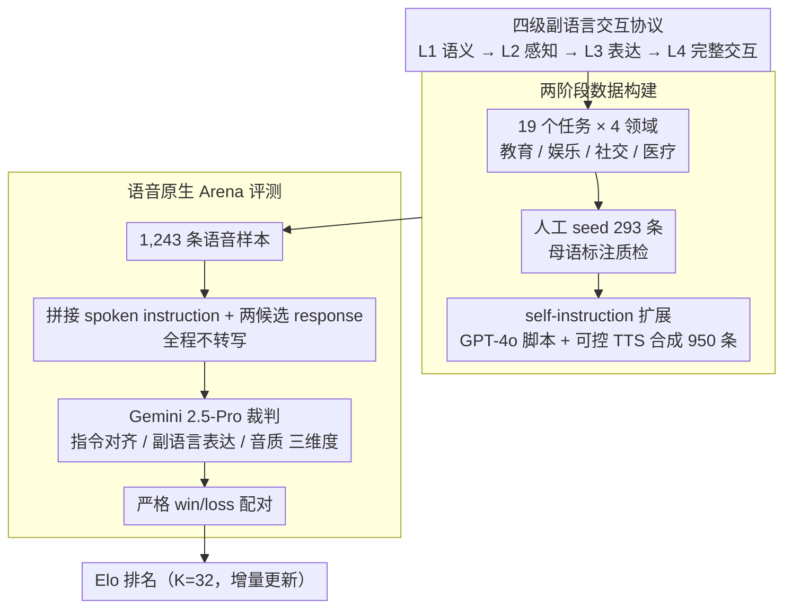

# S2S-Arena: Evaluating Paralinguistic Instruction Following in Speech-to-Speech Models

**会议**: ACL2026  
**arXiv**: [2503.05085](https://arxiv.org/abs/2503.05085)  
**代码**: https://github.com/FreedomIntelligence/S2S-Arena  
**领域**: 语音交互 / Speech-to-Speech 模型 / 评测基准  
**关键词**: 语音到语音, 副语言信息, Arena评测, Elo, 指令跟随

## 一句话总结
S2S-Arena 提出一个直接在语音模态评测 S2S 模型的 benchmark，用四级副语言交互协议、1,243 条语音样本和 1,001 次 pairwise comparison 揭示当前系统在复杂语气、情绪、说话风格和表达控制上的明显差距。

## 研究背景与动机
**领域现状**：LLM 推动了 speech-to-speech 系统从 ASR→LLM→TTS 级联走向更统一的语音交互模型。现有模型通常包含 speech encoder、LLM backbone 和 speech decoder，代表系统包括 GPT-4o-realtime、Qwen2.5-Omni、GLM-4-Voice、Kimi-Audio、LLaMA-Omni、Mini-Omni 等。

**现有痛点**：许多语音 benchmark 仍把模型输出转成文本再评测，或者只关注语音理解任务。这样会丢掉 prosody、emotion、speaker traits、speaking style 等副语言信息，而这些恰恰决定 S2S 交互是否自然、共情、符合场景。

**核心矛盾**：真实语音交互既要求语义正确，也要求模型能感知输入语气并在输出中表达合适语音属性。文本化评测能测语义，却难以衡量“说得是否像人、语气是否对、表达是否符合指令”。

**本文目标**：作者希望建立一个 speech-native benchmark，让 S2S 模型在语音输入和语音输出层面接受 pairwise comparison，系统评估语义理解和副语言表达能力。

**切入角度**：S2S-Arena 设计四级交互协议，从纯语义指令到完整副语言交互逐步增加难度；同时用人工 seed + speech-native self-instruction 扩展数据，并用 Gemini 2.5-Pro 作为与人类较一致的自动语音裁判。

**核心 idea**：把 S2S 评测从“转写文本是否答对”升级到“语音交互本身是否满足语义和副语言指令”，并用 arena Elo 排名持续比较模型。

## 方法详解
S2S-Arena 的贡献不是一个新模型，而是一套语音原生的评测体系：先定义难度分层的任务协议，再构建配套语音样本，验证一个与人类较一致的自动裁判，最后用 pairwise comparison 给多个 S2S 系统排名。

### 整体框架
整个流程分数据和评测两条线。数据线上，作者按四级交互协议在教育、娱乐、社交、医疗咨询四个领域组织 19 个代表性任务，先由脚本、配音、录音和高质量语料构成人工 seed，再用 GPT-4o 生成脚本、交给 Doubao-TTS、AudioX、Parler-TTS 等可控 TTS 合成扩展样本，最终汇成 1,243 条语音。评测线上，系统全程不做转写：把 spoken instruction 和两个候选模型的 spoken response 直接拼成音频喂给裁判，让它沿 instruction alignment、paralinguistic expressiveness、output audio quality 三个维度判断哪一个更好，胜负结果再回写到 Elo 排名里。

### 关键设计

**1. 四级副语言交互协议：把模糊的"语音能力"切成可定位的能力梯度**

很多模型在简单语义指令上看起来都能用，瓶颈其实藏在更难的副语言层级里，单一榜单无法暴露这一点。协议因此把任务拆成逐级加码的四档：L1 只考语义指令执行；L2 要求从输入语音里感知年龄、情绪、风格等副语言线索并据此调整语义回答；L3 输入可以中性，但输出必须按指令表达特定语速、情绪或风格；L4 则同时要求"听懂输入的副语言线索"和"生成匹配的表达"。这条梯度让评测能精确指出一个模型是停在语义理解、声学感知，还是表达生成、完整交互这一层掉队。

**2. 两阶段数据构建：在人工质量与自动规模之间取平衡**

完全人工采集成本太高，完全自动生成又容易让难度和副语言属性漂移，所以数据分两段。Seed 部分是 293 条人工把控的样本，覆盖全部 19 个任务，由四位中文母语 annotator 质检；Augment 部分用 few-shot self-instruction 生成 950 条，把任务面扩展到 100+ 个。为确认自动扩展没有失真，作者做了随机抽样人工核验，difficulty level 一致率 90%、paralinguistic consistency 一致率 93%，说明 seed 的任务结构在放大后基本保住了。

**3. 语音原生 Arena 评测：用相对偏好替代缺失的参考答案**

语音生成质量往往没有唯一正确答案，BLEU、WER 这类指标也测不到"说得像不像人"，因此评测改用 pairwise preference。所有模型初始 Elo 设为 1000，每次比较后按标准 Elo 公式更新，更新步长 $K=32$，对局只记严格 win/loss、不设平局。配对采样也不是均匀的，而是偏向中等 rating gap 的组合，避免出现过于悬殊或过于接近、信息量低的比较。Elo 框架的另一个好处是天然支持增量：未来新模型可以直接加入继续排名。

### 损失函数 / 训练策略
本文不训练被评测模型，唯一需要"挑选"的是自动裁判。作者在 Seed 集上让 19 位人类 annotator 分别与 Gemini 2.5-Pro、Qwen2.5-Omni 对照，发现 Gemini 2.5-Pro 与人类一致性更高，遂用它执行大规模 Augment 评测。

## 实验关键数据

### 主实验
首先验证自动裁判与人类的一致性。Gemini 2.5-Pro 明显优于 Qwen2.5-Omni，因此后续大规模排名采用 Gemini 2.5-Pro。

| 自动裁判 | Cohen's kappa | Agreement | 说明 |
|----------|---------------|-----------|------|
| Gemini 2.5-Pro | 0.6553 | 82.87% | 与人类判断较一致 |
| Qwen2.5-Omni | 0.4667 | 73.15% | 一致性较低 |

作者随后对 10 个 S2S 系统进行 1,001 次 pairwise comparison。工业模型整体领先，学术模型在复杂副语言任务上差距更大。

| 模型 | Elo | Win Rate | W/L | Matches | 观察 |
|------|-----|----------|-----|---------|------|
| Qwen 2.5-Omni | 1246.1 | 59.0% | 134/93 | 227 | 总 Elo 第一 |
| GPT-4o-realtime | 1239.2 | 65.7% | 140/73 | 213 | 胜场最多，语义可靠 |
| Doubao | 1231.9 | 67.9% | 133/63 | 196 | 胜率最高，表达性强 |
| GLM-4-Voice | 1148.2 | 58.3% | 119/85 | 204 | 中上梯队 |
| FunAudioLLM | 1088.3 | 51.0% | 128/123 | 251 | 娱乐/社交场景较强 |
| Kimi-Audio | 1056.7 | 49.3% | 142/146 | 288 | 中间梯队 |
| LLaMA-Omni | 908.7 | 44.4% | 68/85 | 153 | 最接近工业模型的学术系统 |
| Mini-Omni2 | 727.4 | 33.1% | 59/119 | 178 | 复杂表达能力不足 |
| SpeechGPT | 677.1 | 27.3% | 42/112 | 154 | 排名靠后 |
| Mini-Omni | 676.4 | 26.1% | 36/102 | 138 | 排名靠后 |

### 消融实验
这篇论文没有传统模型消融，而是通过任务类别和难度层级分析系统能力差异。

| 模型 | Education | Entertainment | Medical | Social | 平均 | 结论 |
|------|-----------|---------------|---------|--------|------|------|
| GPT-4o-realtime | 1230.2 | 1166.8 | 1124.4 | 1056.6 | 1144.5 | 知识型任务强 |
| Doubao | 1214.5 | 1144.6 | 1055.7 | 1133.0 | 1136.9 | 表达和对话自然性强 |
| Qwen 2.5-Omni | 1096.7 | 1097.0 | 1056.0 | 1155.9 | 1101.4 | 社交场景最高 |
| FunAudioLLM | 999.3 | 1105.9 | 876.2 | 1123.3 | 1026.2 | 娱乐/社交明显好于医疗 |
| LLaMA-Omni | 922.3 | 1004.6 | 948.3 | 913.6 | 947.2 | 学术模型中较强 |

| 模型 | L1 | L2 | L3 | L4 | 平均 | 结构观察 |
|------|----|----|----|----|------|----------|
| GPT-4o-realtime | 1064.4 | 1199.2 | 1241.7 | 1071.3 | 1144.2 | 高难表达任务很强 |
| Doubao | 1029.5 | 1163.7 | 1148.2 | 1205.8 | 1136.8 | L4 完整交互最强 |
| Qwen 2.5-Omni | 1072.2 | 1109.1 | 1136.2 | 1123.0 | 1110.1 | Whisper-large + flow matching 表现稳 |
| LLaMA-Omni | 977.7 | 965.2 | 920.2 | 942.4 | 951.4 | L1 尚可，L3/L4 明显落后 |
| Mini-Omni | 985.8 | 803.0 | 769.8 | 835.7 | 848.6 | 小 backbone 和小 encoder 限制副语言能力 |

### 关键发现
- 工业系统整体领先，但领先方式不同：Qwen 2.5-Omni 总 Elo 最高，GPT-4o-realtime 胜场最多，Doubao 胜率最高且在 L4 表现突出。
- 学术系统与工业系统的差距随任务难度增大而扩大。L1 基础指令跟随差距不算极端，但到 L3/L4 副语言表达和完整交互时，差距可超过 300 Elo。
- 架构因素很重要：强 backbone 有利于语义指令，Whisper-large 等更强 encoder 有利于副语言感知，flow-matching speech decoder 对 expressive generation 尤其关键。

## 亮点与洞察
- 这篇论文抓住了 S2S 评测的盲点：语音模型不是只要转写后答对，还要“以合适方式说出来”。这个转向对下一代语音助手非常关键。
- 四级协议很有诊断价值。它能区分模型是听懂了语义、听懂了情绪、能控制输出风格，还是能完成完整的副语言互动。
- Arena 形式适合开放式语音输出。很多表达质量没有唯一参考答案，pairwise preference 比 BLEU、WER 或文本 LLM judge 更贴近用户体验。
- 论文的模型分析指出了技术路线差异：语义能力、声学感知、生成解码器分别影响不同层级，这比单一排行榜更有信息量。

## 局限与展望
- 数据规模 1,243 条相对真实语音交互空间仍偏小，且扩展数据依赖高质量合成语音，可能偏向适应该分布的模型。
- 当前主要是 utterance-level 和 short-range interaction，还没有覆盖长程 persona consistency、长期情绪变化和多轮 discourse coherence。
- 自动裁判虽然与人类一致性较高，但仍可能有模型偏好、语音质量偏好或语言/口音偏差，需要持续校准。
- 语音评测涉及潜在误用和隐私风险，论文采用匿名化和受控研究设置，但未来开放 benchmark 仍需要明确数据许可和安全边界。

## 相关工作与启发
- **vs Dynamic-SUPERB / AudioBench / MMAU**: 这些 benchmark 重点测 speech understanding 或音频理解，S2S-Arena 同时评测语义理解和语音输出中的副语言表达。
- **vs VoiceBench / SD-Eval / Voxdialogue**: 这些更接近对话评测，但多依赖文本化评估；S2S-Arena 直接在 speech modality 做比较。
- **vs Vstyle / AIR-Bench / Multivox**: 后者开始关注 style 或语音生成，但 S2S-Arena 系统化设计 L1-L4 难度，并用 Arena/Elo 支持持续排名。
- **对模型开发的启发**: 仅提升 LLM backbone 不够，S2S 系统还需要更强 speech encoder 捕捉副语言信号，以及更可控的 speech decoder 表达情绪、节奏和风格。

## 评分
- 新颖性: ⭐⭐⭐⭐☆ 核心是评测设计创新，四级副语言协议和 speech-native arena 很有针对性。
- 实验充分度: ⭐⭐⭐⭐☆ 10 个模型、1,001 次比较和多维分析较充分，但样本规模和长程交互覆盖仍有限。
- 写作质量: ⭐⭐⭐⭐☆ 结构清楚，表格信息密集；部分模型案例分析偏定性，但能帮助理解排行榜。
- 价值: ⭐⭐⭐⭐⭐ 对 S2S 模型评测非常有价值，推动社区从文本正确性走向语音交互质量和人类对齐。

<!-- RELATED:START -->

## 相关论文

- [\[ICLR 2026\] ParaS2S: Benchmarking and Aligning Spoken Language Models for Paralinguistic-Aware Speech-to-Speech Interaction](../../ICLR2026/audio_speech/paras2s_benchmarking_and_aligning_spoken_language_models_for_paralinguistic-awar.md)
- [\[ICLR 2026\] EchoMind: An Interrelated Multi-level Benchmark for Evaluating Empathetic Speech Language Models](../../ICLR2026/audio_speech/echomind_an_interrelated_multi-level_benchmark_for_evaluating_empathetic_speech_.md)
- [\[ACL 2026\] An Exploration of Mamba for Speech Self-Supervised Models](an_exploration_of_mamba_for_speech_self-supervised_models.md)
- [\[ACL 2026\] VAPO: End-to-end Slide-Enhanced Speech Recognition with Omni-modal Large Language Models](vapo_end-to-end_slide-enhanced_speech_recognition_with_omni-modal_large_language.md)
- [\[ACL 2026\] From Flat Language Labels to Typological Priors: Structured Language Conditioning for Multilingual Speech-to-Speech Translation](from_flat_language_labels_to_typological_priors_structured_language_conditioning.md)

<!-- RELATED:END -->
