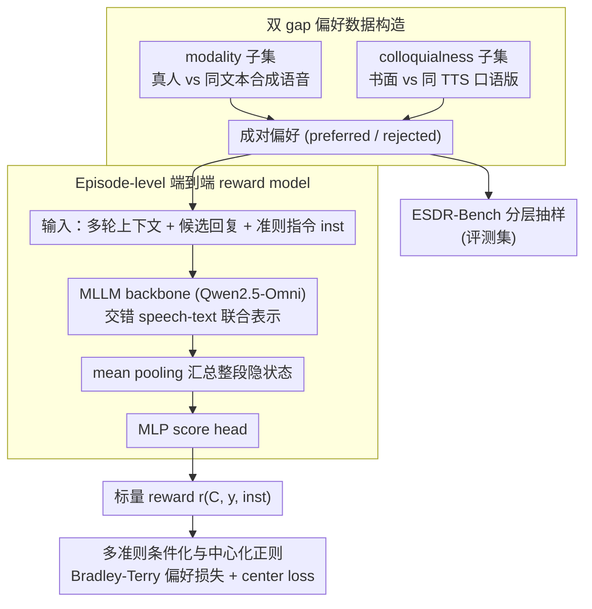

# SDiaReward: Modeling and Benchmarking Spoken Dialogue Rewards with Modality and Colloquialness

**会议**: ACL2026  
**arXiv**: [2603.14889](https://arxiv.org/abs/2603.14889)  
**代码**: https://github.com/MM-Speech/SDiaReward/  
**领域**: 语音对话 / Reward Model  
**关键词**: 语音对话评测、偏好学习、韵律自然性、口语化、奖励模型

## 一句话总结
SDiaReward 构建了面向多轮语音对话的成对偏好数据集与 ESDR-Bench，并训练端到端语音 reward model，让评测不再只看文本语义，而能同时判断韵律/情感等 modality gap 与自然口语风格的 colloquialness gap。

## 研究背景与动机
**领域现状**：端到端 spoken dialogue system 正在从级联 ASR+LLM+TTS 走向直接感知和生成语音的统一模型。文本对话、视觉生成等领域已经广泛使用 reward model、RLHF、DPO 和偏好学习来优化行为。

**现有痛点**：语音对话的偏好不只由文本内容决定，还受韵律、情绪、停顿、说话风格、轮次连贯性影响。文本 reward model 看不到这些信号；传统自动指标和单轮 TTS 评测又难以覆盖多轮互动。

**核心矛盾**：语音输出要同时满足语义正确、听感自然、对话流畅和口语化表达。通用 audio LLM 在 zero-shot 评测时往往“语义优先”，能看出文本风格差异，却无法稳定区分真人语音和高质量合成语音的细微 prosody 差异。

**本文目标**：作者希望建立一个 episode-level reward modeling 框架，直接输入多轮 speech episodes，用成对偏好监督学习一个能够评估 modality-aware naturalness 和 colloquialness 的标量 reward，并提供可复现 benchmark。

**切入角度**：论文把语音对话评测拆成两个明确 gap：modality gap 指语音中的韵律、情绪、通道条件等副语言信息；colloquialness gap 指书面文本和自然口语之间的风格差异。数据构造也围绕这两个 gap 设计对比样本。

**核心 idea**：用大规模成对语音 episode 偏好数据训练端到端 reward model，让模型直接“听见”多轮上下文和候选语音，而不是先把语音离散成文本再评估。

## 方法详解
SDiaReward 把语音对话评测做成一个端到端的标量打分问题：不是给单句 utterance 评分，而是对完整多轮上下文加候选最后一轮语音输出打一个 reward，背后配套一套双 gap 偏好数据集和分层抽样的 ESDR-Bench。

### 整体框架
模型接收一段多轮语音对话上下文 $\mathcal{C}$ 和候选最终回复 $y$，输出标量 $r_\theta(\mathcal{C}, y)$。训练用 preference pairs 监督：每对包含一个 preferred episode 和一个 rejected episode，数据来源横跨 wild YouTube 多人对话、MELD 半自然表演对话、DailyTalk studio scripted 语音，以及由 LLM 改写出的书面/口语两种风格对话。数据建好后，作者从 validation split 按 source 和 metadata 分层采样组成 ESDR-Bench，防止 Wild 子集体量过大把评测拉成单一分布。整套数据集共 13,356 对，其中训练 11,630 对、验证 1,726 对。

### 关键设计

**1. 双 gap 偏好数据构造：把"语音自然性"和"口语风格"两条评估轴隔离开**

如果偏好对里文本内容或录音条件不受控，模型很容易学到"录音更干净就更好"这类 shortcut，根本没在评声学自然性。作者因此按两个 gap 分别构造对照样本。modality-aware subset 把真人语音与 SoulX-Podcast 生成的同内容合成语音配成对，文本一致，迫使模型只能盯住 prosody、情绪、轮次一致性这些副语言差异；colloquialness subset 则先生成书面风格的多轮对话，再重写成带 filler、fragmentation、discourse markers 的自然口语版本，并用相同 TTS 配置合成，保证偏好信号纯粹来自风格而非音质。这样每一对都只在一个维度上有差，监督信号干净。

**2. Episode-level 端到端 reward model：让模型直接"听"完整多轮，而非读 ASR 文本**

多轮语音的偏好信息散落在上下文、最终回复和声学细节里，指望最后一个 token 或一段 ASR 转写承载全部信号并不现实。模型用 multimodal LLM backbone 把交错的 speech-text 序列投影到联合表示空间，取最后一层 hidden states $\mathbf{H}=\{h_1,\ldots,h_L\}$，再经 Pooling 和 MLP 输出 reward。作者对比 last-token、attention、mean pooling 三种聚合方式，发现 mean pooling 在 episode-level 表征上最稳，能更均衡地汇总分散在整段语音里的偏好线索。

**3. 多准则条件化与中心化正则：一个模型兼顾两类评测且 reward scale 不漂**

为了用同一个 reward model 处理 modality-aware 与 colloquialness 两套标准，输入里加入 criterion-specific instruction，reward 变成 $r_\theta(\mathcal{C}, y, inst)$。训练用 Bradley-Terry preference objective 让 preferred 的分数高于 rejected。但 pairwise loss 只约束相对大小、不约束绝对值，跨 Wild、Semi-wild、Scripted 的域差异容易被当成分数整体偏移，于是再加一个 center loss 把 reward 均值锚到合理范围，提升校准与训练稳定性——这对后续把 reward 用于 DPO/GRPO 尤其重要。

### 损失函数 / 训练策略
主损失是 Bradley-Terry preference loss：$\mathcal{L}_{pref}(\theta)=-\mathbb{E}[\log \sigma(r_\theta(\mathcal{C}^+,y^+)-r_\theta(\mathcal{C}^-,y^-))]$，要求 preferred response 的 reward 高于 rejected response，再叠加 center regularization 缓解 reward drift。模型初始化自 Qwen2.5-Omni，在一个线性 score head 上做标量预测，音频统一截断或 padding 到 30 秒。

## 实验关键数据

### 主实验
数据集规模覆盖四类偏好来源，Wild 数据占比最大，但 benchmark 通过分层抽样避免被其主导。

| Category | Train | Val | Total |
|----------|-------|-----|-------|
| Wild modality | 6,879 | 824 | 7,703 |
| Semi-Wild modality | 309 | 186 | 495 |
| Scripted modality | 2,192 | 466 | 2,658 |
| Colloquialness | 2,250 | 250 | 2,500 |
| Total | 11,630 | 1,726 | 13,356 |

ESDR-Bench 上，SDiaReward-7B 在 modality 和 overall 指标上显著超过通用 audio LLM、专用 speech evaluator 和 cascade system。

| 模型 | Modality Micro | Modality Macro | Colloq. Acc | Overall Micro | Overall Macro |
|------|----------------|----------------|-------------|---------------|---------------|
| Gemini 2.5 Pro | 72.63 | 70.50 | 98.80 | 76.42 | 84.65 |
| GPT-4o Audio | 51.12 | 50.47 | 98.00 | 57.91 | 74.23 |
| Qwen 3 Omni 30B | 58.18 | 55.97 | 97.20 | 63.83 | 76.59 |
| SpeechJudge | 54.44 | 52.62 | 55.20 | 54.55 | 53.91 |
| AudioReasoner+Whisper+GPT-4o | 55.38 | 53.09 | 75.20 | 58.25 | 64.14 |
| SDiaReward 3B | 88.62 | 79.20 | 92.00 | 89.11 | 85.60 |
| SDiaReward 7B | 96.61 | 94.91 | 97.20 | 96.70 | 96.06 |

### 消融实验
OOD TTS 测试说明 SDiaReward 并不是简单做 artifact detector。Wav2Vec2-DF 在 CosyVoice 2 上掉到 38.6%，而 SDiaReward-7B 对三种未见 TTS 引擎仍保持高准确率。

| OOD Engine | Wav2Vec2-DF Acc | SDiaReward-3B Acc | SDiaReward-7B Acc | SDiaReward-7B rejected score |
|------------|-----------------|-------------------|-------------------|------------------------------|
| OpenAI TTS | 89.9% | 93.0% | 98.3% | -0.62 |
| CosyVoice 2 | 38.6% | 93.1% | 95.3% | -0.04 |
| FireRedTTS-2 | 94.5% | 72.7% | 90.9% | 0.29 |

Pooling 与中心化正则消融显示 mean pooling + center loss 是最稳配置。

| 设置 | Modality | Colloq. | Overall |
|------|----------|---------|---------|
| 3B Last Hidden | 63.75 | 48.80 | 61.59 |
| 3B Attention | 87.94 | 93.60 | 88.76 |
| 3B Mean | 88.62 | 92.00 | 89.10 |
| 7B Last Hidden | 51.83 | 40.00 | 50.12 |
| 7B Attention | 70.60 | 55.20 | 68.37 |
| 7B Mean | 96.61 | 97.20 | 96.70 |
| 7B Mean w/o Center Loss | 95.05 | 97.20 | 95.37 |
| 7B Mean w/ Center Loss | 96.61 | 97.20 | 96.70 |

### 关键发现
- 通用 audio judge 在 colloquialness 上几乎饱和，例如 Gemini 2.5 Pro 达 98.80%，但 modality micro 只有 72.63%，说明文本/语言风格容易判断，声学自然性更难。
- SDiaReward-7B 的 modality micro 达 96.61%，macro 达 94.91%，比 3B 更稳定；3B 在 Semi-wild 上只有 55.38%，暴露了小模型对复杂半表演语音的泛化不足。
- 人类验证中，75 个分层样本的总体加权 agreement 为 83.5%±4.3%，高置信样本 88.3%，hard negatives 仍有 93.3% agreement，说明偏好标签大体可信。
- FireRedTTS-2 的 rejected score 更高，表示模型认为它更接近真人而不是机械判为假音频，这支持“相对表达力评估”而非 artifact shortcut。

## 亮点与洞察
- 论文准确抓住了 spoken dialogue reward 的核心：语音对话不是“文本答案 + 音质”，而是包含轮次节奏、情绪、停顿和口语习惯的整体体验。
- modality-aware pairing 的设计很干净。通过同文本真人/合成语音对比，模型必须学习副语言自然性，不能靠语义差异取胜。
- colloquialness pairing 也处理得比较严谨：书面版和口语版使用相同 TTS 配置，避免把音频质量误当成口语偏好。
- center loss 的价值不只是提升 1.33 个 overall 点，更重要的是让 reward scale 不随域漂移失控。对后续把 reward 用于 DPO/GRPO 的语音生成训练很关键。

## 局限与展望
- 作者承认数据目前偏向 in-the-wild 录音，未来需要更多高质量 acted speech 和更多合成引擎，以提升跨域鲁棒性。
- 虽然人类验证结果不错，但样本量只有 75，对细粒度主观偏好、文化差异、说话人风格偏差的覆盖还有限。
- reward 仍存在 domain-dependent offset。比如 Scripted 正样本的绝对分数可能偏低，说明模型学到的是域内相对排序而不是全局统一质量尺度。
- 下游应用到语音生成 RL 时要谨慎。reward model 可能被优化器 exploit，尤其是在声学 channel、语速、情绪强度等维度上产生不自然的 reward hacking。

## 相关工作与启发
- **vs SpeechJudge / SageLM**: 这些专用评测器更偏单轮语音或 TTS 质量，SDiaReward 评估 episode-level 多轮语音偏好，因此更适合交互式 spoken dialogue。
- **vs WavReward / ParaS2S**: 相关工作尝试纳入副语言信号，但常依赖手工声学特征或规则；SDiaReward 用数据驱动偏好学习替代 brittle feature engineering。
- **vs cascade evaluator**: AudioReasoner+Whisper+GPT-4o 在口语化上有一定能力，但 ASR 会抹掉 prosody 和 emotion，导致 modality task 表现弱。
- **启发**: 多模态 reward model 应该尽量让偏好对控制住无关变量。语音、视频、具身交互都可以用“同语义不同模态实现”的 hard pair 来训练感知层面的 reward。

## 评分
- 新颖性: ⭐⭐⭐⭐☆ 把 spoken dialogue reward 明确拆成 modality 与 colloquialness 两个 gap，并做 episode-level 偏好建模，很有针对性。
- 实验充分度: ⭐⭐⭐⭐⭐ 主结果、OOD TTS、人类验证、pooling 和 center loss 消融都比较完整。
- 写作质量: ⭐⭐⭐⭐☆ 结构清晰，实验分析细；个别术语如 relative expressiveness 还可以定义得更形式化。
- 价值: ⭐⭐⭐⭐⭐ 对端到端语音对话系统的评测和后续 RL 对齐都有直接价值。

<!-- RELATED:START -->

## 相关论文

- [\[ACL 2026\] VoxMind: An End-to-End Agentic Spoken Dialogue System](voxmind_an_end-to-end_agentic_spoken_dialogue_system.md)
- [\[ICML 2026\] The Silent Thought: Modeling Internal Cognition in Full-Duplex Spoken Dialogue Models via Latent Reasoning](../../ICML2026/audio_speech/the_silent_thought_modeling_internal_cognition_in_full-duplex_spoken_dialogue_mo.md)
- [\[ACL 2026\] Dial HEALTHDIAL for Advice: A Multilingual and Multi-Parallel Spoken Dialogue Dataset for Knowledge-Grounded Information Seeking](dial_healthdial_for_advice_a_multilingual_and_multi-parallel_spoken_dialogue_dat.md)
- [\[ACL 2026\] ZipVoice-Dialog: Non-Autoregressive Spoken Dialogue Generation with Flow Matching](zipvoice-dialog_non-autoregressive_spoken_dialogue_generation_with_flow_matching.md)
- [\[ICLR 2026\] ParaS2S: Benchmarking and Aligning Spoken Language Models for Paralinguistic-Aware Speech-to-Speech Interaction](../../ICLR2026/audio_speech/paras2s_benchmarking_and_aligning_spoken_language_models_for_paralinguistic-awar.md)

<!-- RELATED:END -->
