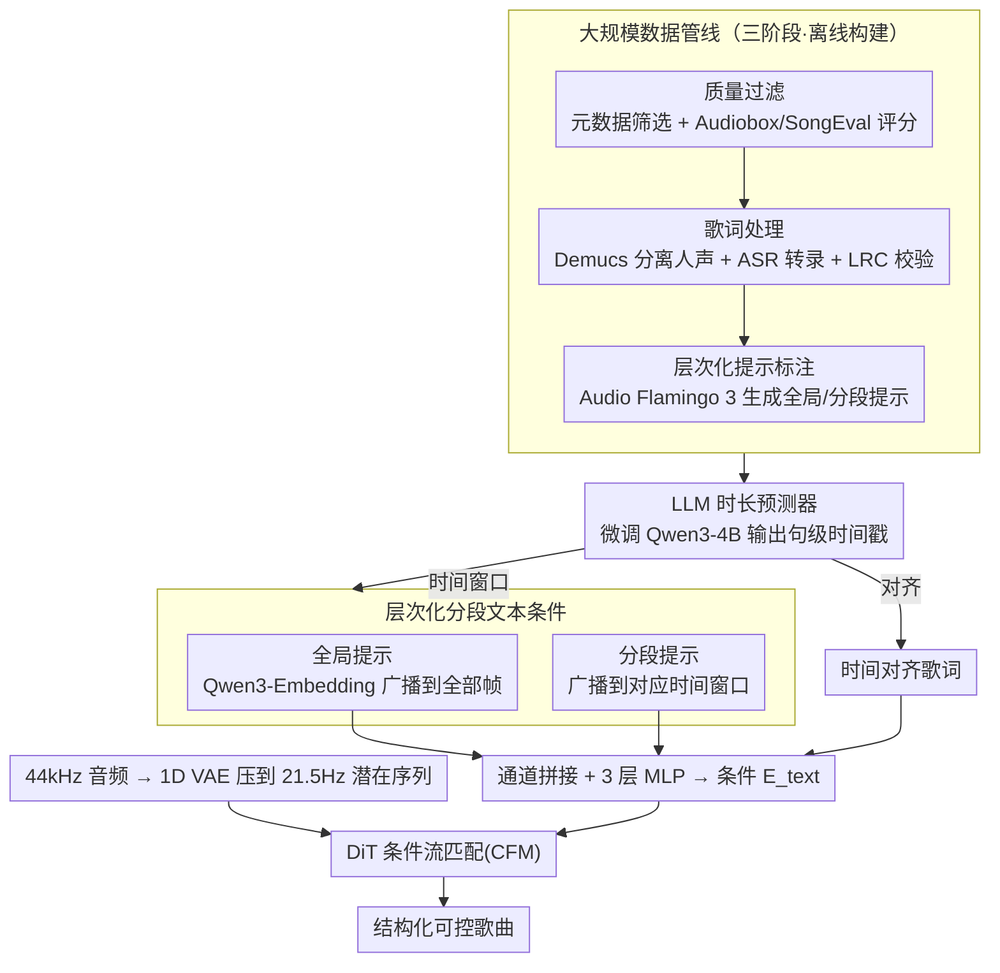

<!-- 由 src/gen_stubs.py 自动生成 -->
# SegTune: Structured and Fine-Grained Control for Song Generation

**会议**: ACL 2026  
**arXiv**: [2606.02638](https://arxiv.org/abs/2606.02638)  
**代码**: 待确认  
**领域**: audio_speech  
**关键词**: 歌曲生成, 分段控制, 扩散Transformer, 时长预测, 层次化条件

## 一句话总结
提出 SegTune，一种基于 Diffusion Transformer 的歌曲生成框架，通过层次化文本条件（全局 + 分段级提示）和 LLM 时长预测器实现对歌曲结构和音乐属性的细粒度时序控制。

## 研究背景与动机
**领域现状**: 神经歌曲生成已能从歌词和全局文本提示合成高质量音频，但现有系统（AR 如 YuE/LeVo 和 NAR 如 DiffRhythm/ACE-Step）主要依赖全局控制信号。

**现有痛点**: (1) 全局提示无法捕捉歌曲的时序动态变化（配器、情绪、能量随段落演变），导致输出同质化；(2) 全局条件下同时生成人声和伴奏给模型带来巨大的协调负担；(3) 缺乏细粒度控制限制了创作者的表达灵活性。

**核心矛盾**: NAR 模型将作曲和渲染压缩到单一扩散过程中，无法同时优化音乐结构、时序连贯性和声-器平衡；且现有方法依赖低质量歌词时长标注（手动或零样本 LLM 生成）。

**本文目标**: 在 NAR 歌曲生成中引入分段级细粒度控制能力，同时消除对手动歌词时长标注的依赖。

**切入角度**: 将文本提示分为全局和分段两级，分段提示时序广播到对应时间窗口，并用微调 LLM 自动预测句级时间戳。

**核心 idea**: 层次化分段条件注入 + LLM-based 时长预测器 = 结构化细粒度可控歌曲生成。

## 方法详解

### 整体框架
SegTune 要解决的是"如何在非自回归歌曲生成里加入分段级时序控制"。它以 DiT（Diffusion Transformer）为骨架、基于条件流匹配（CFM）建模：先用 1D VAE 把 44kHz 原始音频压到 21.5Hz 的潜在序列，再从全局文本提示、分段文本提示、时间对齐歌词三个互补来源构造条件注入扩散过程；其中一个微调过的 LLM 时长预测器负责生成句级时间戳，既用来把分段提示广播到正确的时间窗口，也用来对齐歌词。这样输出的歌曲就能在保持全局风格的同时，按段落呈现配器、情绪、能量的演变。

### 关键设计

**1. 层次化分段文本条件：让全局风格一致性与局部音乐变化各管各的**

歌曲的配器、情绪、节奏天然随段落演变，单一全局提示压根表达不出这种时序动态，输出容易同质化。SegTune 把文本条件拆成两级：全局提示经 Qwen3-Embedding-0.6B 编码后广播到全部帧，负责整体风格；分段提示编码为向量 $\mathbf{e}_s^i \in \mathbb{R}^{1 \times d_s}$，只广播到它对应的时间窗口内的帧，负责局部变化。两路条件沿通道维拼接后过 3 层 MLP，映射成最终注入 DiT 的条件 $E_{\text{text}} \in \mathbb{R}^{T \times 1024}$。分段提示的时间窗口正是由后面的时长预测器给出，所以"哪段提示管哪几帧"是自动确定的。

**2. LLM-based 时长预测器：把易错的时间戳标注变成一次可控的生成**

先前 NAR 方法要么依赖容易出错的手动时间戳，要么靠脆弱的零样本 LLM 提示去凑词级时间，质量都不稳。SegTune 改为微调 Qwen3-4B-Base：输入歌词加层次化提示，自回归输出 LRC 格式的句级时间戳，训练用 LoRA（rank=32）在 >100k 条 LRC 数据上跑 8 个 epoch。得到的句级时间戳同时服务于分段提示广播和歌词对齐，彻底去掉了对人工时长标注的依赖。

**3. 大规模数据管线（三阶段）：用清洗后的对齐数据撑起分段控制能力**

分段控制要学得好，前提是有大量"音频—对齐歌词—层次化提示"三者齐全的高质量样本。管线分三步：先做质量过滤，用元数据筛选叠加 Audiobox/SongEval 美学评分；再做歌词处理，用 Demucs v4 分离人声、FireRedASR/Whisper 转录、并做 LRC 校验拿到对齐歌词；最后做层次化提示标注，由 Audio Flamingo 3 生成全局和分段两级文本提示。三步下来才得到可供分段条件训练的数据底座。

### 损失函数 / 训练策略
训练目标是条件流匹配损失 $\mathcal{L} = \mathbb{E}_{t,q,p} \| v_\theta(t,C,x_t) - u(x_t|x_0,x_1) \|^2$。整体走三阶段：先预训练（~370k 歌曲、~27k 小时、20 epoch），再微调（~50k 歌曲、~4k 小时、8 epoch），最后做偏好对齐（2 轮迭代 DPO，每轮 ~20k 对）。为支持 CFG，全局和分段条件各以 20% 概率 dropout；推理用 Euler ODE 求解器，负条件 CFG 取 cfg=3、cfg_n=1。

## 实验关键数据

### 主实验

| 模型 | PER↓ | AudioBox-CE↑ | SongEval-OM↑ | G-Mulan↑ | Gender Acc↑ | Age Acc↑ |
|------|------|-------------|-------------|---------|------------|---------|
| YuE | 48.5% | 7.16 | 3.22 | 0.29 | 80.7% | 44% |
| LeVo | 29.8% | 7.43 | 3.35 | 0.32 | 90.6% | 50% |
| DiffRhythm++ | 27.4% | 7.55 | 3.76 | 0.47 | 37.5% | 54% |
| ACE-Step | 35.6% | 7.38 | 3.74 | 0.35 | 78.1% | 56% |
| **SegTune-SFT** | **14.5%** | 7.38 | 3.19 | 0.47 | **96.7%** | 57% |
| **SegTune-DPO** | 18.5% | **7.63** | **3.97** | 0.46 | 81.0% | 51% |

### 消融实验（Prompt Encoder 设计）

| 全局编码器 | 分段编码器 | G-Mulan↑ | S-Mulan↑ | Gender Acc↑ | SongEval-OM↑ |
|-----------|-----------|---------|---------|------------|-------------|
| MuQ | – | 0.39 | 0.30 | 47.6% | 2.86 |
| Qwen3-Emb | – | 0.40 | 0.33 | 92.2% | 3.12 |
| Qwen3-Emb(G) + MuQ(S) | 拼接 | 0.44 | 0.37 | 84.4% | 3.34 |
| **Qwen3-Emb + Qwen3-Emb** | **拼接** | **0.47** | **0.38** | **96.7%** | **3.19** |

### 关键发现
- SegTune-SFT 的 PER 仅 14.5%，远低于所有基线（最低基线 DiffRhythm++ 为 27.4%），表明歌词保真度和人声可懂度最优
- 分段提示注入显著提升指令跟随能力：加入分段编码器后 S-Mulan 从 0.33 提升至 0.38，Gender 准确率从 92.2% 提升至 96.7%
- DPO 微调提升音乐性（MOS 4.57±0.52），但因偏好数据偏差（年轻女声主导）导致性别/年龄控制准确率下降
- 主观 MOS 评测：SegTune-DPO 在音乐性上达最高分 4.57±0.52（标准差最低），质量 3.87±0.56（第二，标准差最低）

## 亮点与洞察
- 首次在 NAR 歌曲生成中引入显式分段级文本条件，实现了音乐属性的时序细粒度控制
- LLM 时长预测器是一个优雅的工程设计：将 Qwen3-4B 微调为 LRC 格式生成器，完全消除手动时间戳需求
- 三阶段训练（预训练→微调→DPO）配合数据管线清洗形成了完整的工程闭环
- Qwen3-Embedding 作为提示编码器比音乐专用的 MuQ-MuLan 在指令跟随上表现更好，说明语义理解能力对可控生成至关重要

## 局限与展望
- DPO 后指令跟随能力（性别/年龄）下降，偏好数据偏差问题待解决；可考虑在线策略优化（动态惩罚属性偏差）
- 训练数据以中文流行歌曲为主（>90%），跨语言和跨风格泛化能力有待验证
- 目前仅支持句级时长预测，更细粒度的词级/音素级控制未探索
- 内部数据集和部分模型未公开，可复现性受限

## 相关工作与启发
- DiffRhythm / ACE-Step / JAM 等 NAR 方法虽然加速了生成但缺乏细粒度控制，SegTune 的分段条件范式可推广到其他 NAR 框架
- Music ControlNet 引入时变控制信号但限于器乐，SegTune 扩展到完整歌曲（人声+伴奏）
- LLM 时长预测器的思路可启发其他需要时序对齐的多模态生成任务

## 评分
- 新颖性: ⭐⭐⭐⭐ 分段级文本条件和 LLM 时长预测器是有创新性的设计
- 实验充分度: ⭐⭐⭐⭐ 客观指标全面（PER/AudioBox/SongEval/MuLan/属性准确率），含消融和主观 MOS
- 写作质量: ⭐⭐⭐⭐ 结构清晰，动机到方法再到实验的逻辑链完整
- 价值: ⭐⭐⭐⭐ 解决了 NAR 歌曲生成缺乏细粒度控制的核心问题，工程闭环完整

<!-- RELATED:START -->

## 相关论文

- [\[ACL 2026\] Towards Fine-Grained and Multi-Granular Contrastive Language-Speech Pre-training](towards_fine-grained_and_multi-granular_contrastive_language-speech_pre-training.md)
- [\[ICML 2026\] MECAT: A Multi-Experts Constructed Benchmark for Fine-Grained Audio Understanding Tasks](../../ICML2026/audio_speech/mecat_a_multi-experts_constructed_benchmark_for_fine-grained_audio_understanding.md)
- [\[ACL 2025\] T2A-Feedback: Improving Basic Capabilities of Text-to-Audio Generation via Fine-grained AI Feedback](../../ACL2025/audio_speech/t2a_feedback_audio_gen.md)
- [\[NeurIPS 2025\] Segment-Factorized Full-Song Generation on Symbolic Piano Music](../../NeurIPS2025/audio_speech/segment-factorized_full-song_generation_on_symbolic_piano_music.md)
- [\[NeurIPS 2025\] LeVo: High-Quality Song Generation with Multi-Preference Alignment](../../NeurIPS2025/audio_speech/levo_high-quality_song_generation_with_multi-preference_alignment.md)

<!-- RELATED:END -->
