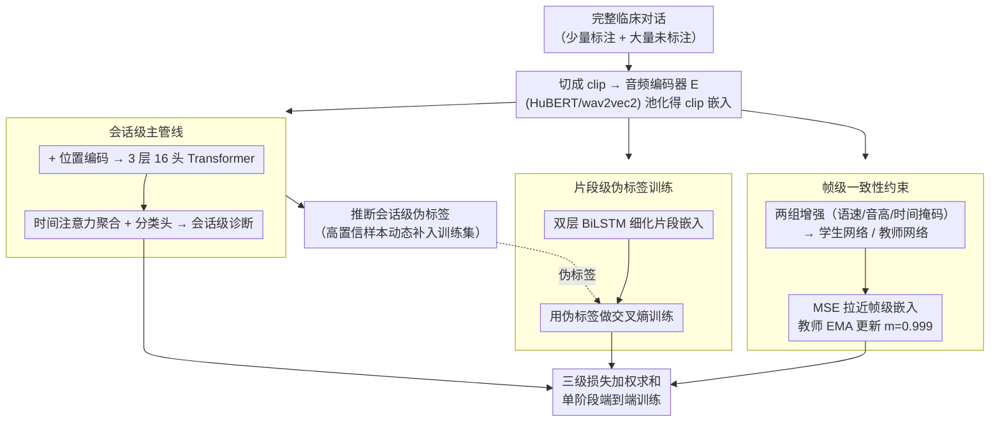

# Semi-Supervised Diseased Detection from Speech Dialogues with Multi-Level Data Modeling

**会议**: ACL 2026  
**arXiv**: [2601.04744](https://arxiv.org/abs/2601.04744)  
**代码**: [GitHub](https://github.com/fispresent/semi_pathological)  
**领域**: 音频语音
**关键词**: 半监督学习, 病理语音检测, 多粒度建模, 伪标签, 临床对话

## 一句话总结

本文提出一种纯音频的半监督学习框架，通过在会话级、片段级和帧级三个层次联合建模临床对话中的病理语音特征，利用 EMA 教师-学生网络动态生成高质量伪标签，在抑郁症和阿尔茨海默症检测中仅用 11 个标注样本即可达到全监督 90% 的性能。

## 研究背景与动机

**领域现状**：利用语音声学特征作为疾病检测的生物标志物是一个日益受关注的方向。现有方法主要依赖全监督学习，使用 wav2vec2、HuBERT 等预训练音频编码器进行迁移学习。多模态方法（结合音频、文本、视觉）也有探索，但面临模态冲突和 ASR 误差传播等问题。

**现有痛点**：(1) 医学语音数据的标注需要临床专家，获取成本极高，导致严重的数据稀缺；(2) 临床标注存在显著的评分者间主观差异，标签本身就是噪声信号；(3) 最核心的挑战是"远端弱监督"——一段长达数分钟的对话只有一个会话级标签（如"抑郁/健康"），但病理特征并非均匀分布在每句话中；(4) 现有方法将长录音切段后独立处理，隐式假设症状在每个片段中均匀表达，这一假设经常不成立；(5) 通用音频领域的半监督方法无法直接迁移到医学场景，因为病理模式在语音中是稀疏分布的。

**核心矛盾**：监督信号在会话级（宏观），但有意义的声学特征需要在帧级或片段级（微观）提取——模型必须在没有细粒度标注的情况下，学会从长对话中定位最具诊断价值的片段。

**本文目标**：设计一种专门针对医学语音的半监督框架，能够同时处理弱监督、数据稀缺和标签噪声三个核心挑战。

**切入角度**：从临床对话的层次结构出发——帧级声学特征 → 片段级（单句话）语义 → 会话级诊断标签，显式建模这种层级关系，而非将所有信息压缩到单一粒度。

**核心 idea**：通过三个粒度层次的联合建模（会话级分类 + 片段级伪标签细化 + 帧级一致性约束），在单阶段端到端训练中动态生成和更新伪标签，实现对未标注数据的高效利用。

## 方法详解

### 整体框架

框架采用教师-学生架构，包含三个层次的建模：(1) 会话级主管线——将完整对话编码后通过 Transformer 聚合，输出最终诊断；(2) 片段级——利用 RNN 对每个话语级别的嵌入进行建模，使用主管线生成的伪标签进行训练；(3) 帧级——通过 Siamese 网络施加帧级一致性约束。教师网络参数通过 EMA 更新，不参与梯度回传。

### 关键设计

**1. 会话级主管线：把完整对话当作一个整体来诊断，并顺手生成伪标签**

直接复用"切段独立打分"的旧做法会丢掉跨句子的语境，而病理线索恰恰可能散落在对话的不同位置。主管线因此保留完整对话：先把它切成若干 clip，每个 clip 经音频编码器 $E$（HuBERT / wav2vec2）池化成嵌入 $embed_{clip_i} = POOL(E(clip_i))$，按时序拼接并加上可学习位置编码，再送入一个 3 层 16 头的 Transformer 得到会话级表示，最后用时间注意力聚合 + 分类头输出诊断。多头注意力让模型自己学会哪几句话更值得关注，而不必人工指定。对于没有标签的对话，这条管线还会顺带推断一个会话级伪标签，把高置信样本动态补进训练集——这是整个半监督回路的源头。

**2. 片段级伪标签训练：让编码器学会区分"哪句话才有病理特征"**

旧方法默认"患者每句话都带病、健康人每句话都不带病"，可现实里一段长对话只有少数句子真正含诊断信息。片段级管线就是要打破这个均匀假设：把主管线里每个 clip 的嵌入 $embed_{clip_i}$ 再送进一个双层双向 LSTM，得到细化的片段嵌入 $embed_{clip_i} = RNN(clip_i)$，并用主管线推断出的伪标签做交叉熵训练。由于伪标签随训练不断刷新，编码器是在动态修正中逐步学到"哪句话像病理表达"。这一设计还有个实用好处——它能直接吞下同时含调查员和受试者的混合对话，无需先做说话人分离。

**3. 帧级一致性约束：在最底层声学模式上提供抗噪声的稳定锚点**

会话级和片段级都依赖伪标签，一旦伪标签噪声大，整条链路就可能被带偏。帧级约束故意不碰伪标签，只做自监督一致性：用 Siamese 结构对同一输入施加两组不同增强（语速扰动、音高偏移、时间掩码）生成两个视图，分别过学生网络与教师网络，再用 MSE 拉近两者的帧级嵌入：

$$Loss_{frame} = MSELoss(embed_{teacher}, embed_{student})$$

教师网络不参与梯度回传，而是用 EMA 跟随学生缓慢更新 $\theta_{teacher} \leftarrow m \cdot \theta_{teacher} + (1-m) \cdot \theta_{student}$，衰减率 $m=0.999$。因为这层学的是与标签无关的低层声学规律，即使上面两级伪标签暂时不准，帧级表示依然稳定，相当于给整个框架兜了一层对伪标签噪声的天然鲁棒性。

### 损失函数 / 训练策略

总损失为三级损失的加权和：$Loss = \alpha Loss_{session} + \beta Loss_{clip} + \gamma Loss_{frame}$。训练采用单阶段在线方式：预热 $k_0$ 步后，每 $k$ 步重新评估和更新所有伪标签。采用阈值策略——置信度超过阈值的未标注样本纳入训练集，低于阈值的排除。最优阈值为 0.75（在 EATD-Corpus 上 Macro F1 达 68.58%）。

## 实验关键数据

### 主实验

**不同标注比例下的检测性能（Macro F1）**

| 方法 | 100% | 50% | 40% | 30% | 20% | 10% |
|------|------|-----|-----|-----|-----|-----|
| 抑郁检测-Baseline | 59.53 | 57.41 | 55.78 | 56.04 | 55.00 | 51.73 |
| 抑郁检测-Ours | 63.26 | 62.00 | 58.51 | 58.59 | 57.70 | 54.37 |
| 阿尔茨海默-Baseline | 71.25 | 70.18 | 69.80 | 67.79 | 67.45 | 65.09 |
| 阿尔茨海默-Ours | 73.01 | 71.35 | 72.14 | 70.11 | 69.80 | 69.47 |

### 消融实验

**层级组件的增量消融（抑郁检测，Macro F1）**

| 方法 | 100% | 50% | 30% | 10% |
|------|------|-----|-----|-----|
| Baseline | 59.53 | 57.41 | 56.04 | 51.73 |
| +Session-level | - | 60.55 | 58.25 | 52.95 |
| +Clip-level | 60.78 | 58.30 | 56.55 | 52.50 |
| +Frame-level | 62.87 | 60.31 | 58.21 | 54.21 |
| Ours（全部+微调编码器） | 63.26 | 62.00 | 58.59 | 54.37 |

### 关键发现

- 用仅 10% 的标注数据（约 11 个样本）即可达到全监督基线 90% 的性能，30% 标注数据即可匹配全监督性能
- 在全监督设置下也优于基线——说明多粒度建模本身就能增强特征学习
- 帧级组件贡献最大，因为它提供了对伪标签噪声的天然鲁棒性
- 框架跨编码器（wav2vec2、HuBERT、WavLM）、跨语言（中英文）、跨疾病类型均表现稳健
- 伪标签质量在训练过程中持续提升，后期甚至超过额外人工标注的质量
- 对比 FixMatch 基线，在所有标注比例下均大幅领先（如 10% 下 69.47 vs 61.93），因为 FixMatch 未建模病理特征的层级稀疏性

## 亮点与洞察

- 三粒度联合建模的设计非常优雅——会话级做全局决策、片段级做细化学习、帧级做一致性约束，三者互补且各自独立运作时也能发挥作用
- 单阶段在线伪标签更新避免了传统多阶段 SSL 的复杂性和额外推理成本
- 不需要说话人分离预处理——框架能直接处理包含调查员和受试者的原始对话，且实验表明包含调查员语音时性能几乎不降
- 片段级伪标签分析（Figure 5）清楚展示了模型学会了区分受试者和调查员——受试者的"病理"标签比例随训练显著上升，而调查员的保持低水平

## 局限与展望

- 纯音频方法无法利用文本和视觉模态的信息
- 数据集规模较小（EATD-Corpus 162 人，ADReSSo21 237 人），在更大规模数据上的表现待验证
- 未探索与多模态方法的结合可能性
- 跨语言预训练模型（如英文 WavLM 用于中文数据集）效果受限，说明语言匹配的预训练很重要

## 相关工作与启发

- **vs FixMatch**: 通用 SSL 方法无法建模病理特征的层级稀疏性，本文通过多粒度建模专门解决这一问题
- **vs 多模态方法（CAMFM, ACMA）**: 多模态方法在准确率上更高，但纯音频方法在跨语言迁移和部署简便性上有优势
- **vs 传统全监督方法**: 传统方法将对话切段独立处理，假设症状均匀表达，本文明确建模了稀疏表达特性

## 评分

- 新颖性: ⭐⭐⭐⭐ 三粒度半监督框架在医学语音检测中首次提出，单阶段在线伪标签更新简洁有效
- 实验充分度: ⭐⭐⭐⭐ 双语言双疾病验证、三种编码器、多比例标注数据、详细消融，但数据集规模偏小
- 写作质量: ⭐⭐⭐⭐ 问题定义清晰，方法层次分明，伪标签分析可视化丰富
- 价值: ⭐⭐⭐⭐ 为标注稀缺的医学语音分析提供了实用的半监督解决方案，模型无关设计增强了通用性

<!-- RELATED:START -->

## 相关论文

- [\[ACL 2026\] Data-efficient Targeted Token-level Preference Optimization for LLM-based Text-to-Speech](data-efficient_targeted_token-level_preference_optimization_for_llm-based_text-t.md)
- [\[ACL 2026\] An Exploration of Mamba for Speech Self-Supervised Models](an_exploration_of_mamba_for_speech_self-supervised_models.md)
- [\[ACL 2026\] SpeakerSleuth: Can Large Audio-Language Models Judge Speaker Consistency across Multi-turn Dialogues?](speakersleuth_can_large_audio-language_models_judge_speaker_consistency_across_m.md)
- [\[ACL 2026\] \[b\] = \[d\] − \[t\] + \[p\]: Self-supervised Speech Models Discover Phonological Vector Arithmetic](bd-tp_self-supervised_speech_models_discover_phonological_vector_arithmetic.md)
- [\[ICLR 2026\] EchoMind: An Interrelated Multi-level Benchmark for Evaluating Empathetic Speech Language Models](../../ICLR2026/audio_speech/echomind_an_interrelated_multi-level_benchmark_for_evaluating_empathetic_speech_.md)

<!-- RELATED:END -->
