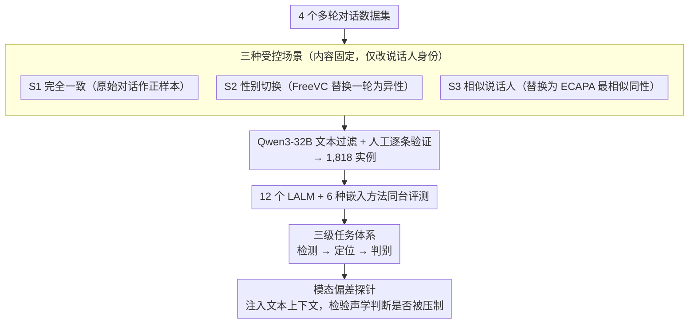

# SpeakerSleuth: Can Large Audio-Language Models Judge Speaker Consistency across Multi-turn Dialogues?

**会议**: ACL 2026  
**arXiv**: [2601.04029](https://arxiv.org/abs/2601.04029)  
**代码**: [https://github.com/holi-lab/SpeakerSleuth](https://github.com/holi-lab/SpeakerSleuth)  
**领域**: 音频语音  
**关键词**: 大型音频语言模型, 说话人一致性, 多轮对话, 基准测试, 模态偏差

## 一句话总结

SpeakerSleuth 构建了首个评估 LALM 多轮对话说话人一致性判断能力的基准（1,818 实例），系统评测 12 个 LALM 和 6 种嵌入方法后发现：模型在检测和定位声学不一致时表现挣扎，存在严重的文本优先于声学的模态偏差，但在比较/排序声学变体时表现较好。

## 研究背景与动机

**领域现状**：语音合成技术已能生成自然的人类语音，被广泛应用于语音助手、播客、电影配音和对话代理等场景。维持多轮对话中说话人身份的一致性（音色、音高、声音质量）是基本要求。

**现有痛点**：
- 即使最新的语音合成模型也存在说话人混淆、音色漂移、声音质量变化等问题
- 现有评估方法基于嵌入模型计算成对相似度，无法整体评估整个对话的一致性，且需手动设定阈值
- LALM 虽能一次性处理整个对话直接输出判断，但其声学判别能力是否可靠完全未知

**核心矛盾**：LALM 理论上可以作为全面的音频-语言评判者，但缺乏系统性基准来评估其是否具备可靠的声学判别能力，尤其是在多轮对话场景下。

**本文目标**：构建基准系统性评估 LALM 和嵌入方法在多轮对话说话人一致性判断上的能力，揭示其优缺点和核心局限。

**切入角度**：设计三个递进任务——检测（是否一致）→定位（哪个轮次不一致）→判别（比较和排序变体）——全面评估不同层次的声学判别能力。

**核心 idea**：通过控制变量的实验设计（同一对话 × 三种场景：完全一致/性别切换/相似说话人替换），隔离声学因素进行系统评估，揭示 LALM 的模态偏差。

## 方法详解

### 整体框架

SpeakerSleuth 想回答一个此前没人系统验证过的问题：大型音频语言模型能否在多轮对话里可靠判断"声称是同一个人的发言是否声学一致"。基准从 4 个对话数据集收集多轮音频，对每段对话派生三种受控场景，再用 FreeVC 做语音转换、Qwen3-32B 自动过滤文本、人工逐条验证音频质量，最终得到 1,818 个实例；在此之上让 12 个 LALM 和 6 种嵌入方法同台跑检测、定位、判别三个递进任务，并额外注入文本上下文探测模态偏差，从而把"声学判别能力"逐层拆开测量。

### 关键设计

**1. 三种受控场景：让性能差异只反映声学**

整段对话的内容、轮次和语义完全保持一致，唯一变化的是说话人身份是否被动过手脚，这样任何场景间的准确率落差都只能归因于声学判别，而非内容理解。S1（完全一致）用原始对话作正样本；S2（性别切换）随机挑一轮用语音转换替换成异性说话人，制造最明显的声学偏差；S3（相似说话人）则替换为 ECAPA-TDNN 嵌入余弦相似度最高的同性说话人，把难度推到细粒度边界。S2→S3 的难度递增天然构成一条声学敏感度梯度，能看出模型在"明显不一致"和"细微不一致"上的表现断层。

**2. 三级任务体系：从粗到细对应真实 TTS 工作流**

三个任务刻意对齐生成系统的实际修复链路——先检测有没有问题、再定位是哪一轮、最后重新生成并挑最优。检测是绝对判断，要求模型判断所有轮次是否同属一人，依赖一个稳定的内部阈值；定位要求精确指出哪一轮不一致，需要 turn 级别的声学区分；判别是相对比较，给定三个候选音频按声学相似度排序（含分类和排序两种形式），考察的是相对而非绝对判断。三层难度不同，能定位模型究竟卡在哪一环。

**3. 模态偏差探针：暴露文本对声学的压制**

实际应用里 LALM 同时拿到音频和文本，作者在主实验之外额外把其他说话人轮次的文本上下文喂给模型，观察检测性能怎么变。如果模型本该靠声学线索判断不一致，却因为文本读起来连贯就改判一致，性能就会塌方——实验里 Gemini-2.5-Flash-Lite 在性别切换场景下因此从 70.3 跌到 3.3，干净地证明了"文本优先于声学"的模态失衡。

## 实验关键数据

### 主实验（检测 - 平衡准确率）

| 模型 | S1 Acc | S2 Acc | S3 Acc | 平衡准确率 | 说明 |
|------|--------|--------|--------|-----------|------|
| Gemini-2.5-Pro | 73.9 | 71.6 | 39.3 | **64.7** | 最强 LALM |
| GPT-4o-audio | 72.9 | 32.8 | 29.5 | 52.0 | 检测能力弱 |
| Pairwise (WavLM) | 91.8 | 38.4 | 37.7 | **64.9** | 最强嵌入方法 |
| Pairwise (ECAPA) | 36.0 | 88.4 | 86.3 | 61.7 | 过度检测 |

### 判别任务

| 模型 | 分类准确率 | NDCG@1 | 精确匹配 | 说明 |
|------|-----------|--------|---------|------|
| Gemini-2.5-Pro | **81.5** | **88.8** | **71.5** | 相对判断能力强 |
| Pairwise (ECAPA) | **99.2** | **99.6** | 58.6 | 嵌入方法排序优秀 |

### 文本上下文影响（检测）

| 模型 | S2 Audio-only | S2 +文本 | Δ | 说明 |
|------|-------------|---------|---|------|
| GPT-4o-audio | 32.8 | 6.3 | **-26.5** | 文本严重干扰 |
| Gemini-2.5-Flash-Lite | 70.3 | 3.3 | **-67.0** | 几乎完全失效 |
| Gemini-2.5-Pro | 71.6 | 46.8 | -24.8 | 受影响但仍有一定判别力 |

### 关键发现
- **检测阈值不稳定**：LALM 在反对角线上聚集——要么过度预测一致（如 MiniCPM-o），要么过度预测不一致（如 Qwen2.5-Omni-7B），缺乏校准的内部阈值
- **定位能力极弱**：大多数模型要么默认不标记任何轮次，要么不分青红皂白标记所有轮次（如 Gemma-3n，95% recall 但仅 19% precision）
- **判别任务表现好**：同样的模型在相对比较/排序声学变体时表现优秀（Gemini-2.5-Pro 88.8% NDCG@1），说明模型具有固有的声学判别能力，只是绝对判断不可靠
- **严重的文本偏差**：添加文本上下文后，模型优先考虑文本连贯性而忽略声学线索，即使是性别切换这种极明显的不一致也无法检测
- 嵌入方法也有系统性偏差：ECAPA-TDNN 偏向过度检测，WavLM 偏向遗漏

## 亮点与洞察
- 发现了 LALM 中"文本优先于声学"的根本性模态偏差，这一发现对构建可靠的音频-语言评判者有重要警示
- "检测差但判别好"的反直觉发现揭示了问题本质：不是模型缺乏声学感知能力，而是缺乏可靠的内部决策阈值
- 三种场景（一致/性别切换/相似说话人）的受控设计很精巧，干净地隔离了声学因素
- 同时评测 LALM 和嵌入方法，提供了两类方法的公平比较和互补洞察

## 局限与展望
- 基准中语音转换工具可能引入伪影，影响某些场景的自然度
- 仅测试了英语对话数据，跨语言评估仍需进一步扩展
- 每个目标说话人固定 5 个轮次，更长对话中的一致性评估未涉及
- 评测集规模（1,818 实例）相对有限，统计功效可能不足以区分某些模型间的微小差异

## 相关工作与启发
- **vs 传统说话人验证（ECAPA-TDNN）**: 传统方法做成对比较，SpeakerSleuth 评估整体对话级一致性判断
- **vs LALM-as-Judge（语音质量评估）**: 现有 LALM 评判者主要关注单维度语音质量，SpeakerSleuth 首次评估跨轮次的说话人一致性
- **vs 说话人识别/分离**: 传统任务识别"谁在说话"，SpeakerSleuth 评估"声称是同一人的发言是否声学一致"

## 评分
- 新颖性: ⭐⭐⭐⭐⭐ 首个多轮对话说话人一致性评估基准，模态偏差的发现具有重要启示价值
- 实验充分度: ⭐⭐⭐⭐⭐ 12 个 LALM + 6 种嵌入方法、三级任务、文本影响分析、参考音频影响分析均全面
- 写作质量: ⭐⭐⭐⭐ 任务设计→基准构建→实验分析的逻辑清晰，关键发现总结到位

<!-- RELATED:START -->

## 相关论文

- [\[ACL 2026\] Style Amnesia: Investigating Speaking Style Degradation and Mitigation in Multi-Turn Spoken Language Models](style_amnesia_investigating_speaking_style_degradation_and_mitigation_in_multi-t.md)
- [\[ACL 2025\] Who Can Withstand Chat-Audio Attacks? An Evaluation Benchmark for Large Audio-Language Models](../../ACL2025/audio_speech/who_can_withstand_chat-audio_attacks_an_evaluation_benchmark_for_large_audio-lan.md)
- [\[AAAI 2026\] DiffA: Large Language Diffusion Models Can Listen and Understand](../../AAAI2026/audio_speech/diffa_large_language_diffusion_models_can_listen_and_understand.md)
- [\[ACL 2026\] Temporal Contrastive Decoding: A Training-Free Method for Large Audio-Language Models](temporal_contrastive_decoding_a_training-free_method_for_large_audio-language_mo.md)
- [\[ACL 2026\] Closing the Modality Reasoning Gap for Speech Large Language Models](closing_the_modality_reasoning_gap_for_speech_large_language_models.md)

<!-- RELATED:END -->
