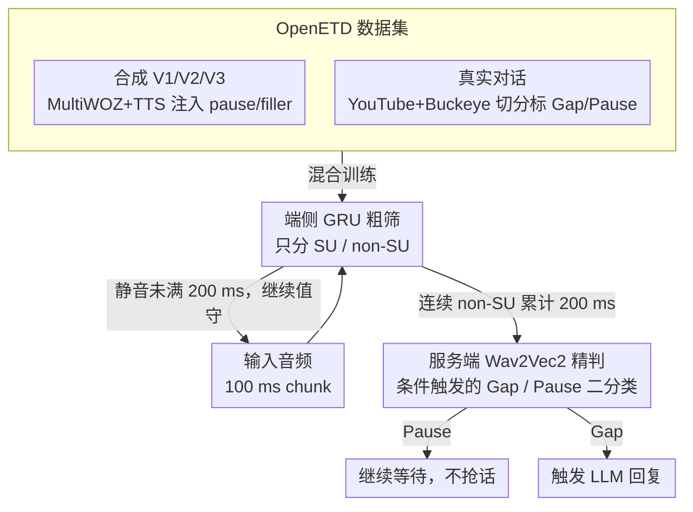

# Speculative End-Turn Detector for Efficient Speech Chatbot Assistant

**会议**: ACL2026  
**arXiv**: [2503.23439](https://arxiv.org/abs/2503.23439)  
**代码**: 论文说明释放处理代码和 OpenETD 数据脚本，正文未给出完整仓库 URL  
**领域**: 语音对话 / End-Turn Detection / 高效推理  
**关键词**: 端点检测、语音聊天、OpenETD、协同推理、低延迟

## 一句话总结
论文构建首个公开 end-turn detection 数据集 OpenETD，并提出 SpeculativeETD，让端侧 GRU 持续检测 speaking/non-speaking，只有遇到 200 ms 静音时才调用服务端 Wav2Vec2 区分 Gap 与 Pause，从而在真实语音上以 38 倍更低 FLOPs 和亚毫秒端侧延迟换取接近大模型的实时 turn-taking 效果。

## 研究背景与动机
**领域现状**：LLM 语音助手越来越强调自然对话，系统需要判断用户是已经说完，还是只是短暂停顿思考。这个任务称为 end-turn detection，直接影响语音助手是否会抢话、误打断或延迟响应。

**现有痛点**：现有 turn-taking 数据要么私有，要么如 Fisher corpus 一样使用成本较高，导致 ETD 研究难以复现。模型方面，Wav2Vec2 这类 transformer 音频模型准确率高但计算重，不适合每 100 ms 在端侧连续运行；小 GRU 可以实时部署，但准确率明显低，尤其难以区分真正的说话结束和犹豫停顿。

**核心矛盾**：ETD 需要高频、低延迟、低功耗地运行，但最难的 Gap/Pause 区分又需要更强的语音理解能力。若始终运行大模型，成本太高；若只用小模型，交互质量不稳。

**本文目标**：作者同时解决数据和推理两个瓶颈：构建公开 OpenETD 数据集，覆盖合成和真实对话音频；设计一个端云协同框架，让大模型只在必要静音段触发。

**切入角度**：ETD 的三分类状态可以拆成两个难度不同的问题。Speaking Unit vs non-SU 相对容易，小模型足够；Gap vs Pause 更难，只在出现静音段后才需要大模型判断。

**核心 idea**：把 speculative decoding 中“小模型快速筛选，大模型少量确认”的结构迁移到语音端点检测，但让大小模型负责不同类别粒度，而不是预测同一分布。

## 方法详解

### 整体框架

SpeculativeETD 要解决的是语音助手最尴尬的瞬间：用户只是停顿思考，系统却以为话说完了抢着回话。它把这个 end-turn detection 任务按难度切成两层，端侧 GRU 以 100 ms chunk 为单位连续运行、只做最容易的"是否在说话"判断，只有当连续静音累积到 turn-taking 文献常用的 200 ms 阈值时，才把这段静音发给服务端 Wav2Vec2 去裁决它到底是 Gap（用户说完，可触发 LLM 回复）还是 Pause（用户还会继续）。这样既保住端侧的实时低功耗，又把最贵的大模型算力集中到真正困难的判别时刻。而这套端云协同所需的训练与评测数据，则由作者自建的 OpenETD 公开数据集供给。

### 关键设计

**1. OpenETD：公开可训的 end-turn detection 数据**

过去 ETD 研究被私有或高价语料卡住、难以复现，作者干脆自建一个合成+真实混合的公开数据集。合成部分基于 MultiWOZ 文本用 TTS 生成三种变体——V1 无显式 pause、V2 注入 pause 静音、V3 在 pause 前加 filler words，让模型见到可控的 pause/gap 模式；真实部分取自 YouTube 和 Buckeye 的双人对话，经 speaker diarization 切分，凡超过 200 ms 的静音按前后说话人是否相同标为 Pause 或 Gap。合成数据负责覆盖特定模式、真实数据补足噪声口音语速的域差距，二者互补避免模型只学到干净 TTS。

**2. 端侧 GRU 粗筛：把连续检测压到 202K 参数**

连续实时检测是整个系统里最耗资源的环节，必须放在端侧最轻的模型上，因此作者刻意把它的任务简化为只分 SU/non-SU，不让它承担 Gap/Pause 的语义判断。每个 100 ms chunk 采样到 16 kHz、提取 40 维 log-mel，经两层 Conv2D frontend 得到 960 维特征，再由单层 hidden size 64 的 GRU 自回归处理、线性头输出 SU/non-SU logits，总参数约 202K，端侧执行延迟仅 0.26 ms。

**3. 服务端 Wav2Vec2 精判与条件触发：把 speculative 思想搬进语音**

困难的 Gap/Pause 区分需要更强的语音理解，但不该每帧都跑。系统约定只有当端侧 GRU 连续 200 ms 预测 non-SU 时，才把静音起点之后的片段发往服务端 Wav2Vec2 做这一次二分类。这借用了 speculative decoding "小模型快筛、大模型少量确认"的骨架，但关键差异在于大小模型负责的是不同粒度的子任务而非同一分布——小模型决定"何时触发"，大模型只解"被触发后的难题"，从而在真实音频上把 Wav2Vec2 调用次数降到约 1/26.7、整体 FLOPs 降到约 1/38。

### 一个完整示例

设想用户说"帮我订一张去北京的机票……"后停顿。前几个 100 ms chunk 里端侧 GRU 持续输出 SU，系统静默等待；当用户停下、连续两个 chunk 被判为 non-SU 并累积到 200 ms，触发协议启动，系统把从静音起点开始的音频段发给服务端 Wav2Vec2。若 Wav2Vec2 判为 Pause（用户只是在想目的地），助手继续等待、不抢话；若用户其实已经说完、被判为 Gap，助手立即开始生成回复。整个过程里大模型只在这一个静音点被调用一次，其余时间都由端侧 GRU 廉价值守。

### 损失函数 / 训练策略

论文没有提出特殊损失，训练用 AdamW 跑 10 epochs，学习率在 $[3\times10^{-6},3\times10^{-4}]$、weight decay 在 $[0.01,2.00]$ 内随机搜索，batch size 按模型大小分别调参。训练数据混合 synthetic 与 real 的 training split，评估在两者各自的 held-out test split 上进行：二分类任务报 Precision、Recall、F1、Accuracy，实时分割任务每 100 ms 评估三类 macro F1 和 IoU。

## 实验关键数据

### 主实验

| 模型 / 数据 | Synthetic F1 | Synthetic Acc. / IoU | Real F1 | Real Acc. / IoU | 说明 |
|--------|------|------|------|------|------|
| VAP 二分类 | 92.1 | Acc. 92.3 | 59.1 | Acc. 69.6 | 开源 turn-taking baseline |
| GRU 二分类 | 78.1 | Acc. 79.7 | 49.8 | Acc. 69.0 | 轻量但精度低 |
| Wav2Vec2 二分类 | 99.2 | Acc. 99.3 | 75.2 | Acc. 81.2 | 精度最高但重 |
| VAP 实时三分类 | 90.6 | IoU 84.8 | 33.2 | IoU 25.9 | 真实数据泛化弱 |
| GRU 实时三分类 | 58.0 | IoU 52.2 | 34.2 | IoU 31.7 | 端侧可跑但不够准 |
| Wav2Vec2 实时三分类 | 94.7 | IoU 90.2 | 58.4 | IoU 46.2 | 准确但计算重 |
| SpeculativeETD | 94.0 | IoU 88.9 | 45.6 | IoU 37.8 | 合成接近 Wav2Vec2，真实显著优于 VAP/GRU |

### 消融实验

| 配置 | 关键指标 | 说明 |
|------|---------|------|
| OpenETD synthetic | 122,481 samples, 148.26 h | V1/V2/V3 覆盖基础、pause、filler word pause |
| OpenETD real | 166 h | 来自 YouTube 和 Buckeye，两人对话 |
| Mixed training | Real F1 45.6, Real IoU 37.8 | synthetic + real 效果最好 |
| Real only | Real F1 43.1, Real IoU 36.3 | 相比 mix 下降 2.5 F1 |
| Synthetic only | Real F1 44.0, Real IoU 36.7 | 相比 mix 下降 1.6 F1 |
| SpeculativeETD FLOPs | 919.64 MFLOPs / 100 samples | Wav2Vec2 为 34,971.68 MFLOPs，约 38x 更低 |
| SpeculativeETD W2V calls | real audio 上 26.7x fewer W2V calls | 大模型只在必要静音段触发 |
| GRU 端侧 latency | execute 0.26 ms | Wav2Vec2 execute 1500.32 ms |

### 关键发现
- OpenETD 合成数据总计 148.26 小时，其中训练集 96,773 samples / 116.83 h，测试集 12,868 samples / 15.68 h。真实数据来自自然双人对话，补足合成数据的域差距。
- Synthetic vs real 的 gap/pause duration 分布接近，gap duration KS=0.083、Cohen's d=0.12，说明 Erlang 拟合能较好模拟静音长度；但 pause/gap 位置分布差异较大，合成数据更适合作 augmentation 而非完全复制真实对话。
- 人工验证显示自动 label 总体 human-auto agreement 为 85.4%，Pause 为 94.0%，Gap 为 76.1%，diarization quality 平均 4.17/5，说明 Gap 边界更难但整体可用。
- 端到端音频传输 RTT 在 5G 下约 106-116 ms，Wi-Fi 下约 98-140 ms，均低于 200 ms turn-taking threshold；payload 从 3.1 KB 增至 312.5 KB 在 5G 上只增加约 10 ms。

## 亮点与洞察
- 把 ETD 拆成 coarse on-device 和 fine server-side 两个阶段非常自然。它符合任务本身的不均匀难度，也符合移动端部署的算力约束。
- OpenETD 的价值不低于方法本身。过去很多 ETD 工作被私有数据限制，这篇提供了合成与真实数据混合的公开基准。
- SpeculativeETD 的“speculative”并非简单照搬 LLM decoding，而是重新定义大小模型分工：小模型负责触发条件，大模型负责困难子问题。这种结构可迁移到其他流式感知任务。
- 实验同时报告精度、FLOPs、端侧 latency 和网络 RTT，比只报告 F1 更贴近真实语音助手部署。

## 局限与展望
- 数据主要是英语对话，不同语言和文化中的 turn-taking pattern、pause 长度和 filler word 都可能不同。
- Gap/Pause 分类依赖服务端 Wav2Vec2，虽然 RTT 测量低于 200 ms，但真实生产系统还会有模型排队、网络波动、隐私和断网问题。
- 合成数据的 pause/gap 位置和真实分布仍有差距，且 TTS 只有有限口音和声音，多样性不足以覆盖真实用户。
- 真实数据 label 依赖 diarization 与 200 ms 规则，Gap human-auto agreement 只有 76.1%，说明训练目标本身存在边界噪声。
- SpeculativeETD 在真实三分类上 F1 45.6，明显低于 Wav2Vec2 的 58.4。它是效率优先的折中，若应用对误打断极敏感，仍需更强 server verifier 或上下文语言理解。

## 相关工作与启发
- **vs VAP**: VAP 是经典 turn-taking 模型，合成数据表现较好但真实数据 F1 只有 33.2；SpeculativeETD 通过数据和两阶段推理提升真实分割。
- **vs Wav2Vec2 全量运行**: Wav2Vec2 精度最高，但每 100 samples 约 34,971.68 MFLOPs 且端侧执行约 1500 ms；SpeculativeETD 用条件触发把计算降到 919.64 MFLOPs。
- **vs 纯 GRU 端侧模型**: GRU latency 极低但准确率不足；SpeculativeETD 保留端侧实时性，同时用服务端补足 Gap/Pause 难点。
- **启发**: 对流式多模态 agent，可以把任务拆成“端侧廉价哨兵 + 云端困难判别”。例如视觉唤醒、异常检测、语音情绪转折或移动端隐私过滤都可借鉴。

## 评分
- 新颖性: ⭐⭐⭐⭐ 两阶段 ETD 设计简洁有效，主要创新在任务拆分和公开数据集。
- 实验充分度: ⭐⭐⭐⭐ 覆盖二分类、实时分割、FLOPs、端侧 latency、RTT 和数据质量分析，很完整。
- 写作质量: ⭐⭐⭐⭐ 结构清楚，部署动机强，数据和方法解释直接。
- 价值: ⭐⭐⭐⭐ 对实时语音助手很实用，OpenETD 对后续研究尤其有价值。

<!-- RELATED:START -->

## 相关论文

- [\[ACL 2026\] VAPO: End-to-end Slide-Enhanced Speech Recognition with Omni-modal Large Language Models](vapo_end-to-end_slide-enhanced_speech_recognition_with_omni-modal_large_language.md)
- [\[ACL 2025\] Distilling an End-to-End Voice Assistant Without Instruction Training Data](../../ACL2025/audio_speech/distilling_an_end-to-end_voice_assistant_without_instruction_training_data.md)
- [\[ACL 2026\] VoxMind: An End-to-End Agentic Spoken Dialogue System](voxmind_an_end-to-end_agentic_spoken_dialogue_system.md)
- [\[AAAI 2026\] End-to-end Contrastive Language-Speech Pretraining Model For Long-form Spoken Question Answering](../../AAAI2026/audio_speech/end-to-end_contrastive_language-speech_pretraining_model_for_long-form_spoken_qu.md)
- [\[ACL 2026\] Data-efficient Targeted Token-level Preference Optimization for LLM-based Text-to-Speech](data-efficient_targeted_token-level_preference_optimization_for_llm-based_text-t.md)

<!-- RELATED:END -->
