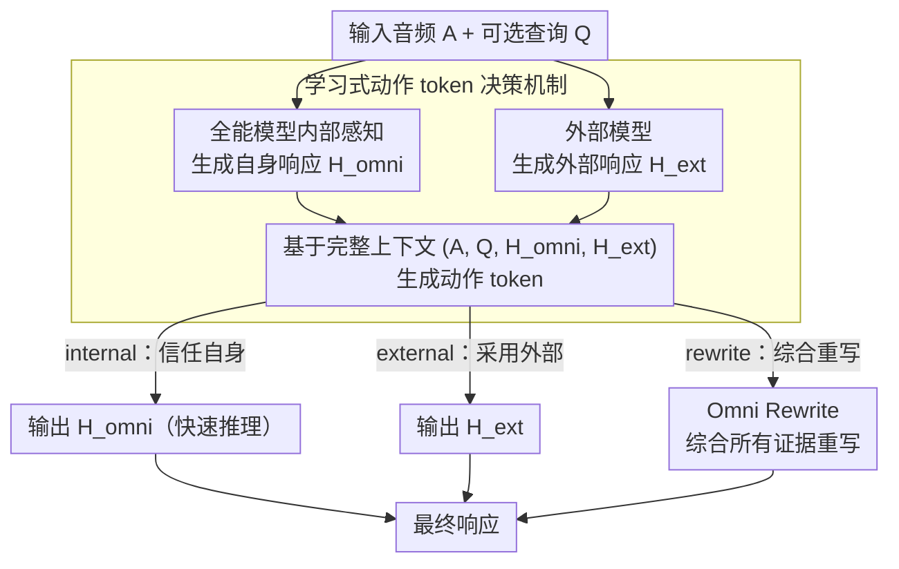

<!-- 由 src/gen_stubs.py 自动生成 -->
# Speech-Hands: A Self-Reflection Voice Agentic Approach to Speech Recognition and Audio Reasoning with Omni Perception

**会议**: ACL2026
**arXiv**: [2601.09413](https://arxiv.org/abs/2601.09413)
**代码**: [GitHub](https://YukinoWan.github.io/Speech-Hands/)
**领域**: audio_speech
**关键词**: 语音识别, 音频推理, 多模态代理, 自我反思, 生成式纠错

## 一句话总结

提出 Speech-Hands，一个可学习的语音代理框架，通过在推理时生成显式动作 token（<internal>/<external>/<rewrite>）来决定信任自身感知还是外部 ASR 假设，在 OpenASR 排行榜 7 个基准上平均 WER 降低 12.1%，在音频 QA 上达到 77.37% 准确率。

## 研究背景与动机

全能多模态模型（如 Qwen2.5-Omni）可以同时处理音频和文本，但一个关键且反直觉的发现是：天真地对全能模型进行微调以融合语音识别和外部声音理解任务，往往**反而降低性能**。初步实验表明，使用 Qwen2.5-Omni 对 Whisper 的 N-best 假设进行生成式纠错（GER），在 7 个 ASR 基准上均出现 WER 恶化（8.52%-9.05%）。更进一步的 zero-shot 分析显示，基础模型缺乏内在仲裁能力——其决策对 prompt 措辞高度敏感而非对正确答案敏感。这表明需要一种**显式的自我反思机制**，让模型学会何时信任自己、何时求助外部。

## 方法详解

### 整体框架

Speech-Hands 将语音理解建模为一个代理决策（agentic decision）过程。给定输入音频 A 和可选查询 Q，全能模型先生成自身响应 H_omni（内部感知），同时获取外部模型给出的响应 H_ext。然后模型基于完整上下文 (A, Q, H_omni, H_ext) 显式生成一个动作 token（action token），指导后续生成策略：`<internal>` 信任自身、`<external>` 采用外部、`<rewrite>` 综合所有证据重写（即 GER）。信任分支直接走快速推理输出，重写分支才进入更深的 Omni Rewrite。这一动作 token 机制靠「事后对比真实结果」构造的标签来训练，并用单一交叉熵损失端到端学会「从证据到动作」的映射。

### 关键设计

**1. 学习式动作 token 决策机制（核心）**：天真融合的痛点在于，当自身感知与外部假设冲突时模型无所适从——zero-shot 仲裁高度依赖 prompt 措辞而非答案正确性。Speech-Hands 不再隐式融合，而是让全能模型先生成自身响应 H_omni、再结合外部模型给出的 H_ext，基于完整上下文 (A, Q, H_omni, H_ext) 显式吐出一个动作 token：`<internal>` 信任自身、`<external>` 采用外部、`<rewrite>` 综合所有证据重写（即 GER）。这把不可解释的信息融合变成一次可解释的策略决策；token 在推理时生成并直接条件化后续输出——信任分支走快速推理，只有重写分支才付出 Omni Rewrite 的额外推理成本。

**2. 基于结果对比的动作 token 标签构建**：决策机制需要监督，但「哪个源更可信」没有现成标签，本文用「事后对比真实结果」反推，并按任务类型分两种策略。ASR 误差可量化：对每个样本分别算内部转录 T_int、外部转录 T_ext、GER 融合转录 T_ger 的 WER，谁最低（或内部 WER=0）就标对应 token，提供精细的强监督。Audio QA 只有离散对错、且外部预测带随机性，于是对外部模型采样 5 次、多数投票决定标 `<external>` 还是 `<rewrite>`，稳定决策边界、降低单次外部预测随机性的干扰。

**3. 统一端到端训练**：把每个样本格式化成「动作 token + 目标文本」，用单一交叉熵损失联合监督「选哪个动作」与「该动作下生成什么」，让模型把「从多模态证据到动作选择」的映射内化进同一套参数。ASR 与 Audio QA 因此复用同一框架，仅切换标签构建策略即可从语音识别自然泛化到音频问答。

### 损失函数/训练策略

- 标准交叉熵损失，联合优化动作 token 和目标序列
- 基于 Qwen2.5-Omni 微调，5 个 epoch，batch size 64，学习率 1e-4（cosine decay），fp16 训练
- 每个数据集最多使用 20,000 个训练样本（受 inference 计算限制）

## 实验关键数据

### 主实验

ASR 任务（7 个 OpenASR 数据集，WER%）：

| 方法 | AMI | Tedlium | GigaSpeech | SPGISpeech | VoxPopuli | Libri-clean | Libri-other | 平均 WER↓ |
|------|-----|---------|------------|------------|-----------|-------------|-------------|----------|
| Whisper-v2-large | 16.88 | 4.32 | 11.45 | 3.94 | 7.57 | 2.91 | 5.15 | 7.17 |
| Qwen2.5-Omni | 19.77 | 5.17 | 11.26 | 4.58 | 6.59 | 2.09 | 3.85 | 7.33 |
| Phi-4-MM | 11.69 | 2.90 | 9.78 | 3.13 | 5.93 | 1.68 | 3.83 | 6.14 |
| GER ⇒ Whisper | 23.44 | 6.15 | 12.15 | 3.94 | 7.53 | 2.97 | 4.89 | 8.44 |
| **Speech-Hands ⇌ parakeet** | **11.20** | **4.37** | **11.10** | **2.26** | **6.02** | **1.67** | **3.18** | **5.69** |

Audio QA 任务（准确率%）：

| 方法 | Bio-acoustic | Soundscape | Complex QA | 平均 Acc↑ |
|------|-------------|------------|------------|----------|
| Qwen2.5-Omni | 47.32 | 56.32 | 59.89 | 57.87 |
| AudioFlamingo 3 | 71.88 | 57.31 | 81.26 | 74.49 |
| **Speech-Hands + majority** | **81.25** | **59.4** | **85.7** | **77.37** |

### 消融实验

| 实验内容 | 关键发现 |
|----------|----------|
| Prompt 消融（GER SFT） | 所有 prompt 策略均失败，WER 8.44-9.05，证明隐式融合不可行 |
| Zero-shot 仲裁 | 模型决策对 prompt 措辞敏感而非正确答案敏感（混淆矩阵验证） |
| 动作 token F1 | <internal> F1>0.8（多数数据集），<external> F1 0.65-0.89，<rewrite> F1<0.4（受数据稀疏限制） |
| 训练数据量 | 仅 20k 样本/数据集即可超越全量训练的基线 |

### 关键发现

- 级联式 GER（先 ASR 再 LLM 纠错）**一致劣于**原始 ASR，而 Speech-Hands 的并行代理架构**一致优于**两个基线
- 尽管 <rewrite> 标签极度稀疏（<2%），模型在触发时精度仍较高，体现出谨慎但可靠的重写检测
- 在 AMI（会议语音，最嘈杂场景）上 Speech-Hands 将 Qwen2.5-Omni 从 19.77% 降至 11.20%，降幅 43%

## 亮点与洞察

- **核心洞察**：多模态模型的根本问题不是感知能力不足，而是缺乏在多信息源之间仲裁的机制。显式动作 token 将隐式的信息融合转化为可解释的决策过程
- **"知道自己不知道"**：框架类比发展心理学中的自我反思能力，从自我中心视角发展到能"跳出自身思维"评估信念可靠性的阶段
- **自然泛化**：从 ASR 到音频 QA 的迁移无需架构修改，仅调整动作 token 构建策略

## 局限与展望

- <rewrite> 动作的训练数据极度稀疏，F1 低，需要数据增强策略
- 当前仅使用 Qwen2.5-Omni 作为 backbone，泛化到其他全能模型待验证
- Tool calling 动作（如调用外部 API）尚未实现，是未来方向
- 多语言 ASR 场景未探索

## 相关工作与启发

- **生成式纠错（GER）** (Yang et al., 2023)：纯文本级联纠错，无法利用原始音频，本文证明这是"非代理"的根本局限
- **Qwen2.5-Omni / Phi-4-MM**：当前最强全能模型，但缺乏显式仲裁机制
- **自我反思** (Madaan et al., 2023)：现有反思方法在感知融合之后才介入，Speech-Hands 的创新在于反思**感知行为本身**
- 启发：动作 token 的思路可推广到任何需要在多信息源之间仲裁的多模态任务

## 评分

| 维度 | 分值 (1-10) |
|------|------------|
| 创新性 | 8 |
| 实验充分度 | 8 |
| 表达清晰度 | 7 |
| 实用价值 | 8 |
| 总分 | 7.8 |

## 评分
- 新颖性: 待评
- 实验充分度: 待评
- 写作质量: 待评
- 价值: 待评

<!-- RELATED:START -->

## 相关论文

- [\[ACL 2026\] VAPO: End-to-end Slide-Enhanced Speech Recognition with Omni-modal Large Language Models](vapo_end-to-end_slide-enhanced_speech_recognition_with_omni-modal_large_language.md)
- [\[ACL 2026\] An Exploration of Mamba for Speech Self-Supervised Models](an_exploration_of_mamba_for_speech_self-supervised_models.md)
- [\[ACL 2026\] \[b\] = \[d\] − \[t\] + \[p\]: Self-supervised Speech Models Discover Phonological Vector Arithmetic](bd-tp_self-supervised_speech_models_discover_phonological_vector_arithmetic.md)
- [\[ACL 2026\] Beyond Transcription: Unified Audio Schema for Perception-Aware AudioLLMs](beyond_transcription_unified_audio_schema_for_perception-aware_audiollms.md)
- [\[ACL 2026\] Closing the Modality Reasoning Gap for Speech Large Language Models](closing_the_modality_reasoning_gap_for_speech_large_language_models.md)

<!-- RELATED:END -->
