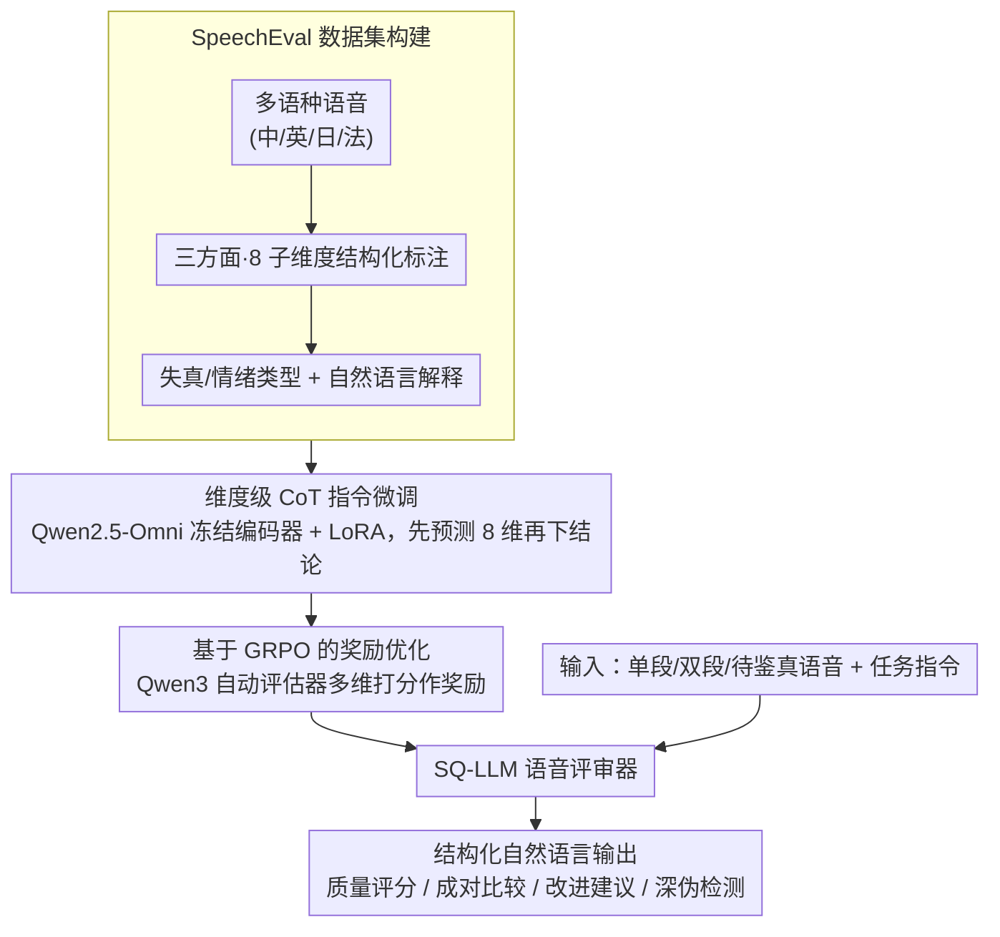

# SpeechLLM-as-Judges: Towards General and Interpretable Speech Quality Evaluation

**会议**: ACL 2026  
**arXiv**: [2510.14664](https://arxiv.org/abs/2510.14664)  
**代码**: https://github.com/NKU-HLT/SpeechLLM-as-Judges  
**领域**: 语音质量评估 / 多模态大模型 / LLM安全  
**关键词**: 语音质量评估、多任务评估、SpeechEval、CoT推理、GRPO

## 一句话总结
这篇论文把语音质量评估从“给一个分数”扩展为“可解释的语音评审”，构建了含 32,207 条多语音频和 128,754 条标注的 SpeechEval 数据集，并用 CoT 指令微调与 GRPO 训练出 SQ-LLM，在质量评分、成对比较、改进建议和深伪检测四类任务上整体优于现有语音大模型与专家模型。

## 研究背景与动机
**领域现状**：生成式语音系统已经覆盖 TTS、语音翻译、语音对话和歌声生成等场景，评估环节通常依赖 MOS、AB 偏好测试、MCD/STOI 等客观指标，或者 MOSNet、UTMOS、Audiobox Aesthetics 这类专门训练的质量预测器。

**现有痛点**：这些方法大多给出标量分数或二分类判断，难以解释“为什么这段语音不好”，也很难同时处理多语言、多来源、多任务的实际评估需求。对语音生成系统开发者而言，一个 3.7 分的 MOS 并不能告诉他们应该修复发音清晰度、动态范围、情绪表达还是失真片段。

**核心矛盾**：语音质量本身是多维、主观且与任务相关的，但现有评估协议倾向于把它压缩成单一数字。另一方面，通用语音 LLM 虽然有多模态输入能力，但没有足够细粒度的质量监督，直接用来当评审时与人类判断的一致性较弱。

**本文目标**：作者希望建立一个统一框架，让模型能听音频、理解任务指令、给出质量判断、解释依据、比较两个样本、提出改进建议，并在深伪语音检测中给出可靠分类结果。

**切入角度**：论文的关键观察是，语音质量评估不只是信号处理问题，也可以被建模为带结构化理由的多模态评审任务。只要有覆盖多任务、多语言和细粒度维度的标注，语音 LLM 就可以学习类似人类评审员的判断过程。

**核心 idea**：用 SpeechEval 提供多维质量监督，再通过 CoT 指令微调和偏好式奖励优化，把 Qwen2.5-Omni 训练成一个面向语音质量的可解释 LLM 评审器。

## 方法详解

### 整体框架

这篇论文把语音质量评估从“输出一个 MOS 标量”改写成“像人类评审员一样给出带理由的判断”。它的做法分两步：先构造能支撑这种评审式输出的多任务数据集 SpeechEval，再在其上训练出可解释的语音评审器 SQ-LLM。推理时输入可以是一段、两段或一段待鉴真的语音，配上自然语言的任务指令；模型用语音编码器抽取声学表示，连同任务提示送入语音感知语言解码器，输出结构化的自然语言答案。单样本评分、双样本比较、改进建议、深伪检测四类任务共享同一个模型和同一套指令化接口。

### 关键设计

**1. SpeechEval：把“分数背后的理由”做成监督信号**

传统数据集多是单语言、单任务的标量评分，训不出通用评审能力，所以作者构建了 32,207 条多语音频、128,754 条标注的 SpeechEval，覆盖中、英、日、法四种语言。标注协议把质量拆成整体质量、生产质量、内容享受三个高层方面，再细化为可懂度、失真、语速、动态范围、情绪冲击、艺术表达、主观体验等 8 个子维度，并额外收集失真类型、情绪类型、说话人性别和开放式描述。结构化标签和自然语言解释一起监督，模型学到的不只是“几分”，而是“为什么是这个分”。

**2. 维度级 CoT 指令微调：先想清各维度再下结论**

只监督最终答案的话，模型容易给出看似合理但维度不稳的解释，因此作者让它在给出最终判断前先显式预测 8 个质量维度。SQ-LLM 基于 Qwen2.5-Omni-7B，冻结语音编码器、用 LoRA 微调，训练目标同时覆盖 8 个维度的中间预测和最终答案，可写作 $L=\lambda\sum_i L_{dim}^{(i)}+L_{ans}$，其中 $\lambda=0.3$。把人工标注里的结构信息显式注入训练，评审理由就更接近人类标注逻辑。

**3. 基于 GRPO 的奖励优化：用自动评估器对齐开放式建议**

SFT 能教会格式和基本能力，但“改进建议”这类开放式任务对答案质量要求更高，单靠 SFT 不够。作者用冻结的 Qwen3 当自动评估器，对 Assessment、Comparison、Suggestion 三类输出在 Helpfulness、Relevance、Accuracy、Detail 四个维度打分，按 1、1、2、0.5 加权聚合成奖励；检测任务则直接用“是否等于标签”作奖励。这样无需额外收集人工偏好对，就能借多维自动反馈把生成质量往人类偏好上拉，消融也显示建议任务正是 GRPO 收益最大的地方。

### 损失函数 / 训练策略

SQ-LLM 分两阶段训练。第一阶段是带维度级 CoT 的指令微调，跑 8 个 epoch，batch size 4，学习率 1e-4；第二阶段是 GRPO，batch size 1、每个 prompt 采样 4 个候选、LoRA 学习率 1e-6。总训练成本约 43 个 A100 GPU 小时，其中 SFT 约 12 小时、GRPO 约 31 小时。

## 实验关键数据

### 主实验

| 任务 / 指标 | 最强直接语音LLM | 最强训练基线 | SQ-LLM | 结论 |
|--------|------|------|------|------|
| 质量评估 LScore | MiDashengLM 5.536 | Qwen2.5-7B + AES-E 6.533 | 6.833 | SQ-LLM 最高 |
| 质量比较 LScore | Qwen2-Audio 4.591 | FT Qwen2-Audio 5.648 | 6.434 | SQ-LLM 明显领先 |
| 改进建议 SBERT / FENSE | MiDashengLM 0.600 / 0.490 | FT Qwen2-Audio 0.708 / 0.708 | 0.735 / 0.735 | 建议内容与参考更一致 |
| Overall Quality PCC | Audiobox Aesthetics 0.464 | Qwen2.5-7B + AES-E 0.457 | 0.520 | 与人类整体质量评分最一致 |
| 比较任务 Overall ACC | UTMOS 0.741 | FT Qwen2-Audio 0.587 | 0.751 | 超过专家模型和 LLM 基线 |
| 深伪检测 EER / ACC | MiDashengLM ACC 67.480 | FT Qwen2-Audio 8.593 / 89.312 | 6.249 / 89.358 | EER 最低，准确率略优 |

### 消融实验

| 配置 | SQA LScore ↑ | SQC LScore ↑ | SQI LScore ↑ | DSD EER ↓ | 说明 |
|------|------|------|------|------|------|
| SQ-LLM 完整版 | 6.833 | 6.434 | 7.420 | 6.249 | CoT + GRPO |
| 去掉 GRPO | 6.804 | 6.420 | 7.018 | 6.264 | 生成式建议任务掉点最明显 |
| 弱化 CoT/奖励组件 | 6.657 | 6.316 | 6.733 | 8.574 | 深伪检测鲁棒性明显下降 |

### 关键发现
- 直接调用多模态语音 LLM 并不能可靠完成语音质量评审，Qwen2-Audio、Qwen2.5-Omni 和 MiDashengLM 在 PCC、ACC 和生成质量上都明显落后于专门训练的 SQ-LLM。
- CoT 的贡献主要体现在结构化判断和深伪检测鲁棒性上；GRPO 的最大收益出现在改进建议任务，因为开放式建议更依赖偏好式质量反馈。
- 数据集本身是关键资产：SpeechEval 不只扩展了样本数，还把“质量评分、质量比较、改进建议、深伪检测”统一到可解释自然语言输出中。
- 专家模型在某些单项指标上仍有竞争力，例如 UTMOS 的比较准确率较高，但它们缺少自然语言解释和跨任务输出能力。
- 改进建议任务显示出评估模型的新用途：它不只是给生成系统打分，也能把评估结果转化为可执行的开发反馈。

## 亮点与洞察
- 论文把语音质量评估从“预测 MOS”改造成“LLM-as-Judge”，这个范式更贴近真实开发流程：开发者不只想知道模型差几分，还想知道问题在哪、该怎么改。
- SpeechEval 的标注设计很实用，结构化标签提供可训练的中间监督，自然语言解释又让模型输出可读；两者结合比单纯人工评分更适合训练评审模型。
- GRPO 使用单个冻结 LLM 评估器打多维奖励，虽然不是人工偏好，但成本低、覆盖开放式任务，给语音质量评估提供了一条可扩展的后训练路径。

## 局限与展望
- SpeechEval 目前覆盖 4 种语言和固定 4 类任务，低资源语言、代码混合语音、情绪表达、说话人一致性等场景仍未充分覆盖。
- 深伪检测虽然 EER 最低，但不同语言间表现并不完全均衡，中文和法文检测相对弱，说明多语种伪造痕迹仍可能有域偏移。
- 自动奖励模型来自 Qwen3，奖励质量会受到评估器偏差影响；未来可以加入人类偏好校准或多评估器集成。
- 训练依赖多模态大模型和 A100 资源，对小团队复现完整流程仍有成本压力。
- 论文主要报告离线 benchmark 结果，还没有展示在真实 TTS/语音对话系统迭代中的闭环评估收益。

## 相关工作与启发
- **vs MOSNet / UTMOS / Audiobox Aesthetics**: 这些专家模型擅长单一质量预测，SQ-LLM 则覆盖评分、比较、建议和检测，优势是任务统一和解释性更强，劣势是训练与推理成本更高。
- **vs QualiSpeech / ALLD-dataset**: 既有自然语言质量数据主要集中在英语或少数任务，SpeechEval 扩展到多语言和 4 类任务，并加入更完整的维度标注。
- **vs 通用语音 LLM**: Qwen2-Audio、Qwen2.5-Omni、MiDashengLM 具备听觉输入能力，但没有质量评审专门监督；本文说明“能听懂语音”和“能评价语音质量”不是同一件事。
- **启发**: 多模态评估任务可以通过“结构化维度 + 自然语言理由 + 偏好优化”组合来构建，类似思路也可迁移到图像质量、视频生成质量和机器人轨迹质量评估。

## 评分
- 新颖性: ⭐⭐⭐⭐☆ 从语音评估角度系统化引入 LLM-as-Judge，并配套大规模多任务数据集，范式新意较强。
- 实验充分度: ⭐⭐⭐⭐☆ 覆盖四类任务、多语言、多种 LLM 与专家基线，消融清晰；跨域真实部署实验还可以更多。
- 写作质量: ⭐⭐⭐⭐☆ 数据、方法和结果结构完整，表格信息密集但逻辑清楚。
- 价值: ⭐⭐⭐⭐⭐ 对语音生成系统的自动评测、质量诊断和安全检测都有直接参考价值。

<!-- RELATED:START -->

## 相关论文

- [\[ICML 2026\] Sparse Autoencoders for Interpretable Emotion Control in Text-to-Speech](../../ICML2026/audio_speech/sparse_autoencoders_for_interpretable_emotion_control_in_text-to-speech.md)
- [\[ICML 2026\] Position: Towards Responsible Evaluation for Text-to-Speech](../../ICML2026/audio_speech/position_towards_responsible_evaluation_for_text-to-speech.md)
- [\[ACL 2026\] MTR-DuplexBench: Towards a Comprehensive Evaluation of Multi-Round Conversations for Full-Duplex Speech Language Models](mtr-duplexbench_towards_a_comprehensive_evaluation_of_multi-round_conversations_.md)
- [\[ACL 2026\] Full-Duplex-Bench-v2: A Multi-Turn Evaluation Framework for Duplex Dialogue Systems with an Automated Examiner](full-duplex-bench-v2_a_multi-turn_evaluation_framework_for_duplex_dialogue_syste.md)
- [\[ICLR 2026\] Discovering and Steering Interpretable Concepts in Large Generative Music Models](../../ICLR2026/audio_speech/discovering_and_steering_interpretable_concepts_in_large_generative_music_models.md)

<!-- RELATED:END -->
