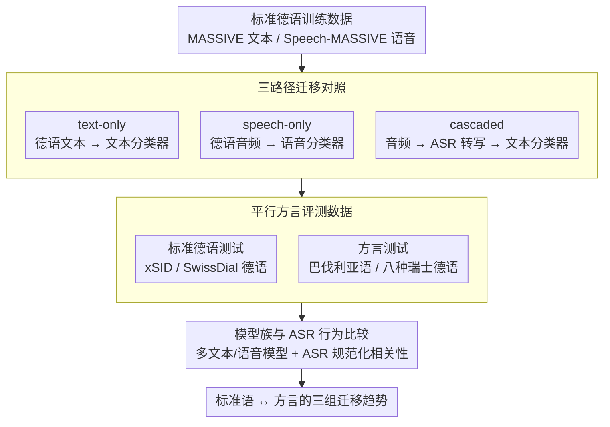

# Standard-to-Dialect Transfer Trends Differ across Text and Speech: A Case Study on Intent and Topic Classification in German Dialects

**会议**: ACL2026  
**arXiv**: [2510.07890](https://arxiv.org/abs/2510.07890)  
**代码**: https://github.com/mainlp/dialects-text-vs-speech  
**领域**: 语音 / 方言NLP  
**关键词**: 方言迁移、语音理解、意图分类、ASR级联、德语方言

## 一句话总结
这篇论文用德语-巴伐利亚语意图分类和德语-瑞士德语主题分类系统比较文本、语音、ASR级联三种迁移路径，发现标准语上的最佳方案不一定适合方言：文本模型最适合标准德语，而语音模型在方言输入上通常更稳。

## 研究背景与动机
**领域现状**：方言 NLP 常见设置是只有标准语训练数据和少量方言评测数据，因此研究者通常训练标准语文本模型，再直接迁移到方言文本。这个范式在书面方言上已经揭示了明显性能落差，尤其是非标准拼写会破坏 subword tokenization。

**现有痛点**：许多方言主要以口语形式存在，而不是稳定书写形式。只研究文本输入会把真实应用中的语音问题简化掉，也会忽略一个关键变量：语音模型处理连续声学信号，不依赖固定词表，可能对拼写不稳定的方言更鲁棒。

**核心矛盾**：高资源标准语任务中，文本模型往往强于语音模型，ASR 加文本分类的级联系统也通常合理。但对低资源、非标准化方言而言，ASR 可能既能把方言“标准化”为文本，也可能产生严重错误；直接语音模型则可能绕开拼写问题，却缺少任务标注数据。

**本文目标**：作者希望回答同一个标准语到方言迁移任务中，文本-only、speech-only、ASR cascaded 三种输入路径的趋势是否一致，以及这些趋势在意图分类和主题分类两个内容分类任务上是否可复现。

**切入角度**：论文选择德语及其近缘方言，构造/使用尽可能平行的标准语和方言、文本和语音数据，使同一内容可以在不同输入模态下被比较。主任务是虚拟助手意图分类，辅助任务是 SwissDial 主题分类。

**核心 idea**：不要默认“标准语上最强的输入模态也最适合方言”，而是把文本、语音、ASR级联视为三条可比较的迁移路径，直接测量它们在标准语和方言上的趋势差异。

## 方法详解

### 整体框架
论文比较三种设置。text-only 设置用德语文本训练分类器，再在德语和方言文本上测试；speech-only 设置用德语音频训练语音分类器，再在德语和方言音频上测试；cascaded 设置先用 ASR 把音频转写为文本，再让标准语文本分类器处理转写结果。

主实验基于 MASSIVE / Speech-MASSIVE 的德语训练数据，以及 xSID 的德语与巴伐利亚语测试数据。作者额外录制 xSID-audio，让同一批德语和巴伐利亚语句子都有语音版本。辅助实验使用 SwissDial，其中德语文本与八种瑞士德语方言在内容上平行，任务是主题分类。

### 关键设计
**1. 三路径迁移对照：把文本、语音、ASR 级联放进同一个标准语→方言框架里直接比**

如果只盯着文本模型看，结论会被非标准拼写主导；只看 ASR，又会被转写错误带跑偏。本文因此把三条迁移路径摆在一起对照：text-only 用标准德语文本训练、再测德语和方言文本；speech-only 用德语音频训练语音分类器、再测德语和方言音频；cascaded 先用 ASR 把音频转写成文本、再交给标准语文本分类器。三者都只在标准德语上训练或调参，测试时才分别面对标准语和方言输入，这样就能把「输入模态差异」和「标准语→方言差异」两个变量拆开看，而不是混成一团。

**2. 平行或可比的方言评测数据：让性能差异来自语言变体和模态，而不是标签或内容分布**

方言资源天生碎片化，任务和标签集一旦不统一，跨模态的结论就没法解释。本文为此尽量对齐评测数据：意图分类里把 MASSIVE 的标签映射到 xSID 用的 10 个意图标签，得到 2.5k/459/361 的训练/开发/测试划分，并用 412 条 xSID 测试实例；作者还额外录制了 xSID-audio，让同一批德语和巴伐利亚语句子都有对应语音版本。主题分类里则把 SwissDial 整理成 10 个主题、划成 1.5k/194/396，使德语文本与八种瑞士德语方言在内容上平行。靠标签对齐加并行测试集，跨模态对比才落在「同一内容、不同输入」上。

**3. 模型族和 ASR 行为的细粒度比较：确认趋势不是某个模型规模或某个 ASR 撑起来的**

只测一两个模型，很难说清结论到底是模态本质还是个例。本文因此横扫多个模型族：文本侧有 mBERT、mDeBERTa、XLM-R base/large，语音侧有 mHuBERT、XLS-R、MMS 和各尺寸 Whisper，级联系统还额外测了别的 ASR。更关键的是，作者把 ASR 错误率和分类性能差异的相关性一并记录下来——因为 ASR 对方言有个重要现象叫「规范化」：转写常常偏向标准德语，这有时帮了文本分类，有时却制造出无意义输出。只有把 ASR 行为和分类结果一起看，才能解释清楚级联路径为什么时好时坏。

### 损失函数 / 训练策略
论文主要使用预训练 encoder 加分类头进行 fine-tuning，报告三种随机种子的平均准确率。学习率和 epoch 数通过德语训练/开发集选择。作者刻意不使用指令调优文本或音频 LLM，因为那会引入未知的分类相关指令数据，难以判断差异来自输入表示还是模型训练语料。

## 实验关键数据

### 主实验
最重要的结果不是某个单模型最高分，而是趋势：标准德语上文本最强；方言上 speech-only 更有优势；ASR 级联取决于转写是否把方言有效规范化。

| 比较项 | 标准德语趋势 | 方言趋势 | 关键数字 |
|--------|--------------|----------|----------|
| 总体性能差距 | 标准语普遍高于方言 | 方言仍存在明显落差 | 意图分类差距 6.1-36.7 pp；主题分类差距 7.9-12.0 pp |
| text-only vs speech-only | 文本通常最佳 | 语音模型通常更鲁棒 | 德语上文本-语音差距可达 23.8 pp；巴伐利亚语上语音可反超文本 14.8 pp |
| speech-only vs cascaded | 德语差距接近 0 | 巴伐利亚语 speech-only 全面优于 cascaded | 巴伐利亚语 speech-only 比 cascaded 高 5.6-17.9 pp |
| cascaded vs text-only | ASR 转写后仍常低于金标准文本 | 好 ASR 可让级联系统超过方言文本 | 瑞士德语中最佳 cascaded 可接近德语 text-only |

数据和任务规模如下。

| 数据/任务 | 语言或方言 | 模态 | 规模 | 说明 |
|-----------|------------|------|------|------|
| MASSIVE / Speech-MASSIVE | 德语 | 文本与语音 | 2.5k / 459 / 361 | 训练、开发、测试，用于意图分类训练 |
| xSID / xSID-audio | 德语、巴伐利亚语 | 文本与语音 | 412 测试实例 | 作者发布首个德语-巴伐利亚语方言音频意图分类集 |
| SwissDial | 德语、八种瑞士德语方言 | 德语文本、方言文本和语音 | 1.5k / 194 / 396 | 辅助主题分类实验，10 个主题 |

ASR 相关分析表明，级联系统的成功高度依赖转写质量，尤其是转写是否接近标准德语文本。

| 分析项 | 结果 | 含义 |
|--------|------|------|
| 德语 ASR 错误率与 cascaded-text 差距 | Pearson r 约 -0.72 到 -0.98 | 转写越接近标准文本，级联系统越接近 text-only |
| 瑞士德语对德语参考的错误率 | r 约 -0.94 到 -0.99 | 被规范化为德语时，文本模型能更好处理方言音频 |
| 巴伐利亚语相关性 | 对德语参考 r 约 -0.85 到 -0.92；对方言参考 r 约 -0.66 到 -0.93 | 规范化和保留方言信息都可能影响分类 |
| xSID 手动 ASR 观察 | 125 条德语/巴伐利亚语样本 | 即使句子不完全流畅，意图关键词常被保留 |

### 消融实验
本文不是模块消融型论文，但它通过设置对照给出了“模态选择”的分析型消融。

| 对照配置 | 发现 | 解释 |
|----------|------|------|
| 只用文本输入 | 标准德语最强，方言文本下落明显 | 标准书写与预训练词表匹配，方言拼写变异造成 tokenization 和词汇问题 |
| 直接用语音输入 | 德语不一定最强，但方言更稳 | 连续声学表示绕开了非标准拼写，且方言差异主要在音系/语音层面 |
| ASR 后文本分类 | 德语较好，方言方差很大 | ASR 可能起到方言到标准语规范化作用，也可能生成噪声文本 |
| 使用 ASR-tuned speech encoder | 通常优于非 ASR-tuned 语音模型 | ASR 预训练有助于理解 utterance 内容，即使最终任务不是转写 |

### 关键发现
- 标准语上常见的“文本优于语音”结论不能直接迁移到方言场景。
- 方言输入中，speech-only 系统比 cascaded 更稳定，尤其是巴伐利亚语意图分类。
- 级联系统的上限来自 ASR 规范化能力，但风险也来自 ASR 对低资源方言的错误转写。
- mBERT 是少数文档中包含巴伐利亚语的文本模型，因此在巴伐利亚语文本上表现相对特殊，不能代表一般文本模型趋势。

## 亮点与洞察
- 论文把“方言 NLP 应该做文本还是语音”变成了可测量问题，而不是凭直觉选择输入模态。
- xSID-audio 的价值很高：它让意图分类能够在同一内容、同一说话人和同一语言变体之间比较文本与语音。
- 结果提醒我们，ASR 不只是前处理模块，它会把方言输入重写成某种文本变体；这种规范化本身就是模型行为的一部分。
- 对低资源口语方言而言，构建语音评测集可能比只扩展书面方言数据更贴近真实应用。

## 局限与展望
- 语言覆盖有限，主要是德语、巴伐利亚语和瑞士德语，无法直接推广到音系、文字系统差异更大的语言。
- 方言音频数据规模仍小，xSID-audio 是读句式录音，不等同于自然对话环境中的 spontaneous speech。
- 级联系统主要训练在金标准文本上，虽然附录验证了 ASR 文本训练趋势类似，但更复杂的 ASR adaptation 仍未充分探索。
- 论文没有纳入指令调优音频/文本 LLM，因此不能回答大模型端到端语音理解在方言上是否会改变趋势。
- 后续可研究多说话人、多地区、噪声环境和真实虚拟助手交互下的方言语音理解。

## 相关工作与启发
- **vs xSID written dialect work**: 既有工作关注书面方言的标准语迁移；本文扩展到语音模态，展示方言 NLP 的核心瓶颈不只是拼写。
- **vs Speech-MASSIVE / spoken intent datasets**: 这些数据多覆盖多语言或标准口音；本文强调同一语言内部的标准-非标准变体差异。
- **vs cascaded SLU**: 传统 cascaded SLU 假设 ASR 越好下游越好；本文进一步指出，对方言而言“更标准化”的 ASR 输出可能比逐字保留方言更利于文本分类。
- **vs token-free dialect models**: token-free 文本模型试图绕开拼写问题；speech-only 模型从输入层面绕开文字系统，是另一条路线。
- **启发**: 方言应用不能只按标准语 benchmark 选型，应该在目标方言、目标模态和目标任务上单独验证。

## 评分
- 新颖性: ⭐⭐⭐⭐☆ 问题设置清晰，把方言迁移从文本扩展到语音和级联对照，数据贡献也有价值。
- 实验充分度: ⭐⭐⭐⭐☆ 模型族、模态、任务和 ASR 分析较完整，但语言范围和语音场景仍有限。
- 写作质量: ⭐⭐⭐⭐☆ 结论围绕三组可解释趋势展开，表格信息量大但原文部分结果表较密。
- 价值: ⭐⭐⭐⭐☆ 对方言 NLP、语音 SLU 和低资源数据设计都有直接启发。

<!-- RELATED:START -->

## 相关论文

- [\[ACL 2025\] Advancing Zero-shot Text-to-Speech Intelligibility across Diverse Domains via Preference Alignment](../../ACL2025/audio_speech/advancing_zero-shot_text-to-speech_intelligibility_across_diverse_domains_via_pr.md)
- [\[ACL 2026\] FC-TTS: Style and Timbre Control in Zero-Shot Text-to-Speech with Disentangled Speech Representations](fc-tts_style_and_timbre_control_in_zero-shot_text-to-speech_with_disentangled_sp.md)
- [\[ACL 2026\] UniSonate: A Unified Model for Speech, Music, and Sound Effect Generation with Text Instructions](unisonate_a_unified_model_for_speech_music_and_sound_effect_generation_with_text.md)
- [\[ACL 2026\] Computational Narrative Understanding for Expressive Text-to-Speech](computational_narrative_understanding_for_expressive_text-to-speech.md)
- [\[ACL 2026\] ImmersiveTTS: Environment-Aware Text-to-Speech with Multimodal Diffusion Transformer and Domain-Specific Representation Alignment](immersivetts_environment-aware_text-to-speech_with_multimodal_diffusion_transfor.md)

<!-- RELATED:END -->
