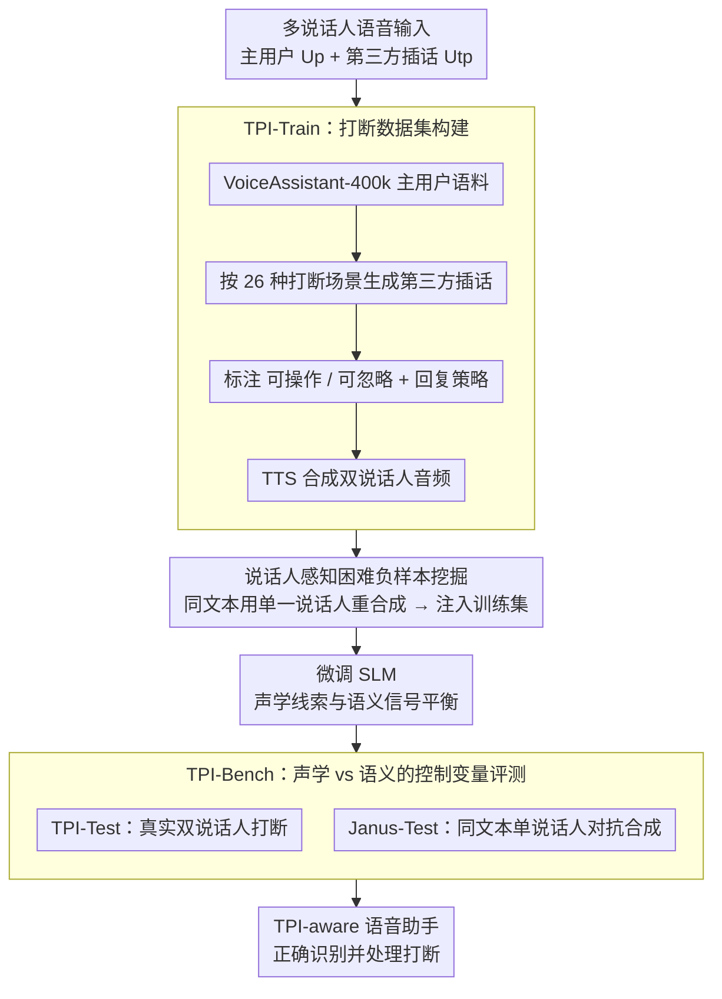

# Still Between Us? Evaluating and Improving Voice Assistant Robustness to Third-Party Interruptions

**会议**: ACL 2026  
**arXiv**: [2604.17358](https://arxiv.org/abs/2604.17358)  
**代码**: [GitHub](https://github.com/pleasedpenguin/tpi-va)  
**领域**: 音频语音  
**关键词**: 语音助手, 第三方打断, 说话人感知, 困难负样本挖掘, 语义捷径学习

## 一句话总结

针对语音助手无法区分第三方打断（TPI）与主用户发言的问题，提出包含88K训练实例的TPI-Train数据集和TPI-Bench评测框架，通过说话人感知的困难负样本挖掘策略消除语义捷径学习，使模型真正依赖声学线索进行打断检测。

## 研究背景与动机

**领域现状**: Spoken Language Models（SLMs）已广泛部署于现实语音助手场景，能够进行类人的自然对话，但主要针对一对一交互设计。

**现有痛点**: 现实生活中，用户与语音助手对话时常有第三方插话（如旁人评论、背景对话）。当前SLM无法分辨这些第三方打断，会将多人发言盲目拼接为单人连续发言，导致错误或荒谬的回复。

**核心矛盾**: 多模态语音数据训练中存在"语义捷径学习"——模型倾向于利用文本中的语义模式（如矛盾、话题转换）来检测打断，而忽略声学信号（如说话人声音变化），导致模型在文本歧义场景下极其脆弱。

**本文目标**: 构建完整的TPI感知框架，包括训练数据、评测基准和训练策略，使语音助手能够正确识别并处理第三方打断。

**切入角度**: 从语言学的打断分类体系出发，定义26种现实打断场景，系统性地构建训练和评测数据。

**核心idea**: 通过说话人感知的困难负样本挖掘（将双人打断文本用同一说话人声音重新合成），迫使模型放弃语义捷径、真正学习声学线索。

## 方法详解

### 整体框架

整个工作围绕"让语音助手真正听声音、而不是猜文本"这一目标展开，由数据、训练、评测三块拼成闭环。输入是夹杂第三方插话的多说话人语音（主用户发言 $U_p$ + 第三方插话 $U_{tp}$），先用 TPI-Train 提供覆盖 26 种现实打断场景的 88K 训练实例，教模型何时该纳入、何时该忽略插话；训练时的核心手段是说话人感知的困难负样本挖掘，把"看起来像打断的文本"用同一人声音重新合成，逼模型放弃语义捷径、真正去听声音是否换了人；最后用 TPI-Bench（含常规 TPI-Test 与对抗性的 Janus-Test）严格检验模型究竟靠声学还是靠语义在判断，最终交付能正确识别并处理打断的语音助手。

### 关键设计

**1. TPI-Train：把打断写进语言学分类体系。** 现有语音对话语料几乎不含系统化的第三方打断场景，也没人告诉模型插话进来后该怎么回应。本文从语言学的打断分类出发，把 7 类经典双人打断分类扩展到"主用户—第三方—模型"的三方设定，归纳出纠正澄清、话题偏移、情绪表达等 26 种现实场景；再从 VoiceAssistant-400k 抽取主用户发言，对每条随机选一个场景、用大模型生成对应的第三方插话，并经 TTS 合成与推理模型过滤，得到约 80K 真实双说话人样本。每条插话都打上"可操作"（应纳入回复）或"可忽略"（应忽视）的标签，并配上对应回复策略，使训练信号不只是"有没有打断"，而是"这次打断该不该影响我的回答"。

**2. 说话人感知困难负样本挖掘：让捷径无路可走。** 仅在打断数据上微调，模型仍会偷懒——它发现靠文本里的矛盾、话题转换就能猜出"有人插话"，于是不去听声音，一遇文本歧义就崩。要堵死这条捷径，最有效的办法是制造"语义完全无用"的样本：本文创建一批文本与真实双说话人打断逐字相同、但音频全部由单一说话人重新合成的困难负样本，并把它们并入 TPI-Train。既然文本一模一样，模型再也无法从文本模式里偷答案，只能去听声音是否换了人。t-SNE 可视化印证了这一机制——不加困难负样本时，不同说话人配置的嵌入在空间里高度重叠；加入之后，嵌入沿声学身份裂成清晰分离的聚类，说明模型的判别依据真正迁移到了声学线索上。

**3. TPI-Bench 与 Janus-Test：用控制变量逼出真实依据。** 光看正常样本无法分辨模型是真听懂了声音还是在蒙文本，所以评测拆成两层。TPI-Test 用真实双说话人打断样本考察常规的情境判别与回复能力；真正的试金石是 Janus-Test——把文本上看起来像打断、实则单人自我修正的内容，用主说话人自己的声音重新合成（与困难负样本同源的构造思路，但用于评测）。它背后的洞察很直接：文本一样、声音却来自同一人时，模型就不应判定为打断。靠语义捷径的模型会在这里集体翻车，把单人自我修正误判为他人插话，从而暴露出"听文本"还是"听声音"的本质差别；评测还配 RSF（回复策略遵循度）与 OH（整体有用性）两个大模型指标做可解释打分。

## 实验关键数据

### 主实验

| 测试集 | 指标 | 基线SLM | TPI-Full | 提升 |
|--------|------|---------|----------|------|
| TPI-Test | 打断检测准确率 | 低（盲目拼接） | 高 | 显著 |
| Janus-Test | 对抗鲁棒性 | 几乎完全失败 | 稳健 | 显著 |
| 人类评估 | 回复自然度偏好 | 低 | 高度偏好 | - |

### 消融实验

| 配置 | 关键指标 | 备注 |
|------|---------|------|
| 无困难负样本 | t-SNE聚类重叠 | 模型依赖语义捷径 |
| 有困难负样本(TPI-Full) | t-SNE聚类清晰分离 | 模型依赖声学线索 |
| 仅语义训练 | Janus-Test失败 | 将单人自我修正误判为打断 |
| 完整训练 | 两个测试集均鲁棒 | 声学和语义信号平衡 |

### 关键发现

- 语义捷径学习是多模态语音模型训练中的关键陷阱：模型会利用文本中的矛盾、话题转换等模式来检测打断，而非真正"听"声音变化
- 困难负样本训练后，模型的嵌入空间从混乱的蓝红混合变为清晰分离的聚类，证明模型学会了基于声学身份进行区分
- 人类评估确认：框架嵌入的回复策略在有效性和自然度方面均获得用户高度偏好
- 可操作vs可忽略的分类对回复策略至关重要——模型需要知道何时应纳入打断内容、何时应忽略

## 亮点与洞察

- **语义捷径学习**这一概念具有广泛意义：不仅限于TPI场景，任何多模态训练中模型都可能走"文本捷径"而忽视其他模态信号
- **Janus-Test的设计思路精巧**：通过控制变量（相同文本、不同声音）来严格测试模型是否真正理解声学信号
- **从语言学分类体系出发**构建数据集，确保了场景的系统性和全面性（26种打断类型）
- **实用性强**：直接面向语音助手的真实痛点，回复策略可直接部署

## 局限与展望

- 主要聚焦于英语场景，跨语言、跨口音的泛化能力有待验证
- 26种打断场景虽系统但可能未穷尽所有现实情况
- 当前框架依赖TTS重新合成来构建困难负样本，合成质量可能影响训练效果
- 多于两个说话人的复杂多方对话场景尚未涉及
- 实时流式处理场景下的性能和延迟有待评估

## 相关工作与启发

- **vs 传统说话人分离**: TPI不仅需要检测说话人变化，还需要判断打断是否应该影响回复策略，这是更高层次的语义理解
- **vs 多轮对话模型**: 现有多轮对话研究主要关注单一用户的连续对话，未考虑第三方介入的场景
- **vs 困难负样本挖掘**: 借鉴了对比学习中困难负样本的思想，但创新地将其应用于跨模态（文本vs声学）的捷径消除

## 评分

- 新颖性: ⭐⭐⭐⭐ 首次系统性定义和解决语音助手的第三方打断问题，语义捷径学习的发现有启发性
- 实验充分度: ⭐⭐⭐⭐ 包含大规模数据集、对抗测试集、消融实验和人类评估
- 写作质量: ⭐⭐⭐⭐ 问题定义清晰，项目页面展示直观
- 价值: ⭐⭐⭐⭐ 面向真实语音助手痛点，具有直接工程应用价值

<!-- RELATED:START -->

## 相关论文

- [\[ACL 2026\] DRInQ: Evaluating Conversational Implicature with Controlled Context Variation](drinq_evaluating_conversational_implicature_with_controlled_context_variation.md)
- [\[ACL 2025\] Does Your Voice Assistant Remember? Analyzing Conversational Context Recall and Utilization in Voice Interaction Models](../../ACL2025/audio_speech/does_your_voice_assistant_remember_analyzing_conversational_context_recall_and_u.md)
- [\[ACL 2025\] Distilling an End-to-End Voice Assistant Without Instruction Training Data](../../ACL2025/audio_speech/distilling_an_end-to-end_voice_assistant_without_instruction_training_data.md)
- [\[ACL 2026\] Speculative End-Turn Detector for Efficient Speech Chatbot Assistant](speculative_end-turn_detector_for_efficient_speech_chatbot_assistant.md)
- [\[ACL 2026\] S2S-Arena: Evaluating Paralinguistic Instruction Following in Speech-to-Speech Models](s2s-arena_evaluating_paralinguistic_instruction_following_in_speech-to-speech_mo.md)

<!-- RELATED:END -->
