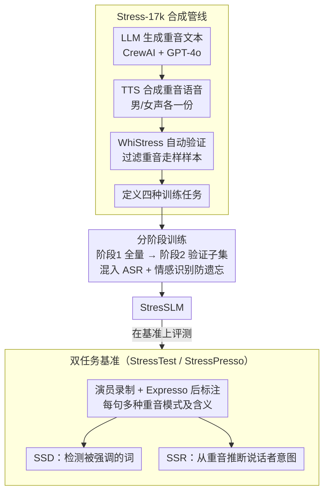

# StressTest: Can YOUR Speech LM Handle the Stress?

**会议**: ACL 2026  
**arXiv**: [2505.22765](https://arxiv.org/abs/2505.22765)  
**代码**: [项目主页](https://pages.cs.huji.ac.il/adiyoss-lab/stresstest)  
**领域**: 语音理解  
**关键词**: 句子重音, 语音语言模型, 韵律理解, 基准测试, 合成数据

## 一句话总结

提出 StressTest 基准评估语音语言模型（SLMs）对句子重音含义的理解能力，发现现有模型几乎无法基于重音模式推理说话者意图，并通过合成数据管线 Stress-17k 训练的 StresSLM 在重音检测和推理任务上大幅超越前沿模型。

## 研究背景与动机

**领域现状**：语音语言模型（如GPT-4o-audio、Gemini 2.5 Pro、Qwen2Audio等）已能直接处理音频进行推理，跳过传统ASR级联管线以利用副语言信息。

**现有痛点**：句子重音（sentence stress）是韵律中的关键要素——同一句"I didn't say she stole the money"根据重音位置可表达完全不同的含义，但在SLM的评估和开发中几乎被完全忽视。现有基准侧重于语音识别、情感检测等，缺少重音理解评估。

**核心矛盾**：理解句子重音需要模型不仅"听到了什么"还要理解"怎么说的"，这要求对韵律线索（音高、响度、时长）和语义推理的深度整合，但现有SLM缺乏这种能力。

**本文目标**：构建重音理解基准、评估前沿SLM的能力差距、并通过合成数据训练一个具备重音理解能力的模型。

**切入角度**：设计双任务评估（重音检测SSD + 重音推理SSR），并构建包含合成数据生成、验证和多任务训练的完整管线。

**核心idea**：通过LLM生成重音文本+TTS合成重音语音+自动验证筛选的管线创建训练数据，使微调后的SLM能泛化到真实录音中的重音理解。

## 方法详解

### 整体框架

本文同时回答"怎么测"和"怎么修"两个问题。测的一侧是 StressTest 基准：由专业演员录制句子，每句至少配两种重音模式及对应含义，再从 Expresso 数据集后标注出补充集 StressPresso，专门考察模型能否从重音读出说话者意图。修的一侧是 Stress-17k 训练管线：输入只是一批可因重音改变含义的句子，经"LLM 生成重音文本 → TTS 合成重音语音 → WhiStress 自动验证筛选 → 定义四种训练任务"流水线，最终对 Qwen2Audio 做分阶段微调，得到能真正理解重音的 StresSLM。

### 关键设计

**1. 双任务基准：先检测、再推理。** 理解一句话重音的含义，前提是先知道哪个词被强调，因此基准拆成互补的两层。SSD（句子重音检测）给定音频和转录文本，要求模型标出被强调的词，这一任务与已有研究对齐、可借现成指标比较；SSR（句子重音推理）则只给音频，让模型在两个候选含义中选出重音真正指向的那个，是本文首次提出的全新任务。两者一前一后，既能定位"听没听见重音"，又能检验"听懂没听懂重音的意思"。

**2. Stress-17k 合成管线：用全自动流水线造高质量数据。** 难点在于并非所有句子都适合做重音变体，而真人录制又无法规模化，于是本文把数据生产拆成四步全自动流程。文本生成用 CrewAI+GPT-4o 按领域/主题/句型批量产出"换重音就换意思"的句子；语音合成用 OpenAI TTS，以星号标注重音词，每种重音模式各合成男声、女声一份；关键的重音验证环节用 WhiStress 自动检测实际落点、过滤掉合成走样的样本，弥补 TTS 重音不准的硬伤；最后据此定义四种训练任务——重音检测、端到端推理、带解释的详细推理、以及"先检测重音再推理"的级联推理，让同一批数据支撑多角度监督。

**3. 分阶段训练：先广后精，再防遗忘。** 直接在干净数据上训练样本量不足，全用未验证数据又会被噪声拖累，因此采用课程式两阶段微调。第一阶段在完整 Stress-17k（含未验证数据）上训练一个 epoch 建立重音理解的基础能力；第二阶段切到经 WhiStress 验证的高质量子集上再训一个 epoch 做精化。两阶段都混入 ASR（LibriLight）与情感识别（MELD）样本作为辅助任务，避免模型在专攻重音时把原本的语音识别和情感能力灾难性遗忘掉。

## 实验关键数据

### 主实验（SSR准确率）

| 模型 | StressTest | StressPresso |
|------|-----------|-------------|
| 人类（多数投票） | 96.0 | 96.0 |
| StresSLM (ours) | **86.2** | **87.6** |
| Gemini 2.5 Pro | 77.5 | 72.7 |
| GPT-4o-audio | 68.8 | 64.8 |
| Qwen3-Omni-30B | 64.6 | 64.8 |
| Qwen2Audio-7B | 53.2 | 51.4 |
| SALMONN | 55.9 | 52.4 |
| 级联(WhiStress→GPT-4o) | 83.4 | 79.7 |

### SSD检测性能（F1）

| 模型 | StressTest | StressPresso |
|------|-----------|-------------|
| StresSLM | **86.9** | **80.6** |
| Gemini 2.5 Pro | 48.5 | 40.7 |
| GPT-4o-audio | 46.1 | 36.9 |
| WhiStress(专用模型) | 88.3 | 83.5 |

### 关键发现
- 现有SLM在重音推理上表现接近随机（多数在50-55%），Gemini 2.5 Pro是唯一超过70%的模型
- StresSLM（7B）在SSR上超越所有SLM包括GPT-4o和Gemini 2.5 Pro，也超过级联方案
- 合成数据训练的模型能泛化到真实录音（StressPresso上87.6%）
- 端到端方法优于级联方法——直接音频处理避免了重音信息丢失
- StresSLM在ASR和SER原始任务上几乎不退化

## 亮点与洞察
- **填补重要空白**：句子重音在语言学中极为重要但在SLM评估中被完全忽视，本文首次系统性评估
- **合成数据管线巧妙**：LLM生成+TTS合成+自动验证的全自动管线可复制到其他韵律特征研究
- **端到端优于级联的有力证据**：证明直接音频处理在重音理解上的优势
- **小模型超越大模型**：7B的StresSLM超越GPT-4o和Gemini 2.5 Pro，说明专项训练数据的价值

## 局限与展望
- **评估限于英语**：重音在其他语言中的功能不同，需要跨语言扩展
- **合成语音训练**：尽管泛化到真实录音效果好，但TTS语音与自然语音仍有差距
- **仅关注句子重音**：未覆盖其他韵律特征（语调、停顿、节奏）
- 未来方向：扩展到多语言、自然语音训练数据、更复杂的韵律理解任务

## 相关工作与启发
- **vs WhiStress**：仅做重音检测的专用模型，本文在此基础上增加重音推理能力
- **vs VocalBench/URO-Bench**：评估SLM的表达能力但不涉及重音理解
- **vs 级联方案**：ASR+重音检测+LLM推理，本文证明端到端更优

## 评分
- 新颖性: ⭐⭐⭐⭐⭐ 首次提出句子重音推理任务和基准，合成数据管线创新实用
- 实验充分度: ⭐⭐⭐⭐ 覆盖8+个SLM、多种输入设置、有人工评估和消融实验
- 写作质量: ⭐⭐⭐⭐ 问题动机清晰，方法描述完整
- 价值: ⭐⭐⭐⭐⭐ 开创重音理解研究方向，对SLM评估和训练有实质性推动

<!-- RELATED:START -->

## 相关论文

- [\[ACL 2026\] SpeakerSleuth: Can Large Audio-Language Models Judge Speaker Consistency across Multi-turn Dialogues?](speakersleuth_can_large_audio-language_models_judge_speaker_consistency_across_m.md)
- [\[CVPR 2026\] How Far Can We Go With Synthetic Data for Audio-Visual Sound Source Localization?](../../CVPR2026/audio_speech/how_far_can_we_go_with_synthetic_data_for_audio-visual_sound_source_localization.md)
- [\[AAAI 2026\] DiffA: Large Language Diffusion Models Can Listen and Understand](../../AAAI2026/audio_speech/diffa_large_language_diffusion_models_can_listen_and_understand.md)
- [\[NeurIPS 2025\] Can LLMs Outshine Conventional Recommenders? A Comparative Evaluation](../../NeurIPS2025/audio_speech/can_llms_outshine_conventional_recommenders_a_comparative_evaluation.md)
- [\[ACL 2025\] Does Your Voice Assistant Remember? Analyzing Conversational Context Recall and Utilization in Voice Interaction Models](../../ACL2025/audio_speech/does_your_voice_assistant_remember_analyzing_conversational_context_recall_and_u.md)

<!-- RELATED:END -->
