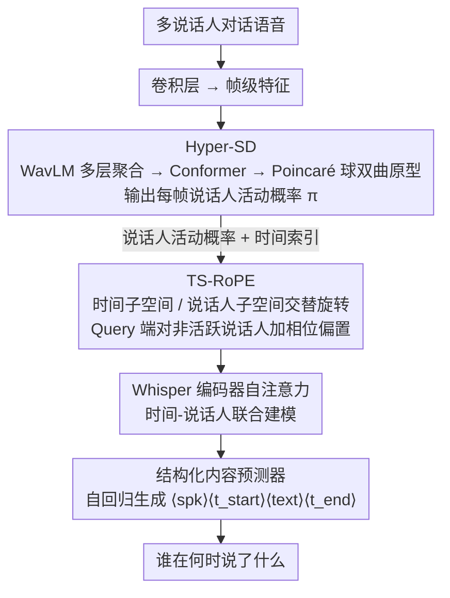

# TellWhisper: Tell Whisper Who Speaks When

**会议**: ACL 2026  
**arXiv**: [2601.03712](https://arxiv.org/abs/2601.03712)  
**代码**: [项目主页](https://walker-hyf.github.io/TellWhisper)  
**领域**: 音频语音  
**关键词**: 多说话人语音识别, 说话人日志, 旋转位置编码, 双曲空间分类, Whisper

## 一句话总结

本文提出TellWhisper，通过设计时间-说话人感知的旋转位置编码（TS-RoPE）将说话人身份和时间信息统一编码到语音编码器的自注意力中，配合双曲空间说话人日志模型（Hyper-SD），实现了对"谁在何时说了什么"的联合建模，在多说话人ASR任务上取得最优性能。

## 研究背景与动机

**领域现状**：多说话人自动语音识别（MASR）旨在从多人对话语音中预测"谁在何时说了什么"。传统方案将说话人日志（SD）和单说话人ASR通过时间戳对齐进行融合，但在重叠语音和快速换说话人场景下对齐困难。

**现有痛点**：即使是近年试图统一SD和ASR的方法，也本质上将时间建模和说话人建模分开处理。具体表现为三种策略的局限：(1) 编码前用SD标签遮罩非目标区域，导致空白输入引发幻觉；(2) 尝试分离目标说话人的语音，需要额外的说话人提示且在重叠区域失效；(3) 在编码器输出后通过说话人后验加权线性混合，将语义与说话人线索纠缠。

**核心矛盾**：时间结构和说话人身份的分离建模在快速换说话人和重叠语音场景下本质上是脆弱的——时间和说话人是耦合的，应当联合建模而非事后拼接。

**本文目标**：在语音编码器内部通过位置编码自然地联合建模时间和说话人信息，使自注意力机制能同时关注"何时"和"谁"。

**切入角度**：受多维RoPE在视觉和多模态中跨轴编码的启发，将RoPE从仅编码时间扩展到同时编码时间和说话人活动状态。

**核心 idea**：设计TS-RoPE，将Query/Key通道划分为时间子空间和说话人子空间，通过区域特定的旋转角度在自注意力中实现时间-说话人的联合建模。

## 方法详解

### 整体框架

TellWhisper以Whisper large-v3-turbo为骨干，目标是从多人对话语音中一次性预测"谁在何时说了什么"，把传统流水线里分裂的说话人日志和ASR收进同一个编码器里联合建模。多说话人语音先过卷积层得到帧级特征，Hyper-SD据此估计每帧的说话人活动概率；这些活动信息连同时间索引一起喂给TS-RoPE，构成注入自注意力的多维位置编码，让"何时"与"谁"在注意力内部就被耦合起来；最后结构化内容预测器以自回归方式吐出"说话人标签+起止时间戳+转录文本"的有序序列。

### 关键设计

**1. TS-RoPE：让旋转位置编码同时携带时间与说话人身份**

传统RoPE只编码时间位置，于是说话人信息只能在编码后另起一摊处理，重叠和快速换人时就对不齐。TS-RoPE把每帧的通道维度D按16维一组划分，组内8个旋转对在时间子空间和4个说话人子空间之间交替分配：$[\psi_{time}, \psi_{spk_1}, \psi_{time}, \psi_{spk_2}, \psi_{time}, \psi_{spk_3}, \psi_{time}, \psi_{spk_4}]$。时间相位直接取帧索引 $\psi_{time}(f_t) = t$；说话人相位则由累积说话人轮次计数与当前活动概率相加得到 $\psi_{spk_s}(f_t) = \mathcal{C}_{t,s} + \pi_{t,s}$。

这样设计后，同一说话人的连续帧旋转角度相近、注意力权重自然偏高，而换说话人或重叠处角度差大、注意力被拉开，说话人内的连续性与说话人间的切换就被旋转角度直接刻画出来。为了进一步把注意力推向活跃说话人，Query端的说话人子空间还额外加了一个相位偏置 $\psi'_{spk_s}(f_t) = \psi_{spk_s}(f_t) + (1 - \pi_{t,s})$——越不活跃的说话人偏置越大、越被推远。消融里这个Query偏置一去掉CP-WER就涨2.49，说话人活动信号去掉退化最大，可见时间-说话人耦合正是性能来源。

**2. Hyper-SD：用双曲空间放大相似音色的可分性**

TS-RoPE依赖可靠的帧级说话人活动概率 $\pi_{t,s}$，但音色相近的说话人在欧氏空间里很难分开。Hyper-SD先把WavLM多层特征加权聚合、过Conformer补上下文，再把欧氏特征映射进Poincaré球。对静默、单说话人、各种重叠组合共 $2^4=16$ 种说话人组合类各配一个可学习的双曲原型 $\mathbf{p}_n$，用帧嵌入到原型的双曲距离 $d_{t,n} = d_{\mathbb{B}_c}(\mathbf{v}'_t, \mathbf{p}_n)$ 算类别概率，再边际化回每个说话人的帧级活动 $\pi_{t,s} = \sum_n b_{s,n} \sigma(-d_{t,n})$。

之所以搬到双曲空间，是因为负曲率带来的指数级体积增长会把微小的特征偏移放大成显著的距离差异，相似音色因此更容易被拉开。实验中Hyper-SD在6个SD数据集上全面超越Pyannote3和Diarizen，AliMeeting上DER从13.03降到10.76，正是这种可分性在真实会议里的体现。

**3. 结构化内容预测器：把"说话人+时间戳+文本"统一成一条序列**

传统流水线要在SD输出和ASR输出之间做时间戳对齐，重叠和快速换人时极易错位。这里把同一说话人的时间连续语音当作独立片段，每段写成token序列 $\langle spk_s \rangle, \langle t_{start} \rangle, \langle text \rangle, \langle t_{end} \rangle$，所有片段按时间顺序拼接成单一目标。模型以自回归方式训练下一token预测，解码时逐token生成直到EOS，说话人归属、时间边界与文本就在同一次解码里一并确定，从根上绕开了事后对齐的问题。

### 损失函数 / 训练策略

采用两阶段微调：先在单说话人语音（LibriSpeech）上预微调，学会单说话人的结构化预测格式，再迁到多说话人对话语音上微调。Hyper-SD用NLLLoss训练，其中双曲分类器走RiemannianAdam、其余组件走AdamW；WavLM用较小学习率，其他模块用较大学习率。

## 实验关键数据

### 主实验

| 数据集 | 指标 | TellWhisper | Dicow(之前SOTA) | 提升 |
|--------|------|-------------|----------------|------|
| AMI | CP-WER↓ | 32.53 | 33.57 | -1.04 |
| NotSoFar | CP-WER↓ | 34.48 | 35.22 | -0.74 |
| LibriCSS | CP-WER↓ | 9.88 | 10.62 | -0.74 |
| AMI | TCP-WER↓ | 33.47 | 34.02 | -0.55 |
| NotSoFar | TCP-WER↓ | 34.51 | 35.64 | -1.13 |
| LibriCSS | TCP-WER↓ | 11.06 | 11.33 | -0.27 |

### 消融实验

| 配置 | AMI CP-WER | AMI TCP-WER | 说明 |
|------|-----------|-------------|------|
| 完整TellWhisper | 32.53 | 33.47 | 所有组件启用 |
| w/o Query相位偏置 | 35.02 | 35.26 | CP-WER +2.49 |
| w/o 说话人轮次计数 | 36.22 | 36.68 | CP-WER +3.69 |
| w/o 说话人活动 | 36.84 | 36.89 | 最大退化 |

### 关键发现

- Hyper-SD在所有6个SD数据集上均超越Pyannote3和Diarizen，证实双曲空间分类优于欧几里得线性分类
- 在AliMeeting上DER改善最显著（13.03→10.76），说明在真实会议场景中双曲空间的说话人分离能力尤为突出
- 消融实验证明TS-RoPE的三个组件（活动概率、轮次计数、Query偏置）逐层贡献，说话人活动信号是最关键的
- TellWhisper的优势在真实会议场景（AMI、NotSoFar）上比模拟数据（Libri2Mix）更明显，因模拟数据中重叠从时间零开始且无说话人切换，TS-RoPE的优势有限

## 亮点与洞察

- TS-RoPE的设计优雅——通过旋转位置编码的通道划分和角度调制，在不改变模型主体架构的情况下注入时间-说话人耦合信息
- 双曲空间用于说话人活动估计是巧妙的——利用负曲率空间的指数体积增长放大音色相似说话人之间的距离
- Query端额外相位偏置的设计直觉清晰：非活跃说话人获得更大的偏置→注意力更倾向于活跃说话人
- 可视化显示16个类原型在双曲空间中均匀分布且无层级结构，符合帧级分类的需求

## 局限与展望

- 当前TS-RoPE设计支持1-4个说话人，扩展到更多说话人需要进一步研究
- Hyper-SD仅在特征提取后进行双曲分类，编码器和分类器处于不同嵌入空间，端到端双曲学习有望进一步提升
- 实验主要在英文数据集上进行，跨语言泛化性有待验证
- Libri2Mix上优势不明显，说明在极端重叠但无换说话人场景下TS-RoPE的收益有限

## 相关工作与启发

- **vs Dicow（Polok et al.）**: Dicow在编码前用说话人掩码过滤，可能引发幻觉；TellWhisper在编码器内部通过位置编码融合说话人信息，更加无缝
- **vs SortFormer（Park et al.）**: SortFormer在编码器输出后加说话人正弦核加权，线性混合纠缠语义和说话人；TS-RoPE通过旋转角度实现解耦的联合建模
- **vs 多维RoPE（视觉领域）**: 视觉RoPE编码宽度/高度等空间轴；TellWhisper创新性地将说话人活动作为新的维度引入RoPE

## 评分

- 新颖性: ⭐⭐⭐⭐⭐ TS-RoPE将RoPE扩展到时间-说话人联合编码，思路新颖且实现优雅
- 实验充分度: ⭐⭐⭐⭐ 4个MASR数据集+6个SD数据集，多基线对比和详细消融
- 写作质量: ⭐⭐⭐⭐ 方法描述清晰，公式推导完整
- 价值: ⭐⭐⭐⭐⭐ 对多说话人语音理解有重要推动，TS-RoPE思想可扩展到其他多维序列建模任务

<!-- RELATED:START -->

## 相关论文

- [\[ACL 2026\] When Misinformation Speaks and Converses: Rethinking Fact-Checking in Audio Platforms](when_misinformation_speaks_and_converses_rethinking_fact-checking_in_audio_platf.md)
- [\[ICLR 2026\] Knowing When to Quit: Probabilistic Early Exits for Speech Separation](../../ICLR2026/audio_speech/knowing_when_to_quit_probabilistic_early_exits_for_speech_separation.md)
- [\[ICLR 2026\] When and Where to Reset Matters for Long-Term Test-Time Adaptation](../../ICLR2026/audio_speech/when_and_where_to_reset_matters_for_long-term_test-time_adaptation.md)
- [\[ICLR 2026\] When Style Breaks Safety: Defending LLMs Against Superficial Style Alignment](../../ICLR2026/audio_speech/when_style_breaks_safety_defending_llms_against_superficial_style_alignment.md)
- [\[CVPR 2026\] When AVSR Meets Video Conferencing: Dataset, Degradation, and the Hidden Mechanism Behind Performance Collapse](../../CVPR2026/audio_speech/when_avsr_meets_video_conferencing_dataset_degradation_and_the_hidden_mechanism_.md)

<!-- RELATED:END -->
