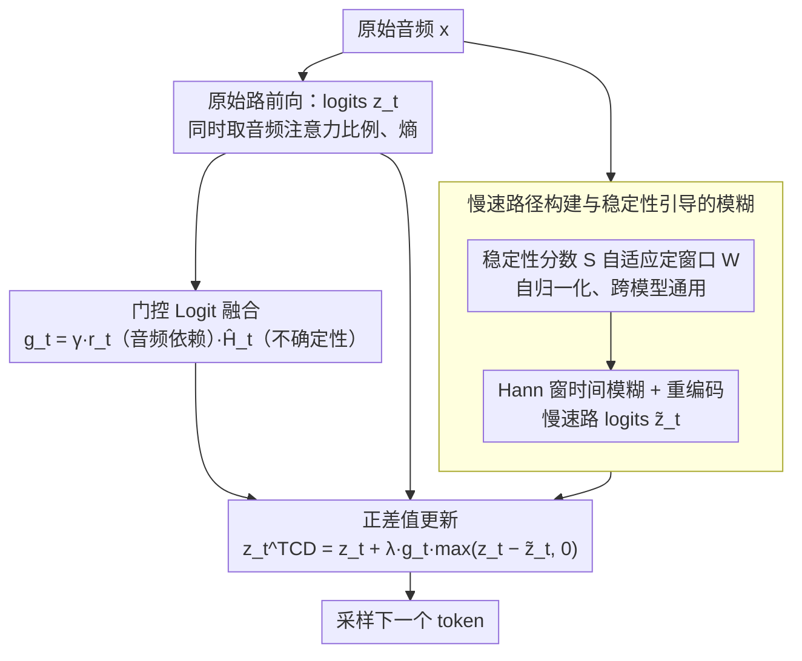

# Temporal Contrastive Decoding: A Training-Free Method for Large Audio-Language Models

**会议**: ACL 2026 Findings  
**arXiv**: [2604.15383](https://arxiv.org/abs/2604.15383)  
**代码**: 无  
**领域**: 音频语音  
**关键词**: 音频语言模型, 对比解码, 时间平滑偏差, 无训练推理, 门控更新

## 一句话总结

提出 TCD，一种无训练的推理时解码方法：通过对比原始音频和时间模糊慢速路径的 logits 差异，配合稳定性引导的模糊窗口和不确定性门控，使统一音频语言模型更好地利用瞬态声学线索，在 MMAU 和 AIR-Bench 上一致提升。

## 研究背景与动机

**领域现状**：大型音频语言模型（LALMs）如 Qwen2-Audio、Qwen2.5-Omni 采用统一架构，将音频表示为时间对齐的 token 序列与文本共享因果解码器。

**现有痛点**：统一解码器存在"时间平滑偏差"——瞬态声学线索（如电话铃响次数、短暂音效变化）可能被时间平滑的上下文和语言先验压制，导致生成内容对关键瞬态事件不够敏感。

**核心矛盾**：语言模型的自回归特性天然偏好时间平滑的预测，而音频中的关键信息往往是瞬态的。

**本文目标**：设计无训练的解码时干预方法，让模型更好利用瞬态声学线索。

**切入角度**：类比视觉对比解码——构造时间模糊的"慢速路径"音频视图，对比两个视图的 logits 差异来识别瞬态线索的贡献。

**核心 idea**：用 Hann 窗时间模糊原始音频生成慢速路径，对比两路 logits 的正差值作为瞬态线索信号，通过稳定性自适应和不确定性+音频依赖度门控限制更新范围。

## 方法详解

### 整体框架

TCD是一种推理时的解码干预，不动模型权重，专门让统一音频语言模型重新关注被语言先验压平的瞬态声学线索。每个解码步它都同时跑两路前向：一路是原始音频，一路是经过时间模糊的"慢速路径"音频视图。两路logits的正向差异 $d_t = z_t - \tilde{z}_t$ 中，被原始音频偏好、却被慢速路径抹掉的那部分，正对应瞬态线索的贡献；TCD据此对原始logits做一次受门控约束的稀疏更新，再正常采样下一个token。

### 关键设计

**1. 慢速路径构建与稳定性引导的模糊：造一个"没有瞬态"的参照**

要识别瞬态线索的贡献，先得有一个抹掉瞬态、只剩平滑结构的参照表示。TCD用归一化Hann窗对原始波形做时间平滑 $\tilde{x} = \mathcal{K}(x)$，再重新编码得到慢速路径表示 $\tilde{H}$。模糊的强度不是写死的：窗口大小 $W$ 由一个自归一化稳定性分数 $S$ 自适应决定，$S$ 从编码器各层的幅度和时间通量算出、并用音频注意力权重加权。

关键在自归一化——不同模型、不同层的隐藏状态尺度差异很大，直接用绝对幅度会让窗口策略在跨模型时失灵；自归一化把这种尺度差异消掉后，同一套稳定性判据才能在Qwen2-Audio和Qwen2.5-Omni上通用。消融中去掉稳定性自适应改用固定窗口，平均掉0.8。

**2. 门控Logit融合：只在"既需要音频又不确定"时才动手**

无条件地把差异叠加上去会过度干预、反而伤害自信且正确的步骤。TCD用一个门控 $g_t = \min\{\gamma \cdot r_t \cdot \hat{H}_t^\alpha, 1.0\}$ 控制更新强度，其中 $r_t$ 是音频注意力比例（这一步到底有多依赖音频证据），$\hat{H}_t$ 是top-K归一化熵（模型当前有多不确定），更新还被限制在候选集 $\Omega_t$ 内。

这套门控的设计哲学是保守：音频无关或模型已经很自信的步骤，门控趋近于不动；只有当这一步既高度依赖音频、又拿不准时才被激活。消融里直接去掉门控，平均掉1.2，是三个组件中影响最大的，印证了"少干预"才是有效干预。

**3. 正差值更新：只增强、不抑制**

最后的融合只取差异的正部分 $d_t^+ = \max(z_t - \tilde{z}_t, 0)$，更新写作 $z_t^{\text{TCD}}(j) = z_t(j) + \lambda \cdot g_t \cdot d_t^+(j)$。之所以丢掉负差值，是因为负差值反映的是语言先验本就偏好、慢速路径也认可的token，没必要去压制它；只有正差值才真正对应"原始音频比平滑视图更想要"的瞬态线索。消融里把负值也算进来（全差值更新）平均掉0.5，说明负差值确实只带来噪声。

### 损失函数 / 训练策略

完全无训练，不引入任何可学习参数，代价只是每步多一次慢速路径前向传播（约2倍推理开销）。

## 实验关键数据

### 主实验

| 模型 | Sound | Music | Speech | Avg |
|------|-------|-------|--------|-----|
| Qwen2.5-Omni | 73.9 | 62.9 | 76.7 | 71.2 |
| + TCD | **75.2** | **68.0** | 75.8 | **73.2** |
| Qwen2-Audio | 63.5 | 48.3 | 67.1 | 59.6 |
| + TCD | **65.8** | **51.2** | **68.4** | **61.8** |

### 消融实验

| 配置 | Avg Δ | 说明 |
|------|-------|------|
| 去除门控 | -1.2 | 过度干预 |
| 去除稳定性自适应 | -0.8 | 固定窗口 |
| 全差值（含负值） | -0.5 | 负差值引入噪声 |

### 关键发现

- TCD 在统一 LALM 上一致有效，对语义瓶颈架构无效——需要时间对齐的音频表示
- Music 和 Sound 域提升最大（依赖瞬态线索），Speech 域较小

## 亮点与洞察

- **"时间平滑偏差"概念**首次明确提出
- **自归一化稳定性分数**设计优雅——无需数据集校准
- **门控设计**确保保守性——大多数步骤不受影响

## 局限与展望

- 不适用于语义瓶颈架构
- 2x 推理开销在实时场景中可能不可接受
- Hann 窗是启发式选择，其他时频变换效果待探索

## 相关工作与启发

- **vs AAD**: 全模态消融 vs 时间分辨率对比，TCD 更精细
- **vs 视觉对比解码**: TCD 将此范式迁移到音频时间维度

## 评分

- 新颖性: ⭐⭐⭐⭐ 时间对比解码思路新颖，借鉴了视觉对比解码
- 实验充分度: ⭐⭐⭐⭐ MMAU+AIR-Bench+消融+架构分析
- 写作质量: ⭐⭐⭐⭐ 框架图清晰
- 价值: ⭐⭐⭐⭐ 对统一 LALM 推理优化有实用价值

<!-- RELATED:START -->

## 相关论文

- [\[AAAI 2026\] Listening Between the Frames: Bridging Temporal Gaps in Large Audio-Language Models](../../AAAI2026/audio_speech/listening_between_the_frames_bridging_temporal_gaps_in_large_audio-language_mode.md)
- [\[ACL 2026\] Towards Fine-Grained and Multi-Granular Contrastive Language-Speech Pre-training](towards_fine-grained_and_multi-granular_contrastive_language-speech_pre-training.md)
- [\[ACL 2026\] SEPT: Semantically Expanded Prompt Tuning for Audio-Language Models](generalizable_prompt_tuning_for_audio-language_models_via_semantic_expansion.md)
- [\[ACL 2026\] Closing the Modality Reasoning Gap for Speech Large Language Models](closing_the_modality_reasoning_gap_for_speech_large_language_models.md)
- [\[ACL 2026\] Do We Need Distinct Representations for Every Speech Token? Unveiling and Exploiting Redundancy in Large Speech Language Models](do_we_need_distinct_representations_for_every_speech_token_unveiling_and_exploit.md)

<!-- RELATED:END -->
