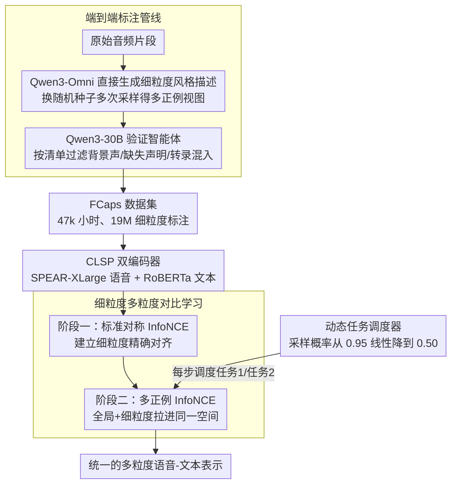

# Towards Fine-Grained and Multi-Granular Contrastive Language-Speech Pre-training

**会议**: ACL 2026  
**arXiv**: [2601.03065](https://arxiv.org/abs/2601.03065)  
**代码**: [GitHub](https://github.com/yfyeung/CLSP)  
**领域**: 音频语音  
**关键词**: 语音风格建模, 对比学习预训练, 细粒度标注, 语音-文本对齐, 副语言学

## 一句话总结

本文提出FCaps大规模数据集（47k小时语音、19M细粒度标注）和CLSP对比学习模型，通过端到端标注管线和细粒度多粒度对比监督，实现了首个能统一表征全局和细粒度语音风格的语音-文本对齐模型。

## 研究背景与动机

**领域现状**：语音风格（speaking style）传递了丰富的副语言信息，包括说话人固有特征（性别、年龄、口音）和情境性特征（语速、情感、表达力）。现有语音-文本表示学习方法通常依赖粗粒度标签或任务特定监督，无法捕捉语音风格的细粒度时间结构。

**现有痛点**：现有语音风格标注数据集主要采用级联标注管线——先用离散标签标注语音，再用大语言模型将标签改写为自然语言描述。这种方法存在根本性的信息瓶颈：中间的离散标签将丰富的、连续的、时变的副语言信息压缩到有限的预定义类别中，导致严重的信息损失和语义偏差。

**核心矛盾**：细粒度语音风格建模需要高质量、大规模的自由文本描述，但现有方法要么依赖人工标注（成本高、一致性差），要么使用级联管线（引入误差传播和信息损失）。

**本文目标**：(1) 构建大规模端到端的细粒度语音风格标注数据集，避免级联管线的信息瓶颈；(2) 训练能统一表征多粒度语音风格的对比学习模型。

**切入角度**：利用最新的多模态标注模型（Qwen3-Omni）直接从音频生成细粒度描述，绕过离散标签中间步骤，并通过智能体验证流程保证标注质量。

**核心 idea**：端到端标注管线 + 细粒度多粒度对比学习，消除信息瓶颈并实现从全局到细粒度的统一语音-文本表示。

## 方法详解

### 整体框架

工作分数据和模型两条线，目标是训出首个能统一表征全局与细粒度语音风格的语音-文本对齐模型。数据端用端到端管线构建FCaps，包含FCaps-Emilia（46,787小时、18M细粒度标注）和FCaps-PSCBase（267小时、14万全局标注+93万细粒度标注），直接从音频生成自由文本描述、绕开离散标签中间层。模型端的CLSP是双编码器（SPEAR-XLarge语音编码器 + RoBERTa文本编码器），走两阶段课程学习：先在大规模细粒度数据上做标准对比对齐，再用多正例对比把全局与细粒度两种粒度统一进同一嵌入空间，第二阶段由动态任务调度器控制训练重心从跨粒度对齐渐进过渡到细粒度判别。

### 关键设计

**1. 端到端标注管线：直接从音频生成描述，绕开离散标签瓶颈**

主流做法是级联管线——先给语音打离散标签，再让LLM把标签改写成自然语言，但中间的离散标签把连续、时变的副语言信息压进有限类别，信息损失和语义偏差由此而来。本文改成端到端：用Qwen3-Omni-30B作详细标注器，直接以语音片段为输入生成细粒度描述，并用提示约束输出聚焦说话人风格、抑制转录内容和环境声；对同一片段换不同随机种子多次生成，天然得到多个正例视图。

之所以能省掉离散标签，是因为生成直接以原始音频为条件、保留了完整副语言信号，而多次基于音频信号的采样也比纯文本改写更可靠。生成之后再用Qwen3-30B推理模型当验证智能体，按预定义检查清单（是否混入背景声/环境噪声描述、是否有缺失声明、是否夹带无风格信息的转录内容等）过滤低质量标注。消融显示端到端标注在正确性/覆盖度/自然度上为4.42/4.55/4.92，全面压过级联的3.30/3.10/4.15。

**2. 细粒度多粒度对比学习：两阶段课程从精确对齐过渡到跨粒度泛化**

第一阶段在大规模细粒度数据上用标准对称InfoNCE建立精确的细粒度语音-文本对应：

$$\mathcal{L} = -\frac{1}{2N}\sum_{i=1}^{N}\Big(\log\frac{\exp(\mathbf{s}_i \cdot \mathbf{t}_{Fi}/\tau)}{\sum_j \exp(\mathbf{s}_i \cdot \mathbf{t}_{Fj}/\tau)} + \text{反向}\Big)$$

第二阶段切到多正例InfoNCE：每条语音同时配两个文本（一全局一细粒度，或两个不同细粒度），通过软目标分布 $D_{i,j}$ 把概率质量按 $\lambda=0.5$ 分配给多个正例，损失为双向交叉熵 $\mathcal{L} = \frac{1}{2}(\mathrm{CE}(\mathbf{L}/\tau, \mathbf{D}) + \mathrm{CE}(\mathbf{L}^\top/\tau, \mathbf{D}'))$。这样安排的用意是先建立纯细粒度的精确对齐，再借全局+细粒度的混合监督把不同粒度拉到一致，最终一个模型既能做全局检索也能做细粒度检索。

**3. 动态任务调度器：让训练从跨粒度对齐渐进过渡到细粒度判别**

第二阶段要同时兼顾"跨粒度泛化"和"细粒度判别"两个目标，一刀切的固定比例并不理想。调度器在每个训练步随机二选一——任务1（全局+细粒度配对）或任务2（两个不同细粒度配对），采样概率 $p_t$ 从 $p_0=0.95$ 线性降到 $p_{min}=0.50$，在 $T=10000$ 步内完成过渡：

$$p_t = \max\Big(p_{min},\; p_0 - \frac{t}{T}(p_0 - p_{min})\Big)$$

训练初期任务1占主导、侧重把全局和细粒度对齐到一起，后期任务2占比上升、强化细粒度之间的判别，整体呈现先泛化后判别的渐进式学习。消融中动态调度优于静态调度。

### 损失函数 / 训练策略

CLSP共724M参数（SPEAR-XLarge 599M + RoBERTa 125M），在8块A100 80GB上训练。第一阶段1.2M步，第二阶段4k步微调。优化器为ScaledAdam、配Eden学习率调度器，两阶段峰值学习率分别为0.045和0.001，温度参数 $\tau$ 可学习。

## 实验关键数据

### 主实验

| 任务 | 指标 | CLSP | 之前SOTA(ParaCLAP) | 提升 |
|------|------|------|-------------------|------|
| 全局检索 S→T | R@1 | 45.6 | 2.1 | +43.5 |
| 全局检索 T→S | R@1 | 40.3 | 0.4 | +39.9 |
| 细粒度检索 S→T | R@1 | 68.1 | 1.2 | +66.9 |
| 细粒度检索 T→S | R@1 | 67.2 | 1.2 | +66.0 |
| 零样本情感(IEMOCAP) | WA/UA | 57.2/56.1 | 46.1/46.5 | +11.1/+9.6 |
| 零样本性别(RAVDESS) | WA/UA | 100.0/100.0 | 99.2/99.2 | +0.8 |
| 风格相似度(固有特征) | Pearson r | 0.893 | 0.663 | +0.230 |
| 风格相似度(情境特征) | Pearson r | 0.903 | 0.323 | +0.580 |

### 消融实验

| 配置 | 说明 | 效果 |
|------|------|------|
| 端到端标注 vs 级联标注 | 正确性/覆盖度/自然度 | 4.42/4.55/4.92 vs 3.30/3.10/4.15 |
| 静态调度 vs 动态调度 | 任务采样策略 | 动态优于静态 |
| $\lambda=0.5$ vs 其他 | 多正例权重分配 | 0.5最优 |

### 关键发现

- CLSP在所有任务上均大幅领先现有方法，尤其在检索任务上提升巨大（R@1从个位数到40-68%）
- 端到端标注质量全面优于级联标注：正确性+1.12、覆盖度+1.45、自然度+0.77
- 在语音风格相似度评分上与人类判断高度一致（Pearson r > 0.88），尤其在情境特征上（0.903 vs ParaCLAP的0.323）远超现有方法
- 零样本分类性能强劲，情感识别WA达57.2%，性别识别100%，说明学到的表示具有良好的副语言信息编码能力

## 亮点与洞察

- FCaps是目前最大的细粒度语音风格标注数据集（47k小时、19M标注），填补了关键的数据空白
- 端到端标注管线的设计思路值得推广——直接从原始信号生成描述避免了信息瓶颈，智能体验证保证了质量
- 两阶段课程学习从细粒度到跨粒度的渐进训练策略有效，仅4k步微调就显著提升了跨粒度能力
- CLSP可以作为语音风格评估器使用，与人类判断的高相关性使其有望替代昂贵的主观评估

## 局限与展望

- 当前仅支持英文语音，跨语言的语音风格建模有待扩展
- 端到端标注管线依赖Qwen3-Omni的质量，该模型本身的偏差可能传递到标注中
- 文本编码器使用RoBERTa-base（125M），更大的文本编码器可能进一步提升性能
- 未探索细粒度标注中的时间对齐——当前标注描述话语内的风格变化但不提供精确时间戳

## 相关工作与启发

- **vs ParaCLAP（Jing et al.）**: ParaCLAP聚焦于情感中心的监督，CLSP通过细粒度多粒度监督覆盖更广的副语言维度
- **vs GLAP（Dinkel et al.）**: GLAP使用转录文本配对提供词汇级监督，CLSP使用风格描述提供副语言级监督
- **vs CapSpeech（Wang et al.）**: CapSpeech使用级联标注管线，CLSP的端到端管线避免了信息瓶颈，标注质量更高

## 评分

- 新颖性: ⭐⭐⭐⭐⭐ 端到端标注管线和多粒度对比学习都是重要创新，FCaps数据集贡献巨大
- 实验充分度: ⭐⭐⭐⭐⭐ 标注质量评估、4类下游任务、与人类判断的相关性分析全面
- 写作质量: ⭐⭐⭐⭐ 方法描述清晰，数据集构建过程详实
- 价值: ⭐⭐⭐⭐⭐ 数据集和模型均开源，对语音风格建模和评估有广泛影响

<!-- RELATED:START -->

## 相关论文

- [\[ACL 2026\] Temporal Contrastive Decoding: A Training-Free Method for Large Audio-Language Models](temporal_contrastive_decoding_a_training-free_method_for_large_audio-language_mo.md)
- [\[ACL 2026\] SegTune: Structured and Fine-Grained Control for Song Generation](segtune_structured_and_fine-grained_control_for_song_generation.md)
- [\[ICML 2026\] MECAT: A Multi-Experts Constructed Benchmark for Fine-Grained Audio Understanding Tasks](../../ICML2026/audio_speech/mecat_a_multi-experts_constructed_benchmark_for_fine-grained_audio_understanding.md)
- [\[AAAI 2026\] MF-Speech: Achieving Fine-Grained and Compositional Control in Speech Generation via Factor Disentanglement](../../AAAI2026/audio_speech/mf-speech_achieving_fine-grained_and_compositional_control_in_speech_generation_.md)
- [\[CVPR 2026\] Unlocking Strong Supervision: A Data-Centric Study of General-Purpose Audio Pre-Training Methods](../../CVPR2026/audio_speech/unlocking_strong_supervision_a_data-centric_study_of_general-purpose_audio_pre-t.md)

<!-- RELATED:END -->
