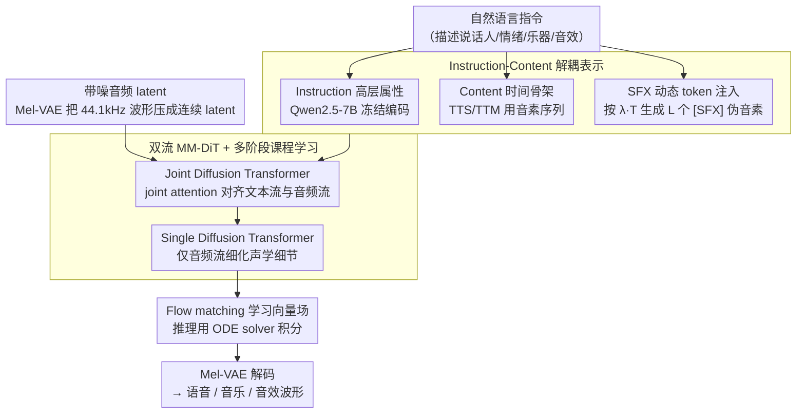

# UniSonate: A Unified Model for Speech, Music, and Sound Effect Generation with Text Instructions

**会议**: ACL2026  
**arXiv**: [2604.22209](https://arxiv.org/abs/2604.22209)  
**代码**: 无公开代码；Demo: https://qiangchunyu.github.io/UniSonate/  
**领域**: 音频语音  
**关键词**: 统一音频生成, 文本指令控制, Flow Matching, 动态 SFX token, MM-DiT

## 一句话总结
UniSonate 用统一的 Instruction-Content 表示、动态 SFX token 注入和多阶段课程学习，把文本转语音、文本转音乐和文本转音效放进同一个 flow-matching MM-DiT 中，在 TTS 与 TTM 上达到或超过专用模型，同时在 TTA 上保持可用的音效生成能力。

## 研究背景与动机
**领域现状**：音频生成长期被拆成多个专用任务。TTS 侧重语音自然度、音色和音素对齐；TTM 侧重歌词、节奏、乐器和音乐结构；TTA 则处理更开放的环境音、事件音和声景。每条路线都已有强模型，但输入接口、控制信号和训练数据形态并不统一。

**现有痛点**：现有统一模型往往只覆盖语音和歌唱，或者依赖 reference audio 做音色控制；支持多任务的系统也常需要不同输入格式、任务标签或后续微调。对一个真正通用的音频生成模型来说，用户更自然的接口应该是纯文本指令：描述说话人、情绪、乐器、氛围或音效事件，然后模型直接生成对应音频。

**核心矛盾**：语音和音乐是高度结构化的，通常有音素、歌词、节拍等离散时间骨架；环境音效则更像连续纹理，没有天然的 token 边界。若直接把 TTS、TTM、TTA 数据混在一起训练，无结构音效的高方差会干扰语音咬字和音乐结构，产生负迁移。

**本文目标**：作者希望在一个模型中同时满足三点：统一生成 speech / music / sound effects，统一使用 reference-free 的自然语言指令输入，并且对语音、音乐和音效都能进行细粒度控制。

**切入角度**：论文把条件拆成 Instruction 和 Content 两条语义线。Instruction 负责高层属性，例如男声、悲伤语气、爵士钢琴、街道脚步声；Content 负责时间结构，语音和音乐用音素 / 歌词，音效则用动态长度的可学习 `[SFX]` token 补上“伪音素”骨架。

**核心 idea**：用动态 `[SFX]` token 把无结构音效符号化，让音效也能被同一个 phoneme-driven Transformer 当作序列建模问题处理，再通过从语音到音乐再到音效的课程学习减少跨模态优化冲突。

## 方法详解

### 整体框架

UniSonate 把"文本→语音/音乐/音效"统一成同一个条件流匹配问题：用户只给一段自然语言指令，模型据此在同一个网络里生成对应音频。条件侧被拆成两条语义线——instruction 由冻结的 Qwen2.5-7B 编码，描述男声、悲伤语气、爵士钢琴、街道脚步声这类高层属性；content 提供时间骨架，TTS/TTM 用文本或歌词转出的音素序列，SFX 则用一串可学习的 `[SFX]` token 补出"伪音素"。音频侧由预训练 Mel-VAE 把 44.1kHz 波形压成降采样率 1024 的连续 latent。

网络是一个双流 MM-DiT：Text Stream 处理 instruction-content 条件，Audio Stream 处理带噪 latent。前半部分的 Joint Diffusion Transformer 层通过 joint attention 让两条流对齐，使音频 latent 同时关注全局风格与局部结构 token；后半部分的 Single Diffusion Transformer 层只在音频流上细化声学细节。训练学习从噪声到真实 latent 的向量场，推理用 ODE solver 积分后再由 VAE 解码成波形。

### 关键设计

**1. Instruction-Content 解耦表示：把任意音频任务投到同一条件空间**

过去的统一模型大多只是把任务标签拼到输入里，用户仍要记住每个任务不同的格式。UniSonate 改成始终只接受自然语言指令，再由模型内部把不同任务投射到"高层指令 + 时间内容"的统一表示：instruction 描述声学属性，content 提供时序锚点。TTS 的 content 是朗读文本的音素，TTM 是歌词/演唱内容的音素，SFX 没有文本内容则交给下一节的 special token 顶替。这样接口被统一到纯文本，而内部表示又保留了每个任务必需的时间结构。

**2. SFX 的动态 token 注入：给无结构音效造一副时间骨架**

环境音效没有天然的 token 边界，若只给一个全局时长提示，模型很难控制音效内部如何展开；若专门加一条音效分支，又破坏了统一架构。作者的折中是先从语音数据估计平均音素密度 $\lambda$，再按目标时长生成 $L_{sfx}=\lfloor \lambda \cdot T_{target} \rfloor$ 个 `[SFX]` token。这排重复 token 不是单个 duration embedding，而是一串可被 cross-attention 逐步遍历的 temporal anchors，等于把音效改写成"伪语言序列"，让同一个 phoneme-driven Transformer 既能控时长又能统一建模。

**3. 双流 MM-DiT + 多阶段课程学习：在一个模型里吸收三类数据又不互相打架**

语音、音乐、音效混在一起直接训练时，无结构音效的高方差会干扰语音咬字和音乐结构，产生负迁移。架构上先用 joint attention 让文本条件与音频 latent 深度交互，再用 audio-only 层细化音质；训练上则按结构强度排课程——先做 speech anchoring 把发音与韵律的对齐机制学稳，再扩到 speech + music 引入中长期节奏结构，最后才加入高方差的 sound effects 扩展音色与环境声覆盖。这里"先难后易"的难指结构最强而非最杂，让稳定的对齐能力先成形，再去容纳噪声更大的数据。

### 损失函数 / 训练策略

训练目标是 conditional flow matching：给定干净 latent $x_0$、噪声 $x_1$、时间 $t$ 与文本条件 $C_{text}$，模型预测向量场 $v_\theta(t, C_{text}, x_t)$，使其逼近从 $x_0$ 指向 $x_1$ 的速度。具体规模为 1.34B 参数的 MM-DiT，含 14 层 Joint Diffusion Transformer 和 6 层 Single Diffusion Transformer，RoPE 负责时间位置感知。数据为 50K 小时 speech、20K 小时 music 和 1.5M 个 SFX clips，统一成 44.1kHz、2–20 秒片段，在 32 张 A800 80GB 上用 Adam、初始学习率 $1\text{e-}4$ 训练。

## 实验关键数据

### 主实验
作者分别评测 TTS、TTM 和 TTA。TTS 使用 Seed-TTS WER、指令控制准确率、相似度和 MOS；TTM 使用 SongEval、控制准确率和 musicality MOS；TTA 使用 AudioCaps 上的 FAD / FD / IS / CLAP 等指标。

| 任务 | 指标 | 强基线 | UniSonate | 结论 |
|------|------|--------|-----------|------|
| TTS 英文 | WER↓ | InstructAudio 1.52, ZipVoice 1.70 | 1.47 | 统一训练没有稀释语音可懂度，反而最佳 |
| TTS 中文 | WER↓ | InstructAudio 1.35, F5-TTS 1.53 | 1.25 | 与 Ground Truth 1.25 持平 |
| TTS 指令控制 | Dialogue accuracy↑ | InstructAudio 90.00, CosyVoice2 不支持 | 93.33 | 多说话人 dialogue 控制更强 |
| TTM | SongEval Coherence↑ | ACE-Step 2.89, InstructAudio 3.08 | 3.18 | 音乐结构一致性最高 |
| TTM | Musicality MOS↑ | ACE-Step 2.88, InstructAudio 2.91 | 3.01 | 主观音乐性最好 |
| TTA | FAD↓ | AudioLDM-L 4.32, Stable Audio 4.19, GenAU-L 2.07 | 4.21 | 接近部分 TTA 基线，但落后专用 SOTA |
| TTA | CLAP score | AudioLDM-L 0.208, GenAU-L 0.300 | 0.156 | 文本-音频对齐仍不是最强项 |

### 消融实验
最关键的消融是比较同一架构下的单任务数据训练与 joint data 训练，验证是否存在正迁移。

| 配置 | EN WER↓ | ZH WER↓ | Speaker Sim↑ | LSD↓ | MCD↓ | MSEP↓ | MR↓ |
|------|---------|---------|--------------|------|------|-------|-----|
| UniSonate (TTS-only data) | 2.24 | 1.40 | 0.63 | 2.63 | 8.70 | 574.67 | 0.426 |
| UniSonate (Joint data) | 1.47 | 1.25 | 0.77 | 1.79 | 5.46 | 422.36 | 0.31 |

| 配置 | Coh↑ | Mus↑ | Mem↑ | Cla↑ | Nat↑ | 说明 |
|------|------|------|------|------|------|------|
| UniSonate (TTM-only data) | 3.11 | 3.00 | 3.04 | 2.92 | 2.84 | 只用音乐数据训练 |
| UniSonate (Joint data) | 3.18 | 3.07 | 3.10 | 2.99 | 2.90 | 加入语音和音效后全面提升 |

### 关键发现
- 联合训练对结构化任务是正迁移而不是负迁移：语音 WER、谱失真、音高误差和音乐 SongEval 都优于单任务训练。
- 动态 SFX token 的价值主要体现在“可接入”而非直接打败所有 TTA 专用模型：UniSonate 能统一生成音效，但在 FAD 上仍明显落后 GenAU-L。
- 课程学习很关键：如果一开始混入高方差环境声，语音发音和音乐结构容易被破坏；先学 speech alignment 再扩展任务更合理。

## 亮点与洞察
- 最漂亮的设计是把 SFX 看成“没有文字的伪音素序列”。这比单独加一个音效分支更统一，也比 duration token 更有时间锚点。
- 论文强调 positive transfer：音效并不是拖累语音，反而增加声学多样性，让 speech reconstruction 更鲁棒；语音的强对齐训练也能迁移到音乐结构。
- Instruction-Content 解耦有很强可迁移性。类似思路可以迁到视频生成或多模态生成：instruction 控制高层属性，content tokens 提供时序 / 空间骨架。
- 统一接口比统一模型本身更重要。只要用户侧仍要记住不同任务的输入格式，模型统一的实际价值就有限；UniSonate 把接口也统一到了自然语言指令。

## 局限与展望
- SFX 质量仍不如专用 TTA 模型，FAD 4.21 与 GenAU-L 2.07 差距明显，说明统一表示还不足以覆盖极其多样的环境声纹理。
- 训练和评测主要集中在 2-20 秒短片段，长歌、长对白、有剧情推进的 audiobooks 或复杂声景仍需要层级规划机制。
- 纯文本指令天然存在一对多歧义，例如“sad song”或“deep male voice”对应许多声学实现，缺少 reference cue 时很难完全符合用户脑中的声音。
- 1.3B diffusion / flow matching 模型推理成本较高，实时 TTS 或交互式音频设计场景还需要蒸馏、缓存或少步采样。
- 高保真语音和音乐生成有深伪、版权和风格模仿风险，发布模型时需要水印、检测器和使用限制配套。

## 相关工作与启发
- **vs InstructAudio**: InstructAudio 已经把 speech 和 music 放进指令控制框架，但不覆盖 SFX；UniSonate 的关键扩展是用动态 `[SFX]` token 接入无结构音效。
- **vs CosyVoice / Vevo2**: 这些方法在语音或歌唱质量上很强，但通常依赖 reference audio 或只覆盖 speech-singing；UniSonate 更强调 reference-free text instruction 和多模态统一。
- **vs AudioLDM / GenAU-L**: TTA 专用模型在环境音 fidelity 上更强，尤其 GenAU-L 的 FAD 明显领先；UniSonate 的优势是单模型、单接口覆盖 speech / music / SFX。
- **vs AudioBox / UniAudio**: 这些统一音频模型证明了多任务音频生成可行，但输入形式和任务覆盖仍不够一致；UniSonate 的贡献在于把 phoneme-driven 结构和 unstructured SFX 对齐起来。

## 评分
- 新颖性: ⭐⭐⭐⭐☆ 动态 SFX token 注入是清晰有效的统一建模思路，整体架构建立在已有 MM-DiT / flow matching 之上。
- 实验充分度: ⭐⭐⭐⭐☆ 覆盖 TTS、TTM、TTA 和联合训练消融，但 SFX 侧的细粒度控制、人评和长音频实验还可以更强。
- 写作质量: ⭐⭐⭐⭐☆ 动机和方法链条很清楚，表格丰富；但部分表格排版拥挤，TTA 指标解释略显不足。
- 价值: ⭐⭐⭐⭐⭐ 对通用音频生成很有启发，尤其适合作为“文本指令 + 结构 token”统一多音频任务的参考框架。

<!-- RELATED:START -->

## 相关论文

- [\[AAAI 2026\] USE: A Unified Model for Universal Sound Separation and Extraction](../../AAAI2026/audio_speech/use_a_unified_model_for_universal_sound_separation_and_extraction.md)
- [\[ACL 2026\] FC-TTS: Style and Timbre Control in Zero-Shot Text-to-Speech with Disentangled Speech Representations](fc-tts_style_and_timbre_control_in_zero-shot_text-to-speech_with_disentangled_sp.md)
- [\[ACL 2026\] ImmersiveTTS: Environment-Aware Text-to-Speech with Multimodal Diffusion Transformer and Domain-Specific Representation Alignment](immersivetts_environment-aware_text-to-speech_with_multimodal_diffusion_transfor.md)
- [\[AAAI 2026\] DualSpeechLM: Towards Unified Speech Understanding and Generation via Dual Speech Token Modeling](../../AAAI2026/audio_speech/dualspeechlm_towards_unified_speech_understanding_and_generation_via_dual_speech.md)
- [\[ACL 2026\] Anchored Cyclic Generation: A Novel Paradigm for Long-Sequence Symbolic Music Generation](anchored_cyclic_generation_a_novel_paradigm_for_long-sequence_symbolic_music_gen.md)

<!-- RELATED:END -->
