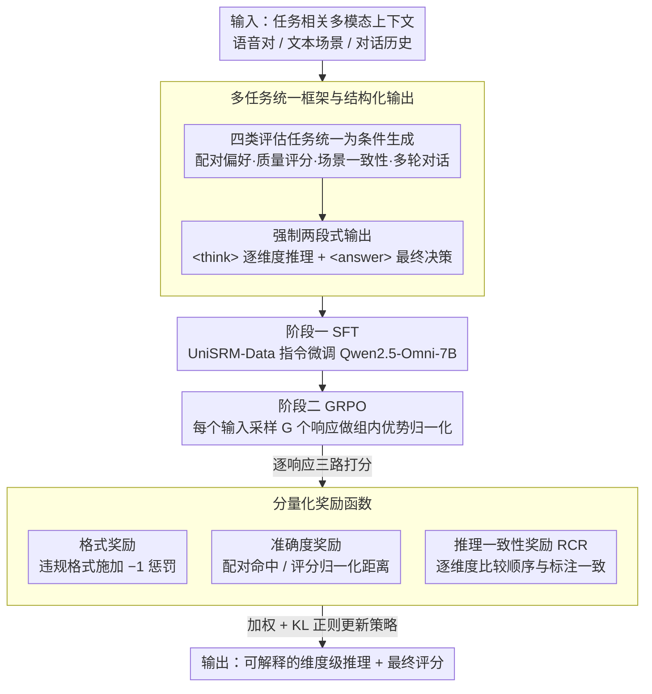

# UniSRM：用于细粒度语音评估的统一语音奖励模型

**会议**: ACL 2026  
**arXiv**: [2605.23261](https://arxiv.org/abs/2605.23261)  
**代码**: https://github.com/lavendery/UniSRM  
**领域**: 语音评估 / 奖励模型  
**关键词**: 语音奖励模型、多维度评估、推理一致性、语音合成评价

## 一句话总结
本文提出 UniSRM，一个统一的语音奖励模型，通过两阶段训练（SFT+GRPO）和推理一致性奖励（RCR）机制，支持从话语级质量到对话级连贯性的多维度、可解释的语音评估，在多个评估任务上显著优于现有方法。

## 研究背景与动机

**领域现状**：语音生成质量评估长期依赖人工意见分数（MOS），成本高、主观性强、难以规模化。近期开始探索使用大型音频语言模型（LALMs）作为自动评分器，如 WavReward、SageLM、SpeechJudge 等。

**现有痛点**：（1）现有方法覆盖任务有限——大多只处理话语级质量或单轮对话，忽视了多轮交互和上下文一致性；（2）评估维度不完整——某些方法遗漏了说话人相似度等关键指标；（3）推理过程不可控——基于规则的 RL 对推理步骤监督不足，导致生成的理由与最终决策不一致；（4）评分缺乏透明度——传统指标（WER、SIM、UTMOS）各自只捕捉单一方面。

**核心矛盾**：语音评估任务的多样性（从孤立话语到对话上下文）与现有奖励模型的单一适配器之间的矛盾；理由生成的自由度与最终评分的准确性之间的张力。

**本文目标**：构建一个能够（1）支持多种语音评估任务；（2）输出可解释的多维度评分及推理过程；（3）确保推理与决策一致性的统一奖励模型。

**切入角度**：观察到现有基于 LLM 的评分器在整合文本或多轮对话上下文时表现不佳——这提示我们可以通过更好的训练策略和推理监督来改进。同时，多维度分解评估过程本身就符合人类评分的直观逻辑。

**核心 idea**：用「分阶段训练 + 推理一致性奖励」的范式替代单纯的端到端微调，使模型在生成维度级别的中间推理时受到显式监督，从而提高整体的可靠性。

## 方法详解

### 整体框架

UniSRM 把"给一段（或一对）语音打多维分"做成一个会先推理再下结论的生成式奖励模型，训练分两阶段。第一阶段 SFT 在统一数据集 UniSRM-Data 上对 Qwen2.5-Omni-7B-thinker 做指令微调，让它学会按结构化格式输出维度级评分和推理；第二阶段用 GRPO 群组相对策略优化，引入推理一致性奖励把模型的预测进一步对齐到人类偏好。输入是任务相关的多模态上下文，输出固定为两段：`<think>` 标签内是逐维度的推理，`<answer>` 标签内是最终决策（二元偏好或 MOS 类评分）。

### 关键设计

**1. 多任务统一框架与结构化输出：一个模型吃下四类评估任务**

UniSRM 在同一模型里处理四个互补任务：话语级配对偏好、话语级质量评分、含文本上下文的场景感知风格一致性、含对话历史的多轮对话评估。做法是把所有任务统一成条件生成问题，系统提示词强制两段式结构（推理 + 答案）；不同任务只在答案部分换格式（二元决策 vs 多维评分向量），推理部分始终包含任务相关的维度级评分。统一格式一方面让单模型学到跨任务的通用评估能力，另一方面也让后续 RL 能对违反格式的输出施加负奖励。

**2. 分量化奖励函数：格式、准确度、一致性三路并管**

GRPO 阶段的最终奖励是三项加权 $R(x,o) = \lambda_{\text{fmt}}R_{\text{fmt}}(o) + \lambda_{\text{acc}}R_{\text{acc}}(o) + \lambda_{\text{rc}}R_{\text{rc}}(o)$。格式奖励对恶意/违规格式施加 $-1$ 惩罚；准确度奖励对配对任务用 $\mathbf{1}[y^{(g)} = y^{\star}]$、对质量评分用归一化距离；一致性奖励即下文要展开的 RCR。三路分别从"格式规范、答案正确、推理自洽"三个角度卡住模型，缺一项都会留下可被钻的空子。

**3. 推理一致性奖励 RCR：逼模型"全程自洽"而不是只对最后一步**

RCR 是上面三路奖励里最关键的一项，也是本文的核心贡献。纯结果准确度奖励会诱导模型走捷径——最终预测对了，但中间各维度的打分自相矛盾，推理可解释性形同虚设。RCR 直接约束中间步骤：对配对任务计算维度级一致性 $R_{\text{rc}}(o) = \frac{1}{D}\sum_{i=1}^{D}\mathbf{1}[\text{sign}(a_i - b_i) = \text{sign}(a_i^{\star} - b_i^{\star})]$，要求两个样本在每个维度上的相对大小顺序都与标注一致；对质量评分任务则改用归一化的多维评分误差作奖励。把优化目标从"最后一步正确"挪到"每个维度都讲得通"，作弊空间被大幅压掉——后面消融也验证了无 RCR 的 GRPO 反而会在某些维度退步到不如纯 SFT。

### 损失函数与训练策略

SFT 阶段使用标准自回归最大似然目标。GRPO 阶段对每个输入 $x$ 从当前策略采样 $G$ 个响应，用组内均值与标准差做优势归一化 $A^{(g)} = (R^{(g)} - \mu(x))/(\sigma(x) + \epsilon)$，再配合 KL 正则的截断策略梯度目标更新。

## 实验关键数据

### 主实验

| 模型 | 任务 1（配对） | 任务 2（质量评分） | 任务 3-英（场景） | 任务 3-中 | 任务 4（对话） |
|------|-------------|----------------|-----------------|---------|------------|
| WER / SIM / UTMOS / DNSMOS | 59.24–84.10 | 0.274–0.449 | 33.21–61.44 | 48.19–63.04 | 40.48–50.79 |
| GPT-4o-Audio | 61.04 | 0.060 | 64.02 | 64.82 | 71.96 |
| Gemini-2.5-Flash | 60.44 | 0.522 | 65.68 | 71.74 | 71.43 |
| **UniSRM（本文）** | **65.06** | **0.551** | **85.61** | **91.30** | **88.89** |

UniSRM 在所有任务上都达到最佳性能，特别是在需要整合文本或对话上下文的任务（任务 3、4）上，相比最强基线提升 20 个百分点以上。

### 消融实验

| 配置 | 任务 1 | 任务 2 | 任务 3-英 | 任务 3-中 | 任务 4 |
|------|------|------|--------|--------|------|
| 仅 SFT（w/o GRPO） | 60.24 | 39.20 | 67.16 | 70.95 | 74.60 |
| GRPO 无 RCR | 60.44 | 37.58 | 80.81 | 81.42 | 82.54 |
| **UniSRM 完整方案** | **65.06** | **39.74** | **85.61** | **91.30** | **88.89** |

关键发现：（1）加入 GRPO 相比纯 SFT 均有提升；（2）RCR 的加入普遍带来进一步改进，最高提升 8.88 个百分点（任务 4）；（3）**反直觉现象**：无 RCR 的 GRPO 在某些维度甚至不如 SFT，说明纯准确度奖励会诱导模型走"捷径"，RCR 通过维度级监督有效阻止了这种行为。

### 跨数据集泛化

| 数据集 | 指标 | DNSMOS | Gemini-2.5-Pro | **UniSRM** |
|--------|------|--------|----------------|-----------|
| BVCC | PCC | 0.299 | 0.339 | **0.498** |
| SOMOS-Clean | PCC | 0.048 | 0.250 | **0.261** |
| SOMOS-Full | PCC | 0.053 | 0.222 | **0.235** |

在人类标注的外部数据集（BVCC、SOMOS）上，UniSRM 表现出强跨域能力，说明模型学到的是真实的评估能力而非过拟合于 LLM 生成的标签。

## 亮点与洞察

- **推理一致性奖励的巧妙设计**：RCR 并不简单地惩罚错误，而是在维度级别强制"逻辑自洽"——确保相对比较的一致性。这个约束设计巧妙地转移了优化目标从"最后一步正确"到"全程合理"，大幅降低了模型的作弊空间。
- **统一数据与多任务学习的协同**：通过精心设计 UniSRM-Data，将表面迥异的四个任务统一为"多维推理+结构化答案"的格式，使单一模型能学到跨任务的通用评估能力。
- **SFT 与 GRPO 的协同**：SFT 教会模型模仿标注者的理由和决策，加入 GRPO 后，模型既改进最终准确度，也通过多样化采样提高推理的多样性和可解释性。

## 局限与展望

**作者承认的局限**：（1）当前基准对重口音、重叠语音等困难场景的覆盖有限；（2）训练和推理的计算成本较高，限制了扩展性和低延迟部署的可行性。

**自发现的局限**：（1）评估维度的定义仍相对固定，可能不适应新兴的应用场景（如多语言混合、特殊口音演员等）；（2）数据来源中对 LLM 生成标签的依赖——虽然论文证明了跨数据集泛化，但 LLM 的系统偏差可能会隐性导入模型。

**改进思路**：（1）探索蒸馏策略将 UniSRM 轻量化；（2）引入主动学习，优先标注高不确定性样本；（3）研究自适应维度选择。

## 相关工作与启发

- **vs WavReward / SageLM**：这些方法聚焦单轮对话或话语级评估，且多采用规则型 RL。UniSRM 覆盖更丰富的任务场景，并通过 RCR 显式约束维度级一致性。
- **vs SpeechJudge**：后者虽然也生成评估理由，但主要针对话语级别，维度数量有限。UniSRM 不仅支持话语级，还扩展到对话级。
- **vs QualiSpeech / AudioJudge**：这些数据集或方法主要关注低阶质量特征，而 UniSRM 加入了高阶、需要上下文感知的评估。

## 评分

- **新颖性**: ⭐⭐⭐⭐⭐ 推理一致性奖励的设计是对多步推理评估的有创意的改进，多任务统一框架虽有先例但本工作的综合性和执行质量都在业界前沿。
- **实验充分度**: ⭐⭐⭐⭐⭐ 包含 4 个互补任务、3 层次的消融、维度级细粒度分析、跨数据集泛化验证，覆盖全面。
- **写作质量**: ⭐⭐⭐⭐ 论文逻辑清晰，动机充分，但在计算成本与实用性的权衡讨论略显欠缺。
- **价值**: ⭐⭐⭐⭐⭐ 为语音生成的奖励建模提供了可复用的范式和公开数据集，对语音 RLHF 生态的完善意义重大。

<!-- RELATED:START -->

## 相关论文

- [\[ACL 2026\] UniVocal：统一的语音-歌唱代码混用合成](univocal_unified_speech-singing_code-switching_synthesis.md)
- [\[ACL 2026\] VoxMind: An End-to-End Agentic Spoken Dialogue System](voxmind_an_end-to-end_agentic_spoken_dialogue_system.md)
- [\[ACL 2026\] Music Audio-Visual Question Answering Requires Specialized Multimodal Designs](music_audio-visual_question_answering_requires_specialized_multimodal_designs.md)
- [\[ACL 2026\] Analyzing Reasoning Shifts in Audio Deepfake Detection under Adversarial Attacks: The Reasoning Tax versus Shield Bifurcation](analyzing_reasoning_shifts_in_audio_deepfake_detection_under_adversarial_attacks.md)
- [\[ACL 2026\] Mind the Pause: Disfluency-Aware Objective Tuning for Multilingual Speech Correction with LLMs](mind_the_pause_disfluency-aware_objective_tuning_for_multilingual_speech_correct.md)

<!-- RELATED:END -->
