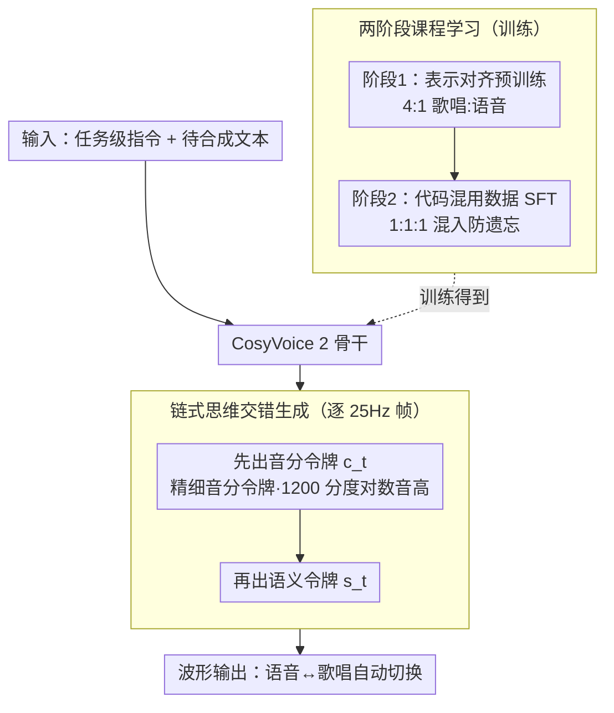

# UniVocal：统一的语音-歌唱代码混用合成

**会议**: ACL 2026  
**arXiv**: [2606.01677](https://arxiv.org/abs/2606.01677)  
**代码**: https://github.com/FunAudioLLM/FunResearch/tree/main/UniVocal  
**领域**: 语音歌唱合成 / 多模态音频生成  
**关键词**: 语音-歌唱代码混用, 链式思维生成, 精细音高表示

## 一句话总结
UniVocal 通过精细音高令牌和两阶段课程学习，训练模型从纯文本语义自动推断语音/歌唱切换点，无需显式标签，在新构建的 SCSBench 基准上达到 SOTA 性能。

## 研究背景与动机

**领域现状**：语音合成（TTS）、歌唱声音合成（SVS）和音乐生成各自专精一个领域，但难以协同工作。传统方案要么只能生成单一模式，要么通过显式标签（如 `<sing>`/`<speech>`）手动控制切换。

**现有痛点**：真实人类在日常交流中会自然地混合语音与歌唱——比如谈话中哼唱一段旋律、用歌曲辅助记忆。现有系统无法捕捉这种 *基于文本语义的自动切换*。Bark 等系统虽尝试混合模式生成，但依赖显式标签且缺乏语义感知能力，导致过渡不稳定。

**核心矛盾**：TTS 缺乏旋律表达能力，SVS 受限于音乐规则和谱，两者的隐式表示空间分布存在巨大差异，直接混合会导致学习失败。同时，语义分词器（semantic tokenizer）丢弃细粒度音高信息，无法精准建模语调和旋律。

**本文目标**：定义"语音-歌唱代码混用（SCS）合成"任务，使模型能：(1) 从纯文本推断何时说话、何时唱歌；(2) 在两种模式间平滑过渡；(3) 保持单一说话人风格的一致性。

**切入角度**：采用课程学习分阶段突破——先对齐两种模式的隐式表示空间，再在合成数据上学习语义触发机制；同时引入高分辨率音高表示法（精细音分令牌）作为"先规划后生成"的结构性约束。

**核心 idea**：用 1200 分度的精细音分令牌显式补充语义分词器丢失的音高信息，辅以链式思维（CoT）生成强制模型预先规划音乐/声调框架，再进行具体内容生成——这一设计既增强歌唱旋律精准度，也无意中激发了模型的文本共鸣（empathy）能力。

## 方法详解

### 整体框架

UniVocal 以 CosyVoice 2 为骨干，把"语音-歌唱代码混用合成"做成一个从纯文本自动推断何时说、何时唱的统一生成框架。输入是任务级自然语言指令（如"生成播客"或"生成歌曲"）加上待合成文本，输出依次是精细音分令牌序列、语义令牌序列和最终波形。核心是 CoT 交错生成：模型在每个 25Hz 帧上先预测音高、再预测内容，把整个生成拆成"先规划音高轨迹、后填充语义"的两步。而能从纯文本学会何时切换，靠的是两阶段课程学习——先对齐语音/歌唱两种模式，再在合成的代码混用数据上学语义触发。

### 关键设计

**1. 精细音分令牌：用 1200 分度补回语义分词器丢掉的音高**

传统语义分词器丢弃细粒度音高，导致语调平坦、旋律失真。UniVocal 改用以 440Hz 为参考的对数频率表示，把音高量化进单个八度：先算 $f_{cent}=1200 \log_2(f_{Hz}/440)$，再映射成令牌 $I(f_{cent})=\lceil f_{cent} \bmod 1200 \rceil$，无声区记为 -1。模 1200 让跨多个八度的人声范围都落进统一的令牌空间，而 1200 分度相比半音的 12 级精细得多、相比原始 F0 又可控得多，最大量化误差约 1 音分（0.08% 频偏），感知上近乎无损。

**2. 链式思维交错生成：先想清音高轨迹再写词**

为了不让语义目标和音乐目标互相打架，UniVocal 强制模型每个时步先出音高令牌、再出语义令牌。实现上扩展 CosyVoice 2 词表，加入 1201 个音分令牌（1200 个音分值 + 1 个无声）并独立初始化嵌入，联合概率按 $P(\mathbf{Y}|\mathbf{X})=\prod_t P(c_t|\mathbf{X},\mathbf{Y}_{<t}) \cdot P(s_t|\mathbf{X},\mathbf{Y}_{<t},c_t)$ 分解，其中 $c_t$、$s_t$ 分别是音分令牌和语义令牌，推理时用 logit mask 强制这个先后顺序。模型必须先把整体音高走向（比如声调由低到高）规划出来，再生成具体词汇细节——后续相关系数 $\rho=0.679$ 也印证了音分令牌确实在充当结构规划者。

**3. 两阶段课程学习：先对齐两种模式，再学语义触发的切换**

语音和歌唱的隐式表示分布差异巨大，直接在混合数据上训会收敛困难（单阶段变体 F1 跌到 0.496）。于是分两步走：第一阶段在对齐数据上以 4:1 的歌唱:语音比例继续预训练，配合任务级指令让模型先独立学稳两种模式；第二阶段用合成的代码混用数据做有监督微调，并按 1:1:1 混入代码混用/语音/歌唱数据防止灾难性遗忘。先对齐表示空间，是后面获得"从文本语义自动切换"能力的前置条件。

### 损失函数 / 训练策略

代码混用数据天然稀缺，UniVocal 用三步合成管道自造训练集。先用 Gemini 2.5 Pro 生成"模糊边界"脚本（独白、播客、有声书），既埋隐式触发（语音走散文体、唱歌走抒情体）也埋显式触发（如"让我想起一首歌"）；再用第一阶段模型统一合成所有片段，语音段条件于 Expresso 的 9 种情感参考音频以保持情感一致，歌唱段只条件于说话人嵌入以稳住音色；最后用 Whisper-v3 算 WER 做质量过滤，丢掉 WER ≥20% 的样本、保留 10–20% 区间以增多样性，最终得到 11,769 条样本（262 小时）。两阶段训练在 4 张 A800 上分别耗时 5 天和 1 天，共 6 天。

## 实验关键数据

### 主实验

| 模型 | SCSBench-Implicit F1(O) | F1(S) | SCSBench-Explicit F1(O) | F1(S) | SCSBench-Mixed F1(O) | F1(S) |
|------|---|---|---|---|---|---|
| Gemini + Bark | 0.414 | 0.142 | 0.533 | 0.250 | 0.465 | 0.199 |
| Gemini + Cosy2 + LeVo | 0.752 | 0.685 | 0.572 | 0.489 | 0.607 | 0.566 |
| **UniVocal** | **0.626** | **0.595** | **0.714** | **0.635** | **0.871** | **0.810** |

混合场景（既有隐式又有显式触发）下，UniVocal 在目标 F1 和 Whisper F1 上双双 SOTA。同时保持最低 WER（5.83-10.90%）和最高 UTMOS（4.36）。

### 消融实验

| 模型变体 | 文本共鸣 E-MOS | P-MOS | 歌唱自然度 N-MOS | M-MOS | 切换准确度 SCS F1 |
|---------|--------------|-------|-----------------|-------|-----------------|
| UniVocal（完整） | 2.26 | 2.22 | 2.23 | 2.18 | 0.716 |
| w/o CoT（无链式思维） | 2.03 | 1.84 | 2.20 | 1.86 | 0.810 |
| w/o CL（无课程学习） | 2.24 | 2.23 | 2.29 | 2.17 | 0.496 |

移除 CoT 虽然提升切换稳定性（F1→0.810），但代价是表现力大幅下降；移除课程学习则切换能力崩溃（F1→0.496）。

### 关键发现

- **显式触发的关键作用**：包含"让我唱一首"之类触发词的样本切换准确率显著更高。
- **哼唱异常**：无语义内容但具有独特文本形式（如"mm-mm"）的哼唱作为"强隐式触发"表现出色。
- **说话人一致性优于基线**：虽全局说话人相似度略低（0.65），但通过时间片段间相似度可见 UniVocal 的句内一致性显著高于级联基线。
- **实时性能**：4 张 A800 GPU 上第一阶段耗时 5 天，第二阶段 1 天，总计 6 天训练。

## 亮点与洞察

- **"规划→生成"的因果链**：CoT 交错生成让模型显式建模音高轨迹后再填充词汇，打破了传统 end-to-end 生成的"黑盒"，相关系数验证（$\rho=0.679$）证明音分令牌确实充当了结构规划者。
- **数据合成范式**：用 LLM 生成语义连贯的代码混用脚本 + 两阶段模型合成 + 质量过滤的闭环管道，既保证了数据自然性，也规避了手工标注。
- **隐形收获——文本共鸣能力**：原本为了增强音乐建模而引入的 CoT 机制，意外地激发了模型的情感表达能力（E-MOS +0.48 vs 基线）。
- **级联 vs 统一的权衡**：级联系统全局相似度更高但句内音色漂移明显；UniVocal 虽全局指标略低，但整体一致性更强。

## 局限与展望

**作者承认的局限**：

1. 合成歌唱数据受源分离和 ASR 工具限制，存在电子音伪影和歌词对齐误差。
2. 合成训练数据与真实复杂场景间存在分布差异；纯隐式切换仍然不够稳健。
3. F1 评估在单个短样本上常陷入二值结果，样本级相关性有限。

**自发现的局限**：

- 模型对"真实世界"场景的泛化受限（Raw Real SCS F1=0.201），需要显式触发才能恢复。
- 课程学习中第一阶段的 4:1 歌唱:语音比例是手工调优的，缺乏系统的比例搜索。

**改进方向**：收集高质量真实歌唱数据；探索更细粒度的语义理解作为隐式切换触发的补充；扩展 CoT 机制到其他多约束生成任务。

## 相关工作与启发

- **vs Bark（混合模式生成）**：Bark 依赖显式标签且过渡不稳定，UniVocal 通过文本语义推断实现自动切换且稳定性更强（F1 0.871 vs 0.465）。
- **vs UniSyn/UniAudio（统一音频生成）**：两者虽支持多任务，但只能生成单一模式，不支持序列内切换；UniVocal 专门为混合生成优化。
- **vs Vevo2（统一声学建模）**：Vevo2 用色度图令牌建模声学（12 半音分辨率），需要参考音频确定模式；UniVocal 用 1200 分度音分令牌且从纯文本推断，粒度更细、输入需求更少。
- **启发**：显式音高建模对于多模态声学生成至关重要；链式思维的"先规划后生成"范式可推广到受多约束制约的生成任务。

## 评分

- 新颖性: ⭐⭐⭐⭐⭐ 首次定义并解决语音-歌唱自动代码混用问题，引入精细音分令牌和 CoT 生成的组合创新。
- 实验充分度: ⭐⭐⭐⭐ 构建 SCSBench 基准并纳入隐式/显式/混合三个场景；消融全面；样本级相关性有限但系统级验证充分。
- 写作质量: ⭐⭐⭐⭐⭐ 逻辑清晰，动机充分，方法细节完整，附录丰富。
- 价值: ⭐⭐⭐⭐ 首次在端到端框架中实现语音-歌唱自动过渡，具有学术新意和应用潜力；所有代码和数据开源。

<!-- RELATED:START -->

## 相关论文

- [\[ACL 2026\] UniSRM：用于细粒度语音评估的统一语音奖励模型](unisrm_a_unified_speech_reward_model_for_reasoning-based_fine-grained_assessment.md)
- [\[ACL 2026\] An Exploration of Mamba for Speech Self-Supervised Models](an_exploration_of_mamba_for_speech_self-supervised_models.md)
- [\[ACL 2026\] SpeechLLM-as-Judges: Towards General and Interpretable Speech Quality Evaluation](speechllm-as-judges_towards_general_and_interpretable_speech_quality_evaluation.md)
- [\[ACL 2026\] Data-efficient Targeted Token-level Preference Optimization for LLM-based Text-to-Speech](data-efficient_targeted_token-level_preference_optimization_for_llm-based_text-t.md)
- [\[ACL 2026\] Mind the Pause: Disfluency-Aware Objective Tuning for Multilingual Speech Correction with LLMs](mind_the_pause_disfluency-aware_objective_tuning_for_multilingual_speech_correct.md)

<!-- RELATED:END -->
