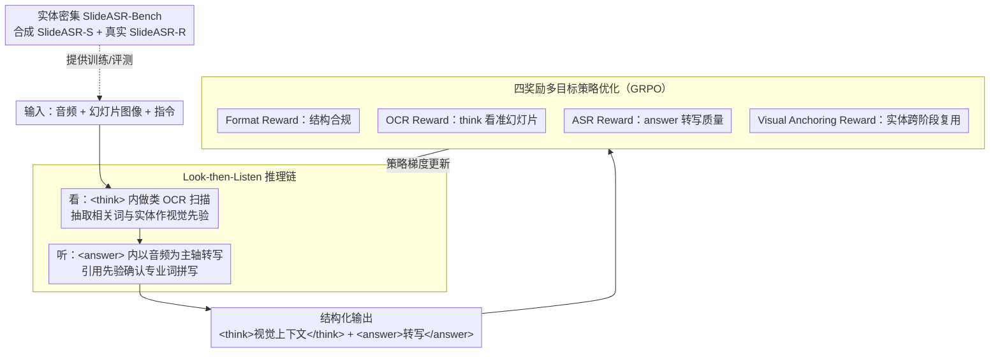

# VAPO: End-to-end Slide-Enhanced Speech Recognition with Omni-modal Large Language Models

**会议**: ACL2026  
**arXiv**: [2510.08618](https://arxiv.org/abs/2510.08618)  
**代码**: https://github.com/isruihu/SlideASR-Bench  
**领域**: reinforcement_learning  
**关键词**: 全模态大模型, 幻灯片增强语音识别, 强化学习, 视觉锚定, 上下文ASR  

## 一句话总结
本文发现端到端全模态大模型做 SlideASR 时会把幻灯片文字误抄成语音内容，并提出 VAPO 用“先看后听”的结构化推理链和多目标强化学习，把幻灯片文字变成语音识别的语义锚点而不是干扰源。

## 研究背景与动机
**领域现状**：传统 ASR 在通用语音上已经很强，但在学术报告、技术演示和专业讲座中仍容易漏掉领域术语、罕见实体和专有名词。幻灯片通常正好包含这些关键词，因此 SlideASR 希望用 slide image 作为视觉上下文来提升语音转写。

**现有痛点**：当前主流 SlideASR 多采用 pipeline：先 OCR 提取幻灯片文字，再挑选关键词，最后把这些文本作为上下文喂给音频语言模型。这种级联系统模块多、实现复杂，而且 OCR 或关键词选择错误会一路传递。全模态大模型看起来能直接同时处理图片、音频和文本，似乎可以自然做端到端 SlideASR。

**核心矛盾**：端到端 OLLM 并不等于自动会合理融合模态。作者发现，模型经常出现 visual interference：当幻灯片中有醒目的文字时，模型会偏向视觉文本，甚至把没有被说出的 slide words 当成语音转写输出。也就是说，视觉上下文本该帮助识别专有名词，却反过来压制了听觉信号。

**本文目标**：论文希望建立一个真正端到端的 SlideASR 范式，让模型直接输入音频、幻灯片和指令，但在推理过程上明确区分视觉感知和听觉转写，避免“看到什么就抄什么”。

**切入角度**：作者借鉴人听报告的习惯：人通常先扫一眼幻灯片，形成主题和实体先验，然后再听语音，把听到的词和视觉先验对齐。VAPO 把这个过程显式写成 “Look-then-Listen” 链条，并用强化学习奖励模型遵守它。

**核心 idea**：用 `<think>` 先抽取幻灯片视觉先验，再用 `<answer>` 生成语音转写，并通过格式、OCR、ASR 和视觉锚定四个奖励共同优化这个结构化策略。

## 方法详解
VAPO 的核心不是让模型简单多看一张图，而是改变它利用图像的时间顺序。vanilla OLLM 同时接收图像和音频时，强视觉文字可能在解码中占据优势，导致模型直接复述 slide text。VAPO 强制模型先把视觉内容写入 `<think>`，再在 `<answer>` 中依据音频生成 transcript。这样视觉信号被变成一个可引用的中间记忆，而不是和音频信号在同一时刻争夺输出。

论文先定义并量化 visual interference。给定幻灯片词集合 $V_{slide}$ 和真实语音词集合 $V_{audio}$，先找出只出现在幻灯片、不在语音中的词 $V_{exclusive}=V_{slide}\setminus V_{audio}$；如果模型预测 $V_{pred}$ 中出现这些词，就认为该样本发生干扰。Visual Interference Rate 就是发生这种误抄的样本比例。这个指标非常贴合任务本质，因为它不只看 WER，还专门衡量“视觉文本压过音频”的失败模式。

### 整体框架
VAPO 的输入包括音频、对应幻灯片图像和任务指令，输出是一个结构化序列：`<think>视觉上下文</think><answer>语音转写</answer>`。在 `<think>` 阶段，模型执行类似 OCR 的视觉扫描，提取 slide 中可能和语音相关的词、短语和实体。在 `<answer>` 阶段，模型以音频为主，同时把 `<think>` 中抽取的实体作为语义锚点，帮助识别专业词。

训练时，作者以 Qwen2.5-Omni 3B / 7B 为基础模型，在 SlideASR-S 训练集上用 GRPO 做策略优化。模型不是只学一个格式模板，而是通过多个奖励同时被拉向三个目标：格式正确、视觉先验准确、最终转写准确、关键实体在 look 和 listen 两阶段之间被真正引用。

论文还构建了 SlideASR-Bench 来解决数据稀缺问题。SlideASR-S 从 ContextASR-Bench 扩展而来，利用实体和领域标签生成 slide-style 文本，再用 Matplotlib 渲染成幻灯片图像，共 8,467 个样本，其中 6,413 个训练、2,054 个测试。SlideASR-R 则是 60 个真实学术报告片段，覆盖化学、医学、生物和人工智能，人工标注 200 个领域实体，用来做真实复杂场景测试。

### 关键设计

**1. Look-then-Listen 推理链：把"看"和"听"在时间上拆开，让视觉只当锚点不当答案**

vanilla OLLM 把图像和音频一起灌进去同时解码，强视觉文字会在那一刻直接压过音频，于是 slide 上的词被原样抄进 transcript。VAPO 的对策是强制模型分两步走：先在 `<think>` 里做一次类 OCR 的视觉扫描，把幻灯片中可能和语音相关的词、短语、实体抽出来形成视觉先验；再在 `<answer>` 里以音频为主轴生成转写，遇到专业词时回头引用 `<think>` 中的候选实体来确认拼写。这个顺序本身就是关键——视觉内容被先写进一段可引用的中间记忆，而不是和音频在同一时刻争夺输出 token。设计灵感来自人听报告的习惯：先扫一眼幻灯片建立主题和实体先验，再听语音把听到的词和先验对齐。这样视觉信号承担的是"锚点"角色，决定权仍在听觉。

**2. 四奖励多目标策略优化：用四个奖励同时把模型拉向格式、看图、听音频、连实体四个目标**

单一奖励都会走偏：只给 ASR 奖励，模型会干脆忽略视觉；只给 OCR 奖励，又会鼓励它照抄幻灯片。VAPO 因此把总奖励拆成四项联合优化。Format Reward 检查输出是否严格遵守 `<think><answer>` 结构；OCR Reward 用 `<think>` 文本和真实 slide text 的 WER 折算为 $R_{OCR}=\max(1-WER,0)$，逼 `<think>` 真的看准幻灯片；ASR Reward 同理用 `<answer>` 和真实 transcript 的 WER 得到 $R_{ASR}=\max(1-WER,0)$，保证最终转写质量；而最关键的 Visual Anchoring Reward 统计关键实体是否**同时**出现在 `<think>` 和 `<answer>`，近似为目标实体的召回率。VA reward 专门约束"看见的实体有没有被正确用到听到的语音里"，它既防止模型在 `<think>` 做完漂亮 OCR 后到 `<answer>` 里弃之不用，也防止模型在 `<answer>` 里乱抄 slide——是把两个阶段真正缝起来的那一针。

**3. 实体密集 SlideASR-Bench：造一个专业实体足够密的数据集，让"视觉干扰"这种失败无处遁形**

如果评测数据里专业实体太稀疏，模型完全可以靠通用 ASR 的高分掩盖掉它在罕见词上的崩溃。VAPO 因此自建 SlideASR-Bench：合成子集 SlideASR-S 从 ContextASR-Bench 扩展而来，用领域标签和实体列表生成 formal slide 文本，再用 Matplotlib 渲染成幻灯片图像，共 8,467 个样本（6,413 训练 / 2,054 测试）；真实子集 SlideASR-R 则采集 60 个真实学术报告片段，覆盖化学、医学、生物和人工智能，人工标注 200 个领域实体。基准把 NE-WER（命名实体 WER）和 NE-FNR（命名实体漏识别率）作为核心指标，迫使方法在真正困难的实体识别上接受检验，而不是躲在整体 WER 后面。

### 损失函数 / 训练策略
VAPO 使用 GRPO 做强化学习式后训练，总奖励为 $R_{total}=\lambda_1R_{Format}+\lambda_2R_{OCR}+\lambda_3R_{ASR}+\lambda_4R_{VA}$。实验中四个权重默认都设为 1。训练总共 800 steps，使用 AdamW，学习率 $1e^{-6}$，global batch size 32，在 4 张 A100 上训练，group size 为 4，采样温度为 1.0，KL penalty coefficient 为 0.01。

## 实验关键数据

### 主实验
作者先在 SlideSpeech 上对比 contextless、pipeline 和 end-to-end 三种设置。令人意外的是，简单加入 slide text 或 slide image 常常让 baseline 更差，而 VAPO 同时降低 WER 并提升关键词召回。

| 方法 | 设置 | Dev WER | Dev Recall | Test WER | Test Recall |
|------|------|---------|------------|----------|-------------|
| Qwen2.5-Omni-7B | Audio-only | 11.75 | 94.78 | 11.75 | 94.78 |
| Qwen3-Omni-30B-A3B | Audio-only | 10.87 | 95.04 | 11.71 | 95.50 |
| Qwen3-Omni-30B-A3B | Slide text pipeline | 50.43 | 96.45 | 57.12 | 96.34 |
| Qwen3-Omni-30B-A3B | Slide image end-to-end | 19.85 | 95.59 | 24.13 | 94.74 |
| VAPO-3B | Slide image end-to-end | 9.84 | 96.54 | 10.73 | 96.57 |
| VAPO-7B | Slide image end-to-end | 8.62 | 97.61 | 10.31 | 97.32 |

在 SlideASR-Bench 上，VAPO 对实体相关指标的优势更明显，尤其是合成英语/中文测试集和真实 SlideASR-R。

| 方法 | SlideASR-S en WER | en NE-WER | en NE-FNR | SlideASR-S zh WER | zh NE-WER | zh NE-FNR | SlideASR-R NE-WER | R NE-FNR |
|------|-------------------|-----------|-----------|-------------------|-----------|-----------|-------------------|----------|
| Qwen3-Omni-30B-A3B Audio-only | 9.06 | 14.61 | 15.53 | 20.77 | 23.31 | 22.49 | 40.43 | 41.09 |
| Qwen3-Omni-30B-A3B End-to-end image | 101.45 | 59.64 | 12.08 | 79.21 | 46.45 | 5.54 | 32.26 | 24.75 |
| VAPO-3B | 4.90 | 3.19 | 3.73 | 2.47 | 4.21 | 2.22 | 27.28 | 19.31 |
| VAPO-7B | 4.60 | 2.83 | 2.97 | 2.13 | 3.78 | 1.36 | 26.48 | 15.35 |

### 消融实验
奖励消融表明，ASR reward 是稳定生成的基础，OCR reward 改善视觉先验，Visual Anchoring reward 则进一步降低实体漏识别。

| 模型 | ASR Reward | OCR Reward | VA Reward | SlideASR-R NE-WER | SlideASR-R NE-FNR |
|------|------------|------------|-----------|-------------------|------------------|
| Qwen2.5-Omni-3B | 无 | 无 | 无 | 49.00 | 53.47 |
| Qwen2.5-Omni-3B | 有 | 无 | 无 | 37.23 | 31.19 |
| Qwen2.5-Omni-3B | 有 | 有 | 无 | 29.97 | 22.28 |
| Qwen2.5-Omni-3B | 有 | 有 | 有 | 27.28 | 19.31 |
| Qwen2.5-Omni-7B | 无 | 无 | 无 | 41.77 | 35.15 |
| Qwen2.5-Omni-7B | 有 | 有 | 有 | 26.48 | 15.35 |

权重敏感性实验显示，默认 1:1:1:1 最稳。提高 VA reward 能略微改善中文实体漏识别，但会增加整体 WER；提高 ASR reward 则可能压制视觉引用。

| 权重 $\lambda_1:\lambda_2:\lambda_3:\lambda_4$ | en WER | en NE-WER | en NE-FNR | zh WER | zh NE-WER | zh NE-FNR |
|---------------------------------------------------|--------|-----------|-----------|--------|-----------|-----------|
| 1:1:1:1 | 4.90 | 3.19 | 3.73 | 2.47 | 4.21 | 2.22 |
| 1:1:1:2 | 5.27 | 3.34 | 3.78 | 2.50 | 4.30 | 2.09 |
| 1:1:2:1 | 5.32 | 4.12 | 3.91 | 2.48 | 4.38 | 2.09 |
| 1:2:1:1 | 5.17 | 3.45 | 3.80 | 2.51 | 4.23 | 1.99 |

### 关键发现
- Visual interference 是普遍问题。MiniCPM-o-2.6 在 SlideSpeech test 上 VIR 达 63.28%，Megrez-Omni 为 44.90%，即使 Qwen2.5-Omni-7B 也有 12.87%。
- 直接加视觉上下文可能灾难性退化。Qwen3-Omni 在 SlideASR-S en 的 end-to-end image 设置下 WER 达 101.45，明显是把幻灯片内容当成语音抄写。
- VAPO 对实体识别提升最大。在 SlideASR-R 上，VAPO-7B 把 NE-FNR 降到 15.35，优于最强 baseline 的 24.75 或 28.22。
- RL 比 SFT 更有效。SFT w/ think 能把 Qwen2.5-Omni-7B 的 WER 从 10.58 降到 6.73，但 VAPO 进一步降到 3.37，说明奖励优化帮助模型把 `<think>` 真正用于 `<answer>`。
- 错配幻灯片实验显示 VAPO 不会盲目抄图。随机换 slide 后，VAPO-3B 的 WER 约 6.70，接近 audio-only baseline，说明它能在视觉不可靠时回退到听觉。

## 亮点与洞察
- 论文把“多模态越多越好”的直觉打破了。全模态模型不是自然会融合模态，如果没有推理过程约束，强视觉文本反而会压过语音。
- VIR 是一个很好的诊断指标。普通 WER 只能说错了多少，VIR 能指出错因是“幻灯片独有词被误输出”，对 SlideASR 特别精准。
- VAPO 的结构很像把 CoT 迁移到跨模态感知。`<think>` 不只是解释，而是一个可被 `<answer>` 注意到的视觉实体缓存。
- Visual Anchoring Reward 设计得很关键。它避免模型只在 `<think>` 做漂亮 OCR，却在最终转写中不用视觉信息，也避免模型在 `<answer>` 中随意抄 slide。
- SlideASR-Bench 对后续研究有独立价值。实体密集、含合成和真实子集、区分 NE-WER / NE-FNR，让这个任务的评估比单纯 WER 更贴近应用。

## 局限与展望
- 方法目前高度依赖幻灯片文本。对于图表、示意图、药物图片、数学公式或非文字视觉线索，当前 “Look” 阶段主要 OCR 的设计还不够。
- 训练数据仍以合成 SlideASR-S 为主。虽然在多个真实集上验证有效，但合成 slide 的版式、噪声、遮挡和复杂图表可能不能覆盖真实会议环境。
- 推理延迟更高。结构化 `<think><answer>` 会增加输出长度和计算开销，论文也承认它更适合离线转写；实时字幕场景可能需要蒸馏或提前缓存视觉先验。
- 奖励需要实体和 slide 文本标注。VA reward 和 OCR reward 依赖相对明确的实体集合和文本监督，迁移到弱标注或开放视频场景时需要改造。
- 仍需防止过度锚定。权重实验说明 VA reward 过高会损害整体 WER，未来需要让模型判断视觉线索是否可靠，而不是总是引用。

## 相关工作与启发
- **vs Pipeline SlideASR**: 传统方法先 OCR 再把文本作为上下文，模块清晰但误差累积；VAPO 保持端到端输入，同时在输出结构上显式分离视觉先验和语音转写。
- **vs Contextual ASR**: 上下文 ASR 常使用实体列表、领域标签或历史对话；VAPO 自动从 slide image 中提取上下文，更适合没有手工词表的报告场景。
- **vs Vanilla OLLM**: 普通 OLLM 同时处理图像和音频，容易出现模态竞争；VAPO 通过时间解耦和 RL 奖励，让视觉成为辅助锚点。
- **vs SFT with CoT**: SFT 能教会格式，但不一定保证中间视觉内容被最终答案利用；VAPO 的 VA reward 直接奖励跨阶段实体复用，因此连接更强。
- **启发**: 这个“先看后听”范式可以推广到会议视频理解、医学影像报告听写、课堂录播转写等任务，也可以扩展为“先看图表、再听讲解、最后生成结构化笔记”。

## 评分
- 新颖性: ⭐⭐⭐⭐☆ 问题洞察和奖励设计都很有针对性，方法本身是结构化推理链加 RL 的组合创新。
- 实验充分度: ⭐⭐⭐⭐⭐ 有失败模式量化、两类主数据集、奖励消融、权重敏感性、SFT 对比、错配鲁棒性和注意力可视化。
- 写作质量: ⭐⭐⭐⭐☆ 论文叙事清晰，Visual Interference 到 VAPO 的动机链很顺，表格较多但信息扎实。
- 价值: ⭐⭐⭐⭐⭐ 对专业场景 ASR 和全模态模型训练都很有实践价值，尤其提醒我们要显式设计模态融合过程。

<!-- RELATED:START -->

## 相关论文

- [\[ACL 2025\] Contextual Biasing with the Knowledgeable External Language Model for End-to-End Speech Recognition](../../ACL2025/audio_speech/contextual_biasing_with_the_knowledgeable_external_language_model_for_end-to-end.md)
- [\[ACL 2026\] Speculative End-Turn Detector for Efficient Speech Chatbot Assistant](speculative_end-turn_detector_for_efficient_speech_chatbot_assistant.md)
- [\[ACL 2026\] VoxMind: An End-to-End Agentic Spoken Dialogue System](voxmind_an_end-to-end_agentic_spoken_dialogue_system.md)
- [\[ACL 2026\] Closing the Modality Reasoning Gap for Speech Large Language Models](closing_the_modality_reasoning_gap_for_speech_large_language_models.md)
- [\[AAAI 2026\] End-to-end Contrastive Language-Speech Pretraining Model For Long-form Spoken Question Answering](../../AAAI2026/audio_speech/end-to-end_contrastive_language-speech_pretraining_model_for_long-form_spoken_qu.md)

<!-- RELATED:END -->
