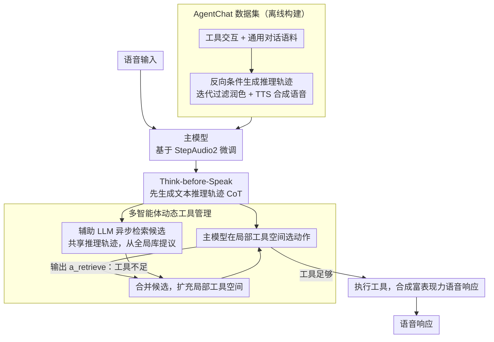

# VoxMind: An End-to-End Agentic Spoken Dialogue System

**会议**: ACL 2026  
**arXiv**: [2604.15710](https://arxiv.org/abs/2604.15710)  
**代码**: [GitHub](https://github.com/MM-Speech/VoxMind)  
**领域**: 对话系统 / Agent  
**关键词**: 端到端语音对话, 工具调用, 思考-说话机制, 多智能体动态工具管理, 语音Agent

## 一句话总结

提出 VoxMind，一个赋予端到端语音对话模型智能体能力的统一框架：通过"Think-before-Speak"机制实现显式推理，结合多智能体动态工具管理架构解耦推理延迟与工具规模，任务完成率从基线 34.88% 提升至 74.57%，超越 Gemini-2.5-Pro。

## 研究背景与动机

**领域现状**：端到端语音对话模型（如 Kimi-Audio、Qwen2.5-Omni、StepAudio2）近年发展迅速，能直接建模副语言信息并生成富有表现力的语音响应，避免传统级联 ASR-LLM-TTS 管线的信息损失和延迟。

**现有痛点**：(1) 现有端到端语音模型主要优化反应式对话，缺乏推理、规划和外部知识获取能力；(2) 语音领域缺乏"端到端语音 Agent"的统一定义和评估标准；(3) 语音输入比文本需要更多 token，与大规模工具描述叠加后产生显著计算开销；(4) 缺乏带有 Agent 行为标注（推理轨迹、工具交互）的语音数据。

**核心矛盾**：语音模型的 Agent 能力（工具调用+推理规划）与推理效率之间存在 trade-off——集成更多工具提升能力但增加延迟，而语音交互对响应时间敏感。

**本文目标**：(1) 定义端到端语音 Agent；(2) 赋予语音模型推理和工具调用能力；(3) 解耦推理延迟与工具库规模。

**切入角度**：借鉴文本 Agent 的成功经验（ReAct、工具调用），但需要适配语音场景的特殊需求——低延迟、副语言信息保持、语音数据稀缺。

**核心 idea**：用 Think-before-Speak 机制让语音模型先生成文本推理轨迹再生成语音响应，用异步辅助模型从全局工具库选择候选工具维护动态局部工具空间。

## 方法详解

### 整体框架

VoxMind 要解决的核心问题是：让端到端语音模型既能像文本 Agent 那样推理、规划、调用工具，又不让大规模工具库拖垮语音交互对延迟的苛刻要求。语音输入进来后，主模型先吐出一段文本推理轨迹（CoT）厘清意图与任务规划，再依据这段推理在一个"局部工具空间"里选择动作；与此同时，一个辅助 LLM 共享同一份推理轨迹、异步地从全局工具库里检索候选工具。只有当主模型自己判断手头工具不够用时，才把候选并入局部空间触发扩展，否则直接执行并合成富表现力的语音响应——"先想后说"负责能力、"按需扩工具"负责效率，两条线并行推进。而支撑这套能力的训练语料，则由离线构建的 AgentChat 数据集提供。

### 关键设计

**1. Think-before-Speak：先生成文本推理再开口说话**

端到端语音模型习惯做直接的 $x \to y$ 映射，对需要多步规划的复杂任务力不从心。VoxMind 把它改成 $x \to z \to y$：响应语音之前，模型先采样一条文本推理轨迹 $\mathbf{c}_t \sim \pi_\theta^{\text{think}}(\mathbf{c} \mid \mathbf{o}_t, \mathcal{H}_{t-1}, \mathcal{T}_t^{local})$，在其中完成意图理解、上下文分析与任务规划，再以这条轨迹为条件选择动作 $\mathbf{a}_t \sim \pi_\theta^{\text{act}}(\mathbf{a} \mid \mathbf{c}_t, \mathbf{o}_t, \mathcal{H}_{t-1})$。中间这层显式的"思考"正是反应式对话模型缺失的规划环节，而它的训练数据靠反向条件生成（先有问答、再补推理过程）批量构造，绕开了语音领域稀缺的推理标注。

**2. 多智能体动态工具管理：把延迟和工具库规模解耦**

如果每一轮都把全部工具描述塞进上下文，token 数会随工具数量线性膨胀，而语音 token 本就比文本多，叠加之后延迟难以接受。VoxMind 改为维护一个远小于全库的局部工具空间 $\mathcal{T}_t^{local} \subset \mathcal{T}^{all}$：主模型只在这个小空间里选动作，辅助 LLM 则共享推理轨迹、异步地从全局库提议候选；唯有主模型显式输出 $a_{\text{retrieve}}$、承认当前工具不足时，才执行合并 $\mathcal{T}_{t+1}^{local} = \mathcal{T}_t^{local} \cup \mathcal{T}_t^{cand}$ 扩充局部空间。检索与推理并行、扩展按需触发，使得即便全局库膨胀到 40 个工具，延迟也只增加约 20%。

**3. AgentChat 数据集：为语音 Agent 补齐带推理标注的训练语料**

语音领域几乎没有带 Agent 行为标注（推理轨迹、工具交互）的数据，模型无从学起。作者构建了 AgentChat：工具交互语料 14,805 条（取自 ToolACE、APIGen-MT 及自建数据）与通用对话语料 31,481 条，合计约 470 小时。每条样本的推理轨迹用反向条件生成 $R \sim p_{\text{LM}}(R \mid Q, A)$ 合成，并经迭代过滤（质量阈值 7/10、最多重试 3 次）与文本润色把控质量，最后由 TTS 合成为语音，从而把文本世界成熟的 Agent 数据迁移到语音场景。

### 一个完整示例

以"帮我查下周从北京到上海的高铁并订票"为例：语音进来后，主模型先在推理轨迹里拆出"查车次→选车次→下单"三步规划；当前局部空间只有通用问答工具，主模型据此输出 $a_{\text{retrieve}}$，而异步运行的辅助 LLM 已从全局库捞回 `train_search`、`ticket_booking` 等候选并合并进局部空间；下一轮主模型在扩充后的空间里调用 `train_search` 拿到车次、再调用 `ticket_booking` 完成下单，最后把结果用自然语音播报给用户。整个过程里检索始终与推理并行，用户感知到的延迟并不随后台工具库变大而上升。

### 损失函数 / 训练策略

基于 StepAudio2 微调，使用 AdamW 优化器，学习率 1e-5，DeepSpeed ZeRO-3，bfloat16 精度，梯度检查点。2 张 H20-NVLink GPU 训练。

## 实验关键数据

### 主实验

| 模型 | 单任务 TS/PF | 任务分解 TS/PF | 并行处理 TS/PF | 主动寻求 TU | Overall |
|------|------------|-------------|-------------|-----------|---------|
| StepAudio2 | 78.70/48.87 | 60.32/26.98 | 53.33/33.33 | 3.12 | 34.88 |
| Kimi-Audio | 78.45/56.89 | 48.15/22.75 | 79.05/55.24 | 13.64 | 54.94 |
| Gemini-2.5-pro | 90.98/75.19 | 82.54/52.38 | 88.57/69.52 | 26.87 | 71.51 |
| **VoxMind** | **98.50/72.18** | **95.24/38.10** | **89.52/61.59** | **68.66** | **74.57** |

### 消融实验

| 配置 | Overall | 说明 |
|------|---------|------|
| w/o think, 1:1 | 68.83 | 无推理，工具/对话 1:1 |
| w/o think, 1:0.5 | 70.97 | 无推理，更少对话数据 |
| w/ think, 1:1 | 71.97 | 有推理 |
| w/ think, 1:0.5 | **74.57** | 推理 + 更多工具数据占比 |

### 关键发现

- Think-before-Speak 机制平均提升约 3-6%，对"主动寻求工具"能力提升最大（从 31.34% 到 68.66%）
- 工具/对话数据比例 1:0.5 优于 1:1，说明更高比例的 Agent 数据有利于工具能力
- 动态工具管理使延迟不随工具数增加而显著增长，40 个工具时延迟仅增加约 20%
- VoxMind 在 VoiceBench 上保持了通用对话质量，未因 Agent 训练而退化

## 亮点与洞察

- **端到端语音 Agent 的形式化定义**填补了领域空白——Profile、Memory、Planning、Action 四维度框架为后续研究提供了标准
- **异步并行的动态工具管理**设计巧妙——辅助模型与主模型共享推理轨迹但独立检索，实现了能力与效率的解耦
- **反向条件生成推理轨迹**的数据构建方法实用——先有问答对再生成推理过程，比人工标注高效

## 局限与展望

- AgentChat 数据主要由 TTS 合成，可能缺乏自然语音的丰富性
- 评估主要在自建测试集上，缺乏社区公认的语音 Agent 基准
- 辅助 LLM 的选择和规模对整体效果的影响未充分消融
- 未探索流式推理场景（用户说话过程中即开始推理）

## 相关工作与启发

- **vs 级联系统（Qwen3+Whisper）**: 级联系统利用文本 LLM 的 Agent 能力但丢失副语言信息和增加延迟，VoxMind 保持端到端优势
- **vs WavRAG/Stream RAG**: 仅支持检索增强等单一 Agent 功能，VoxMind 支持完整的工具调用+推理规划
- **vs Gemini-2.5-pro**: 闭源模型在单项能力上有优势，但 VoxMind 在整体 Agent 任务上超越，且开源可部署

## 评分

- 新颖性: ⭐⭐⭐⭐⭐ 首个系统性的端到端语音 Agent 框架，定义+数据+方法完整
- 实验充分度: ⭐⭐⭐⭐ 对比全面但缺乏社区标准基准
- 写作质量: ⭐⭐⭐⭐ 形式化定义清晰，架构图直观
- 价值: ⭐⭐⭐⭐⭐ 开源框架+数据集对语音 Agent 领域有重要推动

<!-- RELATED:START -->

## 相关论文

- [\[AAAI 2026\] End-to-end Contrastive Language-Speech Pretraining Model For Long-form Spoken Question Answering](../../AAAI2026/audio_speech/end-to-end_contrastive_language-speech_pretraining_model_for_long-form_spoken_qu.md)
- [\[ACL 2026\] VAPO: End-to-end Slide-Enhanced Speech Recognition with Omni-modal Large Language Models](vapo_end-to-end_slide-enhanced_speech_recognition_with_omni-modal_large_language.md)
- [\[ACL 2025\] DNCASR: End-to-End Training for Speaker-Attributed ASR](../../ACL2025/audio_speech/dncasr_end-to-end_training_for_speaker-attributed_asr.md)
- [\[ACL 2026\] Speculative End-Turn Detector for Efficient Speech Chatbot Assistant](speculative_end-turn_detector_for_efficient_speech_chatbot_assistant.md)
- [\[ACL 2025\] OmniFlatten: An End-to-end GPT Model for Seamless Voice Conversation](../../ACL2025/audio_speech/omniflatten_an_end-to-end_gpt_model_for_seamless_voice_conversation.md)

<!-- RELATED:END -->
