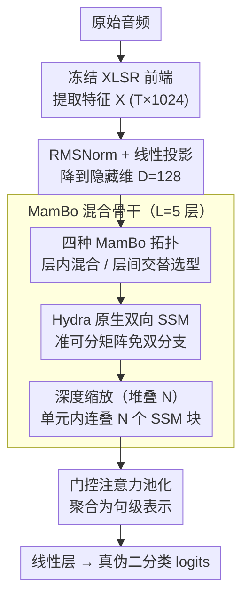

# XLSR-MamBo: Scaling the Hybrid Mamba-Attention Backbone for Audio Deepfake Detection

**会议**: ACL 2026  
**arXiv**: [2601.02944](https://arxiv.org/abs/2601.02944)  
**代码**: [GitHub](https://github.com/saki-ciallo/XLSR-MamBo)  
**领域**: AI安全 / 语音伪造检测  
**关键词**: 音频深度伪造检测, Mamba, 混合架构, 状态空间模型, XLSR

## 一句话总结
提出 XLSR-MamBo 框架，系统探索 Mamba-Attention 混合架构在音频深度伪造检测中的四种拓扑设计和多种 SSM 变体（Mamba2、Hydra、GDN），其中 MamBo-3-Hydra 利用 Hydra 的原生双向建模达到多个基准上的竞争性能，且增加骨干深度可有效缓解浅层模型的性能不稳定。

## 研究背景与动机

**领域现状**：音频深度伪造检测（ADD）已从手工特征转向端到端架构。XLSR 作为前端特征提取器搭配 Conformer 等注意力分类器是主流方案。近期 Mamba 等状态空间模型（SSM）因线性复杂度受到关注。

**现有痛点**：纯因果 SSM 是单向的，难以捕捉全局频域伪造痕迹所需的基于内容的检索能力。现有双向 Mamba 扩展依赖手工设计的双分支策略（如正反向拼接），存在结构冗余。Transformer 的二次复杂度限制了长序列效率。

**核心矛盾**：SSM 擅长高效时序压缩和局部高频伪影捕捉，Attention 擅长全局关联和内容检索——深度伪造信号同时表现为局部高频伪影和全局频谱不一致，单一机制都不够。

**本文目标**：系统探索 SSM-Attention 混合架构在 ADD 中的最优拓扑组合，并评估深度缩放对性能稳定性的影响。

**切入角度**：受 Jamba、Zamba 等 LLM 混合架构启发，但针对 ADD 任务进行定制化探索，特别引入 Hydra（原生双向 SSM）替代启发式双向策略。

**核心 idea**：SSM 和 Attention 的互补性（时序压缩 vs 内容检索）在 ADD 中尤为重要，Hydra 的原生双向参数化比双分支策略更优雅，增加 SSM 堆叠深度 N 可缓解性能不稳定。

## 方法详解

### 整体框架

XLSR-MamBo 的出发点是：深度伪造信号既有局部高频伪影、又有全局频谱不一致，SSM 擅长高效时序压缩与局部捕捉、Attention 擅长全局关联与内容检索，单靠一种机制都不够，于是把两者混合进同一个骨干。原始音频先经冻结的 XLSR 前端提取特征 $X \in \mathbb{R}^{T \times 1024}$，过 RMSNorm 并线性投影到隐藏维 $D=128$，再经 $L=5$ 层 MamBo 混合层编码，最后由门控注意力池化聚合成句级表示、线性层输出真伪二分类 logits。论文的真正工作不在某个固定结构，而在系统比较 SSM 与 Attention 的多种拓扑组合及其深度缩放行为——下面三个关键设计都作用在这套 MamBo 混合骨干上。

### 关键设计

**1. 四种 MamBo 拓扑：层内混合还是层间交替**

为了搞清 SSM 与 Attention 该怎么拼，作者枚举了四种拓扑：MamBo-1 用纯 SSM 直接替换多头注意力；MamBo-2（Mamer）在 SSM 之后接一层 MHA 来替换 FFN，属于层内混合；MamBo-3 让 Mamba 层与 Transformer 层交替堆叠；MamBo-4 让 Mamba 层与 Mamer 层交替堆叠。前两者探索"层内"如何融合两种算子，后两者探索"层间"如何穿插，且每种拓扑都可换装不同 SSM 变体（Mamba、Mamba2、Hydra、GDN）。这种全因子式的探索把不同伪造痕迹对处理方式的偏好暴露出来，实验结论是层间交替（MamBo-3）整体最优。

**2. Hydra 原生双向 SSM：用准可分矩阵免掉双分支启发式**

深度伪造的伪影可能分布在整段音频里，检测需要非因果的全局上下文，但纯因果 SSM 是单向的，过去的双向 Mamba 又依赖正反向拼接这类手工双分支策略、结构冗余。Hydra 改从参数化层面解决：把前向与反向扫描统一写成一个准可分矩阵，其下三角承载过去信息、上三角承载未来信息，整体计算形如 $\text{shift}(SS(X)) + \text{flip}(\text{shift}(SS(\text{flip}(X)))) + DX$，在线性复杂度内就原生地完成双向处理。它既补上了"因果一致性违反"这一伪造线索所需的非因果视野，又比双分支更优雅、无冗余。

**3. 深度缩放（Stacking N）：靠堆叠层数压住浅层的不稳定**

实验中发现浅层模型性能方差很大、跑同一配置结果忽高忽低，原因是 SSM 层数太少、表征深度不足以稳定地刻画复杂伪造痕迹。作者引入堆叠超参数 $N$，允许在单个单元里连续叠 $N$ 个 SSM 块来加深表征。扫描下来 $N=3$ 在性能与稳定性之间最佳，而 $N=1$ 的浅层模型方差明显偏大——这条"加深可缓解不稳定"的规律对实际部署有直接价值。

### 损失函数 / 训练策略

使用 FocalLoss 处理类别不平衡。AdamW 优化器（$lr=10^{-5}$），10% 线性 warmup + 余弦衰减。混合精度训练（BF16/FP32），最多 20 epoch，早停 patience=7。在 ASVspoof 2019 LA 训练集上训练，跨数据集评估泛化性。

## 实验关键数据

### 主实验

| 模型 | ASV21LA EER↓ | ASV21DF EER↓ | ITW EER↓ |
|------|-------------|-------------|----------|
| XLSR-Conformer (基线) | ~1.0 | ~2.5 | ~5.0 |
| MamBo-1-Mamba (N=1) | 1.19 | 2.08 | 4.65 |
| MamBo-3-Hydra (N=3) | 最优 | 竞争性 | 竞争性 |
| RawBMamba | - | - | - |

### 消融实验

| 配置 | ASV21LA | 说明 |
|------|---------|------|
| MamBo-1 (纯SSM) | 基线 | SSM 替换 Attention |
| MamBo-2 (Mamer) | 略优 | 层内混合有帮助 |
| MamBo-3 (交替) | 最优 | 层间交替效果最好 |
| N=1 vs N=3 | 方差↓ | 深度缩放显著提升稳定性 |

### 关键发现
- MamBo-3（Mamba-Transformer 交替）在多数基准上表现最优，证明层间交替优于层内混合
- Hydra 在 MamBo-3 中表现最佳，其原生双向建模比 Mamba 的启发式双分支更有效
- 增加 SSM 堆叠深度 N 从 1 到 3 显著降低性能方差，浅层模型的不稳定性是实际部署的隐患
- 在 DFADD 数据集上对扩散和流匹配合成方法保持鲁棒，证明泛化能力
- GDN 的 delta rule 记忆管理在某些场景下也表现不错

## 亮点与洞察
- 系统化的拓扑探索（4 种设计 × 4 种 SSM 变体 × 不同深度）为 SSM-Attention 混合架构在语音任务中的应用提供了全面的设计指南。这种方法论可迁移到其他语音任务
- Hydra 的原生双向能力在 ADD 中的优势验证了"因果一致性违反"作为伪造检测线索的假设
- "深度缩放缓解浅层不稳定"是实用的工程洞察，对实际部署有直接指导意义

## 局限与展望
- 仅在 ASVspoof 2019 LA 训练集上训练，训练数据多样性有限
- 模型规模较小（D=128, L=5），更大规模模型的表现未探索
- ITW 数据集上的性能仍有提升空间
- 未探索端到端训练（XLSR 参数冻结）
- 未来可探索更多混合拓扑和跨语言泛化

## 相关工作与启发
- **vs XLSR-Conformer**: 纯注意力架构，本文混合 SSM 在效率和性能上均有改进
- **vs RawBMamba**: 手工双向 Mamba 策略，本文用 Hydra 原生双向替代更优雅
- **vs Jamba/Samba**: LLM 领域的混合架构，本文首次将此范式系统化应用于 ADD

## 评分
- 新颖性: ⭐⭐⭐⭐ 系统化探索 SSM-Attention 混合在 ADD 中的应用，Hydra 引入有新意
- 实验充分度: ⭐⭐⭐⭐⭐ 四种拓扑 × 四种变体 × 多深度 × 多数据集，非常全面
- 写作质量: ⭐⭐⭐⭐ 背景知识详实，实验组织清晰
- 价值: ⭐⭐⭐⭐ 为 ADD 领域的架构选择提供了系统化参考

<!-- RELATED:START -->

## 相关论文

- [\[ACL 2026\] HCFD: A Benchmark for Audio Deepfake Detection in Healthcare](hcfd_a_benchmark_for_audio_deepfake_detection_in_healthcare.md)
- [\[ACL 2026\] An Exploration of Mamba for Speech Self-Supervised Models](an_exploration_of_mamba_for_speech_self-supervised_models.md)
- [\[ACL 2026\] Analyzing Reasoning Shifts in Audio Deepfake Detection under Adversarial Attacks: The Reasoning Tax versus Shield Bifurcation](analyzing_reasoning_shifts_in_audio_deepfake_detection_under_adversarial_attacks.md)
- [\[ACL 2026\] RTCFake: Speech Deepfake Detection in Real-Time Communication](rtcfake_speech_deepfake_detection_in_real-time_communication.md)
- [\[ACL 2026\] Semi-Supervised Diseased Detection from Speech Dialogues with Multi-Level Data Modeling](semi-supervised_diseased_detection_from_speech_dialogues_with_multi-level_data_m.md)

<!-- RELATED:END -->
