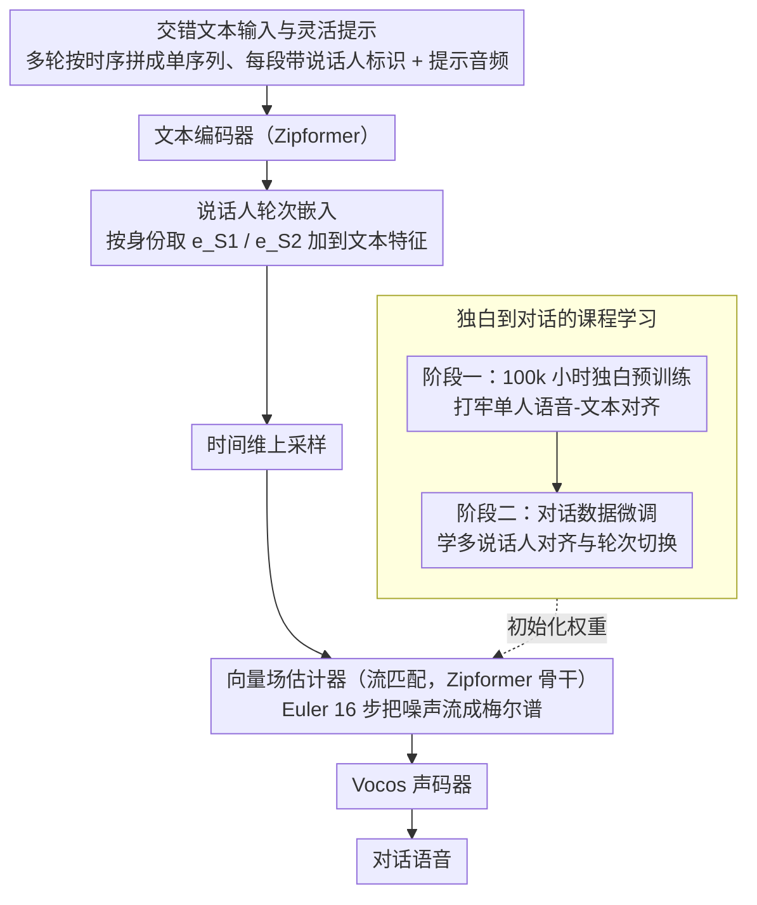

# ZipVoice-Dialog: Non-Autoregressive Spoken Dialogue Generation with Flow Matching

**会议**: ACL 2026  
**arXiv**: [2507.09318](https://arxiv.org/abs/2507.09318)  
**代码**: [https://github.com/k2-fsa/ZipVoice](https://github.com/k2-fsa/ZipVoice)  
**领域**: 图像生成  
**关键词**: 对话语音生成, 非自回归, 流匹配, 说话人轮次, 课程学习

## 一句话总结

提出 ZipVoice-Dialog，首个基于流匹配的非自回归零样本对话语音生成模型，通过课程学习策略和说话人轮次嵌入两个简单设计，解决了流匹配直接用于对话场景时的语音不可懂和轮次混乱问题，同时发布了首个大规模开源对话语音数据集 OpenDialog（6.8k 小时）。

## 研究背景与动机

**领域现状**：文本到语音（TTS）技术在单说话人独白场景已取得出色成果。然而，合成多说话人自然对话仍是重大挑战，因为对话需要准确自然的说话人轮次切换和保持不同说话人的音色区分。

**现有痛点**：当前最先进的对话语音生成方法主要依赖自回归（AR）架构（如 MoonCast、Dia），但 AR 模型存在两个固有缺陷：(1) 推理延迟高，因为需要逐步顺序生成；(2) 鲁棒性问题严重，暴露偏差导致词语重复或跳词等不稳定现象。

**核心矛盾**：流匹配作为非自回归方法在独白 TTS 中已展现出色性能，但作者的初步实验发现，直接将流匹配架构用于对话生成会导致完全不可懂的语音——模型能模仿提示音的风格和音色，但完全无法反映输入文本的内容。这是因为对话中涉及两个不同说话人的音色，使得语音-文本对齐学习变得极其困难。

**本文目标**：设计有效的方法使流匹配架构适用于多说话人对话生成，同时解决训练数据稀缺问题。

**切入角度**：作者观察到问题的根源在于多说话人音色的对齐学习难度，因此从"先学会对齐再学对话"的课程学习角度切入，并通过显式的说话人轮次嵌入提供清晰的说话人线索。

**核心 idea**：用课程学习（先独白预训练后对话微调）解决对齐问题，用可学习的说话人轮次嵌入解决轮次切换问题，使流匹配 NAR 架构在对话生成中同时获得高速度和高稳定性。

## 方法详解

### 整体框架

ZipVoice-Dialog 把成熟的独白流匹配 TTS 模型 ZipVoice 改造成对话生成器：交错排好的多说话人文本和一段提示音频进来，文本编码器（Zipformer）先把文本编成特征，向量场估计器（同样 Zipformer 骨干）在条件流匹配框架下把噪声逐步"流"成目标梅尔谱，最后交给预训练的 Vocos 声码器还原成完整对话语音。整个模型不靠任何外部时长预测器，token 时长和轮次切换都由流匹配目标隐式学出来，再叠加一个语音填充（speech infilling）任务获得零样本克隆能力。难点不在骨干，而在两件事：怎么让一个原本只会单人对齐的模型在双说话人场景下不崩、以及怎么让它分得清两个嗓音——这正是下面三个设计要解决的。

### 关键设计

**1. 独白到对话的课程学习：先学会对齐，再学会对话**

直接拿对话数据从头训流匹配模型会立刻翻车——语音-文本对齐彻底崩溃，WER 从独白时的约 5% 飙到 100% 以上，模型只会模仿提示音的音色却完全念不出文本内容。根因是两个说话人的音色同时存在，让"哪段声音对应哪个字"的对齐学习难度陡增。课程学习的思路是把任务拆成由易到难两段：阶段一用在 100k 小时独白数据上预训练好的 ZipVoice 权重初始化，先把稳健的单人对齐基础打牢；阶段二才在对话数据上微调，让模型在已会对齐的前提下专心学多说话人上下文里的对齐适配、音色分配和自然轮次切换。消融里"无课程学习"一栏 WER 116.10 就是对齐崩溃的直接证据。

**2. 说话人轮次嵌入：用两个可学习向量替模型贴上身份标签**

让模型分清谁在说话、并给每个轮次配上正确音色，光靠在文本里插分隔符 "|" 或写 [S1]/[S2] 标记都不够——这两种做法的 cpWER 高达 37.82 / 31.34，远高于普通 WER，说明内容念对了但说话人张冠李戴。本文改成引入两个随机初始化、可学习的嵌入向量分别绑定 [S1]、[S2]。对文本序列里每个 token $y_i$，按其说话人身份取出对应嵌入 $e_{speaker(i)}$ 直接加到文本特征上，$\widetilde{y_i} = \hat{y_i} + e_{speaker(i)}$，之后再做时间维上采样。这样身份信息以连续向量形式注入特征空间而非离散符号，让模型能稳定地把音色和轮次对上号，cpWER 一下降到 5.82，轮次准确率近乎完美。

**3. 交错文本输入与灵活提示：把多轮对话压成一条序列、端到端建时长**

对话输入天然复杂——多人多轮还要有先后。这里把所有发言按时间排序拼成单一交错文本序列，每段前缀带上说话人标识；训练时随机截取不同长度的对话音频前缀当提示，推理时则支持任意轮数的提示音频。关键是不引入预定义时间戳或外部时长预测器，token 和轮次的时长全部由流匹配目标隐式建模，训练推理都更简洁，也避免了时间戳预测误差的级联。

### 一个完整示例

以一段两人中文对话为例：输入是交错文本"[S1] 你吃饭了吗 [S2] 还没呢"加一小段 A、B 两人各说过一句话的提示音频。文本编码器把整条序列编码，碰到 [S1] 段的 token 就加上 $e_{S1}$、[S2] 段加上 $e_{S2}$，再上采样到帧级；向量场估计器以提示音频为条件，从高斯噪声出发用 Euler 求解器迭代 16 步把梅尔谱"流"出来——前半段自动套用 A 的音色念第一句、后半段切到 B 的音色念第二句，轮次切换点由流匹配自行决定；最后 Vocos 把梅尔谱转成波形，得到一段音色区分清晰、轮换自然的对话语音。

### 损失函数 / 训练策略

训练用条件流匹配（CFM）损失，且只在被掩码区域上计算：

$$L_{CFM} = \mathbb{E}_{t,q(x_1),p_0(x_0)} \| (v_t(x_t, z, (1-m) \odot x_1; \theta) - (x_1 - x_0)) \odot m \|^2$$

阶段二在 OpenDialog 加内部数据（共约 7.6k 小时）上微调 60k 步，总 batch 约 4k 秒；推理用 Euler 求解器采样 16 步。

## 实验关键数据

### 主实验

与开源对话语音生成模型对比（中英文测试集）：

| 模型 | 参数量 | RTF↓ | 中文 WER↓ | 英文 WER↓ | cpSIM↑ | UTMOS↑ |
|------|--------|------|-----------|-----------|--------|--------|
| Dia | 1.61B | 1.663 | - | 11.80 | 0.333 | 1.87 |
| MoonCast | 2.67B | 0.953 | 15.85 | 23.62 | 0.356 | 2.37 |
| ZipVoice-Dialog | **123M** | **0.063** | **3.17** | **3.25** | **0.437** | **3.07** |

ZipVoice-Dialog 以仅 123M 参数实现了全面碾压：推理速度快 15 倍以上，WER 降低 3-7 倍。

### 消融实验

| 配置 | 英文 WER↓ | 英文短 cpWER↓ | 说明 |
|------|-----------|---------------|------|
| 完整模型（课程学习+嵌入） | 3.25 | 3.27 | 最优 |
| 无课程学习 | 116.10 | 116.31 | 对齐崩溃，完全不可懂 |
| 分隔符 "|" 替代嵌入 | 5.34 | 37.82 | 轮次准确率极差 |
| 文本标记替代嵌入 | 5.57 | 31.34 | 轮次准确率差 |
| 仅 OpenDialog 数据 | 3.34 | 3.53 | 仅数据即可达到强基线 |

### 关键发现

- 课程学习是不可或缺的：没有它模型完全无法工作（WER >100%），这说明多说话人对齐是流匹配对话生成的核心瓶颈
- 说话人轮次嵌入极其简单但极其有效：两个可学习向量就将轮次错误率从 >30% 降至 <1%
- 主观评估（CMOS/SMOS）中 ZipVoice-Dialog 大幅领先 MoonCast（CMOS 差距 -1.17，SMOS 3.86 vs 2.35）
- OpenDialog 数据集单独使用即可训练出超越基线的模型，验证了数据集的高质量

## 亮点与洞察

- **极简但极效的设计哲学**令人印象深刻——仅课程学习 + 两个可学习嵌入就让流匹配架构从"完全不可用"变成"全面碾压 AR 基线"，这种以最小改动获得最大效果的思路值得借鉴
- **OpenDialog 数据集**的开源贡献非常有价值——首个大规模（6.8k 小时）开源对话语音数据集，填补了领域空白，数据构建流程（VAD→说话人日志→ASR→LLM 分类→WhisperD 精标→规则过滤）可复用
- 123M 参数模型在所有指标上碾压 1.6B-2.7B 的 AR 模型，证明了 NAR 架构在对话场景的巨大潜力

## 局限与展望

- 模型和数据规模有限，小模型在表达力上有天花板，更大模型+数据可能进一步提升
- 主观评估仅限中文，英文的主观质量未验证
- 目前限于两人对话，虽然方法可扩展到多人，但未验证
- 未探索重叠语音和回应词（backchannel）等更自然的对话现象

## 相关工作与启发

- **vs MoonCast**: MoonCast 采用 AR+NAR 混合架构（LLM→流匹配→声码器），参数量 2.67B，但 AR 部分导致严重的跳词和不稳定问题（WER 23.62%）。ZipVoice-Dialog 纯 NAR 仅 123M 参数，WER 3.25%，快 15 倍
- **vs Dia**: Dia 是纯 AR 模型直接预测音频 token，1.61B 参数但 WER 11.80%，音色相似度最低（cpSIM 0.333）。说明纯 AR 路线在对话场景的鲁棒性不足

## 评分

- 新颖性: ⭐⭐⭐⭐ 首个将流匹配成功应用于对话语音生成的工作，但核心技巧（课程学习、嵌入）本身并不新颖
- 实验充分度: ⭐⭐⭐⭐⭐ 完整的消融实验、主客观评估、数据集对比、基准测试建立，非常充分
- 写作质量: ⭐⭐⭐⭐⭐ 结构清晰，问题动机和解决方案的逻辑链非常流畅，易于理解
- 价值: ⭐⭐⭐⭐⭐ 模型+数据集+基准三重贡献，OpenDialog 数据集对社区尤为重要

<!-- RELATED:START -->

## 相关论文

- [\[ACL 2026\] VoxMind: An End-to-End Agentic Spoken Dialogue System](voxmind_an_end-to-end_agentic_spoken_dialogue_system.md)
- [\[ICLR 2026\] Flow2GAN: Hybrid Flow Matching and GAN with Multi-Resolution Network for Few-step High-Fidelity Audio Generation](../../ICLR2026/audio_speech/flow2gan_hybrid_flow_matching_and_gan_with_multi-resolution_network_for_few-step.md)
- [\[ACL 2026\] SDiaReward: Modeling and Benchmarking Spoken Dialogue Rewards with Modality and Colloquialness](sdiareward_modeling_and_benchmarking_spoken_dialogue_rewards_with_modality_and_c.md)
- [\[NeurIPS 2025\] Shallow Flow Matching for Coarse-to-Fine Text-to-Speech Synthesis](../../NeurIPS2025/audio_speech/shallow_flow_matching_for_coarse-to-fine_text-to-speech_synthesis.md)
- [\[ACL 2025\] WavRAG: Audio-Integrated Retrieval Augmented Generation for Spoken Dialogue Models](../../ACL2025/audio_speech/wavrag_audio-integrated_retrieval_augmented_generation_for_spoken_dialogue_model.md)

<!-- RELATED:END -->
