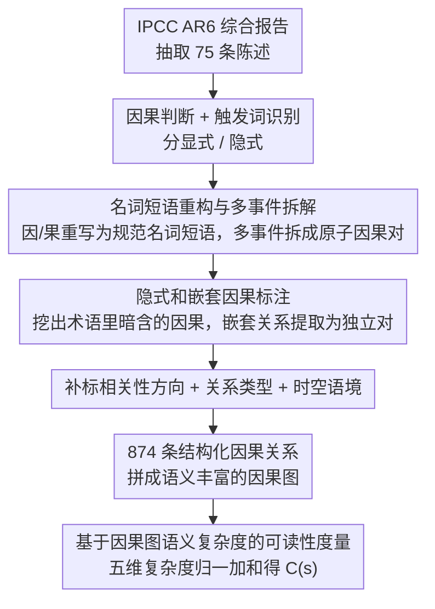

# ClimateCause: Complex and Implicit Causal Structures in Climate Reports

**会议**: ACL 2026 Findings  
**arXiv**: [2604.14856](https://arxiv.org/abs/2604.14856)  
**代码**: [GitHub](https://github.com/laallein/ClimateCause)  
**领域**: 因果推理 / 数据集  
**关键词**: 因果发现, 气候变化, 隐式因果, 嵌套因果, IPCC报告

## 一句话总结
ClimateCause 构建了首个针对气候报告中复杂和隐式因果结构的专家标注数据集（874 条因果关系），支持嵌套因果、多事件拆解、相关性方向和时空语境标注，并提出基于因果图语义复杂度的可读性度量，LLM 基准测试显示因果链推理仍是重要挑战。

## 研究背景与动机

**领域现状**：文本因果发现数据集（如 BioCause、BECauSE、CNC）主要来自新闻和社交媒体，以显式、直接的因果关系为主。现有数据集缺乏对隐式因果（通过语义推断而非显式触发词）、嵌套因果（因果关系嵌入另一个因/果中）和多事件拆解的标注。

**现有痛点**：气候变化领域的因果关系天然复杂——因果网络多层嵌套、受时空语境限制、存在不确定性和混杂因素。但现有数据集无法表达这种复杂性，特别是像 CO2-FFI（化石燃料燃烧和工业过程导致的二氧化碳排放）这样的缩写中嵌套了多重因果关系。

**核心矛盾**：科学报告的因果结构复杂度远超现有 NLP 资源的表达能力，导致 LLM 在因果推理任务上的评估不充分。

**本文目标**：构建覆盖隐式、嵌套和复杂因果结构的高质量标注数据集，并探索其在可读性度量和 LLM 因果推理基准测试中的应用。

**切入角度**：从 IPCC 第六次评估报告中提取陈述，由语言学和论辩学专家标注因果关系。

**核心 idea**：名词短语重构 + 多事件拆解 + 嵌套因果和时空语境标注 → 构建语义丰富的因果图。

## 方法详解

### 整体框架

ClimateCause 是一套围绕"如何把气候科学报告里那些缠绕的因果关系标准化地标出来"的标注方法学。从 IPCC AR6 综合报告里抽出 75 条陈述，两名语言学／论辩学专家按详细指南逐条加工：先判断有没有因果、识别触发词并分显式／隐式，再把因和果都重构成规范名词短语、对含多事件的部分做拆解、标出嵌套结构，最后补上相关性方向、关系类型和时空语境。一条原始陈述经这条流水线展开后，最终产出 874 条结构化因果关系，可直接拼成语义丰富的因果图。下面三个设计分别解决"表示怎么规范""隐藏的因果怎么挖出来"和"复杂度怎么量化"。

### 关键设计

**1. 名词短语重构与多事件拆解：把因果两端化成可逐对比对的规范形式**

现有数据集往往保留原句的混合表述，导致因果图里的事件无法精确匹配、也没法逐对验证。本文要求把每个因和果都重写成名词短语，例如"Unsustainable agricultural expansion increases ecosystem vulnerability"被拆成 cause: unsustainable agricultural expansion、effect: increased ecosystem vulnerability。当一端裹着多个事件时（如"damages in terrestrial, freshwater, cryospheric ecosystems"），进一步拆成多条独立因果对，并用 Belongs_to 和 Combined 两个字段区分"只是举例并列"还是"联合共同作用"。这样每条关系都成了原子化、可比对的单元，因果图的节点匹配才有可能。

**2. 隐式和嵌套因果标注：把术语里藏着的因果挖出来**

科学报告里大量因果并不靠"because"这类触发词，而是埋在术语和领域知识里，忽略它们会严重低估因果网络的真实复杂度。隐式因果如"anthropogenic greenhouse gas emissions"，没有触发词，但语义上暗含 humans → greenhouse gas emissions；嵌套因果如缩写 CO2-FFI，内部其实压着 fossil fuel combustion → CO2 emissions 和 industrial processes → CO2 emissions 两条关系。本文用 Nested 字段标记这类结构，并把嵌套出来的关系也提取为独立因果对，让原本隐藏的层级在数据集中显式可见。

**3. 基于因果图语义复杂度的可读性度量：量化一条陈述的因果认知负担**

传统可读性指标（如 Flesch Reading Ease）只看词长句长，根本测不出读懂一段因果推理要花多少脑力。本文据此提出从因果图语义结构出发的五维复杂度：共同原因／效果结构复杂度 $C^{com}$、举例展开复杂度 $C^{ex}$、嵌套因果复杂度 $C^{nest}$（带 $T_i \log T_i$ 项惩罚多层嵌套）、相关性方向复杂度 $C^{corr}$、关系类型复杂度 $C^{pol}$，各维度经 min-max 归一化后等权加和得到陈述总复杂度 $C(s)$。这一度量可用来评估 IPCC 这类报告对非专家读者的可理解程度，进而指导报告该往哪里简化。

## 实验关键数据

### 主实验

| 指标 | 数值 |
|------|------|
| 标注陈述 | 75 条（63 条含因果关系） |
| 因果关系数 | 874 条 |
| 唯一关系数 | 653 条（去量词后） |
| 唯一触发词 | 95 个 |
| 显式 vs 隐式 | 显式为主，但隐式比例显著高于现有数据集 |
| 正向 vs 负向关系 | 正向为主 |

### 消融实验

| LLM 任务 | 挑战 | 说明 |
|---------|------|------|
| 相关性推断 | 中等 | LLM 在正/负相关判断上表现尚可 |
| 因果链推理 | 困难 | 多跳因果推理是 LLM 的关键瓶颈 |

### 关键发现
- 57.33% 的陈述包含语义复杂的因果结构（$C(s)>0$），最高复杂度达 1.821
- 陈述长度与因果复杂度显著正相关（$r=0.590, p<0.01$）
- 嵌套因果关系全部为正相关，负相关仅出现在显式关系中（$\chi^2=26.53, p<0.01$）
- LLM 在因果链推理上表现远差于相关性推断，说明多跳因果推理是当前 LLM 的重要能力缺陷

## 亮点与洞察
- **因果结构的可读性度量**是一个新颖且有实用价值的思路——可以帮助 IPCC 等组织评估其报告对政策制定者的可理解性，指导报告简化
- 数据集的标注设计非常周到，特别是 Belongs_to/Combined 的区分和时空语境标注，展示了因果标注如何超越简单的 (cause, effect) 二元组
- 嵌套因果的概念可以推广到其他专业领域（如医学报告、法律文件），它们中同样充满术语级的隐式因果

## 局限与展望
- 数据集规模较小（75 条陈述、874 条因果关系），限制了 LLM 微调的可能性
- 仅来源于 IPCC AR6 综合报告，覆盖的气候主题有限
- 标注严重依赖领域知识，第一轮标注者间一致性很低（触发词识别 $\kappa=-0.075$），说明标注难度极高
- 可读性度量中各维度等权加和是简化假设，未经认知验证

## 相关工作与启发
- **vs BioCause**: 生物医学因果数据集，有跨句因果但无嵌套因果和时空语境标注
- **vs BECauSE 2.0**: 新闻源的因果数据集有触发词标注但无隐式因果
- **vs PolarIs3CAUS/PolarIs4CAUS**: 同为气候领域但来自社交媒体，规模更小，ClimateCause 来自权威科学报告

## 评分
- 新颖性: ⭐⭐⭐⭐ 隐式/嵌套因果标注和因果可读性度量都是新贡献
- 实验充分度: ⭐⭐⭐ 数据集分析充分但规模小，LLM 基准测试较初步
- 写作质量: ⭐⭐⭐⭐ 标注设计描述清晰详细，但可读性度量部分符号较重

<!-- RELATED:START -->

## 相关论文

- [\[ICML 2026\] Controllable Generative Sandbox for Causal Inference](../../ICML2026/causal_inference/controllable_generative_sandbox_for_causal_inference.md)
- [\[CVPR 2026\] A Polynomial Chaos Framework for Causal Discovery in Nonlinear Uncertain Systems](../../CVPR2026/causal_inference/a_polynomial_chaos_framework_for_causal_discovery_in_nonlinear_uncertain_systems.md)
- [\[ICML 2026\] Evaluating Bivariate Causal Statements Based on Mutual Compatibility](../../ICML2026/causal_inference/evaluating_bivariate_causal_statements_based_on_mutual_compatibility.md)
- [\[AAAI 2026\] I-CAM-UV: Integrating Causal Graphs over Non-Identical Variable Sets Using Causal Additive Models with Unobserved Variables](../../AAAI2026/causal_inference/i-cam-uv_integrating_causal_graphs_over_non-identical_variable_sets_using_causal.md)
- [\[AAAI 2026\] CaDyT: Causal Structure Learning for Dynamical Systems with Theoretical Score Analysis](../../AAAI2026/causal_inference/causal_structure_learning_for_dynamical_systems_with_theoretical_score_analysis.md)

<!-- RELATED:END -->
