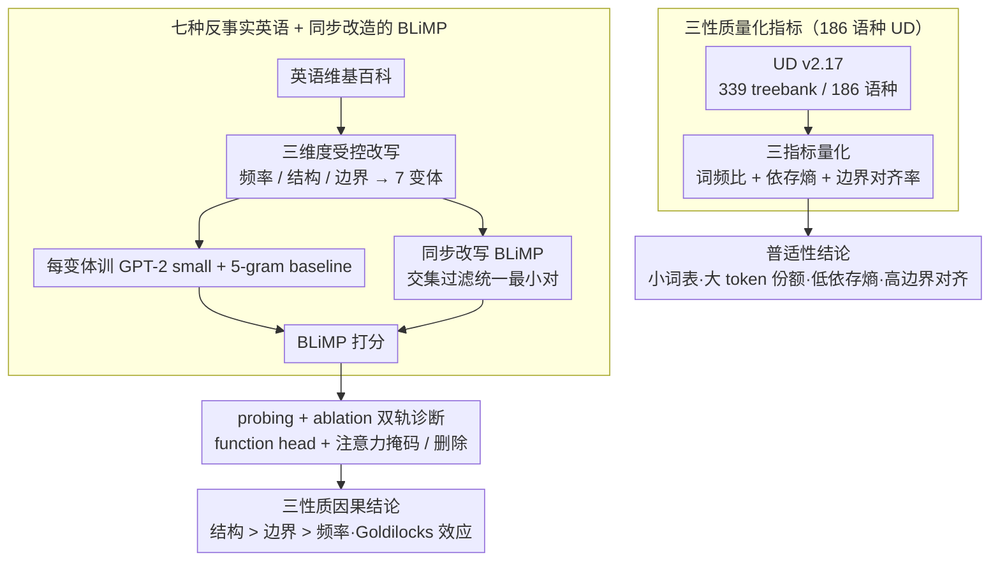

# Function Words as Statistical Cues for Language Learning

**会议**: ACL 2026  
**arXiv**: [2601.21191](https://arxiv.org/abs/2601.21191)  
**代码**: <https://github.com/picol-georgetown/function_word>  
**领域**: 语言学 / 认知 / 计算语言习得  
**关键词**: 功能词、统计学习、反事实语言、BLiMP、Goldilocks 效应

## 一句话总结
作者一边用 186 种语言的 Universal Dependencies 语料证明"功能词高频 + 句法可预测 + 短语边界对齐"这三条分布性质是跨语种普适的，另一边在英语上构造 7 个反事实变体训练 GPT-2 small，证明 transformer 学习者只有在三条性质同时满足时学得最好，并发现一个 Goldilocks 效应——功能词必须既够高频又够多样才能既可靠又有区分度。

## 研究背景与动机
**领域现状**：语言习得领域有一个长久谜题——人类（以及神经网络）究竟靠什么把线性输入抽象成层次化的语法知识？过去四十年的实验心理学和认知科学反复指出，**功能词**（determiners、auxiliaries、prepositions 这些封闭类）扮演了关键的"统计锚点"角色，常被归纳为三条分布性质：(i) 高词频；(ii) 与特定句法结构可靠绑定；(iii) 系统性地落在短语边界上。代表性假说包括 Anchoring Hypothesis（Valian & Coulson 1988）和 Marker Hypothesis（Green 1979）。

**现有痛点**：① 实证证据几乎全来自英语或屈指可数的几种语言；linguists 在数千种语言上做了描述性分析（WALS），但没人在大规模多语料上做统计验证。② 这些性质的因果作用大多在简化的人造语言里被分别检验，没人系统比较过在真实自然语言尺度上"每条性质各贡献多少"以及"破坏其中之一会发生什么"。③ 还不知道这些性质对模型的影响是只在习得阶段（learning），还是会延续到推理阶段（processing）。

**核心矛盾**：如果功能词的分布特征真是普适的语法学习线索，那么 (a) 它们在 186 种语言里都该成立、(b) 在真实自然语言上系统破坏它们应当显著降低神经模型的句法泛化、(c) 模型应当在推理时真的"用"这些特征。这三个层级目前都没被联合检验过。

**本文目标**：把这三层问题打包回答 —— (RQ1) 三条性质是否真普适；(RQ2.1) 在自然语言尺度上人造语言的结论是否还成立、(RQ2.2) 各性质各贡献多少；(RQ3) 模型是否在 processing 时真的依赖功能词。

**切入角度**：使用 Universal Dependencies (UD) v2.17 的 339 个 treebank 覆盖 186 种语言做统计检验；用 counterfactual language modeling —— 把英语维基百科按目标性质做受控修改，训练 GPT-2 small + 5-gram baseline，让"破坏哪条性质"成为独立变量。

**核心 idea**：把"功能词三条性质"当作可被独立 ablation 的统计变量，用 transformer 这种弱 inductive bias 的通用学习器作为放大镜，把"何种统计规律支持语法学习"做成可控实验。

## 方法详解

### 整体框架
论文分两段：第一段做 cross-linguistic corpus analysis —— 对 UD 里每种语言计算功能词与内容词的 type/token 比、依存熵、短语边界对齐率，画 3 张分布图证明三性质的普适性。第二段做 counterfactual language modeling —— 在英语维基百科上构造 7 种变体语料（NoFunction / FiveFunction / MoreFunction / BigramDep / RandomDep / WithinBoundary / NaturalFunction），每种变体训练独立 GPT-2 small（vocab 32k、10 epoch、3 seeds），同时配 5-gram baseline；评测用经过同步修改的 BLiMP 最小对集合，并在最后做 attention probing + function-word ablation 两组诊断实验。

### 关键设计

**1. 186 语种 UD 上的三性质量化指标：把"高频 / 句法可预测 / 边界对齐"三句定性描述各自变成一个能跨语种比较的数字**

以前 typology 只能定性地说功能词"频繁、可预测、落在边界上"，无法在百量级语种上一锤定音。本文把三条性质各自做成可计算的指标。**高频**用 type ratio $\frac{|V_c|}{|V|}$ 和 token frequency ratio $\frac{\sum_{w\in V_c}\text{count}(w)}{\sum_{w\in V}\text{count}(w)}$ 一起刻画：若某类词均匀分布，两者相等（点落在对角线上），而实测功能词的点远在对角线上方——词表很小却吃掉很大一块 token 份额。**句法可预测性**把依存树当无向图，对每个 POS 节点 $y$ 算其邻居 POS 的条件熵 $H(X\mid Y=y)=-\sum_{x\in T} p(x\mid y)\log_2 p(x\mid y)$，再对功能词集 $\mathcal{F}$ 取频率加权平均 $H_F=\sum_{f\in \mathcal{F}}\text{Freq}(f)H(X\mid Y=f) / \sum \text{Freq}(f)$，结果 $H_F$ 几乎在所有语种里都显著低于内容词的 $H_C$。

**边界对齐**用依存子树的左右端近似 constituent 边界，对 ADP/DET/SCONJ/CCONJ 这些可靠 marker 统计"出现在子树两端"的比例；186 语种里这个比例的中位数高达 **0.95**（韩语最低也有 0.55），而内容词中位数只有 0.58。三个指标一起把"普适性"从描述性断言变成了可在大规模语料上被验证的数字。

**2. 七种反事实英语 + 同步改造的 BLiMP：把"语料修改"做成一组干净的析因实验，让频率、结构、边界能被单独和联合 ablation**

人造语言里这三条性质只能被分别检验，没人在真实自然语言尺度上比过"破坏哪一条伤害最大"。本文沿三个维度受控改写英语维基百科。**频率维度**三档：STANDARDFUNCTION（116 类自然英语功能词）、FIVEFUNCTION（每个句法类压成 1 个 type、共 5 个 type，把频率拉到极高）、MOREFUNCTION（每个功能词用 Wuggy 扩成 10 个伪词，inventory 涨到 1.2k）、外加 NOFUNCTION（全删）。**结构维度**三档：PHRASEDEPENDENCY（自然基线）、BIGRAMDEP（功能词改由下一个词决定）、RANDOMDEP（保持位置但 shuffle 身份）。**边界维度**两档：ATBOUNDARY（自然基线）和 WITHINBOUNDARY（把功能词从短语边界挪到紧贴其句法 head 的位置，破坏 55% 功能词位置、覆盖 99% 句子）。

光改训练语料还不够——变体语料训练出的模型该怎么公平打分是个根本难题，本文的解法是让评测端的 BLiMP 跟着同样规则改写：去掉关键词本身是功能词的 categories（如 Det-N agreement），去掉变换后塌成同句的最小对，再做交集过滤——一个最小对只要在任一条件下被移除，就在所有条件里都移除，保证每个模型都在**完全相同**的最小对集合上受测。这套同步改造让"频率 vs 结构 vs 边界"成了三个可独立拨动的开关。

**3. attention probing + function-word ablation 的双轨诊断：把"语料修改影响了学习"延伸到"模型推理时是否真的在用功能词"**

只看 BLiMP 分数，最多证明改语料会改学习效果，看不出模型内部到底发生了什么。本文加两组诊断把"学习"和"使用"的链路打通。**probing** 沿用 Aoyama & Wilcox 2025 的做法，对每个 head $(h,l)$ 定义 $f_{h,l}(x_i)=\arg\max_{j\neq i} a_{ij}^{(h,l)}$（这个词的最大注意力指向谁），统计该 head 把注意力指向功能词的频率 $S_F(h,l)$，从而找出对每个 BLiMP 子类贡献最大的"function head"，用来看三性质完整时是否真的长出了集中、专门的 function-word head。**ablation** 则分两式：function-word masking 在评测时阻断功能词 token 的双向注意力，把它们变成 content-free 占位符；function-word deletion 直接在 NoFunction 改造过的 BLiMP 上评测。两式都是问同一个问题——模型在推理时到底有多依赖功能词。有了这两轨，结论就从"语料级因果"落到了"模型级机制"。

### 损失函数 / 训练策略
每个变体训练 GPT-2 small（BPE 词表 32,768、context 128、batch 128、10 epoch、lr 5e-4、linear warmup 10%、AdamW、weight decay 0.1、Tesla V100），3 个随机 seeds（42/53/67）取平均。每种变体配一个独立训练的 tokenizer 以适配词表变化；5-gram baseline 用 KenLM + Kneser-Ney smoothing。不使用 perplexity 评测（变体改变了熵），统一用 BLiMP accuracy + linear mixed-effects 显著性检验（`acc ~ condition + (1|category:phenomenon) + (1|seed)`）。

## 实验关键数据

### 主实验

| 条件 | Transformer 整体 | $\Delta$ vs Natural | 5-gram 整体 | 关键观察 |
|------|----------------|---------------------|-------------|----------|
| NATURALFUNCTION | **72.7** | — | 55.5 | 自然英语最优 |
| NOFUNCTION | 60.7 | **-12.0** | 54.1 | 删功能词损失最惨 |
| FIVEFUNCTION | 70.9 | -1.8 (p=0.08) | 55.4 | 仅边缘显著 |
| MOREFUNCTION | 69.7 | -3.0 | 52.8 | 多样性过头反伤 |
| BIGRAMDEP | 67.4 | -5.3 | **56.1** | 5-gram 在此反超自然条件 |
| RANDOMDEP | 67.0 | -5.7 | 53.4 | 结构 shuffle 后明显掉 |
| WITHINBOUNDARY | 69.7 | -3.0 | 54.5 | 破坏边界仅小幅掉 |

关键观察：所有破坏条件均显著负效应（$p<0.05$）（FIVEFUNCTION 仅边缘 $p=0.08$）；**破坏结构关联（BigramDep/RandomDep）比破坏边界对齐（WithinBoundary）伤害更大**。

### 消融 / 诊断实验

| 条件 | Function Head 熵均值 (bits) | std |
|------|----------------------------|-----|
| NATURALFUNCTION | **2.74** | 0.861 |
| FIVEFUNCTION | 2.87 | 0.924 |
| MOREFUNCTION | 3.53 | 0.263 |
| BIGRAMDEP | 3.60 | 0.257 |
| RANDOMDEP | 3.64 | 0.156 |
| WITHINBOUNDARY | 4.02 | 0.463 |

Natural 条件的 function-head 注意力高度集中在 Layer 3-4 的少数 head（熵最低），破坏任意一条性质都把这种"专用 head"打散。Function word deletion 实验里 Natural 条件的 BLiMP 下降最大（说明它最依赖功能词），BigramDep/RandomDep 下降最小（说明它们本就不依赖）。

### 关键发现
- **Goldilocks 效应**：把 116 个功能词压成 5 个高频 type（FiveFunction）和扩成 1.2k 个 pseudo type（MoreFunction）都不如自然基线 —— 高频还得搭配足够多样性，太集中失去对结构的区分度，太分散失去高频性。
- **结构关联 > 边界对齐 > 频率**：在三性质里破坏 structural association（BigramDep/RandomDep -5.3/-5.7）的代价显著大于破坏 boundary alignment（-3.0），说明 labeling 信息比 segmentation 信息对功能词更核心；segmentation 可以从 transition probability 等其他统计源被部分恢复。
- **186 语种普适**：功能词在所有语种里都是"小词表 + 大 token 份额 + 低依存熵 + 高边界对齐率"，这把心理语言学几十年来基于英语的归纳推到了真正的跨语种验证层面。
- **5-gram 反例**：5-gram 在 BigramDep 上反而比 Natural 高（56.1 vs 55.5），但 transformer 在 Natural 上明显赢；这是 transformer 真正抓住了结构关联而非线性局部统计的反向证据。

## 亮点与洞察
- **把语言学假说翻译成可 ablation 的训练实验**：心理语言学几十年都靠人类被试的人造语言实验做"分布性质 → 学习难度"的因果链；本文用 counterfactual language modeling + transformer 学习器把同样的因果链放到了真实自然语言尺度上验证，这种方法论可以迁移到任何"语料里某个分布特征是否真的导致某种习得"的问题（如形态学、声调、句法层级）。
- **probing + ablation 双轨证据**：先证学习阶段功能词性质塑造模型，再证推理阶段模型真的依赖这些性质，把"语料级因果"和"模型级机制"打通成一条闭环。
- **跨语种 + 计算"两段式"叙述**：UD 186 语种的描述性结果让结论具备 typological 力度；counterfactual modeling 让结论具备机制力度。两段拼起来是任何"语言普适性"主张应该走的范式。
- **Goldilocks 效应有跨任务普适性**：把"高频"和"多样性"看成 trade-off 的二元，这种现象在 vocab 设计、tokenizer 选择、prompt 词选取上都可能复现 —— 比如系统提示如果用极少数高频锚词（FiveFunction 风格）反而可能丢掉区分度。

## 局限与展望
- 反事实建模只在英语上做：因为 WithinBoundary 操作要靠精确的依存解析（Stanza），又要靠 BLiMP 这种语法 minimal pair benchmark，目前只英语同时满足；其他语言的因果实验未做。
- 功能词只考虑词级封闭类，未涉及形态层面的"功能性后缀"（如土耳其语黏着语形态）；UD 没有标注 morphology 也限制了这一扩展。
- 训练语料用 Wikipedia 而非儿童导向语料（CDS），缺少韵律线索（stress/rhythm）；作者承认 prosody 这条心理语言学经典维度未触及。
- MoreFunction 的伪词随机扩展不能保证伪词与上下文的自然搭配，结果可能含一定噪声。
- 用 BLiMP 评测语法能力本身有局限——5-gram 都能达到 above-chance；BLiMP 分高不一定等价于人类风格的语法知识。

## 相关工作与启发
- **vs Valian & Coulson 1988 / Green 1979**：心理语言学经典原型实验，只在小规模人造语言 + 人类被试上做；本文把同样的范式放大到自然语言 + 神经学习器，结论一致并细化（结构关联 > 频率）。
- **vs Kallini et al. 2024（Mission: Impossible Language Models）**：他们也用"语料反事实修改"测 LM 的归纳偏置，本文聚焦"功能词三性质"细分，更针对一类典型假说。
- **vs Mintz 2003（Frequent Frames）**：那篇提出 frequent frames 支持语法范畴学习；本文进一步把 frame 现象拆解到"频率/结构/边界"三层，并在 transformer 上重做。
- **vs BLiMP 原作（Warstadt et al. 2020）**：本文同步改造 BLiMP，并实施严格的"交集过滤"，把它从单一英语评测扩展为支持反事实语言的统一测试床，这套改造方法对后续做反事实语言研究的人非常友好。

## 评分
- 新颖性: ⭐⭐⭐⭐ 反事实 LM + 186 语种统计 + probing/ablation 双诊断的组合很完整
- 实验充分度: ⭐⭐⭐⭐⭐ 7 主条件 + 3 seed + 5-gram baseline + 交互条件 + 人 head probing + 双 ablation
- 写作质量: ⭐⭐⭐⭐⭐ 三性质叙事链清晰，limitation 与 discussion 都极其诚实
- 价值: ⭐⭐⭐⭐ 跨认知科学与计算语言学，给"为什么 Zipfian + 功能词"的老问题一个机器学习时代的明确答复

<!-- RELATED:START -->

## 相关论文

- [\[ICLR 2026\] Function Induction and Task Generalization: An Interpretability Study with Off-by-One Addition](../../ICLR2026/causal_inference/function_induction_and_task_generalization_an_interpretability_study_with_off-by.md)
- [\[ECCV 2024\] Learning Chain of Counterfactual Thought for Bias-Robust Vision-Language Reasoning](../../ECCV2024/causal_inference/learning_chain_of_counterfactual_thought_for_bias-robust_vision-language_reasoni.md)
- [\[ACL 2026\] Learning Invariant Modality Representation for Robust Multimodal Learning from a Causal Inference Perspective](learning_invariant_modality_representation_for_robust_multimodal_learning_from_a.md)
- [\[ACL 2026\] Evaluating Counterfactual Strategic Reasoning in Large Language Models](evaluating_counterfactual_strategic_reasoning_in_large_language_models.md)
- [\[ICML 2025\] Isolated Causal Effects of Natural Language](../../ICML2025/causal_inference/isolated_causal_effects_of_natural_language.md)

<!-- RELATED:END -->
