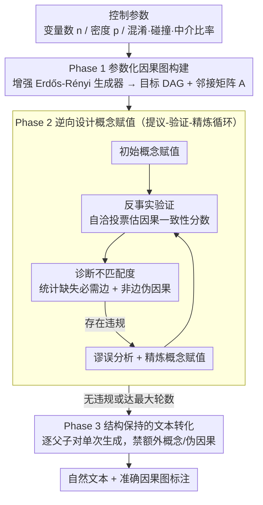

# iTAG: Inverse Design for Natural Text Generation with Accurate Causal Graph Annotations

**会议**: ACL 2026  
**arXiv**: [2604.06902](https://arxiv.org/abs/2604.06902)  
**代码**: 有  
**领域**: 因果推断 / 文本生成  
**关键词**: 因果图标注, 逆向设计, 文本生成, 基准数据, CoT推理

## 一句话总结
提出 iTAG 框架，通过逆向设计的三阶段流程（参数化因果图构建→基于 CoT 的概念赋值→结构保持的文本生成）生成同时具有极高因果图标注准确率和文本自然度的数据，可作为真实标注数据的实用替代品进行文本因果发现算法基准测试。

## 研究背景与动机

**领域现状**：因果发现研究严重缺乏因果标注的文本数据作为基准真值，高昂的人工标注成本是根本障碍。现有方法分两类：模板方法和 LLM 直接生成方法。

**现有痛点**：(1) 模板方法（如"[A] results in [B]"）可保证标注准确但文本极不自然；(2) LLM 直接生成方法文本自然但不验证生成概念是否符合目标因果关系，导致标注准确率不稳定（随图规模增大 F1 从 ~0.78 降至 ~0.52）。

**核心矛盾**：文本自然度与因果图标注准确率之间存在权衡困境——现有方法无法同时满足两者，因此无法作为真实标注数据的可信替代。

**本文目标**：生成同时满足三个条件的文本数据：(1) 因果图标注准确，(2) 文本自然不可区分，(3) 可用于实际的因果发现算法评估。

**切入角度**：将概念赋值视为逆向设计问题——以因果图为目标，通过 CoT 推理迭代检查和精炼概念选择，使概念间的诱导关系与目标因果关系一致。

**核心 idea**：在 LLM 生成文本之前增加"逆向设计概念赋值"步骤，用 CoT 引导的提议-验证-精炼循环确保概念间的因果关系与目标图一致。

## 方法详解

### 整体框架
iTAG 是一条免训练的三阶段逆向设计流水线，直接用 LLM API（默认 Claude Opus）作为推理引擎，把「想要的因果图」翻译成「读起来自然、标注又准的文本」。流程从控制参数出发：Phase 1 先生成一张参数化的因果 DAG（有向无环图）及其邻接矩阵作为目标真值；Phase 2 是全篇核心，把图上的抽象节点逐一替换成真实世界概念，并通过反事实验证保证概念之间诱导出的因果关系与目标图一致；Phase 3 再把带概念的因果图编织成流畅文本。与「先让 LLM 写文本、再被动接受其因果结构」的正向思路相反，iTAG 把因果图当成预先固定的设计目标，让概念赋值反过来去逼近它，从而在源头上消除遗漏与幻觉。

### 关键设计

**1. Phase 1 参数化因果图构建：把结构复杂度变成一组可调旋钮**

要做系统化基准测试，就得能精确控制图的难度。iTAG 用增强版 Erdős-Rényi DAG 生成器，把变量数 $n$、密度 $p$、度数限制、混淆子比率 $\gamma_c$、碰撞子比率 $\gamma_v$、中介链数 $\lambda$ 等都开放为输入参数，输出对应的 DAG 与邻接矩阵 $A$。由此可以显式地铺出从稀疏到稠密、从简单链到含混淆/碰撞结构的成套图，为后续准确率与可迁移性评估提供受控的难度梯度。

**2. Phase 2 逆向设计概念赋值：用提议-验证-精炼循环把全图结构约束注入生成过程**

这是全篇核心。现有 LLM 生成方法缺少全图级的硬约束，规模一大就开始遗漏必需边、又在不该有因果的地方凭空断言关系。iTAG 把概念赋值显式建模成逆向问题——以目标图 $A$ 为期望输出、以概念赋值 $C$ 为设计变量，用 Algorithm 1 的迭代循环去逼近：初始概念赋值 $C^{(0)}$ 后，反事实验证（CounterfactualVerification）通过自洽性投票为每对概念估计因果一致性分数 $s_{ij}\in[0,1]$，再据此算出诊断性不匹配度 $\hat{\mathcal{L}}(C;A)$，它同时统计「缺失必需边」（$\ell^{\text{miss}}_{ij}=1-s_{ij}$）和「非边上伪因果」（$\ell^{\text{spur}}_{ij}=s_{ij}$）两类错误；谬误分析（FallacyAnalysis）对 $s_{ij}$ 设阈值得到违规集合，精炼概念赋值（RefineConceptAssignment）针对性地替换概念并记录历史最优 $C^{\star}$，循环往复直到违规集合为空或触及最大轮数 $K_{\max}$。为减少循环论证，验证器骨干默认与提议/精炼器分离。这套纠错机制让概念赋值阶段中位仅 1.63 轮就收敛，成功率高达 99.1%。

**3. Phase 3 结构保持的文本转化：在已净化的概念上做单次生成**

由于 Phase 2 已经保证概念清晰、互不重叠，文本化阶段几乎不再需要纠结结构。iTAG 枚举每个父子节点对，提示 LLM 把它们编织成流畅文本，同时明令禁止引入额外概念、禁止在非边对上断言因果关系。这里采用单次生成而非再套一层逆向设计循环——消融实验显示在文本阶段再加循环只带来边际收益却显著抬高成本，因此把验证压力集中在概念层、把文本层做轻是更划算的分工。

## 实验关键数据

### 主实验
标注准确率（Experiment 1, n=3-10）：

| 方法 | F1_Ga (↑) | SHD (↓) | SID (↓) | 自然度 F1_D (↓) |
|------|----------|---------|---------|---------------|
| Template-based | 1.00（完美） | 0 | 0 | 0.81-0.99（极易检测）|
| LLM-dependent | 0.78→0.52 | 高 | 高 | 0.57-0.64 |
| LLM-dep+CA | 优于基线 | 中 | 中 | 0.54-0.60 |
| **iTAG** | **≥0.95** | **~1边** | **<1** | **0.51-0.57（近随机）**|

### 可迁移性实验

| 指标 | Pearson $r$ | Spearman $\rho$ | $R^2$ |
|------|-----------|----------------|-------|
| F1_G | 0.928 | 0.926 | 0.861 |
| SHD | 0.927 | 0.921 | 0.859 |
| SID | 0.921 | 0.928 | 0.848 |

### 关键发现
- iTAG 是唯一同时满足高标注准确率（F1≥0.95）和高自然度（接近随机猜测的检测率）的方法
- 在 n=3-10 范围内标注准确率保持稳定，而 LLM 基线随图规模增大严重退化
- 生成语料上的因果发现算法评估与真实语料上的评估高度相关（Pearson r≥0.921, p<0.001），中心化后仍然显著
- Phase 2 概念赋值是关键贡献：消融显示一次性概念赋值改善有限，仅生成时逆向设计收益边际

## 亮点与洞察
- 将概念赋值建模为逆向设计问题是巧妙的创新——用已知的因果图作为目标"逆向"搜索合适的概念，而非"正向"从概念生成可能不一致的图
- 同时达到高准确率和高自然度打破了现有方法的权衡困境，方法论上具有示范意义
- 可迁移性验证（中心化消除 n 的混淆效应后仍显著相关）为替代数据的有效性提供了严格的统计支持

## 局限与展望
- 仅支持邻接级因果图（边的有无），不支持结构方程模型（效应大小/函数形式）
- 验证范围限于小图（3-10 变量）和三个英文领域
- 非边验证本质上比正边验证困难，可能存在残余误差
- 未来可扩展到更大/层次化图、多语言、以及带效应参数的 SEM 标注

## 相关工作与启发
- **vs Template-based**: 模板完美准确但极不自然（检测率 0.81-0.99），iTAG 在保持准确的同时实现自然
- **vs LLM-dependent (Phatak等)**: 直接 LLM 生成自然但不验证因果一致性，iTAG 通过逆向设计验证解决
- **vs Gandee et al. (faithful generation)**: 他们也指出 LLM 生成可能遗漏/幻觉因果关系，iTAG 从概念层面源头解决

## 评分
- 新颖性: ⭐⭐⭐⭐⭐ 逆向设计+CoT 概念赋值的方法论创新性强
- 实验充分度: ⭐⭐⭐⭐⭐ 三个实验（准确率/自然度/可迁移性）覆盖三个评估需求，统计严谨
- 写作质量: ⭐⭐⭐⭐⭐ 问题定义清晰，三个 desiderata 逻辑推进，限制性讨论诚实透彻
- 价值: ⭐⭐⭐⭐⭐ 为文本因果发现领域提供了重要的基准工具

<!-- RELATED:START -->

## 相关论文

- [\[ICML 2025\] Isolated Causal Effects of Natural Language](../../ICML2025/causal_inference/isolated_causal_effects_of_natural_language.md)
- [\[ACL 2025\] Causal Graph based Event Reasoning using Semantic Relation Experts](../../ACL2025/causal_inference/causal_graph_based_event_reasoning_using_semantic_relation_experts.md)
- [\[ACL 2026\] Parallel Universes, Parallel Languages: A Comprehensive Study on LLM-based Multilingual Counterfactual Example Generation](parallel_universes_parallel_languages_a_comprehensive_study_on_llm-based_multili.md)
- [\[ACL 2025\] CausalRAG: Integrating Causal Graphs into Retrieval-Augmented Generation](../../ACL2025/causal_inference/causalrag_integrating_causal_graphs_into_retrieval-augmented_generation.md)
- [\[ACL 2026\] ClimateCause: Complex and Implicit Causal Structures in Climate Reports](climatecause_complex_and_implicit_causal_structures_in_climate_reports.md)

<!-- RELATED:END -->
