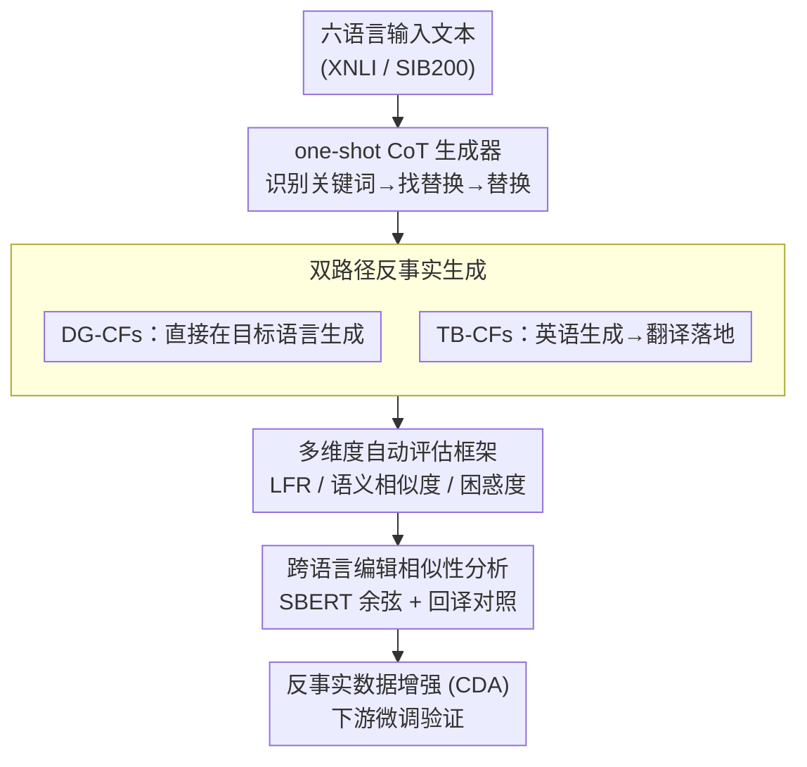

# Parallel Universes, Parallel Languages: A Comprehensive Study on LLM-based Multilingual Counterfactual Example Generation

**会议**: ACL 2026  
**arXiv**: [2601.00263](https://arxiv.org/abs/2601.00263)  
**代码**: [GitHub](https://github.com/qiaw99/multicfe)  
**领域**: 因果推理  
**关键词**: 多语言反事实生成, 反事实解释, 数据增强, 跨语言一致性, LLM多语言能力

## 一句话总结

本文系统研究了 LLM 在六种语言上的多语言反事实样本生成能力，通过直接生成和翻译两种路径对比，发现翻译路径的标签翻转率更高但需要更多编辑，识别出四类常见错误模式，并验证多语言反事实数据增强优于跨语言增强，尤其对低资源语言更有效。

## 研究背景与动机

**领域现状**：反事实样本（counterfactual examples）是指对输入进行最小编辑使模型预测发生改变的样本，是解释模型行为的有效手段。现有反事实生成方法（如 MICE、Polyjuice、ZeroCF 等）几乎全部在英语数据上评估。

**现有痛点**：LLM 展现了强大的多语言能力，但其在非英语语言上生成高质量反事实的有效性尚不清楚。跨语言分析已揭示英语和非英语之间存在系统性的行为差异，仅靠英语反事实不足以捕捉模型行为的全貌。

**核心矛盾**：LLM 的多语言能力与其反事实生成能力之间的关系未被系统研究——高资源语言和低资源语言在反事实质量上差距多大？翻译路径和直接生成路径哪个更优？

**本文目标**：(1) 评估 LLM 在六种语言上直接生成和翻译生成反事实的质量；(2) 分析跨语言编辑的相似性；(3) 识别多语言反事实的错误类型；(4) 评估多语言反事实数据增强的效果。

**切入角度**：选择六种语言（英语、阿拉伯语、德语、西班牙语、印地语、斯瓦希里语），覆盖高资源到低资源、多种文字系统，使用三个不同规模的 LLM（Qwen2.5-7B、Gemma3-27B、Llama3.3-70B），在两个多语言数据集（XNLI、SIB200）上进行全面评估。

**核心 idea**：通过系统对比直接生成和翻译生成两条路径，揭示 LLM 多语言反事实生成的能力边界、错误模式和数据增强效果，为多语言可解释性研究提供实证基础。

## 方法详解

### 整体框架

本文不提出新模型，而是搭建一套系统的实证流水线：以一个固定的 one-shot Chain-of-Thought 反事实生成器为基座（先识别输入中影响预测的关键词，再找到能把标签导向目标类别的替换词，最后替换生成反事实），在此之上分叉出两条获取多语言反事实的路径——直接在目标语言上生成（DG-CFs）与先在英语生成再翻译落地（TB-CFs）。生成的反事实经过有效性/相似度/流畅度三个维度的自动评估和跨语言编辑相似性分析，最终用于反事实数据增强（CDA）下游验证，从而把"LLM 多语言反事实能力"这个问题拆成质量、模式、增益三层逐一回答。

### 关键设计

**1. 双路径反事实生成：用同一基座对比"直接生成"与"翻译落地"两种多语言策略**

多语言反事实有两种自然的获取方式，本文让二者共用同一个 one-shot CoT 生成器以保证可比。DG-CFs 直接在目标语言上跑完"识别关键词 → 找替换 → 替换生成"三步；TB-CFs 则先在 LLM 最擅长的英语上生成反事实，再用同一个 LLM 翻译到目标语言。两条路径全程统一使用英语提示（English prompts），把语言变量隔离在生成内容本身而非指令上。这样设计是因为 LLM 在英语上的反事实质量通常最高，翻译路径有机会把这种优势"借"给其他语言，但同时也会引入翻译噪声——二者孰优正是要量化的核心权衡。

**2. 多维度自动评估框架：用三个互补指标衡量有效性、最小编辑性与自然度的平衡**

单一指标无法刻画反事实的好坏，因此本文同时报告三个维度。有效性用标签翻转率 Label Flip Rate 衡量，即反事实样本中成功改变模型预测的比例 $LFR = \frac{1}{N}\sum_{i=1}^{N}\mathbb{1}(\mathcal{M}(\tilde{x}_i) \neq \mathcal{M}(x_i))$；最小编辑性用多语言 SBERT 计算原句与反事实的语义相似度 Textual Similarity；自然度用 mGPT-1.3B 的困惑度 Perplexity 评估。三者共同约束了一个好的反事实应当"翻得动标签、改得尽量少、读起来自然"，也正是靠这一组指标才发现了翻译路径"LFR 更高但相似度更低、困惑度更高"的反直觉现象。

**3. 跨语言编辑相似性分析：量化不同语言是否遵循一致的扰动策略**

为了判断 LLM 在不同语言上是否采用类似的编辑模式，本文用多语言 SBERT 计算各语言反事实之间的成对余弦相似度。但直接比较会被语言本身的表层差异污染，因此还额外把非英语反事实回译成英语再计算一次相似度，剥离语言外壳、只看编辑语义。这一对照让"欧洲语言编辑高度相似、阿拉伯语和斯瓦希里语显著不同"的结论得以站得住脚，也揭示了跨语言扰动是否存在共性原则。

### 损失函数 / 训练策略

反事实生成本身不涉及训练，全部由现成 LLM 零样本/少样本完成。训练只发生在下游的 CDA 验证环节：用生成的反事实增广数据后微调多语言 BERT，并刻意区分两种增强方式——跨语言 CDA 只用英语训练数据加反事实，多语言 CDA 则用全部语言的训练数据加反事实，二者之差正好测出"把反事实做成多语言"相对"只在英语上做"的额外收益。

## 实验关键数据

### 主实验

**直接生成反事实 (DG-CFs) 的标签翻转率 (LFR)**

| 模型 | 数据集 | en | ar | de | es | hi | sw |
|------|--------|----|----|----|----|----|----|
| Qwen2.5-7B | XNLI | 45.42% | 44.10% | 46.63% | 49.44% | 39.92% | 38.31% |
| Qwen2.5-7B | SIB200 | 92.16% | 89.22% | 77.45% | 72.55% | 89.71% | 84.80% |
| Llama3.3-70B | XNLI | 50.88% | 36.91% | 42.25% | 44.70% | 41.33% | 34.42% |
| Llama3.3-70B | SIB200 | 87.25% | 88.73% | 78.43% | 83.33% | 85.29% | 91.18% |

**翻译反事实 (TB-CFs) vs 直接生成：TB-CFs 在多数情况下 LFR 更高，但相似度平均低 15.44%，困惑度平均高 38%**

### 消融实验

**多语言 vs 跨语言反事实数据增强 (Qwen2.5-7B 生成)**

| 语言 | 跨语言 CDA (XNLI) | 多语言 CDA (XNLI) | 跨语言 CDA (SIB200) | 多语言 CDA (SIB200) |
|------|-------------------|-------------------|---------------------|---------------------|
| en | 69.86 (+1.16) | 73.45 (+1.23) | 82.80 (-1.00) | 85.86 (+3.03) |
| ar | 58.10 (-2.02) | 64.89 (+1.68) | 26.30 (+1.00) | 53.54 (-1.01) |
| de | 63.49 (+0.16) | 68.42 (+0.82) | 84.80 (-4.10) | 84.85 (-3.03) |
| sw | 48.92 (+0.26) | — | 63.60 (-1.00) | — |

### 关键发现

- 英语反事实整体 LFR 最高，但在流畅度和编辑量上不一定最优——"最优语言"取决于具体指标
- 欧洲语言（英/德/西）的反事实编辑模式高度相似，而阿拉伯语和斯瓦希里语的编辑模式显著不同
- 四类错误中，复制粘贴（copy-paste）最普遍（SIB200 平均 6.7%），语言混淆在低资源语言上更严重
- 多语言 CDA 整体优于跨语言 CDA，对阿拉伯语提升最明显（平均 +64.45%），但对斯瓦希里语几乎无效

## 亮点与洞察

- 首次系统评估 LLM 多语言反事实生成能力，填补了反事实解释从英语到多语言的关键空白
- 错误分类学（copy-paste、negation、inconsistency、language confusion）具有实用价值，为后续改进提供方向
- 发现"翻译路径 LFR 更高但质量更差"的有趣权衡——更高的标签翻转率并不等于更好的反事实

## 局限与展望

- 仅使用英语提示，未探索目标语言提示是否能改善效果
- 反事实生成方法较基础（one-shot CoT），更先进的方法可能表现不同
- 斯瓦希里语等低资源语言的 CDA 效果不佳，需要专门针对低资源场景的策略
- 评估仅使用自动指标，人工评估覆盖有限

## 相关工作与启发

- **vs ZeroCF/FIZLE**: 这些方法只评估英语，本文将其扩展到六种语言，揭示了多语言场景下的新挑战
- **vs 多语言 CDA (Liu et al., 2021)**: 前者关注机器翻译的 CDA，本文关注反事实解释的 CDA
- **启发**：跨语言编辑相似性分析可启发未来的多语言对齐和跨语言迁移研究

## 评分

- 新颖性: ⭐⭐⭐⭐ 首个系统性多语言反事实生成研究，视角新颖
- 实验充分度: ⭐⭐⭐⭐⭐ 三个模型×六种语言×两个数据集×多个评估维度，实验非常全面
- 写作质量: ⭐⭐⭐⭐ 结构清晰，分析深入，图表丰富
- 价值: ⭐⭐⭐⭐ 为多语言可解释性研究提供了重要的实证基础和方法论参考

<!-- RELATED:START -->

## 相关论文

- [\[ACL 2025\] FitCF: A Framework for Automatic Feature Importance-guided Counterfactual Example Generation](../../ACL2025/causal_inference/fitcf_a_framework_for_automatic_feature_importance-guided_counterfactual_example.md)
- [\[ICML 2025\] E-LDA: Toward Interpretable LDA Topic Models with Strong Guarantees in Logarithmic Parallel Time](../../ICML2025/causal_inference/e-lda_toward_interpretable_lda_topic_models_with_strong_guarantees_in_logarithmi.md)
- [\[ICLR 2026\] On the Eligibility of LLMs for Counterfactual Reasoning: A Decompositional Study](../../ICLR2026/causal_inference/on_the_eligibility_of_llms_for_counterfactual_reasoning_a_decompositional_study.md)
- [\[ACL 2026\] iTAG: Inverse Design for Natural Text Generation with Accurate Causal Graph Annotations](itag_inverse_design_for_natural_text_generation_with_accurate_causal_graph_annot.md)
- [\[ICLR 2026\] Function Induction and Task Generalization: An Interpretability Study with Off-by-One Addition](../../ICLR2026/causal_inference/function_induction_and_task_generalization_an_interpretability_study_with_off-by.md)

<!-- RELATED:END -->
