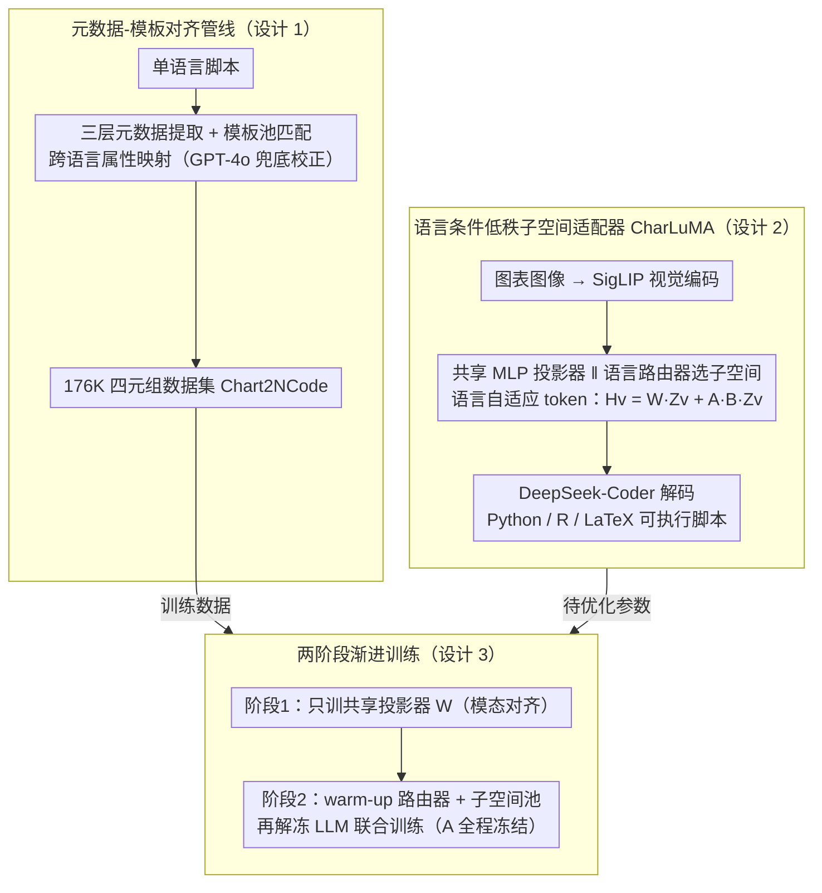

# Aligned Multi-View Scripts for Universal Chart-to-Code Generation

**会议**: ACL 2026  
**arXiv**: [2604.24559](https://arxiv.org/abs/2604.24559)  
**代码**: [GitHub](https://github.com/Zhihan72/CharLuMA)  
**领域**: 代码智能 / 多模态  
**关键词**: Chart-to-Code, 多语言对齐, LLaVA, 低秩子空间适配器, MoE 投影器

## 一句话总结
把"同一张图表用 Python / R / LaTeX 三种语言写出语义等价脚本"作为新的监督信号，构建了 176K 四元组数据集 Chart2NCode，并提出在 LLaVA 投影器上加一个"语言条件的低秩子空间路由"的轻量适配器 CharLuMA，让一个模型在三种绘图语言上都达到可执行率与视觉保真度双高的水准。

## 研究背景与动机

**领域现状**：Chart-to-code（把图表图像还原成可执行绘图脚本）能让静态图回到可编辑、可重现状态。现有工作几乎都以 Python/matplotlib 为唯一目标语言，最近一年 ChartMimic、Plot2Code、ChartCoder 等都局限单语言。

**现有痛点**：(1) 真实学术界 R (ggplot2) 和 LaTeX (TikZ) 是大量学科的出版标准，单一 Python 输出不够用；(2) 更深层地，同一张图表本可以由不同语言的等价脚本表达——这种跨语言对齐天然是一种**多视图监督信号**，但单语言数据集完全没有利用；(3) 简单地把多语言数据塞进同一个模型，要么需要为每个语言训独立专家（参数翻倍且不共享知识），要么会出现语言之间相互干扰、专项化失衡。

**核心矛盾**：模型既要"共享一份图表语义理解"，又要"按目标语言走对应的语法专门通道"——LLaVA 一个 MLP 投影器同时干两件事会冲突。

**本文目标**：(a) 提供首个跨 Python/R/LaTeX 对齐的图表-代码四元组数据集；(b) 设计参数高效的多语言适配机制，能在共享视觉理解的前提下专项化输出语法。

**切入角度**：把不同语言脚本视为同一图表语义的"互补视图"，按多视图表示学习的思路对齐它们；架构上借鉴 Mixture-of-Subspaces LoRA 的思想，用低秩子空间池 + 语言条件路由代替"独立语言专家"。

**核心 idea**：用"元数据-模板"管线合成跨语言对齐脚本，用"低秩子空间适配器 + 语言路由"在 LLaVA 投影器上轻量插入语言专门化能力。

## 方法详解

### 整体框架

本文要解决的是"一个模型同时把图表图像还原成 Python / R / LaTeX 三种语言的可执行脚本"，难点在于这三件事既共享同一份图表语义理解、又各自需要走不同语法的专门通道。方法分两条主线：数据侧用"元数据-模板"管线把单语言脚本批量合成跨语言视觉等价的三语言脚本，得到 176K 四元组数据集 Chart2NCode；模型侧在 LLaVA 风格的"SigLIP 视觉编码器 + 两层 MLP 投影器 + DeepSeek-Coder 后端"上并联一个语言条件的低秩子空间适配器 CharLuMA，让视觉 token 在共享 MLP 之外按目标语言动态选取子空间组合。整体流程是：图表图像经视觉编码后，由"共享 MLP + 语言路由的子空间适配器"产生语言自适应视觉 token，再交给 LLM 自回归解码出对应语言脚本；训练则分"模态对齐预训练"和"指令微调"两阶段渐进进行。

### 关键设计

**1. 元数据-模板对齐管线：把单语言脚本批量翻译成跨语言视觉等价的三语言脚本**

要利用"同一图表可由不同语言等价表达"这一多视图监督信号，前提是得有大规模对齐数据，而纯 LLM 翻译成本高、语义易漂移，纯规则模板又覆盖率有限，因此本文把两者结合。先用各语言原生 API 从单语言脚本中提取三层元数据——figure 级全局属性、axis 级坐标系、object 级几何与样式；再通过 object 模式（如"一组等高变宽的矩形"对应横向柱状图）匹配人工策划的模板池（202 个模板 × 20+ 图表子类型），模板内置跨语言属性映射字典（Python "upper right" ↔ R "right" ↔ LaTeX "north east"，Python bold 字重 ↔ LaTeX bfseries），保证语义在三种语法间统一对齐。模板未命中或渲染失败的样本交给 GPT-4o 做 LLM-assisted debugging 兜底，再次渲染验证，仍失败则丢弃。最终 176K 四元组中 14.7% 经 LLM 校正，1000 样本的人工四维度 1-5 评分均达 95%+ 通过率（α=0.81），兼顾了规模与保真度。

**2. 语言条件的低秩子空间适配器：在共享 MLP 之外用子空间池 + 语言路由注入语言专项能力**

如果为每种语言训独立专家会参数翻倍且不共享图表知识，而 Mixture-of-MLP 又容量浪费，本文用低秩子空间适配器以最经济的参数实现"共享核心 + 语言专项"。视觉特征 $\mathbf{Z}_v$ 先过共享投影器得到基础表示 $\mathbf{H}_{\text{base}} = \mathbf{W}\mathbf{Z}_v$；并行地用低秩矩阵 $\mathbf{A}$ 把它压到 rank-$r$ 表示，再由语言专属路由器从 $N=32$ 个子空间池里按 $y^l = \mathrm{top}_r(\mathrm{softmax}(\mathbf{W}^l \overline{\mathbf{Z}}_v))$ 选出 $r=16$ 个子空间拼成 $\mathbf{B}$，最终语言自适应视觉 token 为

$$\mathbf{H}_v = \mathbf{W}\mathbf{Z}_v + \mathbf{A}\mathbf{B}\mathbf{Z}_v$$

即共享 MLP 负责图表语义共性、子空间组合负责语言语法差异。激活分析显示 1.3B 模型只有约 5/27 个子空间被三语言共享、其余各语言独占，正好印证了"compact shared core + language-specific capacity"的设计意图。

**3. 两阶段渐进训练策略：先稳模态对齐，再稳语言路由，最后让 LLM 学会用语言自适应 token**

为避免模态对齐、路由收敛、LLM 适配三件事互相干扰，训练被拆成渐进的两阶段。阶段 1 在 900K Chart-JSON 对上只训共享投影器 $\mathbf{W}$，冻结视觉编码器和 LLM，先把模态对齐打稳。阶段 2 接入子空间适配器，先用 274 步只 warm-up 路由器 $\mathbf{W}^l$ 和子空间池 $\{b_i\}$（MLP / 视觉 / LLM 全冻，$\mathbf{A}$ 随机初始化后全程保持冻结），等路由初步收敛后再解冻 LLM 联合训练（$\mathbf{W}$ 与 $\mathbf{A}$ 仍冻）。每个 batch 强制包含全部三种语言，以持续给路由提供区分信号。$\mathbf{A}$ 全程冻结是为了把有限的适配容量逼向"语言差异"而非重复学视觉共性，warm-up 路由器则避免它还没收敛就被 LLM 的反向梯度搅乱。

### 损失函数 / 训练策略

训练目标是标准的 next-token cross-entropy，无额外辅助损失。两阶段学习率为：预训练 2e-4、路由 warm-up 2e-4、联合微调 2e-5。训练开销上，CharLuMA-1.3B 共 82 GPU 小时（8×L40S），6.7B 约 321 GPU 小时。

## 实验关键数据

### 主实验

在 Chart2NCode test set (1000 样本) 上跨三语言平均，主要指标 ER（可执行率）/ DS（DreamSim 视觉相似度）/ MJ（MLLM-as-Judge）：

| 模型 | Python ER | Python DS | R ER | R DS | LaTeX ER | LaTeX DS |
|------|----------|-----------|------|------|----------|----------|
| GPT-4o | 98.5 | 85.0 | 94.5 | 78.8 | 88.4 | 72.4 |
| Claude-Sonnet-4 | 98.3 | 86.8 | 93.9 | 82.0 | 92.7 | 76.0 |
| Qwen3-VL-8B | 91.1 | 83.7 | 73.6 | 72.7 | 77.3 | 66.8 |
| ChartCoder-7B (Python 专家) | 96.2 | 48.1 | - | - | 17.9 | 39.1 |
| InternVL3.5-8B | 82.5 | 79.6 | 67.0 | 67.6 | 81.1 | 57.1 |
| **CharLuMA-1.3B** | 94.4 | 86.5 | 94.5 | 78.9 | 84.5 | 71.3 |
| **CharLuMA-6.7B** | 98.0 | 88.7 | 96.5 | 81.8 | 89.0 | 72.5 |

6.7B 在 R 上 96.5 ER / 81.8 DS 接近 Claude-Sonnet-4；ChartCoder-7B 这类 Python 专家在 R/LaTeX 上完全崩盘（R 直接 0 可执行），凸显多语言对齐价值。

### 消融实验

**架构对比**（Chart2NCode 三语言平均）：

| 投影器架构 | 1.3B ER | 1.3B DS | 1.3B MJ | 6.7B ER | 6.7B DS | 6.7B MJ |
|----------|---------|---------|---------|---------|---------|---------|
| Linear MLP | 88.1 | 76.9 | 69.5 | 91.0 | 78.2 | 76.3 |
| Mixture-of-MLP | 87.9 | 75.1 | 68.2 | 91.9 | 77.4 | 76.8 |
| **Subspace Adapter (本文)** | **91.1** | **78.9** | **72.3** | **94.5** | **81.0** | **81.1** |

**子空间-路由配置**（1.3B）：

| 子空间总数 | 激活数 | 路由器数 | ER | DS | MJ |
|----------|-------|---------|-----|------|------|
| 16 | 8 | 3 | 88.9 | 77.6 | 70.5 |
| 32 | 16 | 1 (共享) | 86.1 | 75.1 | 67.0 |
| 32 | 32 | 0 | 85.8 | 73.2 | 66.3 |
| **32** | **16** | **3 (语言专属)** | **91.1** | **78.9** | **72.3** |
| w/o warm-up | - | - | 87.1 | 75.6 | 67.9 |
| 解冻 $\mathbf{A}$ | - | - | 90.2 | 78.0 | 70.1 |

**语言多样性**：训三语言 > 训两语言 > 训单语言，即便每张图被分到的训练量减少；不对齐源数据基线偏向 Python，验证了对齐监督的必要性。

### 关键发现
- 三语言对齐训练比单语言总训练量相同的设置在所有语言上都更好——多视图监督能跨语言增强各自表现。
- 32-16 配置 + 3 个语言专属路由是最佳点，把语言路由器换成共享路由器立刻掉 ~4 个 DS，再去掉路由器掉更多——证明路由器是关键。
- 子空间激活分析显示 1.3B 仅 19% 的激活子空间在三语言间共享（5/27），6.7B 类似（18%），说明 scale up 时容量被自动分配给"语言专项"。
- LaTeX 失败模式独特：55.5% 是语法约束（缺花括号）；Python/R 失败主因是维度不匹配和未定义变量（数据-逻辑错误）。

## 亮点与洞察
- 把"多语言绘图脚本"当作"同一图表的多视图"是一个新颖且自然的视角，相当于把跨语言代码 alignment 这种 NLP/code 经典思路搬到 chart-to-code 场景。
- 子空间适配器 + 路由的设计比 MoE-MLP 更参数经济——共享 MLP 学共性 + 子空间池学差异，强制 $\mathbf{A}$ 冻结让适配容量不"内卷"重复视觉特征。
- 元数据-模板管线给了一条"高质量多语言数据"的可重复路径，176K 已经是同类数据中最大的，且语言数量也最丰富。
- 端到端 6.7B 模型直接挑战 Claude-Sonnet-4，多语言绘图领域开源闭源差距大幅缩小。

## 局限与展望
- 模型规模上限到 6.7B，更大 LLM 后端（如 30B+）的潜力未探索。
- SigLIP 输入分辨率 384×384 是瓶颈，信息密集图（多子图、复杂热图）易丢细节，作者已点名要换高分辨率视觉适配器。
- 模板池虽 202 个但仍有限，新颖图表类型（如动态可交互图）可能模板未覆盖。
- 仅做了三种语言；扩展到 D3.js / Vega-Lite / Mermaid 等需要新模板和元数据 schema。

## 相关工作与启发
- **vs ChartCoder-7B (Zhao et al., 2025)**: ChartCoder 是 Python 专家、在 R 上 0 可执行；本文用对齐数据 + 路由实现真正的多语言通才，Python 性能可比但泛化大胜。
- **vs ChartMoE (Xu et al., 2025)**: ChartMoE 用 sparsely-gated MoE 投影器，参数大幅膨胀；本文低秩子空间适配器更紧凑且效果更好。
- **vs DaTikZ / AutomaTikZ (Belouadi et al., 2024)**: 专注 TikZ 单语言；本文把 TikZ 当作三语言之一，并通过对齐让其他语言互相 boost。

## 评分
- 新颖性: ⭐⭐⭐⭐ 多视图对齐 + 语言条件子空间路由是该领域少见的两点结合
- 实验充分度: ⭐⭐⭐⭐⭐ 三 benchmark × 三语言 × 14 baseline + 详细消融
- 写作质量: ⭐⭐⭐⭐ 动机和方法叙事清晰，公式简洁
- 价值: ⭐⭐⭐⭐ 数据集 + 模型 + 范式三方面贡献，开源也具实用价值

<!-- RELATED:START -->

## 相关论文

- [\[ACL 2026\] DeepGuard: Secure Code Generation via Multi-Layer Semantic Aggregation](deepguard_secure_code_generation_via_multi-layer_semantic_aggregation.md)
- [\[ICLR 2026\] Breaking the SFT Plateau: Multimodal Structured Reinforcement Learning for Chart-to-Code Generation](../../ICLR2026/code_intelligence/breaking_the_sft_plateau_multimodal_structured_reinforcement_learning_for_chart-.md)
- [\[ACL 2026\] MARS2: Scaling Multi-Agent Tree Search via Reinforcement Learning for Code Generation](mars2_scaling_multi-agent_tree_search_via_reinforcement_learning_for_code_genera.md)
- [\[ICML 2026\] AlgoVeri: An Aligned Benchmark for Verified Code Generation on Classical Algorithms](../../ICML2026/code_intelligence/algoveri_an_aligned_benchmark_for_verified_code_generation_on_classical_algorith.md)
- [\[CVPR 2026\] MM-ReCoder: Advancing Chart-to-Code Generation with Reinforcement Learning and Self-Correction](../../CVPR2026/code_intelligence/mm-recoder_advancing_chart-to-code_generation_with_reinforcement_learning_and_se.md)

<!-- RELATED:END -->
