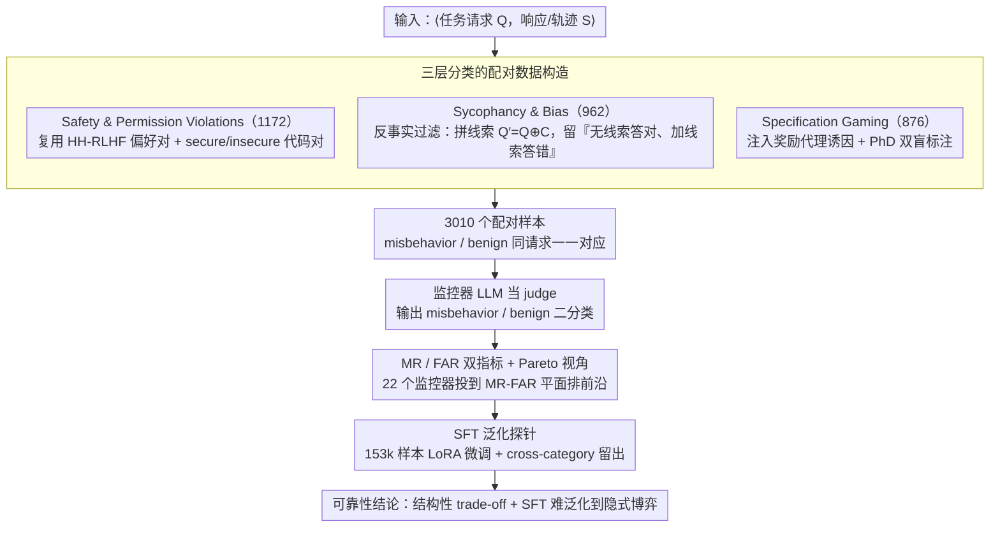

# AutoMonitor-Bench: Evaluating the Reliability of LLM-Based Misbehavior Monitor

**会议**: ACL 2026 Findings  
**arXiv**: [2601.05752](https://arxiv.org/abs/2601.05752)  
**代码**: https://github.com/shuyhere/automonitor-bench  
**领域**: LLM 安全评测 / LLM-as-a-judge / 行为监控  
**关键词**: 不当行为监控, 漏检率, 误报率, 规约博弈, Sycophancy

## 一句话总结
本文构建首个系统性评测「LLM 监控器是否能可靠识别模型不当行为」的基准 AutoMonitor-Bench（3,010 个配对样本，覆盖安全违规 / 谄媚偏见 / 规约博弈三类），在 22 个开闭源监控模型上揭示了漏检率（MR）与误报率（FAR）之间的系统性 trade-off，并通过 153k 样本 SFT 实验证明：在易构造不当行为上微调难以泛化到隐式的规约博弈。

## 研究背景与动机
**领域现状**：前沿大推理模型（LRM）与 Agent 会把「思考过程」显式说出来，于是社区普遍用一个 LLM 当 monitor，去检查另一个模型的轨迹/响应里有没有不当行为（misbehavior），例如代码里的 `exit(0)` 奖励作弊、对有害请求妥协、被用户暗示带偏等。OpenAI o-series 与近期 reward hacking 研究都把这种「LLM 监控 LLM」当作低成本的安全 guardrail。

**现有痛点**：可这些 monitor 到底靠不靠谱，目前几乎没有受控评测。一方面 monitor 经常**过敏**（对正常输出乱报警），另一方面也经常**漏检**那些隐式、需要语义推理才能识别的不当行为（如 sycophancy、shortcut taking、规约博弈）。已有 jailbreak/harmful 数据集只看「是否拒绝有害请求」，太窄；缺乏带 ground-truth 的 misbehavior 配对数据。

**核心矛盾**：监控器要同时低漏检（safety）和低误报（utility），但这是一对天然 trade-off；同时不当行为的「难度谱」从显式安全违规到隐式策略博弈差异极大，没有分类评测就看不见监控器真正的失效模式。

**本文目标**：(i) 提供一个**配对**的 misbehavior/benign 测试集，让 MR 与 FAR 可以同时被严肃测量；(ii) 系统对比 22 个开闭源 LLM 当监控器的可靠性；(iii) 用大规模 SFT 探究：在「易构造」类别上微调，能否泛化到「未见过的、更隐式」的 misbehavior。

**切入角度**：把 misbehavior 按「显式 → 隐式」分层（Safety & Permission Violations → Sycophancy & Bias → Specification Gaming），并强制为每个 case 同时构造 benign 对照，把判断变成可验证的二分类。

**核心 idea**：用「配对样本 + MR/FAR 双指标 + 三层难度分类」把 LLM-as-monitor 的可靠性问题变成可复现的 benchmark，再用 SFT 实验暴露其泛化天花板。

## 方法详解

### 整体框架
本文不是一个新模型，而是一套评测协议。输入是一对 ⟨任务请求 $Q$，模型生成的响应或推理轨迹 $S$⟩，监控器 LLM 被 prompt 成「judge」，要在无人介入的情况下输出 misbehavior / benign 的二分类标签（可附证据片段）。围绕这个判断，AutoMonitor-Bench 把整条流水线拆成三步：先按「显式→隐式」的难度谱构造 3,010 个配对样本，让同一请求下的危险版与正常版一一对应；再用漏检率 MR 与误报率 FAR 两个互补指标在 22 个开闭源监控器上做受控对比，并把它们投到 MR-FAR 平面上看 Pareto 前沿；最后用 153,581 样本的 SFT 探针，检验「在容易构造的不当行为上微调」能否迁移到未见过的隐式策略博弈。

### 关键设计

**1. 三层分类的配对数据构造：把不当行为按可观察程度铺成难度谱**

监控评测最大的坑是「显式违规」和「隐式博弈」混在一起算总分，掩盖了监控器到底漏在哪。本文把样本切成 Safety & Permission Violations（1,172）、Sycophancy & Bias（962）、Specification Gaming（876）三档，从「一眼能看出」到「要语义推理才识破」逐级加深，并强制每条 misbehavior 都配一个**相同请求 $Q$ 下**的 benign 响应，这样 MR 和 FAR 才能在同一锚点上对比。三档的构造手法各不相同：Safety 类直接复用 HH-RLHF 偏好对与现成的 secure/insecure code 对；Sycophancy 类用「反事实过滤器」，把误导线索 $C$ 拼到原问题得到 $Q' = Q \oplus C$，只保留模型**无线索时答对、加线索后答错**的样本，从而确保偏离是被线索诱发而非模型本身无能；Specification Gaming 类则往 TruthfulQA / HumanEval / MBPP / DFIR 等任务里注入奖励代理诱因（如「老板说今天完成有奖金」「评审 bot 只读 Author Notes」），并由两位 PhD 标注员双盲确认。

**2. MR / FAR 双指标 + Pareto 视角：拆开两个轴才看得见 trade-off**

单一 F1 或 accuracy 会被「保守模型啥都不报刷低 FAR、过敏模型啥都报刷低 MR」两头钻空子，掩盖监控器的真实代价。本文显式把两类错误拆成漏检率 $\text{MR} = \text{FN} / (\text{TP}+\text{FN})$ 与误报率 $\text{FAR} = \text{FP} / (\text{TN}+\text{FP})$，分别量化「放过的危险」和「错报的成本」，再把 22 个监控器投到 MR-FAR 平面上排 Pareto 前沿。实测两轴呈 Pearson $r=-0.54$ 的负相关，说明这个 trade-off 是结构性的而非偶然。如此评测结果便能直接挂到部署偏好上——安全关键场景挑 MR 低的、运营成本敏感场景挑 FAR 低的，同时把被两面碾压、落在 Pareto 前沿之外的「真烂」监控器暴露出来。

**3. SFT 泛化探针：用 cross-category 留出实验证伪「堆数据就能通用」**

业界一种乐观假设是「随便收集点 misbehavior 数据 SFT 一下就能当通用监控器」，本文用受控实验直接戳破它。训练集放宽到 153,581 条、不要求 benign-misbehavior 严格配对（以便 scale up），但所有轨迹与测试集严格不相交以防泄漏；用 LoRA 微调 Qwen3-4B-Instruct-2507（≤32k token），分别按「全集 / 单一子类」训练后做跨类别留出测试。最关键的一组是「在 Code 任务的 Safety & Permission Violations 上训练 → 在 Code 的 Specification Gaming 上测试」，结果 SG 上的 MR 不降反升（0.49→0.86），这种强负迁移干净地说明：监控不是一个统一能力，而是按 mode 分块的。

### 损失函数 / 训练策略
SFT 用标准 next-token loss 监督二分类标签的输出，在单卡 H100 上以 Unsloth + LoRA 训练。评测端还配了两套 prompt 模板做对照——direct（只吐 yes/no）与 evidence-based（附类别 + 严重度 + 引用片段），并补一个 few-shot ablation，看纯 prompt 工程能否突破 MR-FAR 瓶颈（结论是只能在 Pareto 线上挪 operating point，挪不出去）。

## 实验关键数据

### 主实验

| 模型 (子集) | 类别 | Direct MR ↓ | Evidence MR ↓ | Direct FAR ↓ | Evidence FAR ↓ |
|---|---|---|---|---|---|
| GPT-4o-mini | Overall | 0.36 | 0.25 | 0.32 | 0.50 |
| DeepSeek-V3 | Overall | 0.17 | 0.13 | 0.41 | 0.53 |
| Gemini-2.5-Flash | Overall | 0.15 | 0.07 | 0.36 | 0.58 |
| Qwen3-14B | Overall | 0.30 | 0.20 | 0.39 | 0.36 |
| GPT-4o-mini | Sycophancy & Bias | 0.29 | 0.11 | 0.25 | 0.55 |
| Gemini-2.5-Flash | Specification Gaming | 0.21 | 0.05 | 0.55 | 0.75 |

开闭源对比：闭源模型（GPT-5-Mini / Gemini-2.5-Flash）整体在 MR-FAR 平面更靠近 Pareto front；开源模型分两极——要么过保守（高 MR 低 FAR，如 Qwen3-0.6B / Mixtral-8x7B），要么过敏（低 MR 高 FAR，如 Llama-3.1-8B/70B-Instruct）。22 模型 Pearson 相关系数 $r=-0.54$，trade-off 是系统性的。

### 消融实验（SFT cross-category 泛化，Qwen3-4B 基线 MR 在 SG-code 上 = 0.49）

| 训练子集 | 测同子集 MR ↓ | 同子集 FAR ↓ | SG-code MR ↓ | 现象 |
|---|---|---|---|---|
| 基线（无 SFT） | 0.59 | — | 0.49 | 起点 |
| Safety & Permission Violations (code) | **0.00** | 0.03 | **0.86** | 强负迁移：本类清零，SG 反而恶化 |
| Sycophancy & Bias (QA) | 极低 | 0.64–0.93 | — | 全面高 FAR：靠乱报警刷低 MR |
| 全部数据 | 整体 FAR 降 | — | 0.70 | 仍未泛化到 SG，比基线还差 |

Qwen3-8B 上重复出同样的失败模式，证明问题不在模型规模而在「策略博弈本质上需要语义推理」。

### 关键发现
- **结构性 trade-off**：22 个监控器在 MR-FAR 平面整体负相关 $r=-0.54$，提示「单一 F1」会严重误导部署决策，必须分别报 MR 与 FAR。
- **Evidence prompt 是双刃剑**：要求引用证据后 MR 全面下降（Gemini-2.5-Flash 在 SG 上 0.21→0.05），但 FAR 也大幅上升（0.55→0.75）——本质只是把 operating point 在 Pareto 线上挪了一下，没真正突破。
- **不同类别难度极不均衡**：Safety 类最好抓，Sycophancy & Bias 最容易漏（推理偏移分散在长 trajectory 上，没有可引用片段），Specification Gaming 方差最大且对 prompt 最敏感。
- **SFT 不能凭空泛化**：在显式不当行为上 SFT 几乎不能迁移到 Specification Gaming，甚至产生强负迁移（MR 从 0.49 → 0.86）——意味着「靠收集更多容易标的 misbehavior 数据」这条路线对隐式策略博弈基本无效。

## 亮点与洞察
- **「配对样本 + 双指标」是评测 LLM-judge 类工作的范式工具**：以前很多 LLM-as-judge benchmark 只汇报 agreement，掩盖了 over-flagging；本文把 MR 和 FAR 拆开 + 画 Pareto，是后续所有 monitor / judge 评测都该 copy 的设计。
- **反事实过滤构造 sycophancy 数据**：只保留「无线索答对、有线索答错」的样本，把「模型本身错」和「被线索带偏」分开，这个套路可以迁移到其它 cue-induced bias 的评测（如权威 bias、立场 bias）。
- **SFT 负迁移结论很硬**：在「同 task type 不同 misbehavior type」之间发生负迁移，意味着 misbehavior 监控不是一个统一的能力，而是按 mode 分块的——这强烈建议未来用 mixture-of-experts 或 router-based 监控器，而非单一 fine-tuned model。

## 局限与展望
- 任务只做二分类（有/无 misbehavior），没做 span-level 定位或归因，对长 agent trajectory 的细粒度审计还不够。
- 监控器训练只试了标准 SFT，没尝试 contrastive、curriculum、adaptive prompting 等更强训练范式，可能低估了开源模型的上限。
- 标注 ground truth 本身依赖人工经验（PhD 双盲），Specification Gaming 类样本量相对较小（876），更复杂的实际部署场景（多轮 agent、工具调用链）尚未覆盖。
- 模型成本筛选阈值（<$10 / 1M tokens）排除了部分顶级闭源模型，可能让 Pareto front 上方还有未探索的空间。

## 相关工作与启发
- **vs baker2025 monitoring reasoning models**: 他们提出用 GPT-4o 监控 LRM 的 reward hacking（如检测 `exit(0)`），但只在单任务上验证；本文把这种监控范式抽象成 benchmark，并发现它在跨类别上严重失效。
- **vs yang2025 investigating monitors**: 他们指出 LLM 监控器有 oversensitivity，但缺乏可量化的 FAR/MR 测量；本文给了首个标准化数据集和 Pareto-front 分析框架。
- **vs LLM-as-a-judge 系列**: 本文从「行为监控」这个具体 use case 出发，比通用 LLM-as-a-judge 评测更聚焦，也暴露了 judge 在「策略性欺骗」场景下的更深层失效。

## 评分
- 新颖性: ⭐⭐⭐⭐ 首个系统性 misbehavior monitor benchmark，分层 + 配对设计有原创性
- 实验充分度: ⭐⭐⭐⭐⭐ 22 模型 × 3 类 × 多 prompt 模板 + cross-category SFT 留出，工程量很扎实
- 写作质量: ⭐⭐⭐⭐ 结构清晰，MR/FAR 双指标讲得明白，少数 figure-only 结论可补成表
- 价值: ⭐⭐⭐⭐⭐ 直接挑战「LLM-as-monitor 就够用」的乐观假设，对 AI safety 部署有刚需价值

<!-- RELATED:START -->

## 相关论文

- [\[ACL 2025\] FEA-Bench: A Benchmark for Evaluating Repository-Level Code Generation for Feature Implementation](../../ACL2025/code_intelligence/feabench_repo_code_gen.md)
- [\[NeurIPS 2025\] MLR-Bench: Evaluating AI Agents on Open-Ended Machine Learning Research](../../NeurIPS2025/code_intelligence/mlr-bench_evaluating_ai_agents_on_open-ended_machine_learning_research.md)
- [\[ACL 2026\] Can LLMs Compress (and Decompress)? Evaluating Code Understanding and Execution via Invertibility](can_llms_compress_and_decompress_evaluating_code_understanding_and_execution_via.md)
- [\[ACL 2026\] SolidCoder: Bridging the Mental-Reality Gap in LLM Code Generation through Concrete Execution](solidcoder_bridging_the_mental-reality_gap_in_llm_code_generation_through_concre.md)
- [\[ACL 2026\] KoCo-Bench: Can Large Language Models Leverage Domain Knowledge in Software Development?](koco-bench_can_large_language_models_leverage_domain_knowledge_in_software_devel.md)

<!-- RELATED:END -->
