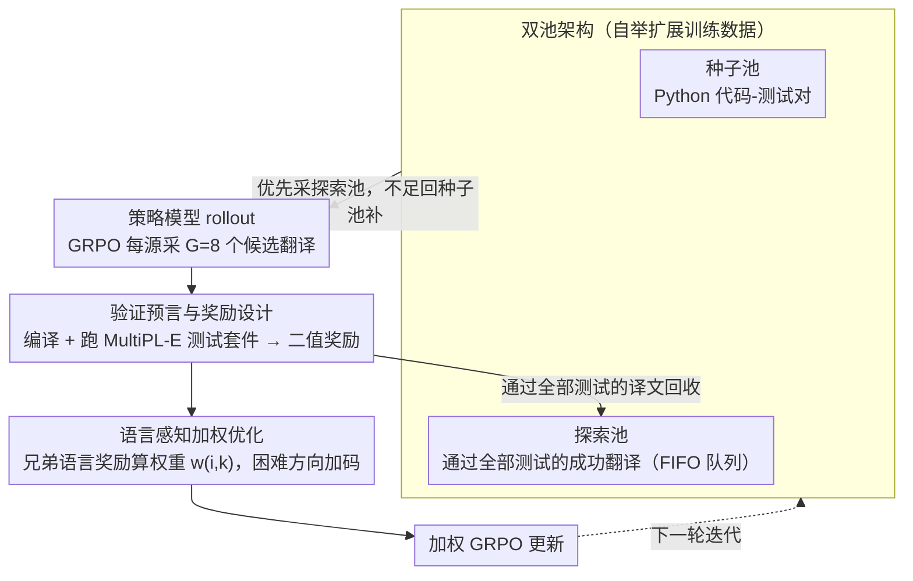

# Bootstrapping Code Translation with Weighted Multilanguage Exploration

**会议**: ACL 2026  
**arXiv**: [2601.03512](https://arxiv.org/abs/2601.03512)  
**代码**: [https://github.com/nju-websoft/BootTrans/](https://github.com/nju-websoft/BootTrans/)  
**领域**: 代码翻译/强化学习  
**关键词**: 代码翻译, 自举式探索, 语言感知加权, RLVR, 多语言优化

## 一句话总结

BootTrans 提出了一种自举式多语言代码翻译方法，通过利用单一枢纽语言（Python）的测试用例作为跨语言验证预言，结合双池架构进行经验收集扩展训练数据，并设计语言感知加权机制动态优先处理困难的翻译方向，在 HumanEval-X 和 TransCoder-Test 上显著超越基线。

## 研究背景与动机

**领域现状**：代码翻译对遗留系统现代化和跨平台互操作至关重要。LLM 在编码任务上取得了显著进展，但代码翻译通常依赖于高质量的平行语料，而这些语料很少配备可执行的测试用例。

**现有痛点**：(1) 多语言平行代码数据稀缺，且很少配备跨语言的可执行测试用例；(2) 无监督方法（如利用代码结构信息的方法）需要海量单语语料，且不能基于功能正确性直接优化；(3) 现有 RLVR 方法面临**输入单调性**（可验证种子仅限于单一枢纽语言）和**优化不平衡**（不同翻译方向难度差异导致学习信号偏斜）两大挑战。

**核心矛盾**：虽然测试用例天然具有跨语言可移植性，但从单一枢纽语言扩展到完整的多语言翻译矩阵面临数据瓶颈和优化失衡的双重障碍。

**本文目标**：(1) 解决多语言代码翻译中训练数据的稀缺性；(2) 缓解多语言同时优化时的优化不平衡问题。

**切入角度**：利用单元测试的跨语言可移植性作为统一验证机制，通过自举式经验收集逐步扩展训练数据覆盖所有翻译方向。

**核心 idea**：以一种语言为轴心，通过 RL 策略模型自身的成功翻译来"自举"扩展训练数据，同时用语言感知权重动态调节不同翻译方向的学习强度。

## 方法详解

### 整体框架

BootTrans 要解决的是「多语言代码翻译没有带可执行测试的平行语料」这个数据瓶颈。它的核心观察是单元测试天然跨语言可移植：以 Python 为枢纽语言，只要把 Python 测试用例规则化转成目标语言，就能给任意翻译方向提供功能正确性的验证预言。围绕这点，方法用 RL（GRPO）训练翻译模型，一边靠自举式探索把模型自己翻对的代码回收成新训练数据、把覆盖面从单一枢纽语言滚动扩展到完整翻译矩阵，一边用语言感知加权动态调高那些「别的语言翻得好、唯独这门翻不好」的方向的学习强度，从而在所有方向上均衡提升。

### 关键设计

**1. 双池架构：让模型用自己翻对的代码自举出多语言训练数据**

可验证的种子只有 Python 一门语言（输入单调性），靠平行语料扩展又无从谈起。本文用两个池打破这一依赖：种子池 $\mathcal{D}_{\text{seed}}$ 装枢纽语言（Python）的代码-测试对，探索池 $\mathcal{D}_{\text{explore}}$ 动态收集策略模型在 rollout 中**通过全部测试**的成功翻译。每轮训练优先从探索池采样、不足时回种子池补充；而探索池里翻对的代码可以在后续迭代里当作新方向的源输入（例如 Java→Python 的反向翻译），从而像滚雪球一样把训练数据从一门语言铺到整个翻译矩阵。池子用 FIFO 队列管理防止过载。

**2. 验证预言与奖励设计：用二值可执行奖励把目标对齐到功能等价而非表面相似**

跨语言验证靠的是一个二值可验证奖励 $R(y, T) = \mathbb{1}[y \text{ compiles and passes all tests in } T]$——译文必须既能编译、又通过测试套件 $T$ 才得 1，编译错误、运行时错误、超时一律记 0。测试套件本身通过 MultiPL-E 把 Python 规则化转换到其他语言，使同一组测试在所有方向复用。这样优化目标盯的是功能正确性，而不是 BLEU 式的表面形式相似——这既是双池架构判定「翻对」的依据，也是下面加权机制能比较各方向表现的共同基础。

**3. 语言感知加权优化：用「兄弟语言」的相对表现给困难方向加码**

多个翻译方向同时优化时，难易差异会让学习信号偏向容易的方向。本文对源代码 $x_i$ 到目标语言 $L_k$ 的翻译，先定义兄弟奖励 $\mathcal{R}_{i,\neg k}$ 为同一源在其他目标语言上的累积奖励之和，再设权重 $w_{i,k} = \frac{\mathcal{R}_{i,\neg k}}{\mathcal{R}_{i,k} + \mathcal{R}_{i,\neg k}}$。直觉很清楚：若模型在兄弟语言上已展示出语义理解、却唯独在 $L_k$ 上挣扎，$w_{i,k}$ 就会增大，说明瓶颈在该语言的语法/习惯表达而非对题意的理解，于是迫使模型把更多学习强度投到这个困难方向。

### 损失函数 / 训练策略

训练用 GRPO，目标是语言感知加权后的 PPO 式目标：保留裁剪比率与 KL 惩罚，优势估计按「同一目标语言」分组计算，再乘上权重 $w_{i,k}$。优化器 AdamW、学习率 1e-6，rollout 宏批次 256，每个源代码采样 $G=8$ 个候选翻译。

## 实验关键数据

### 主实验

**HumanEval-X CA@1 平均分**

| 方法 | Avg |
|------|-----|
| Qwen3-1.7B (base) | 64.33 |
| BootTrans Qwen3-1.7B | **74.70** (+10.37) |
| Llama-3.1-8B (base) | 61.79 |
| BootTrans Llama-3.1-8B | **78.36** (+16.57) |
| Qwen2.5-7B (base) | 68.50 |
| BootTrans Qwen2.5-7B | **83.84** (+15.34) |

**与其他方法对比 (Qwen3-1.7B, HumanEval-X Avg)**

| 方法 | Avg |
|------|-----|
| CoTran | 64.03 |
| MultiPL-T | 64.74 |
| PPOCoder | 69.21 |
| OORL | 69.92 |
| BootTrans | **74.70** |

### 消融实验

BootTrans 1.7B 模型在 HumanEval-X 上超越了 Qwen3-32B（74.70 vs 67.99），展示了小模型通过 RL 训练可以超越大模型的潜力。在 TransCoder-Test 上，BootTrans 同样带来一致的提升。

### 关键发现

- 自举式探索和语言感知加权两个组件都对最终性能有显著贡献
- BootTrans 使 1.7B 参数的小模型超越了 32B 参数的大模型
- 在所有六个翻译方向上都取得了一致的提升，缓解了优化不平衡问题
- 测试用例的跨语言可移植性是方法成功的关键基础

## 亮点与洞察

- 自举式数据扩展的思路简洁有效，充分利用了测试用例的跨语言可移植性
- 语言感知加权机制直觉清晰，基于"兄弟语言"的对比实现了自适应难度调节
- 小模型超越大模型的实验结果突出了 RL 训练在代码翻译中的价值
- 双池架构的 FIFO 管理策略在工程上考虑周到

## 局限与展望

- 目前仅在 C++、Java、Python 三种语言间实验，未扩展到更多语言
- 依赖 MultiPL-E 的规则化测试转换，可能对某些复杂测试用例失败
- 训练成本较高，需要大量 rollout 和编译执行
- 未来可探索将方法扩展到更多编程语言和更复杂的软件工程场景

## 相关工作与启发

- 与 PPOCoder 和 OORL 等 RL 方法相比，BootTrans 的创新在于数据扩展和加权机制的结合
- MultiPL-E 的测试转换工具为方法提供了关键基础设施
- 自举式训练数据扩展的思路可推广到其他需要验证反馈的生成任务

## 评分

- 新颖性: ⭐⭐⭐⭐ 自举式探索和语言感知加权的组合设计新颖实用
- 实验充分度: ⭐⭐⭐⭐ 三种基础模型、两个基准、多种基线的全面对比
- 写作质量: ⭐⭐⭐⭐ 问题定义清晰，算法描述详尽

<!-- RELATED:START -->

## 相关论文

- [\[ICML 2026\] MatchFixAgent: Language-Agnostic Autonomous Repository-Level Code Translation Validation and Repair](../../ICML2026/code_intelligence/matchfixagent_language-agnostic_autonomous_repository-level_code_translation_val.md)
- [\[ACL 2026\] PExA: Parallel Exploration Agent for Complex Text-to-SQL](pexa_parallel_exploration_agent_for_complex_text-to-sql.md)
- [\[ICML 2025\] Function-to-Style Guidance of LLMs for Code Translation](../../ICML2025/code_intelligence/function-to-style_guidance_of_llms_for_code_translation.md)
- [\[ACL 2025\] ExploraCoder: Advancing Code Generation for Multiple Unseen APIs via Planning and Chained Exploration](../../ACL2025/code_intelligence/exploracoder_advancing_code_generation_for_multiple_unseen_apis_via_planning_and.md)
- [\[ACL 2026\] CodeRL+: Improving Code Generation via Reinforcement with Execution Semantics Alignment](coderl_improving_code_generation_via_reinforcement_with_execution_semantics_alig.md)

<!-- RELATED:END -->
