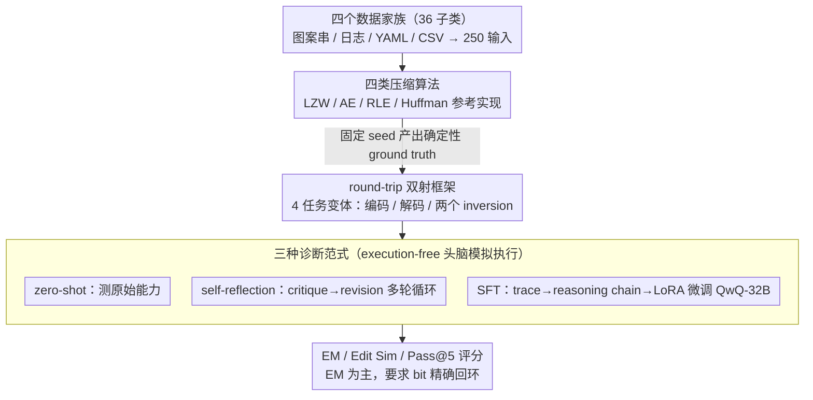

# Can LLMs Compress (and Decompress)? Evaluating Code Understanding and Execution via Invertibility

**会议**: ACL 2026 Findings  
**arXiv**: [2601.13398](https://arxiv.org/abs/2601.13398)  
**代码**: https://github.com/Nickil21/round-trip-code-compression  
**领域**: 代码智能  
**关键词**: 代码推理, 双向执行, 压缩算法, 自一致性, 评测

## 一句话总结
本文提出 RoundTripCodeEval (RTCE)：用 4 种无损压缩算法（LZW/AE/RLE/Huffman）构造 250 输入 × 4 子任务 = 1000 个严格回环（encode→decode 必须 bit-精确还原）的代码推理基准，结果显示即使是 QwQ-32B 在 Huffman 编码上 EM 仍为 0%，SFT 和 self-reflection 都救不回来。

## 研究背景与动机

**领域现状**：Code-LLM（DeepSeek-Coder、Qwen2.5-Coder、StarCoder2 等）在 HumanEval/MBPP 等代码生成基准上已经很强；执行推理评测（CRUXEval、CodeIO、CodeMind、REVAL 等）测了 forward 或 backward 执行单方向。

**现有痛点**：所有现有评测要么单方向（只测 forward 或 backward），要么基于"语义等价"（如 IdentityChain 测 code↔spec、RTC 测 code↔NL description）。但语义等价是一个很宽松的标准——只要新生成的代码 behave 一样就算对，模型完全可以靠模式匹配/记忆刷分；它无法证明模型真正理解了算法的内部状态机和数据流。

**核心矛盾**：模型可能在 forward 上拿高分（因为 forward execution 可以由表面模式匹配解决），但在 backward 上失败；或者两个方向各自看似都对，组合后回环不闭合——这恰恰说明模型内部表征是不一致的，但单方向 benchmark 永远抓不到这种缺陷。"forward correctness was fragile, derived from template matching"。

**本文目标**：设计一个评测能区分"靠模式匹配混分"与"真懂算法语义"的代码模型。

**切入角度**：无损压缩算法天然就是双射（bijection），enc(x)=z 和 dec(z)=x 必须完全可逆，给出了一个严格的回环约束 $\text{dec}(\text{enc}(x))=x$，远比"语义等价"更难刷分。

**核心 idea**：把"代码理解"重新定义为"代码可逆性问题"（code invertibility），用 round-trip exact-match 作为评测信号，4 种压缩算法 × 4 种任务变体（encode、decode、encode⁻¹、decode⁻¹）形成 16 维诊断网格，暴露 forward-only 评测无法发现的系统性失败。

## 方法详解

### 整体框架

RTCE 把"代码理解"重新表述成"代码可逆性"问题，再用一条严格的回环约束去检验模型是否真的在脑子里跑通了算法。整个基准分三步搭起来：先在图案字符串、Apache 日志、YAML 配置、CSV 表格四个数据家族（共 36 个子类）下合成 250 个多样化输入，再用 LZW/AE/RLE/Huffman 四个压缩算法的 Python 参考实现在固定 seed 下产出确定性的 ground truth，最后让模型在 execution-free（不准真跑代码）的设定下完成四种任务变体（O/P Pred、O/P Pred-I、I/P Pred、I/P Pred-I），逼它在头脑里模拟执行。评分用 EM、Edit Similarity、Pass@5 三个指标：EM（exact match，浮点容差 $10^{-3}$）是主指标，ES（归一化 Levenshtein）给部分分，Pass@5 取 5 次采样的最好结果——之所以以 EM 为准，是因为很多 EM=0 的样本 ES 仍有 8%–20%，恰恰说明模型输出"看起来像但并不精确"，只有严格回环才抓得住这种脆性。在这套基准上，论文进一步用 zero-shot / self-reflection / SFT 三种诊断范式去穷尽涨分手段，把失败归因钉死在架构层面。

### 关键设计

**1. 双射压缩构成的 round-trip 框架：把"理解"操作化为 bit 精确的可逆性**

现有评测的根本松动在于"语义等价"——只要新代码行为一样就算对，模型靠模式匹配/记忆就能刷分，没法证明它真懂算法的内部状态机。无损压缩天然是双射，给出了一个远更苛刻的约束：定义 $\mathsf{enc}:\mathcal{X}\to\mathcal{Z}$、$\mathsf{dec}:\mathcal{Z}\to\mathcal{X}$，强制 $\forall x\in\mathcal{X},\ \mathsf{dec}(\mathsf{enc}(x))=x$，任何信息丢失都会让 exact-match 直接失败。围绕它派生出四种任务：$x\to z$（前向编码）、$z\to x'$（前向解码），以及用 dec 函数反推 encode 行为、用 enc 函数反推 decode 行为这两个"inversion"变体。后两个 inversion 任务是杀手锏——它们要求模型把给定函数当成目标的逆来推理，没法靠"读懂代码再顺着模拟"取巧，因此能暴露"两边各看似都对、合起来却不闭合"的内部矛盾，而这正是单方向 benchmark 永远抓不到的。

**2. 四类压缩算法张成编码范式谱：用不同设计模式戳中不同推理瓶颈**

只用单一算法会让结论被该算法的特质偏置，所以 RTCE 选了四个机制差异极大的算法：LZW 考字典维护（动态状态），AE 考概率区间累积（浮点精度叠加长跨度依赖），RLE 考连续游程聚合（最简单的 bijection），Huffman 考前缀编码加树构造（多阶段层次过程）。它们从最简单的 RLE 一路铺到最复杂的 Huffman，于是能把"某个算法的特定知识不会"和"通用状态跟踪能力差"区分开。最有说服力的信号来自 Huffman encoding：15 个模型 EM 全是 0，而难度排在中间的 RLE 却能拿到几十分，说明卡住模型的不是绝对难度，而是"是否真懂状态机"。

**3. zero-shot / self-reflection / SFT 三种诊断范式：穷尽涨分手段，证明鸿沟是根本性的**

要让"transformer 在 stateful bijection 上有根本缺陷"这个结论站得住，就必须先排除"只是没教好/prompt 不行/规模不够"的可能。于是论文把三种标准增强手段全用上：zero-shot 测原始能力；多轮 self-reflection 用 critique/revision 两阶段循环，每轮模型先做 KEEP/REVISE 判断再改写；SFT 则走五阶段管道——用 @snoop 注入执行、过滤出合法 trace、用 Qwen3-32B 把 trace 翻成自然语言 reasoning chain、拼成 2-turn chat 数据、再以 LoRA rank-8 微调 QwQ-32B。三种方法把当前能想到的 prompt/data/scale 杠杆都拉满了，却都没能把 Huffman encoding 从 0% 救回来，从而把失败归因牢牢钉在架构层面而非训练层面。

## 实验关键数据

### 主实验
15 个 LLM × 4 算法 × 4 任务（Pass@5 综合平均，节选）：

| 模型 | 规模 | RLE 综合 | LZW 综合 | AE 综合 | Huffman 综合 | Avg |
|------|------|----------|----------|---------|--------------|-----|
| Llama-3.2-1B | 1B | 0.15 | 0.05 | 0.34 | 0.08 | 0.16 |
| Phi-3-mini-128k | 3.8B | 12.01 | 3.65 | 2.60 | 1.54 | 4.95 |
| Qwen2.5-7B | 7.6B | 17.39 | 4.46 | 6.55 | 2.65 | 7.76 |
| DeepSeek-R1-Distill-14B | 14.8B | 26.97 | 14.03 | 10.08 | 3.15 | 13.56 |
| Codestral-22B | 22.2B | 30.68 | 7.77 | 1.76 | 1.50 | 10.43 |
| **QwQ-32B** | 32.8B | **57.23** | 24.14 | **15.71** | 5.50 | **25.65** |
| Qwen2.5-Coder-32B | 32.8B | 41.51 | 21.06 | 8.45 | 3.15 | 18.54 |
| DeepSeek-R1-Distill-32B | 32.8B | 36.37 | 23.81 | 12.74 | 3.98 | 19.23 |
| deepseek-coder-33b | 33.3B | 13.71 | 3.44 | 3.34 | 1.21 | 5.43 |

**关键观察**：(1) Huffman encoding 全员 0%——构造频率表 + 建 Huffman 树 + 输出变长码三步组合，没有任何 LLM 能完成；(2) reasoning 训练（QwQ vs Qwen2.5-Coder 同参数同 tokenizer）让 AE 涨 1.86×，证明瓶颈是逻辑推理而非 tokenization；(3) decoding 普遍比 encoding 容易（解码可以利用 encoded 串的表面规律），但 AE 反例：QwQ 在 AE 编码 27.6% 而解码仅 2.3%（12× 落差），因为 AE 解码要求逆向浮点区间运算。

### 消融：SFT on QwQ-32B（Pass@5）

| 算法 | temp | I/P Pred | I/P Pred-I | O/P Pred | O/P Pred-I |
|------|------|----------|------------|----------|------------|
| AE | 0.2 | 30.77 | 23.08 | **78.57** | **84.62** |
| AE | 0.8 | 15.00 | 20.00 | 70.00 | 84.21 |
| Huffman | 0.2 | 35.00 | 50.00 | **0.00** | **0.00** |
| Huffman | 0.8 | 36.36 | 50.00 | **0.00** | **0.00** |
| LZW | 0.2 | 62.50 | 62.50 | 87.50 | 87.50 |
| RLE | 0.2 | 76.47 | 86.00 | 80.00 | 86.00 |

Huffman encoding 经过 SFT 仍是 0%，但 decoding 涨到 50%——证明 trace-derived reasoning chain 只学到了"表面解码模板"，没内化双射的状态转移结构。

### 关键发现
- **Huffman 悖论**：所有模型 Huffman encoding 为 0，但 decoding 能到 7-11%。原因是 decoding 只需在给定 Huffman tree 上做遍历（局部 lookup），encoding 需要构造频率表+建树+变长码（多阶段全局推理）。
- **Self-reflection 一轮饱和**：第 1 轮 critique 能修浅层 reasoning 错误，第 2 轮就饱和，说明系统性状态跟踪错误无法靠自纠正修复（与 Olausson 2024 的发现一致）。
- **SFT 涨 forward 但伤 inverse**：AE 上 forward 升到 78.6% 但 inverse 仅 23–30%，说明 LoRA adapter 过拟合到 trace 表面形式，没学到 bijective invariants。
- **Tokenization 不是瓶颈**：QwQ 和 Qwen2.5-Coder 同 tokenizer 同参数但 AE 差 1.86×，差异完全来自训练目标（reasoning vs code）。
- **ES > 0 但 EM = 0**：模型输出"看起来对但不精确"，证明 RTCE 的 exact-match 严格性确实暴露了别的 benchmark 看不到的脆性。

## 亮点与洞察
- **把"理解"操作化为"可逆性"**：用 bijection 把抽象的"是否真懂算法"变成可量化的 exact-match 信号，方法论上是新一类 evaluation。这个思路可迁移到任何有自然 inverse 的任务（refactor↔重写、加密↔解密、序列化↔反序列化、解析↔生成）。
- **诊断式评测三件套**：zero-shot + self-reflection + SFT 三种增强一起测，排除"是否训练不够/prompt 不好/规模太小"的可能性，让结论"transformer 在 bijective state tracking 上有根本缺陷"更有说服力。这是评测论文的范式参考。
- **Huffman 悖论给出明确的能力缺口**：encoding 0% / decoding 11% 的强烈不对称，把"多阶段全局状态构造"标定为下一代 code LLM 的具体改进目标。
- **synthetic 但真实**：4 个数据家族刻意模拟真实开发者工件（日志、YAML、CSV），避免被 GitHub 数据污染嫌疑。

## 局限与展望
- 只测 Python，未扩展到其他语言（虽然作者说扩展容易）。
- 仅 4 个压缩算法，1000 个样本——对细粒度 per-category 统计稳定性有限。
- Execution-free 评测无法测 side-effect/concurrency/exception 等运行时现象。
- 主要测开源模型（GPT-4/Claude/Gemini 等闭源未在主表），结论对最强闭源模型的泛化性留作开放问题。
- 个人补充：bijection 只是 code understanding 的一个维度，refactor、decompile、symbolic execution 等同样重要的可逆性形式未覆盖。

## 相关工作与启发
- **vs IdentityChain (Min 2024)**：检查 spec↔code 一致性，但语义等价；本文要 exact bijection，严格得多。
- **vs RTC (Allamanis 2024)**：code↔NL description round-trip，是语义级；本文是数据级 bit 精确。
- **vs CodeIO/CRUXEval**：前者收集函数 I/O，但 forward/backward 独立打分；本文强调两方向必须自一致。
- **vs CodeMind/REVAL/CACP**：靠 trace/concept-level 标注暴露问题；本文不需要任何标注，只靠回环 exact-match 自动判分。

## 评分
- 新颖性: ⭐⭐⭐⭐⭐ 把 round-trip + bijection 引入代码推理评测，并把 invertibility 操作化为可量化指标，是真正新的视角。
- 实验充分度: ⭐⭐⭐⭐ 15 个模型 × 4 算法 × 4 任务 × 3 增强范式，但闭源模型缺席。
- 写作质量: ⭐⭐⭐⭐ 数学符号清晰，4 个任务定义和 inversion 区分讲得很到位。
- 价值: ⭐⭐⭐⭐⭐ 暴露 transformer 在 stateful bijection 上的系统性缺陷，对 code reasoning 社区是个明确的负面信号 + 研究方向。

<!-- RELATED:START -->

## 相关论文

- [\[ACL 2026\] SWE-QA: Can Language Models Answer Repository-level Code Questions?](swe-qa_can_language_models_answer_repository-level_code_questions.md)
- [\[ACL 2025\] TeXpert: A Multi-Level Benchmark for Evaluating LaTeX Code Generation by LLMs](../../ACL2025/code_intelligence/texpert_a_multi-level_benchmark_for_evaluating_latex_code_generation_by_llms.md)
- [\[ACL 2026\] DUET: Dual Execution for Test Output Prediction with Generated Code and Pseudocode](duet_dual_execution_for_test_output_prediction_with_generated_code_and_pseudocod.md)
- [\[ACL 2026\] SolidCoder: Bridging the Mental-Reality Gap in LLM Code Generation through Concrete Execution](solidcoder_bridging_the_mental-reality_gap_in_llm_code_generation_through_concre.md)
- [\[ACL 2026\] AutoMonitor-Bench: Evaluating the Reliability of LLM-Based Misbehavior Monitor](automonitor-bench_evaluating_the_reliability_of_llm-based_misbehavior_monitor.md)

<!-- RELATED:END -->
