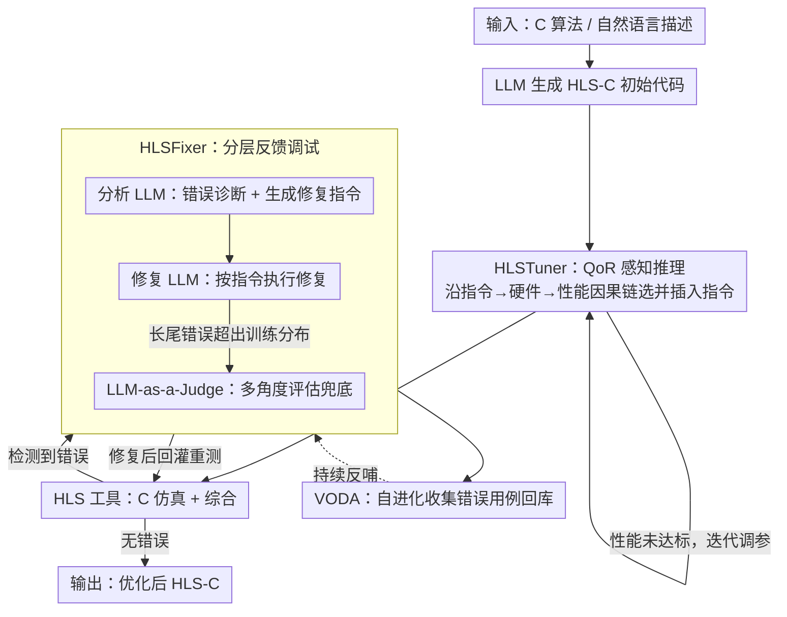

# ChatHLS: Towards Systematic Design Automation and Optimization for High-Level Synthesis

**会议**: ACL 2026  
**arXiv**: [2507.00642](https://arxiv.org/abs/2507.00642)  
**代码**: 无  
**领域**: LLM 辅助硬件设计  
**关键词**: 高层综合, LLM辅助设计, 多智能体, 指令优化, 自动调试

## 一句话总结

ChatHLS 提出了一个多智能体 HLS 设计框架，通过 HLSTuner（QoR 感知推理优化指令选择）和 HLSFixer（分层反馈增强的调试框架）两个核心组件，结合自进化错误用例扩展机制（VODA），在 HLS-C 生成成功率和硬件性能优化上显著超越基线。

## 研究背景与动机

**领域现状**：高层综合（HLS）通过将 C/C++ 抽象为硬件描述来加速硬件设计。LLM 在代码生成方面的成功激发了将其应用于 HLS 的研究兴趣。

**现有痛点**：(1) HLS 特定数据稀缺，现有数据集很少暴露可综合性约束、指令选择理由和 QoR 关联；(2) 组合爆炸的指令调优空间使手动优化极其耗时；(3) 通用 LLM 难以识别和修正 HLS 特定的兼容性错误。

**核心矛盾**：HLS 设计需要同时优化功能正确性和硬件效率，但现有 LLM 缺乏对硬件约束和指令语义的理解。

**本文目标**：构建自动化的 HLS 设计、优化和调试框架。

**切入角度**：多智能体协作 + 专业化微调 + 自进化数据增强。

**核心 idea**：通过 QoR 感知推理让 LLM 理解指令与硬件性能之间的因果关系，通过推理到指令的方法让 LLM 准确诊断 HLS 错误。

## 方法详解

### 整体框架

ChatHLS 是一条把 HLS 设计、优化、调试串起来的多智能体流水线，核心是让微调过的 LLM 真正"懂"指令与硬件性能之间的因果关系。流程分两段：生成段里 LLM 先产出 HLS-C 代码，再由 HLSTuner 基于 QoR 感知推理挑选并插入优化指令；调试段里 HLSFixer 解析 HLS 工具的反馈做错误诊断与修复，同时 VODA 把新遇到的错误用例回收进库，让调试能力随使用不断自我进化。

### 关键设计

**1. HLSTuner：用 QoR 感知推理把"插指令"变成"懂权衡"**

指令调优空间组合爆炸，手工优化极其耗时，而通用 LLM 往往只会机械地往代码里塞指令，并不理解每条指令会如何改变硬件。HLSTuner 以源 HLS-C 和初始 QoR 为输入，沿"指令变化 → 硬件架构变化 → 性能变化"这条因果链做推理；训练数据则用 NSGA-II 在多目标空间里生成一批多样化的优化设计，再由教师模型为每个设计写出优化 CoT 作为监督信号。这样 LLM 学到的不是"哪条指令常出现"，而是"为什么这条指令能改善 QoR"。

**2. HLSFixer：把调试解耦成识别-诊断-修复的分层反馈框架**

通用 LLM 很难识别和修正 HLS 特有的可综合性/兼容性错误，端到端直接改代码又黑箱难控。HLSFixer 把调试拆成错误识别、诊断、修复三步：由分析 LLM 从 HLS 工具反馈中提取错误信息并生成修复指令，再由修复 LLM 执行这些指令；对于落在训练分布之外的长尾错误，则引入 LLM-as-a-Judge 做多角度评估兜底。这种"推理到指令"的解耦比端到端修复更可控、也更可解释。

**3. VODA：在工作流里自进化地扩充错误用例库**

HLS 错误呈长尾分布，靠一次性标注的数据集很难覆盖。VODA 让 ChatHLS 在实际运行过程中自动捕捉新出现的错误用例并沉淀进库，持续反哺 HLSFixer 的调试能力，形成越用越强的闭环。

### 损失函数 / 训练策略

HLSTuner 用 NSGA-II 生成多样化设计、教师模型产出优化 CoT，做监督微调；HLSFixer 则按"推理到指令"的解耦方式微调，分别训练分析 LLM 与修复 LLM。

## 实验关键数据

### 主实验

- ChatHLS 在调试上相对 Gemini-3-pro 提升 32.6%
- HLS-C 生成成功率提升 41.8%
- 相对 RAG 方法达到 3.3× 性能提升

### 关键发现

- QoR 感知推理显著优于简单的代码到代码映射
- 分层反馈调试比端到端修复更有效
- VODA 自进化机制持续提升调试能力

## 亮点与洞察

- QoR 感知推理让 LLM “理解”硬件而非简单生成代码
- 推理到指令的解耦调试方法具有良好的可解释性

## 局限与展望

- 仅针对特定 HLS 工具链，可能不适用于其他 EDA 工具
- NSGA-II 生成 CoT 的过程计算成本较高
- 未来可探索端到端的 RL 训练替代监督微调

## 相关工作与启发

- 与 HeteroRefactor、HeteroGen 的模板方法相比，ChatHLS 更灵活且无需预定义模板
- 与 RAG 方法相比，专业化微调提供了更精确的领域知识

## 评分

- 新颖性: ⭐⭐⭐⭐ QoR 感知推理和自进化调试是新颖的设计
- 实验充分度: ⭐⭐⭐⭐ 多种基准和基线对比
- 写作质量: ⭐⭐⭐⭐ 框架描述详尽，流程图清晰

<!-- RELATED:START -->

## 相关论文

- [\[ACL 2026\] SOCIA-EVO: Automated Simulator Construction via Dual-Anchored Bi-Level Optimization](socia-evo_automated_simulator_construction_via_dual-anchored_bi-level_optimizati.md)
- [\[ACL 2026\] CuBridge: An LLM-Based Framework for Understanding and Reconstructing High-Performance Attention Kernels](cubridge_an_llm-based_framework_for_understanding_and_reconstructing_high-perfor.md)
- [\[ACL 2026\] LogicEval: A Systematic Framework for Evaluating Automated Repair Techniques for Logical Vulnerabilities in Real-World Software](logiceval_a_systematic_framework_for_evaluating_automated_repair_techniques_for_.md)
- [\[ACL 2026\] QiMeng-PRepair: Precise Code Repair via Edit-Aware Reward Optimization](qimeng-prepair_precise_code_repair_via_edit-aware_reward_optimization.md)
- [\[ACL 2026\] QAQ: Bidirectional Semantic Coherence for Selecting High-Quality Synthetic Code Instructions](qaq_bidirectional_semantic_coherence_for_selecting_high-quality_synthetic_code_i.md)

<!-- RELATED:END -->
