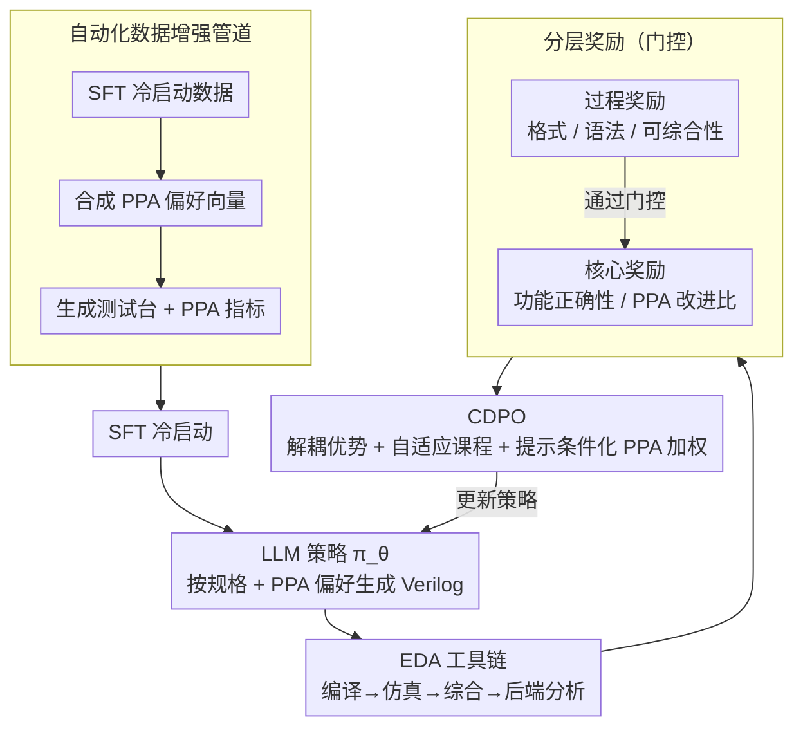

# ChipSeek: Optimizing Verilog Generation via EDA-Integrated Reinforcement Learning

**会议**: ACL 2026  
**arXiv**: [2507.04736](https://arxiv.org/abs/2507.04736)  
**代码**: [https://github.com/rong-hash/chipseek](https://github.com/rong-hash/chipseek)  
**领域**: 强化学习  
**关键词**: Verilog生成, EDA集成, 分层奖励, PPA优化, 课程式策略优化

## 一句话总结

ChipSeek 提出了一个将 EDA 工具链直接集成到训练循环中的分层奖励 RL 框架，通过课程引导的动态策略优化（CDPO）使 LLM 能够生成同时满足功能正确性和 PPA（功耗-性能-面积）优化的 RTL 代码，在标准基准上达到 SOTA。

## 研究背景与动机

**领域现状**：LLM 在自动化 RTL 代码生成方面展现了巨大潜力。现有方法通过 SFT、RAG、多智能体和 CoT 推理提升功能正确性，但通常忽略硬件特定指标（PPA）。

**现有痛点**：(1) 现有模型缺乏同时优化功能正确性和 PPA 的内在机制；(2) 后处理方法（如 MCTS）不能提升 LLM 本身的能力；(3) 现有模型生成的 Verilog 通常不如专家手写的硬件效率。

**核心矛盾**：当前方法缺乏将功能正确性和 PPA 优化并行纳入训练目标的机制。

**本文目标**：设计一个将 EDA 工具链反馈直接纳入 RL 训练的框架，使 LLM 内化硬件设计知识。

**切入角度**：分层奖励设计 + 课程式权重调度 + 提示条件化 PPA 偏好。

**核心 idea**：通过将完整的开源 EDA 工具链（编译、仿真、综合、后端分析）接入训练循环，提供从语法到 PPA 的分层奖励，让 LLM 在训练中学习硬件设计权衡。

## 方法详解

### 整体框架

ChipSeek 把完整的开源 EDA 工具链（编译、仿真、综合、后端分析）直接搬进 RL 训练循环：LLM 作为策略 $\pi_\theta$ 根据设计规格生成 Verilog，工具链从语法一路评估到 PPA 并回吐分层奖励，再由 CDPO 把功能正确性和 PPA 当作多目标一起优化。这样模型不是事后被挑刺，而是在训练过程中就把硬件设计的权衡内化进参数里。整个流程由自动化数据增强管道在前端备好 PPA 感知的训练数据，经 SFT 冷启动后进入闭环 RL 训练。

### 关键设计

**1. 分层奖励：用门控把廉价检查放前面、昂贵评估放后面**

PPA 评估要跑综合和后端分析，代价高昂，对一段连编译都过不了的代码做这些纯属浪费。分层奖励因此把反馈拆成过程奖励（格式、语法、可综合性）和核心奖励（功能正确性、PPA），并用严格的门控机制串起来——只有通过上游检查的代码才会触发下游指标的计算。PPA 奖励取相对参考设计的改进比例 $r_m = \text{ref}_m / \text{gen}_m$，把连续的 PPA 信号与离散的功能正确性信号解耦，既省算力又让两类目标各自可控。

**2. CDPO（课程引导动态策略优化）：让多目标不被易学组件带偏**

多目标 RL 有两个老毛病：不同奖励的学习阶段不同步、尺度也不一致，简单地把奖励加起来就会被最容易学的语法项主导。CDPO 用三招化解：(a) 解耦优势估计，每个奖励组件各自独立归一化，避免尺度互相压制；(b) 自适应课程，根据全局成功率动态调整过程奖励权重——当语法成功率已经很高时自动调小其权重，把学习压力转向更难的 PPA；(c) 提示条件化 PPA 加权，按提示里给出的偏好向量调节功耗/延迟/面积三者的权重。三者合起来实现了从易到难的学习进程，也让设计偏好可以按需指定。

**3. 自动化数据增强管道：补上 PPA 感知训练数据的缺口**

硬件设计数据本就稀缺，带 PPA 标注的更少。该管道分三阶段批量造数据：先生成 SFT 冷启动数据让模型具备基本生成能力，再合成多样化的 PPA 偏好向量覆盖不同优化诉求，最后为每个样本生成配套的测试台和 PPA 指标，使整条 RL 训练得以真正以 PPA 为目标驱动。

### 损失函数 / 训练策略

以 GRPO 为骨架做策略优化，配合解耦裁剪和动态权重完成多目标优势聚合；训练先用 SFT 冷启动，再进入接入 EDA 工具链反馈的 RL 阶段。

## 实验关键数据

### 主实验

- 在标准基准上达到 SOTA 的功能正确性和 PPA 性能
- 在特定优化目标（功耗、延迟、面积）上也能产生高效设计

### 关键发现

- 将 EDA 工具链纳入训练循环比后处理更有效
- CDPO 的课程式调度对多目标优化至关重要
- 提示条件化 PPA 加权实现了灵活的设计偏好控制

## 亮点与洞察

- EDA 工具链作为可验证奖励源的思路可推广到其他工程领域
- CDPO 的多目标优化设计具有通用性
- 分层门控显著节省计算资源

## 局限与展望

- 依赖开源 EDA 工具，商业工具可能产生不同结果
- EDA 工具执行时间较长，增加了训练成本
- 未来可探索更复杂的设计场景和更大规模的模型

## 相关工作与启发

- 与 RTLFixer/HDLDebugger 的 RAG 方法相比，RL 训练内化了硬件知识
- 与 VeriGen-MCTS 的后处理相比，RL 提升了 LLM 本身的能力

## 评分

- 新颖性: ⭐⭐⭐⭐⭐ 将完整 EDA 工具链纳入 RL 训练是重要创新
- 实验充分度: ⭐⭐⭐⭐ 多基准、多优化目标的全面评估
- 写作质量: ⭐⭐⭐⭐ 框架设计清晰，公式推导详尽

<!-- RELATED:START -->

## 相关论文

- [\[ACL 2026\] MARS2: Scaling Multi-Agent Tree Search via Reinforcement Learning for Code Generation](mars2_scaling_multi-agent_tree_search_via_reinforcement_learning_for_code_genera.md)
- [\[NeurIPS 2025\] QiMeng-SALV: Signal-Aware Learning for Verilog Code Generation](../../NeurIPS2025/code_intelligence/qimeng-salv_signal-aware_learning_for_verilog_code_generation.md)
- [\[ACL 2026\] CodeRL+: Improving Code Generation via Reinforcement with Execution Semantics Alignment](coderl_improving_code_generation_via_reinforcement_with_execution_semantics_alig.md)
- [\[CVPR 2026\] MM-ReCoder: Advancing Chart-to-Code Generation with Reinforcement Learning and Self-Correction](../../CVPR2026/code_intelligence/mm-recoder_advancing_chart-to-code_generation_with_reinforcement_learning_and_se.md)
- [\[ICLR 2026\] Breaking the SFT Plateau: Multimodal Structured Reinforcement Learning for Chart-to-Code Generation](../../ICLR2026/code_intelligence/breaking_the_sft_plateau_multimodal_structured_reinforcement_learning_for_chart-.md)

<!-- RELATED:END -->
