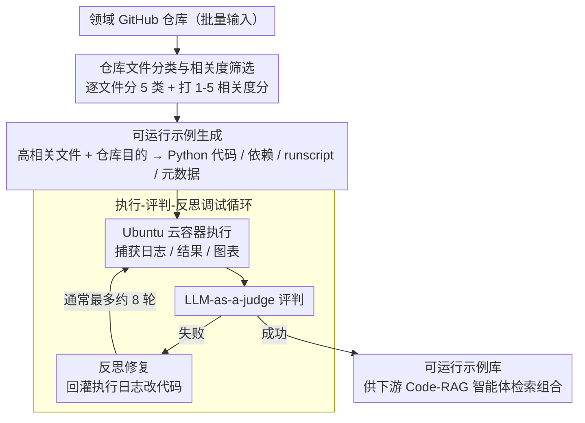

# CodeDistiller: Automatically Generating Code Libraries for Scientific Coding Agents

**会议**: ACL2026  
**arXiv**: [2512.01089](https://arxiv.org/abs/2512.01089)  
**代码**: https://github.com/cognitiveailab/codedistiller  
**领域**: AI for Science / 代码智能体  
**关键词**: 自动科学发现, 代码智能体, Code-RAG, 仓库蒸馏, LLM-as-a-judge

## 一句话总结
CodeDistiller 自动把科学领域 GitHub 仓库蒸馏成可运行、经调试的示例代码库，让 Code-RAG 式科学发现智能体能调用真实领域工具；在 250 个材料科学仓库上，最佳模型的人工验证正确功能率达到 74.1%，下游发现任务也更受专家偏好。

## 研究背景与动机
**领域现状**：自动科学发现系统正在从文献发现、数据驱动发现走向实验驱动发现。很多新系统会接收研究任务，自动生成代码、运行计算实验、调试错误，最后写出实验报告。对于材料科学、计算化学或机器学习系统研究这类领域，能否写出正确实验代码直接决定发现质量。

**现有痛点**：科学实验代码往往依赖非常专门的库、数据格式和操作流程。智能体只依赖参数知识时，容易凭印象生成不可运行或科学上不合规的代码；如果依赖人工整理的示例库，又成本很高、扩展慢。已有 agent benchmark 多关注复现少量仓库或根据论文写代码，不能直接为 Code-RAG 科学发现系统大规模构建可复用示例。

**核心矛盾**：科学智能体需要大量真实、可运行、领域特定的代码示例来增强能力，但这些示例若靠专家手工维护，无法覆盖快速增长的开源科学软件生态；若完全自动生成，又难以保证代码能运行且确实展示仓库核心功能。

**本文目标**：作者希望构建一个自动流水线，把大批 GitHub 科学仓库转化为“可被下游发现智能体检索和组合”的 vetted code examples，并量化不同基础模型在成本、运行时间、正确性上的取舍。

**切入角度**：CodeDistiller 不试图让智能体从参数知识直接写实验，而是先离线扫描仓库、识别关键文件、生成并调试最小工作示例，再把这些示例作为 Code-RAG 库供下游任务调用。

**核心 idea**：用静态文件筛选 + 动态代码生成/执行/反思调试，把开源科学仓库自动蒸馏成可执行示例库，从而补足科学发现 agent 的领域工具知识。

## 方法详解

### 整体框架
CodeDistiller 的输入是一批领域相关 GitHub 仓库，输出是每个仓库对应的可运行示例代码和元数据。流程先做大规模静态信息收集：逐文件判断文件类型、用途、相关度和特殊运行需求，找出最可能帮助构建示例的代码、文档、脚本或已有示例。然后进入动态示例生成阶段：把高相关文件和仓库核心目的交给代码生成系统，让它产生 Python 代码、依赖、运行脚本和资源说明。生成结果会在 Ubuntu 云容器中真实执行；若 LLM-as-a-judge 判定失败，系统把执行日志反馈给模型进行反思和修复，直到成功或达到调试上限。

### 关键设计

**1. 仓库文件分类与相关度筛选：先把上百个嵌套文件过一遍，挑出真正能帮上忙的那几个**

代码生成模型上下文有限，把整个仓库塞进去既贵又全是噪声。CodeDistiller 因此先做一次大规模静态扫描：逐个文件送进提示词，分类成 code、documentation、scripts、data、other 五类，其中 code、documentation、scripts 还会进一步细分成 existing examples、instructions、entry points 等更细的类别。同时系统给每个文件打 1-5 的相关度分数，并记录它是否含 GPU 需求、配置说明、关键任务信息这类元数据。这样后续生成阶段就能把注意力集中在 API、文档和已有示例上，而不是被测试脚本、数据 dump 这些边角文件淹没。

**2. 可运行示例生成：把仓库的核心功能压成一个下游 agent 能直接检索、运行、组合的最小实验**

下游 Code-RAG 要的不是一段仓库摘要，而是能跑起来的具体代码。CodeDistiller 用一个修改版 CodeScientist 接收高相关文件和仓库核心目的，一次产出四类绑在一起的输出：可执行的 Python 代码、Python 依赖清单、带 Conda 环境设置的 bash runscript，以及一份元数据——包含用途描述、适用 / 不适用场景，以及 CPU/GPU/RAM/disk 需求和是否需要用户交互。前三样保证示例真的能在干净环境里复现，最后这份元数据则是给下游 agent 看的"使用说明书"，让它能判断什么时候该调用这个示例。

**3. 执行-评判-反思调试循环：把"看起来合理"的代码逼成"真跑通过"的代码**

科学代码对不对，光读静态文本判断不了。生成的示例会被丢进 Ubuntu 云容器里真实执行，系统捕获 stdout/stderr、带时间戳的日志、JSON 结果和图表等人类可读输出。执行完由 LLM-as-a-judge 判断它是否正确展示了仓库功能；一旦判失败，就把当前代码连同执行日志一起回灌给模型做反思和修复，如此循环、通常最多 8 次以控制成本。正是这一圈"跑一遍—看日志—改"的闭环，把只能纸面通过的 toy code 和真正能用的 code library 区分开来。

### 训练策略 / 模型配置
CodeDistiller 不是训练一个模型，而是比较不同基础模型作为 agent base model 的表现。实验使用 GPT-OSS-120B、GPT-5 和 Claude Sonnet 4.5；文件分类阶段可用同模型家族的便宜模型，例如 GPT-5-mini 或 Claude Haiku 4.5。评估包括自动 LLM-as-a-judge、材料科学专家人工检查、运行时间、调试轮数和 API 成本。下游评估则把 CodeDistiller 生成的示例库加入 CodeScientist，并与只使用通用材料科学代码示例的 baseline 做 A/B 比较。

## 实验关键数据

### 主实验
材料科学专家先列出 30 个常见 Python 材料库，如 PyMatgen、ASE、LAMMPS、PyCalphad。作者用 GitHub API 找到 3,802 个包含这些库 import 且许可证 permissive 的仓库，再随机抽样 250 个用于评估。

| Agent base model | 自动成功率 | 人工执行无错 | 人工展示仓库功能 | 人工正确功能 | 成功平均运行时 | 成功平均成本 |
|------------------|-----------:|-------------:|----------------:|-------------:|---------------:|-------------:|
| GPT-OSS-120B | 61.6% | 29.6% | 29.6% | 25.9% | 13.8 min | $0.09 |
| GPT-5 | 70.4% | 69.0% | 69.0% | 60.5% | 20.3 min | $0.70 |
| Claude Sonnet 4.5 | 75.6% | 75.6% | 75.6% | 74.1% | 19.0 min | $1.71 |

### 下游 A/B 测试
| 维度 | 关键数据 | 说明 |
|------|----------|------|
| 任务构造 | 12 个材料科学仓库，每个 5 个问题，共 60 个 discovery problems | 只分析 baseline 与增强系统都产出解的 50 个问题 |
| 运行预算 | 每次最多 15 轮调试、总运行 6 小时、每轮最多 60 分钟、LLM 成本上限 $5 | 使用 Claude Sonnet 4.5 作为 CodeScientist base model |
| 专家偏好 | CodeDistiller 增强系统在 accuracy、completeness、soundness 上通常超过半数被偏好 | baseline 仅在约 18%-24% 情况下被偏好，其余约四分之一为 tie |
| 评审一致性 | Cohen's $\kappa$: Accuracy 0.77, Soundness 0.70, Completeness 0.62 | LLM-as-a-judge 与专家在 A/B 任务上为中等到较强一致 |

### 案例结果
| 场景 | Baseline | CodeDistiller 增强系统 | 说明 |
|------|----------|------------------------|------|
| Tox21 毒性预测 | 使用 20 个手工挑选分子复制出的合成数据 | 使用 6,258 个真实化合物、12 个毒性 assay | 增强系统更具科学有效性 |
| Ge/Sb/Te 结构松弛 | 使用未针对元素参数化的通用 Lennard-Jones potential，体积坍缩 80%-93% | 使用 CHGNet，体积变化 -16% 到 +75% | 增强系统更符合材料物理 |
| 合金参数计算 | 手工数据库导致 AlTiVNb 原子尺寸差异 3.60% | 使用 pymatgen 和 Parameter-Calculator-for-CCA，得到 5.428% | 成熟库比临时实现更可靠 |

### 关键发现
- 自动 judge 会高估示例质量，尤其 GPT-OSS-120B 的自动成功率 61.6% 与人工正确功能率 25.9% 差距很大。
- Claude Sonnet 4.5 效果最好，但平均成功成本 $1.71，是 GPT-OSS-120B 的约 19 倍；这形成清晰的成本-质量 trade-off。
- 成功样例通常只需约 2 轮调试，不成功样例会不断迭代直到上限，因此失败成本不可忽视。
- 下游 A/B 说明这些示例不是只对“仓库复现”有用，也能提升自动科学发现报告的准确性、完整性和科学 soundness。

## 亮点与洞察
- **把 GitHub 仓库转化为 Code-RAG 资产**：论文关注的不是单次解决一个 repo，而是为科学智能体构建可检索、可组合的代码库，这个目标更贴近长期系统建设。
- **人工专家评估很关键**：自动 judge 与人工结果的差距提醒我们，科学代码“能跑”不等于“科学上正确”，必须有领域验证。
- **离线蒸馏降低在线发现难度**：下游 agent 在执行具体研究任务前已经拥有领域示例，在线推理不必从零学习每个库。
- **成本数据有工程参考价值**：论文不只报成功率，还报运行时间、调试轮数和 API 成本，使方法可部署性更可判断。

## 局限与展望
- 人工专家评估仍是时间受限的 proxy：专家检查代码、结果和图表是否合理，但没有为每个仓库编写完整测试集或复现实验文献。
- 仓库识别方式会引入噪声。作者用材料科学库 import 检索仓库，但人工分析估计约一半仓库并非真正材料科学，只是偶然 import 相关库。
- 当前只评估材料科学，迁移到生物、化学、地理信息或机器人时，数据开放性、软件依赖、闭源工具和实验标准都可能改变性能。
- purpose-built agent 与通用 coding agent 的对比仍未解决；不同系统预算、模型、工具和输出形式不同，很难完全公平控制。
- 未来可以引入更强的自动单元测试生成、领域基准验证、许可证/安全过滤，以及对生成示例库的版本更新机制。

## 相关工作与启发
- **vs CodeScientist**: CodeScientist 依赖已有 vetted code library；CodeDistiller 解决的是这个 library 如何自动扩充。
- **vs AI Scientist / AgentLab**: 这些系统侧重执行研究任务或生成实验代码；CodeDistiller 更像前置基础设施，为后续 agent 准备可调用工具示例。
- **vs SUPER / GISTIFY / RexBench**: 这些 benchmark 测试 agent 设置、复现或生成单仓库示例能力；CodeDistiller 在更大规模材料仓库上评估，并关注下游科学发现收益。
- **启发**：如果要构建领域研究助手，可以先离线蒸馏领域 GitHub 生态，形成“可运行工具记忆库”，再让在线 agent 检索和组合这些示例，而不是每次从模型参数知识里硬写。

## 评分
- 新颖性: ⭐⭐⭐⭐☆ 仓库到可运行示例库的目标很实用，流程组合清晰；单个 agent 组件并非全新。
- 实验充分度: ⭐⭐⭐⭐☆ 有 250 仓库、人工专家评估和下游 A/B；但领域限于材料科学，且人工验证仍是 proxy。
- 写作质量: ⭐⭐⭐⭐☆ 叙述直接，成本和失败模式讲得清楚；图表命名有些“Table 1/2”混用，需要读者留意。
- 价值: ⭐⭐⭐⭐⭐ 对 AI for Science agent 和 Code-RAG 基础设施非常有参考价值。

<!-- RELATED:START -->

## 相关论文

- [\[ACL 2026\] SecureVibeBench: Evaluating Secure Coding Capabilities of Code Agents with Realistic Vulnerability Scenarios](securevibebench_evaluating_secure_coding_capabilities_of_code_agents_with_realis.md)
- [\[ACL 2026\] RExBench: Can coding agents autonomously implement AI research extensions?](rexbench_can_coding_agents_autonomously_implement_ai_research_extensions.md)
- [\[ICML 2026\] NEMO: Execution-Aware Optimization Modeling via Autonomous Coding Agents](../../ICML2026/code_intelligence/nemo_execution-aware_optimization_modeling_via_autonomous_coding_agents.md)
- [\[ACL 2026\] SciCoQA: Quality Assurance for Scientific Paper–Code Alignment](scicoqa_quality_assurance_for_scientific_paper--code_alignment.md)
- [\[ACL 2025\] UTBoost: Rigorous Evaluation of Coding Agents on SWE-Bench](../../ACL2025/code_intelligence/utboost_rigorous_evaluation_of_coding_agents_on_swe-bench.md)

<!-- RELATED:END -->
