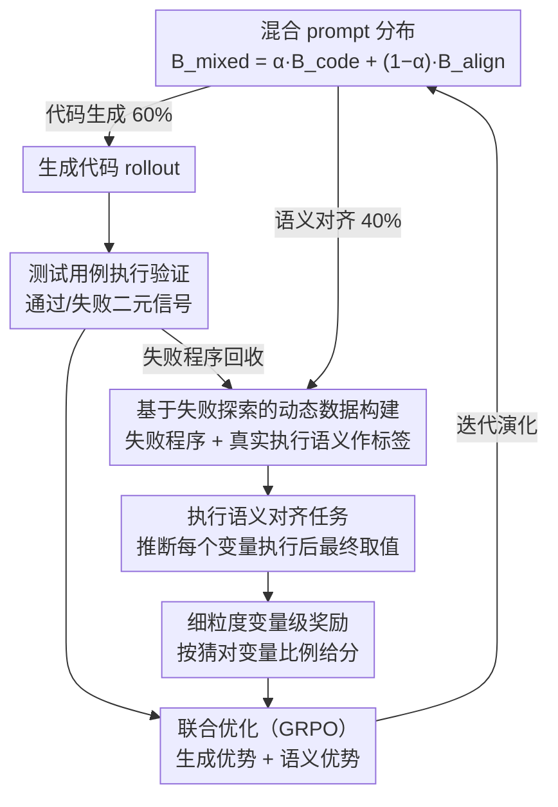

# CodeRL+: Improving Code Generation via Reinforcement with Execution Semantics Alignment

**会议**: ACL 2026  
**arXiv**: [2510.18471](https://arxiv.org/abs/2510.18471)  
**代码**: [https://github.com/jiangxxxue/CODERLPLUS](https://github.com/jiangxxxue/CODERLPLUS)  
**领域**: 代码生成 / 强化学习  
**关键词**: 代码生成, 执行语义对齐, RLVR, GRPO, 程序执行轨迹

## 一句话总结

本文提出 CodeRL+，将执行语义对齐集成到 RLVR 训练管道中，通过让模型推断变量级执行轨迹来弥合代码文本表示与执行语义之间的差距，在代码生成上平均 pass@1 提升 4.6%，在代码推理和测试输出生成基准上分别提升 15.5% 和 4.4%。

## 研究背景与动机

**领域现状**：LLM 通过自回归预训练学习代码的文本模式，已具备强大的代码生成能力。RLVR（带可验证奖励的强化学习）通过测试用例执行提供确定性反馈，尝试弥合文本模式与功能正确性之间的语义差距。

**现有痛点**：RLVR 仅依赖二元通过/失败信号，不足以建立代码文本表示与执行语义之间的良好对齐。实验表明 RLVR 训练后的模型在执行轨迹推断任务上仅比基线提升 4%，无法追踪循环中的变量变化等基本执行语义。

**核心矛盾**：LLM 的预训练目标（拟合文本分布）与评估标准（执行正确性）之间存在根本性错位。仅依赖最终执行结果的稀疏奖励无法让模型学习理解代码的运行时行为。

**本文目标**：在 RLVR 中引入执行语义对齐，使模型能推断变量级执行轨迹，提供直接的执行语义学习信号。

**切入角度**：将失败的代码探索重新利用为执行语义对齐的训练数据——让模型学习推断失败程序中每个变量的最终值。

**核心 idea**：代码生成（合成状态转换函数 $\Phi_p$）和执行语义对齐（理解 $\Phi_p$）是互补的双向关系，联合优化可以超越表面文本模式的学习。

## 方法详解

### 整体框架

CodeRL+ 想解决的核心错位是：RLVR 只用测试通过/失败的二元信号训模型，模型能写出能跑的代码，却说不清代码跑起来时变量怎么变。它的思路是在 GRPO 管道里塞进第二个目标——除了照常生成代码并用测试用例验证，还要让模型反过来推断一段程序里每个变量执行后的最终取值。两个目标按一个混合 prompt 分布 $\mathcal{B}_{\text{mixed}} = \alpha \cdot \mathcal{B}_{\text{code}} + (1-\alpha) \cdot \mathcal{B}_{\text{align}}$ 交替采样、联合优化，让"合成执行逻辑"和"理解执行逻辑"在同一套权重上互相拉动。

### 关键设计

**1. 执行语义对齐任务：把"代码会怎么跑"变成可学习的目标**

RLVR 的盲区在于最终奖励太稀疏，模型无从知道循环里某个变量的值是怎么一步步变出来的。CodeRL+ 给模型一段程序 $p$ 和输入 $x$，要求它推断每个变量 $var_i$ 在执行轨迹中最后一次被赋值时的取值。之所以只推断"最终值"而不是完整轨迹，是因为完整轨迹在循环场景下状态数会爆炸，而最终变量值是一个可行的近似——它隐含地编码了控制流走了哪条路径、变量之间存在哪些数据依赖，等于逼着模型在脑子里把代码跑一遍。

**2. 基于失败探索的动态数据构建：让写错的代码反哺语义理解**

对齐任务需要带真值标签的训练样本，但额外采数据或蒸馏教师模型都很贵。CodeRL+ 注意到代码生成的 rollout 阶段本就会产生大量没通过测试的失败程序，于是直接把它们回收：用失败程序拼出对齐 prompt $q' = \langle p_{\text{fail}}, x, V \rangle$，再用真实执行这些失败程序得到的语义 $\mathcal{F}_{p_{\text{fail}}}(x)$ 当标签。训练初期全是代码生成任务，随着迭代逐步掺入对齐样本，使对齐数据始终跟着模型当前能力一起演化。妙处在于失败程序恰恰暴露了模型对执行语义的误解，拿它们来纠偏正好对症。

**3. 细粒度变量级奖励：用连续信号替代全有或全无**

代码生成的奖励是非黑即白的——整段代码要么过要么不过，对部分正确的推断毫无区分度。对齐任务则按模型猜对的变量比例给分 $R_{\text{sem}}^{(i)} = \frac{1}{|V|}\sum_{v_k \in V} \mathbb{1}[\hat{v}_k^{\text{final}} = v_k^{\text{final},*}]$，哪怕只对了一半变量也能拿到正奖励。这种密集梯度让模型在"完全没学会"和"完全学会"之间有了可攀爬的台阶，学习信号比二元反馈丰富得多。

### 损失函数 / 训练策略

联合优化目标为 $\mathcal{J}_{\text{CodeRL+}}(\theta) = \mathbb{E}[r(\theta) \cdot A_{\text{gen}}] + \mathbb{E}[r'(\theta) \cdot A_{\text{sem}}]$，两项分别对应代码生成与语义对齐的优势项，统一在 GRPO 框架下更新。混合比例取 $\alpha = 0.6$（代码生成 60%、语义对齐 40%），基座为 Qwen2.5-Coder-7B-Instruct，batch size 128，每个 prompt 采样 8 条 rollout，在 8×A100 上训练。

## 实验关键数据

### 主实验

**Qwen2.5-Coder-7B-Instruct 上的 pass@1（%）**

| 方法 | HumanEval | LeetCode | LiveCodeBench | Avg | 代码推理 | 测试输出 |
|------|-----------|----------|---------------|-----|---------|---------|
| Base | 88.4 | 50.6 | 34.3 | 57.8 | 60.8 | 48.8 |
| GRPO | 87.2 | 60.0 | 35.4 | 60.9 | 66.0 | 48.4 |
| OlympicCoder | 75.6 | 45.3 | 30.9 | 50.6 | 68.5 | 31.1 |
| CodeReasoner | 88.4 | 50.0 | 34.8 | 57.7 | 78.5 | 65.1 |
| **CodeRL+** | **90.9** | **63.3** | **36.9** | **63.7** | **85.0** | 53.2 |

### 消融实验

| 配置 | 代码生成 Avg | 代码推理 | 说明 |
|------|-------------|---------|------|
| GRPO（基线） | 60.9 | 66.0 | 仅代码生成 |
| + 执行语义对齐 | **63.7** | **85.0** | CodeRL+ 完整版 |
| 仅执行语义对齐 | - | 提升 | 单独对齐也有效 |
| 不同 RL 算法（REINFORCE++, DAPO） | 均提升 | 均提升 | 跨算法一致 |

### 关键发现

- CodeRL+ 在代码生成上比 GRPO 平均提升 4.6%（相对提升），在代码推理上提升 15.5%
- CodeRL+ 成功弥合了代码生成和代码推理之间的性能鸿沟——以往专注代码推理的方法往往损害代码生成，反之亦然
- 跨模型（Qwen、DeepSeek、Llama）和跨 RL 算法（GRPO、REINFORCE++、DAPO）均有稳定提升
- 探测实验证明 CodeRL+ 训练后，模型在生成代码时更多地考虑执行语义

## 亮点与洞察

- 失败探索的重新利用是关键设计亮点——不浪费任何计算资源，失败代码直接成为语义对齐的训练数据
- 双目标联合优化实现了"合成 $\Phi_p$"和"理解 $\Phi_p$"的良性循环
- 无需额外数据源或教师模型蒸馏，对齐数据完全来自模型自身的探索

## 局限与展望

- 执行轨迹近似（仅推断最终变量值）可能丢失中间状态的关键信息
- 依赖可执行测试用例提供奖励，对无法自动化验证的编程任务（如 UI 开发）不适用
- 仅评估了 Python 代码生成，对其他编程语言的泛化效果待验证

## 相关工作与启发

- **vs CODEI/O**: CODEI/O 通过教师蒸馏+SFT 学习执行，CodeRL+ 通过 RL 自我探索学习，泛化性更好
- **vs CodeReasoner/CodeBoost**: 这些方法仅优化代码推理，可能损害代码生成；CodeRL+ 联合优化两者
- **vs 标准 GRPO**: 标准 GRPO 对执行语义理解提升有限（4%），CodeRL+ 通过显式对齐大幅提升

## 评分

- 新颖性: ⭐⭐⭐⭐⭐ 首次在 RLVR 中集成执行语义对齐，利用失败探索构建训练数据
- 实验充分度: ⭐⭐⭐⭐⭐ 五个基准、多模型、多 RL 算法、探测分析，非常全面
- 写作质量: ⭐⭐⭐⭐ 动机清晰，形式化严谨，但部分符号较重
- 价值: ⭐⭐⭐⭐⭐ 为代码生成 RL 训练提供了重要的执行语义学习信号

<!-- RELATED:START -->

## 相关论文

- [\[ACL 2026\] MARS2: Scaling Multi-Agent Tree Search via Reinforcement Learning for Code Generation](mars2_scaling_multi-agent_tree_search_via_reinforcement_learning_for_code_genera.md)
- [\[ICLR 2026\] Execution-Grounded Credit Assignment for GRPO in Code Generation](../../ICLR2026/code_intelligence/execution-grounded_credit_assignment_for_grpo_in_code_generation.md)
- [\[ACL 2026\] SciCoQA: Quality Assurance for Scientific Paper–Code Alignment](scicoqa_quality_assurance_for_scientific_paper--code_alignment.md)
- [\[ACL 2026\] ReCode: Reinforcing Code Generation with Reasoning-Process Rewards](recode_reinforcing_code_generation_with_reasoning-process_rewards.md)
- [\[ACL 2026\] ChipSeek: Optimizing Verilog Generation via EDA-Integrated Reinforcement Learning](chipseek_optimizing_verilog_generation_via_eda-integrated_reinforcement_learning.md)

<!-- RELATED:END -->
