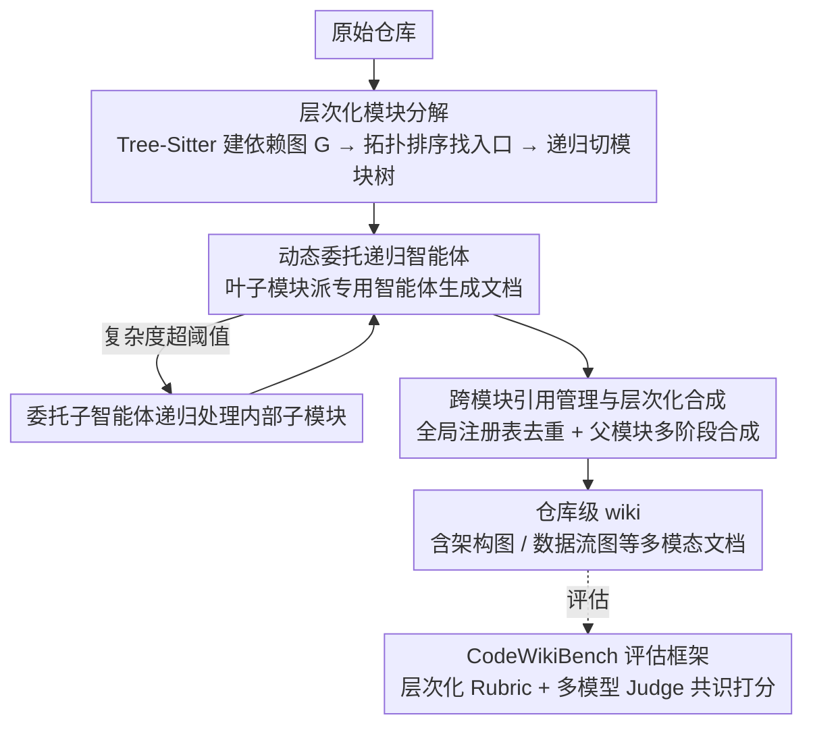

# CodeWiki: Evaluating AI's Ability to Generate Holistic Documentation for Large-Scale Codebases

**会议**: ACL 2026  
**arXiv**: [2510.24428](https://arxiv.org/abs/2510.24428)  
**代码**: [GitHub](https://github.com/FSoft-AI4Code/CodeWiki)  
**领域**: 代码智能  
**关键词**: 代码文档生成, 仓库级理解, 多智能体系统, 层次化分解, 代码基准

## 一句话总结

提出 CodeWiki，一个基于层次化分解和递归多智能体处理的开源框架，用于自动生成仓库级代码文档，并构建了 CodeWikiBench 基准，在七种编程语言上以 68.79% 的质量分数超越了闭源系统 DeepWiki（64.06%）。

## 研究背景与动机

**领域现状**：随着代码库规模和复杂度不断增长，维护全面且及时的文档已成为软件开发中的核心瓶颈。约 31% 的开发者已大量使用 AI 来辅助代码文档化，这反映出自动化文档生成的迫切需求。

**现有痛点**：现有方法主要集中在函数级和文件级文档生成（如 CodeBERT、DocAgent 等），难以扩展到仓库级别。仓库级文档需要捕获架构模式、跨模块交互、数据流和系统级设计决策，但现有工具缺乏对这些语义依赖和层次结构的建模能力。此外，评估体系也存在不足——传统的 BLEU/ROUGE 指标无法捕捉文档质量的多维度特征，且缺乏针对仓库级文档的系统性基准。

**核心矛盾**：仓库级文档生成需要同时理解局部实现细节和全局架构关系，但 LLM 的上下文窗口有限，无法一次性处理大型代码库；现有多语言支持也严重不足，大多数研究仅关注 Python。

**本文目标**：构建一个可扩展的、支持多语言的仓库级文档自动生成框架，同时提供可靠的评估方法论。

**切入角度**：借鉴动态规划思想，通过层次化分解将大型仓库拆分为可管理的模块，然后递归地自底向上生成并合成文档。

**核心idea**：将仓库级文档生成分为三阶段——静态分析与模块分解、递归智能体文档生成、层次化组装与合成——通过动态委托机制实现对任意规模仓库的自适应处理。

## 方法详解

### 整体框架

CodeWiki 要解决的矛盾是：仓库级文档既要讲清楚架构、跨模块交互和系统级设计，又受限于 LLM 上下文窗口装不下整个大型代码库。它借鉴动态规划的"分治"思路把流程拆成三段自底向上推进——先做仓库分析，用 AST/LLM 解析构建依赖图、识别高层组件并递归切成模块树；再做递归文档生成，给每个叶子模块派一个能读源码、能浏览模块树、能操作文档工作区、能遍历依赖图的专用智能体，模块太复杂时还能动态委托给子智能体；最后做层次化组装，把子模块文档逐层合成为父模块的架构概述，并产出带架构图、数据流图等多模态内容的综合文档。输入是一个原始仓库，中间是一棵被智能体逐节点填充的模块树，输出是一份互联的仓库级 wiki，并由 CodeWikiBench 这套评估框架对其质量打分。

### 关键设计

**1. 层次化模块分解：用分治把大仓库切成 LLM 能消化的单元**

LLM 上下文窗口有限而仓库动辄上百万行，直接喂整仓必然溢出。CodeWiki 用 Tree-Sitter 解析器提取 AST，构建有向依赖图 $G=(V,E)$，再对图做拓扑排序找出零入度的入口组件（如 main 函数、API 端点），从这些入口递归分区成一棵模块树。关键的工程取舍是模块树节点只保留组件 ID 而非完整源码，从而把分解过程本身的开销压到最小，同时让切分顺着真实依赖走、保持架构一致性。

**2. 动态委托递归智能体：让处理深度自适应模块复杂度**

固定粒度的切分要么对简单模块过度拆分、要么对复杂模块装不下。CodeWiki 让每个叶子模块的专用智能体在生成文档时实时评估圈复杂度、嵌套深度、语义多样性和当前上下文窗口利用率，一旦复杂度越过阈值就把内部子模块委托给新的子智能体递归处理。这样无论仓库多大，每个实际落到 LLM 的处理单元都被控制在有界复杂度内，既保证了任意规模的可扩展性，又维持了单模块的文档质量。

**3. 跨模块引用管理与层次化合成：避免冗余并织出全局视图**

逐模块生成容易把同一个组件在多处重复描述，也难以得到统一的架构叙事。CodeWiki 维护一个全局注册表追踪已记录的组件及其位置，遇到外部组件时只创建交叉引用而不重复正文；父模块的合成则走多阶段 LLM 流水——先分析各子文档的主题模式，再依次生成架构概览、特性摘要、使用指南和可视化图表。这样最终文档既不冗余，又能如实映射代码库真实的结构与交互关系。

**4. CodeWikiBench 评估框架：用层次化标准与多模型共识替代 BLEU/ROUGE**

传统 n-gram 指标抓不住仓库级文档的多维质量，业界也缺乏系统性基准。CodeWikiBench 的核心是层次化评分标准（Hierarchical Rubric）：从开源项目的官方文档里自动抽取评估标准，并让标准结构镜像项目架构。评判时由多个来自不同模型家族的 Judge Agent 独立打分叶子级需求，再自底向上加权聚合成最终分数与可靠性指标，多模型共识有效摊薄了单模型偏差。

## 实验关键数据

### 主实验

| 仓库 | 语言 | LOC | CodeWiki | DeepWiki | 提升 |
|------|------|-----|----------|----------|------|
| OpenHands | Python | 229K | 82.45% | 73.04% | +9.41% |
| svelte | JavaScript | 125K | 71.96% | 68.51% | +3.45% |
| puppeteer | TypeScript | 136K | 83.00% | 64.46% | +18.54% |
| ml-agents | C# | 86K | 79.78% | 74.80% | +4.98% |
| logstash | Java | 117K | 57.90% | 54.80% | +3.10% |
| wazuh | C | 1.4M | 64.17% | 68.68% | -4.51% |
| electron | C++ | 184K | 42.30% | 44.10% | -1.80% |
| **平均** | | | **68.79%** | **64.06%** | **+4.73%** |

### 跨语言分析

| 语言类别 | CodeWiki | DeepWiki | 提升 |
|---------|----------|----------|------|
| 脚本语言 (Python/JS/TS) | 79.14% | 68.67% | +10.47% |
| 托管语言 (C#/Java) | 68.84% | 64.80% | +4.04% |
| 系统语言 (C/C++) | 53.24% | 56.39% | -3.15% |

### 关键发现
- CodeWiki 在 7 个仓库中的 5 个上超越所有基线，在 TypeScript 仓库上获得最大提升（+18.54%）
- 高级脚本语言上的优势最为显著（+10.47%），但在系统编程语言（C/C++）上略逊于 DeepWiki
- 性能差异主要归因于语言特征而非仓库规模
- 初步人类研究显示 CodeWiki 在 9 次评估中的 7 次被偏好

## 亮点与洞察
- **层次化分解思路精妙**：将动态规划思想应用于文档生成，既解决了规模可扩展性问题，又保持了架构语义的一致性
- **评估方法论创新**：CodeWikiBench 的层次化标准生成和多模型共识评判机制为仓库级文档评估提供了系统性解决方案
- **开源透明性**：在闭源系统占主导的背景下，CodeWiki 的开源释放具有重要社区价值

## 局限与展望
- **系统编程语言表现不佳**：C/C++ 上低于 DeepWiki，指针操作和模板元编程等底层构造的解析能力不足
- **评估标准未经充分人类验证**：语义可靠性 73.65%、结构可靠性 70.84%
- **人类评估规模有限**：仅 3 名参与者 × 3 个仓库
- 未来方向：针对系统语言开发专用解析模块、多版本文档追踪、利用文档支持下游任务

## 相关工作与启发
- **vs DocAgent**：DocAgent 使用多智能体协作进行函数级文档生成，而 CodeWiki 聚焦于仓库级层次化合成
- **vs DeepWiki**：闭源商用系统，整体表现不错但缺乏层次化分解能力
- **vs OpenDeepWiki/deepwiki-open**：开源替代方案采用整仓库直接提示方式，性能明显落后

## 评分
- 新颖性: ⭐⭐⭐⭐ 层次化分解+动态委托的设计新颖，CodeWikiBench 评估方法论有创新
- 实验充分度: ⭐⭐⭐⭐ 覆盖 7 种语言和 7 个仓库，有跨语言和可扩展性分析，人类评估规模偏小
- 写作质量: ⭐⭐⭐⭐ 结构清晰，三个研究问题组织得当
- 价值: ⭐⭐⭐⭐ 填补仓库级文档自动生成和评估的重要空白，开源对社区有积极影响

<!-- RELATED:START -->

## 相关论文

- [\[NeurIPS 2025\] MLR-Bench: Evaluating AI Agents on Open-Ended Machine Learning Research](../../NeurIPS2025/code_intelligence/mlr-bench_evaluating_ai_agents_on_open-ended_machine_learning_research.md)
- [\[ACL 2026\] SecureVibeBench: Evaluating Secure Coding Capabilities of Code Agents with Realistic Vulnerability Scenarios](securevibebench_evaluating_secure_coding_capabilities_of_code_agents_with_realis.md)
- [\[ICML 2026\] SWE-rebench V2: Language-Agnostic SWE Task Collection at Scale](../../ICML2026/code_intelligence/swe-rebench_v2_language-agnostic_swe_task_collection_at_scale.md)
- [\[ACL 2026\] RExBench: Can coding agents autonomously implement AI research extensions?](rexbench_can_coding_agents_autonomously_implement_ai_research_extensions.md)
- [\[ACL 2026\] LogicEval: A Systematic Framework for Evaluating Automated Repair Techniques for Logical Vulnerabilities in Real-World Software](logiceval_a_systematic_framework_for_evaluating_automated_repair_techniques_for_.md)

<!-- RELATED:END -->
