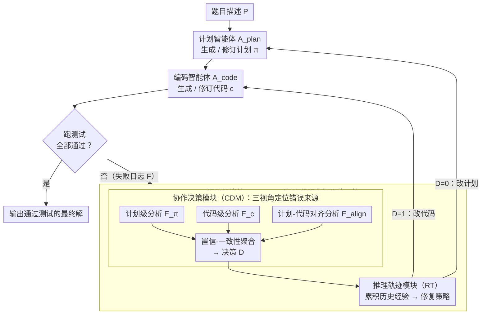

# CollabCoder: Plan-Code Co-Evolution via Collaborative Decision-Making for Efficient Code Generation

**会议**: ACL 2026 Findings  
**arXiv**: [2604.13946](https://arxiv.org/abs/2604.13946)  
**代码**: [https://github.com/ihbkaiser/CollabCoder](https://github.com/ihbkaiser/CollabCoder)  
**领域**: 代码生成 / 多智能体系统  
**关键词**: 代码生成, 计划-代码共演化, 多智能体, 协作调试, 推理轨迹

## 一句话总结

本文提出 CollabCoder，一个计划-代码共演化框架，通过协作决策模块（CDM）判断错误应在计划层还是代码层修复，结合推理轨迹模块（RT）实现从错误中学习的自改进调试，在复杂编程基准上比强基线提升 11-20%，同时减少 4-10 次 API 调用。

## 研究背景与动机

**领域现状**：LLM 代码生成已从直接生成发展到"先规划后编码"的双阶段范式：第一阶段生成计划并编码，第二阶段精炼或调试。近年出现了 MapCoder、CodeSIM 等多智能体框架，将生成过程分解为检索、规划和调试的迭代流程。

**现有痛点**：(1) 调试主要是反应式的，缺乏错误归因机制，往往产生重复且效果有限的修改；(2) 计划模块在整个调试过程中保持固定不变，无法根据代码修改和中间反馈进行调整；(3) 现有系统的有效推理复杂度为 $O(nk)$，导致计算开销高。

**核心矛盾**：当代码错误源于计划层面的逻辑错误时，仅修改代码无法解决根本问题；但现有方法无法区分错误来源——应该修改计划还是修改代码。

**本文目标**：设计一个计划和代码可以协作演化的框架，能够自适应地判断错误来源并选择相应的修复策略。

**切入角度**：引入协作决策模块（CDM）从三个互补视角（计划分析、代码分析、计划-代码对齐分析）诊断错误，并引入推理轨迹模块（RT）积累历史调试经验。

**核心 idea**：计划和代码应该共同演化——调试不仅修复代码，也应在必要时修订计划，且调试策略应从历史失败中持续学习。

## 方法详解

### 整体框架

CollabCoder 针对的是"先规划后编码"范式里的两个老毛病：计划一旦定下就在整个调试过程中冻结，而调试又是反应式的、只会反复改代码却说不清错到底出在哪。它让计划和代码协作演化——框架由计划智能体 $A_{\text{plan}}$、编码智能体 $A_{\text{code}}$ 和调试智能体 $A_{\text{debug}}$ 组成，其中调试智能体内部再分出协作决策模块（CDM）和推理轨迹模块（RT）。每轮迭代里，代码跑测试失败后，CDM 先诊断这次失败该归咎于计划还是代码，RT 则带着历史调试经验给出具体修复策略，再交由对应智能体执行，修完重测进入下一轮，直到通过全部测试或触顶迭代上限。输入是题目描述，中间是一份随调试不断被修订的计划与代码，输出是通过测试的最终解。

### 关键设计

**1. 协作决策模块（CDM）：从三个视角定位错误真正的来源**

当代码报错时，根因可能在实现细节，也可能在计划层的逻辑本身，单看代码无从分辨。CDM 在分析阶段并行做三种互补诊断——计划级分析 $E_\pi^{(t)}$ 判断计划逻辑是否与失败现象自洽、代码级分析 $E_c^{(t)}$ 假设计划正确时排查实现错误、计划-代码对齐分析 $E_{\text{align}}^{(t)}$ 检查计划与代码的语义一致性。决策阶段再用置信-一致性聚合函数 $D^{(t)} = \arg\max_{d} \sum_i w_i \cdot \phi_{i,d}^{(t)} \cdot \varphi_{H\setminus\{i\},d}^{(t)}$ 把三路诊断按权重和彼此一致性融合，输出"改计划"还是"改代码"。单一视角容易误判，三角度加权聚合则给出更可靠的错误归因。

**2. 推理轨迹模块（RT）：让调试从历史失败里持续学习**

先前方法把每次失败孤立处理，于是同一个无效改法被反复尝试。RT 维护一个持久的推理状态 $R^{(t)}$，每轮更新时联合考虑上一轮的历史调试上下文 $R^{(t-1)}$、本轮 CDM 的诊断信号 $E_X^{(t)}$、问题描述、当前解和失败证据，由此生成指导下一步修复的策略。把调试经验沉淀成可累积的状态，就避免了在"试错循环"里原地打转。

**3. 计划-代码共演化流程：让错误在正确的层面被修掉**

固定计划加反复修代码的僵化模式，碰到计划层逻辑错时根本无解。CollabCoder 在每轮迭代里由 CDM 输出修复目标（$D^{(t)} = 0$ 改计划、$D^{(t)} = 1$ 改代码），RT 配上相应策略，交对应智能体执行，修完重测再迭代。计划和代码因此能交替被修订、协同收敛，错误总能落到它真正该被修复的那一层。

### 损失函数 / 训练策略

CollabCoder 是无训练的推理时框架，不涉及任何梯度更新，所有"学习"都发生在 RT 的状态累积里。核心超参数为迭代次数 $t = 5$，CDM 三路诊断的信任权重 $w_\pi = 0.4$、$w_c = 0.3$、$w_{\text{align}} = 0.3$。框架对骨干模型无侵入，可直接套用 GPT-4o mini、Seed-Coder-8B、Qwen2.5-Coder-32B 等多种模型。

## 实验关键数据

### 主实验

**Seed-Coder-8B 上的代码生成准确率（Pass@1 %）**

| 方法 | HE | HE-ET | MBPP | MBPP-ET | Avg | API Calls |
|------|-----|-------|------|---------|-----|-----------|
| CoT | 82.32 | 75.00 | 75.06 | 50.13 | 70.63 | 1.00 |
| MapCoder | 79.88 | 70.12 | 73.55 | 49.12 | 68.78 | 9.84 |
| CodeSIM | 90.24 | 76.20 | 82.00 | 53.65 | 75.51 | 6.69 |
| **CollabCoder** | 87.20 | 78.05 | 83.37 | 56.42 | **76.26** | **5.06** |

**在复杂基准上的表现（GPT-4o mini）**

| 方法 | LiveCodeBench | xCodeEval | API Calls |
|------|---------------|-----------|-----------|
| CodeSIM | 39.60 | 20.26 | 8.41 |
| ThinkCoder | 36.91 | 18.93 | 9.00 |
| **CollabCoder** | **47.65** | **22.37** | **4.76** |

### 消融实验

| 配置 | 性能 | 说明 |
|------|------|------|
| 完整 CollabCoder | 最优 | CDM + RT 完整版 |
| 去除 CDM（仅修代码） | 下降 | 无法修正计划层错误 |
| 去除 RT（无历史经验） | 下降 | 重复无效修复 |
| 去除对齐分析 | 略降 | 减少错误归因准确性 |

### 关键发现

- 在难度较高的 LiveCodeBench 和 xCodeEval 上优势更明显：比 CodeSIM 提升 11-20%，同时减少约 4 个 API 调用
- CDM 的错误归因准确率在迭代中持续提升，说明三角度分析的有效性
- RT 模块显著减少了重复无效修复的次数，提高了调试效率
- 在简单基准（HumanEval、MBPP）上与 SOTA 持平，在复杂基准上明显超越

## 亮点与洞察

- "修改计划还是修改代码"的决策机制抓住了代码调试中的核心痛点
- 推理轨迹的状态积累避免了"试错循环"——这是当前多智能体系统的常见问题
- 效率与效果双赢：更少的 API 调用+更高的准确率，在困难任务上优势尤为突出

## 局限与展望

- CDM 的信任权重为固定超参数，可能不适用于所有任务类型
- 在简单任务上改进有限，开销可能不划算
- 依赖 LLM 的代码分析能力，对于 LLM 本身不擅长的编程范式可能效果受限
- RT 的历史窗口有限，长调试序列中可能遗漏关键信息

## 相关工作与启发

- **vs MapCoder/CodeSIM**: 这些方法用固定计划+多轮代码修复，CollabCoder 允许计划和代码共演化
- **vs ThinkCoder**: ThinkCoder 使用 20 轮调试但效果不如 CollabCoder 的 5 轮，说明自适应决策比蛮力迭代更有效

## 评分

- 新颖性: ⭐⭐⭐⭐ 计划-代码共演化和协作决策机制是对现有代码生成智能体的重要改进
- 实验充分度: ⭐⭐⭐⭐⭐ 六个基准、三种骨干模型、效率分析、消融研究，非常全面
- 写作质量: ⭐⭐⭐⭐ 框架描述清晰，图示直观
- 价值: ⭐⭐⭐⭐ 在复杂编程任务上实现了效率与效果的双赢

<!-- RELATED:START -->

## 相关论文

- [\[ACL 2026\] PaT: Planning-after-Trial for Efficient Test-Time Code Generation](pat_planning-after-trial_for_efficient_test-time_code_generation.md)
- [\[ACL 2026\] SolidCoder: Bridging the Mental-Reality Gap in LLM Code Generation through Concrete Execution](solidcoder_bridging_the_mental-reality_gap_in_llm_code_generation_through_concre.md)
- [\[ACL 2025\] Tree-of-Evolution: Tree-Structured Instruction Evolution for Code Generation in Large Language Models](../../ACL2025/code_intelligence/tree_of_evolution_code_gen.md)
- [\[ACL 2026\] Learning Adaptive Parallel Execution for Efficient Code Localization](learning_adaptive_parallel_execution_for_efficient_code_localization.md)
- [\[ACL 2026\] MARS2: Scaling Multi-Agent Tree Search via Reinforcement Learning for Code Generation](mars2_scaling_multi-agent_tree_search_via_reinforcement_learning_for_code_genera.md)

<!-- RELATED:END -->
