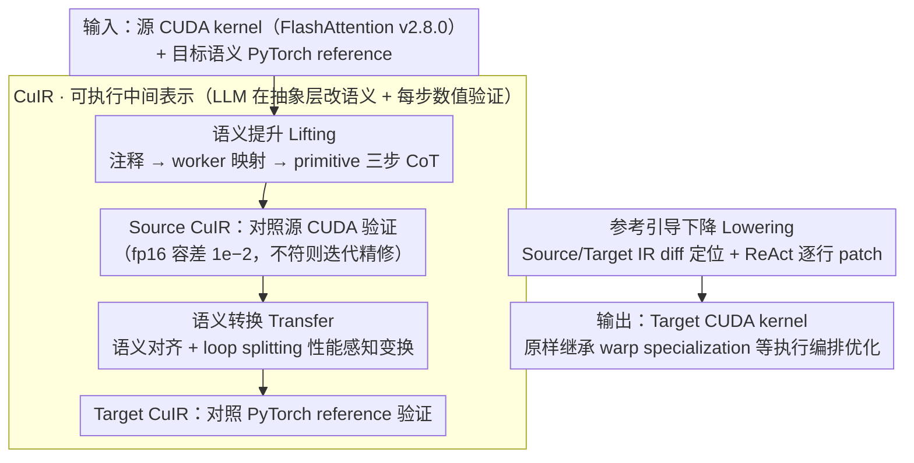

# CuBridge: An LLM-Based Framework for Understanding and Reconstructing High-Performance Attention Kernels

**会议**: ACL 2026  
**arXiv**: [2605.05023](https://arxiv.org/abs/2605.05023)  
**代码**: 暂未公开  
**领域**: 代码智能 / HPC / GPU Kernel 自动适配  
**关键词**: CUDA、Attention Kernel、LLM Code Generation、Intermediate Representation、Lift-Transfer-Lower

## 一句话总结
作者把"用 LLM 直接改 FlashAttention CUDA 代码"这件不靠谱的事，重写成"lift 到可执行 IR（CuIR）→ 按 PyTorch reference transfer → 差分式 lower 回 CUDA"三段式工作流，在 A100/H100 上对 8 类 attention 变体保持 100% 正确率，相对 PyTorch 平均 16.03×、相对 FlexAttention 1.39×、相对前一代 LLM-based 方法 Qimeng-Attention 3.33× 加速。

## 研究背景与动机
**领域现状**：现代深度学习的性能命脉是 GPU 上手写的 CUDA attention 内核（FlashAttention 系列、cuBLAS、CUTLASS）。但随着模型架构演化，attention 不断出现新形式——PrefixLM、Sliding Window、Sigmoid Attention、Softcap、Sliding+Softcap 组合等。

**现有痛点**：现有路径都有显著缺陷——(1) PyTorch 等高级框架灵活但慢，会拆出多个 fine-grained kernel，频繁 launch + 重复 global memory 访问；(2) FlexAttention 这类基于模板的编译器允许有限定制但被模板束缚，不支持非标准变体；(3) FlashAttention 等专家库性能顶级但扩展每个变体都要资深工程师重写；(4) 直接用 LLM 端到端生成或改写 CUDA kernel，KernelBench 等 benchmark 显示 attention 类复杂算子上正确率不稳定、性能比专家版慢最多 34.9×（Ouyang et al. 2025）。

**核心矛盾**：专家 CUDA kernel 已经把"正确高效的执行编排（execution orchestration）"硬编码在了底层 PTX 与异步原语里；而 LLM 直接面对这种代码时，既看不清"哪一段是干什么的"，也分不清"这段属于哪个 warp"——semantic 修改和 syntax 操作纠缠在一起，导致 LLM 改一行就崩。

**本文目标**：让 LLM 在不端到端生成 kernel 的前提下，准确地把已有专家 kernel 适配到新的 attention 语义，并保留全部的 hardware-specific 执行编排。

**切入角度**：与其让 LLM 直面 PTX/CuTe 的复杂语法，不如先把 CUDA "lift" 到一个把执行编排显式化、且本身可执行的 IR 上，让 LLM 在抽象层做语义修改，再"lower"回 CUDA。

**核心 idea**：设计 Pythonic 可执行 IR——CuIR——把 memory/compute/sync/control 四类原语暴露执行编排（tile shape、memory hierarchy、指令选择、依赖、并行粒度），用 lift-transfer-lower 三段流水线 + 在每一段都做 IR 级执行验证，把"LLM 写 CUDA"变成"LLM 写 IR + 工具 lift/lower"的可靠协同。

## 方法详解

### 整体框架
CuBridge 解决的问题是：给定一个手写的高性能源 CUDA kernel（默认 FlashAttention v2.8.0）和一段描述目标语义的 PyTorch reference（如想要 PrefixLM mask），自动产出一个针对该变体的高性能 CUDA kernel。它不让 LLM 直面 PTX，而是把整个适配过程拆成 lift-transfer-lower 三段流水线：先把 Source CUDA「lift」成一个把执行编排显式化、本身可执行的中间表示 CuIR，让 LLM 在抽象层读懂并按目标语义「transfer」成 Target CuIR，最后通过 IR diff 定位差异、以最小 patch「lower」回 Target CUDA。贯穿全程的关键保障是每一段产出的 CuIR 都能在 backend executor 上跑出数值——lift 后对照源 CUDA（fp16 容差 $10^{-2}$）、transfer 后对照 PyTorch reference——把 LLM 每一步的输出都拉回到「可证明等价」的轨道上，这是整套系统能保持 100% 正确率的根因。

### 关键设计

**1. CuIR：把执行编排显式化的可执行中间表示**

以往 LLM 改 CUDA 的失败模式是「看不懂复杂语法、又找不到要改的位置」——semantic 修改和 PTX 级 syntax 操作纠缠在一起，改一行就崩。CuIR 的破解办法是用 Python 语法配一套极小的原语集合，把真正决定性能的执行编排从语法噪音里抽出来：Memory 类（`alloc / copy / copy_async`）暴露 tile shape 与内存层级，Compute 类（`gemm / gemm_async`）暴露指令变体，Sync 类（`barrier.wait / arrive`）暴露同步范围，Control 类（`bind / commit`）暴露并行粒度与依赖，而 thread-level indexing 这种与「理解执行结构」无关的细节被彻底抽掉。

更关键的是 CuIR 不止是文档而是可执行工件：它的程序基于 PyTorch tensor 操作 tile-level 数据，能被 backend executor 直接运行——独立的并行任务被串行执行（不影响正确性），有依赖的任务严格按同步约束的顺序执行，与 CUDA 的真实行为对齐。这样「是什么 / 谁干的 / 顺序如何」三件事都变成 LLM 易读的 primitive 序列，且「修改前后语义是否等价」可以靠数值执行闭环验证——这正是把不可靠的 LLM 编程变成可靠工程系统的工艺核心。

**2. 语义提升（Semantic Lifting）：注释 → worker 映射 → primitive 三步 CoT 还原**

专家 kernel 里 warp specialization 是异步且隐式的，warp 与代码块的对应关系藏在大量 `threadIdx` 条件分支里，LLM 一旦搞错「这段是谁干的」，后续 transfer 必然连锁崩溃。Lifting 把还原过程拆成单次 LLM 调用内的三段链式思考：先做 Syntax Annotation，用 CUDA/CuTe 文档为每个低层 intrinsic 加语义注释，把 implicit 意图变 explicit；再做 Code-to-Worker Mapping，分析控制流谓词（如 `if (threadIdx.x < 128)`）把代码段归属到对应的 warp group / warp 等 cooperative worker；最后做 Primitive Lifting，把每个 worker 对齐的代码区域翻成 CuIR primitive 序列，恢复 tile shape、内存放置、同步范围等参数。

这套设计的要点是把「identification → attribution → translation」显式拆开，让 LLM 每一步只做一件事、每步都有结构化 checklist，再叠加 lifting 后的数值验证闭环纠错——还原出的 Source CuIR 必须与源 CUDA 数值等价才放行，否则迭代精修。

**3. 语义转换（Semantic Transformation）：先把语义改对，再顺手做性能感知变换**

提升得到的 Source CuIR 只忠实复刻了源 kernel，要适配新变体还得在抽象层把语义改对、且别改慢，这一步交给 IR Transfer。它先做语义对齐（Semantic Alignment）：分析目标 PyTorch reference、找出「源 IR 与目标算子之间差在哪」，把缺的语义映射到 CuIR primitive，并定位源编排里哪些地方需要扩展或修改，生成既实现目标计算、又在结构上与 Source IR 对齐的 Target CuIR——结构对齐是关键，正是它让后续 lowering 能靠 IR diff 精确定位改动落点。

但一个语义正确的 Target IR 未必高效，所以 Transfer 还会在生成时分析这次语义改动的性能含义，顺手做性能感知变换（Performance-Aware Transformation）。典型例子是 PrefixLM：mask 只在 boundary tile 上才需要逐元素检查，于是 Transfer 自动做 loop splitting，把整块有效的走 check-free 的 Full Loop、边界块走带 masking 的 Partial Loop，省掉 full-loop 区无谓的逐元素判断。这类优化放在 IR 层做，比在生成出的 CUDA 上手改安全得多。生成的 Target IR 同样要在 backend executor 上跑、对照 PyTorch reference 验证，不符则迭代精修。

**4. 参考引导下降（Reference-guided Lowering）：IR diff 定位 + ReAct 最小化 patch**

让 LLM「重写整段 CUDA」几乎必崩——上下文太长、实现风格漂移、对齐失败，还会丢掉源 kernel 难以言传的优化。Lowering 因此走最小化改动路线：先做 Differential Analysis 比对 Source/Target CuIR 找出语义差异，再借 lifting 阶段保留的 region 对应关系把改动精确定位到原 CUDA 的具体代码段；接着做 Reference-Guided Lowering，把 Source CUDA 当作「CuIR 该怎么落地成 CUDA」的实现风格参考，照葫芦画瓢地把抽象 primitive（如 `copy_async`）转成 PTX intrinsic（如 `cp.async.ca`）、把 tile-level 操作扩展为 thread-level indexing；最后用 ReAct 框架按行级 `Edit_Line` 动作（insert/delete/modify）逐行打 patch，每轮编译/数值失败就把完整错误信息喂回 LLM 再试。

因为只动必要的几行，目标 kernel 得以原样继承源 kernel 几乎全部的 hardware-specific 优化（warp specialization、tensor/cuda core overlap）——这也是 CuBridge 在 H100 上对最复杂的 comb 变体能拿到 11.47× Qimeng-Attention 加速的原因：它真正继承了 FlashAttention 的执行编排，而非从零重写。

### 损失函数 / 训练策略
全程不训练新模型，是纯 inference-time pipeline。LLM 采样用 temperature $=0$、best-of-$k$（$k=10$）报最佳；所有 IR 执行验证沿用 CUTLASS 惯例的 fp16 数值容差 $10^{-2}$；源 kernel 默认 FlashAttention v2.8.0，每段 IR 在 CuIR backend executor 上运行，lower 阶段的逐行 patch 由 ReAct 框架的 `Edit_Line` action 完成。

## 实验关键数据

### 主实验
A100 + H100 两个平台、8 类 attention 变体（PrefixLM、Global Sliding Window、Share Question Mask、Causal Blockwise、Relative Position Embedding、ReLU、Sigmoid + 一个 comb 组合）、3 个模型配置（Llama2-7B MHA、Qwen2.5-72B GQA、Llama3.1-405B GQA）、序列长度 1k/2k/4k/8k 共 8k 总 token 维持 batch。汇总性能（论文 Fig 6 / 文本节选）：

| 平台 | vs PyTorch | vs FlexAttention | vs Qimeng-Attention |
|------|-----------|------------------|---------------------|
| A100 平均 | 12.69× | 1.18× | 2.54× |
| H100 平均 | 19.82× | 1.62× | 4.35× |
| 总平均 | **16.03×** | **1.39×** | **3.33×** |

具体 spread：vs FlexAttention 在 A100 上 1.05×–1.22×、在 H100 上 1.26×–1.66×；vs Qimeng-Attention 在 A100 上 1.18×–10.56×、在 H100 上 1.43×–20.3×；最复杂的 comb 变体 H100 上达 11.47×（A100 5.37×）。与手写顶级库 FlashInfer 对比：在 FlashInfer 原生支持的变体上 1.07×（持平），在 FlashInfer 不支持的变体上反超 3.49×。所有变体均 100% 正确。

### 消融实验
H100 上 8 变体 × 12 序列长度 = 96 个 case 上做"是否引入 CuIR"的对比（Table 2）：

| 方法 | Pass@1 | Pass@3 | Pass@5 | 归一化加速比（vs Vanilla GPT-5） |
|------|--------|--------|--------|----------------------------------|
| Vanilla GPT-5（单次直接改写源 kernel） | 0.21 | 0.33 | 0.38 | 1.00× |
| GPT-5 + ReAct（迭代但无 CuIR） | 0.41 | 0.54 | 0.58 | 1.23× |
| **GPT-5 + CuBridge** | **0.70** | **0.85** | **1.00** | **4.19×** |

LLM 后端泛化（Table 3，H100 + PrefixLM + Llama2-7B 配置，TFLOPS）：

| 后端 | Seq=1k | Seq=2k | Seq=4k | Seq=8k |
|------|--------|--------|--------|--------|
| GPT-5 | 304.35 | 426.82 | 577.03 | 551.73 |
| Claude | 292.87 | 428.64 | 562.91 | 569.02 |
| DeepSeek-V3 | 294.12 | 424.05 | 557.03 | 549.73 |
| Qwen-3-235B | 295.04 | 421.63 | 558.74 | 542.61 |
| Qwen-3-32B | N/A | N/A | N/A | N/A |

### 关键发现
- **CuIR 是正确率的根因**：Vanilla GPT-5 Pass@5 只能爬到 0.38（采样饱和），加上 ReAct 也只到 0.58 且 1.23× 加速；CuBridge Pass@5 = 1.00、4.19× 加速。说明问题不在"采样不够"，而在 LLM 没有可推理的中间结构。
- **能力阈值 vs 模型选择**：GPT-5/Claude/DeepSeek-V3/Qwen-3-235B 性能相差 <5%——说明性能上限主要由 lift-transfer-lower 工作流 + CuIR 决定，而非具体模型；但 Qwen-3-32B 不达 baseline CUDA 推理能力直接失败，存在明确的"模型能力底线"。
- **越新越复杂的硬件，CuBridge 优势越大**：vs FlexAttention 的加速比 A100→H100 由 1.18× 升到 1.62×；vs Qimeng-Attention 由 2.54× 升到 4.35×。原因是 CuBridge 通过 reference-guided lowering 保留了源 kernel 的 warp specialization 与 tensor/cuda core overlap 等 H100 专属优化，而 LLM 直接生成这些异步原语极易翻车。
- **kernel fusion vs 多 kernel launch**：CuBridge 生成单个 fused kernel 取代 PyTorch 的多 kernel 链，避免重复 global memory 访问和 OOM。
- **Loop Splitting 等 performance-aware transformation 的价值**：PrefixLM 中 boundary tile 才需 mask check，IR Transfer 自动做 loop splitting 把 full tile 走"check-free Full Loop"、partial tile 走"Partial Loop"，这种优化在 IR 层就完成，比在 CUDA 层手改安全得多。

## 亮点与洞察
- **"不让 LLM 直面 CUDA"是工程上的关键智慧**：CuIR 的角色类似 MLIR/Triton——把 LLM 该处理的层级抽象到正好够用，而把"线程级索引、PTX intrinsic"这类"LLM 必崩"的细节交给确定性 lowering。这是把 LLM 当"语义层程序员"用的可复制范式。
- **可执行 + 数值验证的中间表示**：CuIR 不只是 documentation，每一步都能在 backend executor 跑出数值，能与源 CUDA / PyTorch reference 数值对照，把 LLM 在每一阶段的输出都拉回到"可证明正确"的轨道——这是工业级可靠性的工艺核心。
- **lift-transfer-lower + 最小 patch**：把"端到端代码生成"拆成"差异化编辑"，是一种和重写完全不同的思路；这让生成结果天然继承源代码所有难以言传的工程优化，特别适合 HPC / 编译器后端这种"99% 沿用、1% 修改"的场景。
- **Reference-Guided Lowering 的可迁移性**：把源代码当 style guide 让 LLM 模仿地写新代码，思路可直接迁移到 ISA-specific intrinsic、内核内 instrinsic 别名漂移、API 版本升级、平台移植等所有"有参考实现的代码迁移"任务。

## 局限与展望
- 作者承认的局限：(1) 强依赖高质量专家源 kernel——NVIDIA 平台有 FlashAttention，但 FPGA、AMD MI 系、TPU、华为 NPU 这类生态可能没有同等参考；(2) 当前仅验证 attention 这类执行编排极复杂的算子，未扩展到科学计算、稀疏算子等其它 HPC 任务。
- 自己发现的局限：(1) CuIR 原语集合（11 个）是为 attention 量身定制的，遇到 conv、recursive scan、convex 优化等其它复杂模式可能要扩；(2) lifting 阶段失败一次会导致整个 pipeline 重启，缺少 partial lift 的回退；(3) best-of-10 + 多轮验证带来推理成本与 LLM API 费用，对部署敏感场景不友好；(4) 评测均在 NVIDIA 平台，跨厂商 GPU/加速器是否成立未知；(5) lower 阶段的 line-level patch 在大规模重构（如 swap 内外循环）时可能失效，需要更高层结构化 edit primitive。
- 改进思路：(1) 把 CuIR 拓展为多算子通用 HPC IR（带 conv / scan / spmm 原语）；(2) 引入 partial-lift fallback，让无法 lift 的局部用 CUDA 直接传递；(3) 用 distillation 把"CuIR lift/transfer 能力"灌入 7-32B 小模型，降低推理成本；(4) 把 CuIR 与 Triton / TVM / MLIR Linalg 互转，打通现有 compiler 生态；(5) 与 reinforcement learning（Kevin / STARK 之类的 multi-turn RL kernel 优化）结合，让 transfer 阶段也能自动搜索 schedule。

## 相关工作与启发
- **vs FlashAttention 系列 (Dao et al.)**：CuBridge 把 FlashAttention 当源 kernel reference，而非取代它——是"专家库的智能扩展器"。
- **vs FlexAttention (Guessous et al.)**：FlexAttention 用模板 + 编译器自动生成 attention，胜在编译路径成熟，但被模板束缚（不支持 ReLU/Sigmoid/comb）；CuBridge 通过 IR-level 改写突破模板，但代价是依赖 LLM 推理。
- **vs Qimeng-Attention / CUDA-LLM / Kevin / STARK**：这些工作都让 LLM 端到端生成 CUDA kernel（或用 multi-agent / profiler-feedback / RL 优化），CuBridge 区别在于"先 lift 再 transfer 再 lower"，把生成空间从无结构 CUDA 收窄到结构化 CuIR，显著降低了搜索难度。
- **vs Triton / TVM / MLIR**：传统 IR 是给编译器写的、表达能力广但与高性能 GPU 内核优化的对齐弱；CuIR 专门为 LLM 推理 + 高性能 attention 设计，原语数量极少（11 个），但每个都暴露最关键的执行编排信息。
- **启发**：(1) "LLM 不直接写底层语言、而是写一个可执行 IR + 自动 lowering"这一范式对 SQL 优化、PyTorch 算子改写、HDL 设计等所有"复杂底层、易错重写"场景普适；(2) "Reference-Guided Lowering"（让 LLM 模仿已有实现风格而非创造）是通用代码迁移工具的关键工艺，可直接用于 ARM↔x86、Vulkan↔Metal、CUDA↔HIP 移植；(3) "可执行 IR + 数值验证"应成为所有 LLM-assisted code transformation 系统的标配。

## 评分
- 新颖性: ⭐⭐⭐⭐ "lift-transfer-lower + 可执行 IR + reference-guided lowering"四件套是首次系统应用于 attention kernel 自动适配，对 LLM-for-systems 是清晰的方法学贡献。
- 实验充分度: ⭐⭐⭐⭐⭐ 两平台 × 8 变体 × 4 序列长度 × 3 模型配置 × 5 LLM 后端 + 96 case 消融 + 与 5 类基线（PyTorch / FlexAttention / Qimeng / FlashInfer / Vanilla LLM）的横向比较，HPC 类论文里属于上乘。
- 写作质量: ⭐⭐⭐⭐⭐ 故事线（trade-off → IR → lift/transfer/lower）层层递进，图 4/5 的对照式 IR/CUDA 示意非常直观，正负例对比清晰。
- 价值: ⭐⭐⭐⭐⭐ 把"LLM 写 attention CUDA"从玩具变成可靠工程系统，对 LLM/HPC 交叉社区有强示范效应，方法论可平移到几乎所有"LLM-assisted code transformation"领域。

<!-- RELATED:START -->

## 相关论文

- [\[ACL 2026\] ChatHLS: Towards Systematic Design Automation and Optimization for High-Level Synthesis](chathls_towards_systematic_design_automation_and_optimization_for_high-level_syn.md)
- [\[NeurIPS 2025\] A Stochastic Differential Equation Framework for Multi-Objective LLM Interactions](../../NeurIPS2025/code_intelligence/a_stochastic_differential_equation_framework_for_multi-objective_llm_interaction.md)
- [\[ACL 2026\] Sense and Sensitivity: Examining the Influence of Semantic Recall on Long Context Code Understanding](sense_and_sensitivity_examining_the_influence_of_semantic_recall_on_long_context.md)
- [\[ACL 2026\] Discover and Prove: An Open-source Agentic Framework for Hard Mode Automated Theorem Proving in Lean 4](discover_and_prove_an_open-source_agentic_framework_for_hard_mode_automated_theo.md)
- [\[ACL 2026\] LogicEval: A Systematic Framework for Evaluating Automated Repair Techniques for Logical Vulnerabilities in Real-World Software](logiceval_a_systematic_framework_for_evaluating_automated_repair_techniques_for_.md)

<!-- RELATED:END -->
