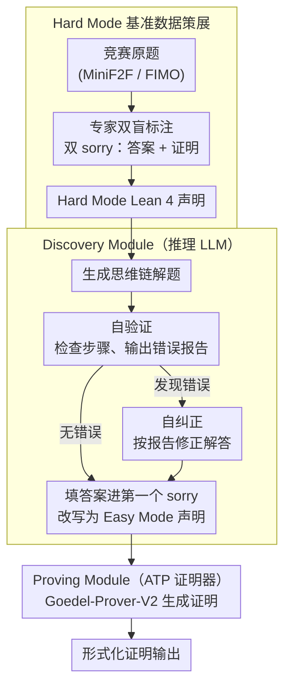

# Discover and Prove: An Open-source Agentic Framework for Hard Mode Automated Theorem Proving in Lean 4

**会议**: ACL 2026  
**arXiv**: [2604.15839](https://arxiv.org/abs/2604.15839)  
**代码**: [GitHub](https://github.com/liuchengwucn/discover-and-prove)  
**领域**: LLM Agent  
**关键词**: 自动定理证明, Hard Mode, Lean 4, 答案发现, 形式化验证

## 一句话总结
DAP 提出了 Hard Mode ATP 的概念（AI 必须自行发现答案再构造证明，而非使用嵌入答案的 Easy Mode 声明），发布了 MiniF2F-Hard 和 FIMO-Hard 基准，并设计了"发现+证明"两阶段框架——用 LLM 自然语言推理发现答案后改写为 Easy Mode 声明交给形式化证明器，在 CombiBench 上将解题数从 7 提升到 10，首次在 PutnamBench Hard Mode 上证明 36 个定理。

## 研究背景与动机

**领域现状**：自动定理证明（ATP）取得了快速进展，Seed-Prover 在 MiniF2F 上趋近饱和。但现有基准普遍采用"Easy Mode"——将最终答案嵌入形式化声明中——这降低了任务难度，因为人类参赛者必须自己发现答案。

**现有痛点**：(1) Easy Mode 大幅降低了问题难度——对许多竞赛题，发现答案才是主要挑战，知道答案后的证明相对简单；(2) 部分形式化声明与原题语义不完全对齐——如只证明了单方向蕴含而原题要求充要条件；(3) LLM 在非形式推理上超过 80% 答案准确率，但形式化证明器只能处理不到 10%，暴露了巨大的能力差距。

**核心矛盾**：Easy Mode 让 ATP 基准过于乐观地估计了 AI 的数学能力，因为它省略了人类解题中最具挑战性的"发现"环节。

**本文目标**：(1) 建立更公平的 Hard Mode ATP 基准；(2) 设计能处理 Hard Mode 问题的框架。

**切入角度**：将 Hard Mode 问题分解为两步——先用非形式 LLM 推理发现答案（Discovery），再用形式化证明器证明（Proving），模拟人类数学家的思考流程。

**核心 idea**：解耦"发现答案"和"构造证明"——用 LLM 的强非形式推理能力弥补形式化证明器的弱点。

## 方法详解

### 整体框架
DAP 要解决的是 Hard Mode ATP：题目不再把答案嵌在形式化声明里，而是要求 AI 像人一样先发现答案再证明。它把这件事解耦成两个模块的流水线：输入一道 Hard Mode 的 Lean 4 声明，Discovery Module 用推理 LLM 做非形式推理找出答案并把它填回声明、改写成 Easy Mode，再交给 Proving Module，由现成 ATP 证明器（Goedel-Prover-V2）生成形式化证明。核心思路是用 LLM 在非形式推理上 >80% 的答案准确率，去弥补形式化证明器 <10% 的薄弱环节。

### 关键设计

**1. Discovery Module：生成→自验→自纠→改写的答案发现**

对许多竞赛题，「发现答案」才是主要挑战，知道答案后的证明反而相对简单，所以 DAP 把发现独立出来用最强推理 LLM（GPT-OSS-120B）走四步：先由推理 LLM 生成详细的思维链解题过程；再自验证，让 LLM 检查自身步骤的潜在错误并生成错误报告；仅在发现错误时才触发自纠正，基于错误报告生成修正后的解答；最后把发现的答案填入 Hard Mode 声明的第一个 `sorry` 占位符，生成 Easy Mode 声明。自验证和自纠正这两步是答案准确率的主要提升来源。

**2. Hard Mode 基准数据策展：双 `sorry` 双盲框架**

Easy Mode 的形式化可能语义弱于原题（如只证明了单方向蕴涵而原题要求充要条件，或省略了可达性证明），让基准高估了 AI 的能力。作者请专家重新标注 MiniF2F 和 FIMO，把「答案导向」问题编码为两个 `sorry` 占位符（第一个填答案、第二个填证明），同时修正已知的语义对齐问题并提供 Lean 4 版本的 FIMO。这样 AI 面对的任务才与人类参赛者一致，得到的评估才公平。

**3. 模块解耦与可扩展性：两条能力曲线各自提途**

Discovery Module 和 Proving Module 用不同的 LLM、互不依赖，任何推理模型或 ATP 系统的进步都能直接提升 DAP 的整体性能。这个设计点正好提供了「发现、证明各自用最强工具」的自由度：当下 LLM 在非形式推理上进步迅速但形式化证明仍受限，解耦设计能最大化地吃到两个方向各自的红利。

### 损失函数 / 训练策略
无训练。Discovery Module 靠精心设计的 prompt 驱动，Proving Module 直接用预训练的 Goedel-Prover-V2。

## 实验关键数据

### 主实验

| 基准 | 方法 | 解题数 | 说明 |
|------|------|--------|------|
| CombiBench Hard | 此前SOTA (Kimina) | 7-8 | Pass@16 |
| CombiBench Hard | **DAP** | **10** | 新SOTA |
| PutnamBench Hard | 此前 | 0 (无公开结果) | 首次评估 |
| PutnamBench Hard | **DAP** | **36** | 首个Hard Mode结果 |

### 消融实验

| 配置 | 说明 |
|------|------|
| 仅Discovery（无Proving） | 答案准确率>80%，但无形式化保证 |
| 仅Proving（Easy Mode） | 形式化证明率<10% |
| Discovery+Proving | 两者互补，证明数显著提升 |

### 关键发现
- LLM 在非形式推理上的答案准确率（>80%）远超形式化证明率（<10%），揭示了 Hard Mode 基准独特的度量价值
- DAP 的 Discovery Module 对最终性能贡献最大——错误的答案发现直接导致不可证明的声明
- 自验证和自纠正步骤显著提升答案准确率
- Easy Mode 和 Hard Mode 之间的性能差距在困难问题上更加显著

## 亮点与洞察
- **Easy Mode vs Hard Mode 的区分**是对 ATP 评估方法论的重要贡献——暴露了现有基准可能过于乐观的问题
- 非形式推理 80% vs 形式化证明 10% 的差距量化了"知道答案"与"严格证明"之间的鸿沟
- DAP 框架设计简洁但效果显著——不需要复杂的搜索或 RL 训练，仅靠 prompt 工程和模块解耦

## 局限与展望
- Discovery Module 的答案准确率仍非 100%，错误答案导致的不可证明声明浪费了证明器的计算
- 仅使用单一推理 LLM，集成多个推理模型可能提升答案发现率
- 自验证的可靠性有限——LLM 可能无法检测自身的微妙推理错误

## 相关工作与启发
- **vs DSP/DSP+**: DSP 用自然语言草稿指导形式化证明，DAP 用自然语言发现答案后改写声明——DAP 直接解决 Hard Mode 的答案发现问题
- **vs Seed-Prover**: Seed-Prover 是 lemma 风格的全证明推理模型，DAP 解耦了发现和证明，更灵活
- **vs AlphaProof**: AlphaProof 使用强化学习，DAP 完全开源且基于 prompt，更可复现

## 评分
- 新颖性: ⭐⭐⭐⭐⭐ Hard Mode ATP 概念+基准+框架三位一体的贡献
- 实验充分度: ⭐⭐⭐⭐ 多基准评估+消融，但数据规模有限
- 写作质量: ⭐⭐⭐⭐⭐ Easy/Hard Mode 区分的动机论述极为清晰
- 价值: ⭐⭐⭐⭐⭐ 对 ATP 评估方法论和实践都有重要影响

<!-- RELATED:START -->

## 相关论文

- [\[ACL 2026\] Benchmarking Testing in Automated Theorem Proving](benchmarking_testing_in_automated_theorem_proving.md)
- [\[ACL 2026\] FormalScience: Scalable Human-in-the-Loop Autoformalisation of Science with Agentic Code Generation in Lean](formalscience_scalable_human-in-the-loop_autoformalisation_of_science_with_agent.md)
- [\[ACL 2026\] LogicEval: A Systematic Framework for Evaluating Automated Repair Techniques for Logical Vulnerabilities in Real-World Software](logiceval_a_systematic_framework_for_evaluating_automated_repair_techniques_for_.md)
- [\[ACL 2026\] CuBridge: An LLM-Based Framework for Understanding and Reconstructing High-Performance Attention Kernels](cubridge_an_llm-based_framework_for_understanding_and_reconstructing_high-perfor.md)
- [\[AAAI 2026\] Why Do Open-Source LLMs Struggle with Data Analysis? A Systematic Empirical Study](../../AAAI2026/code_intelligence/why_do_open-source_llms_struggle_with_data_analysis_a_systematic_empirical_study.md)

<!-- RELATED:END -->
