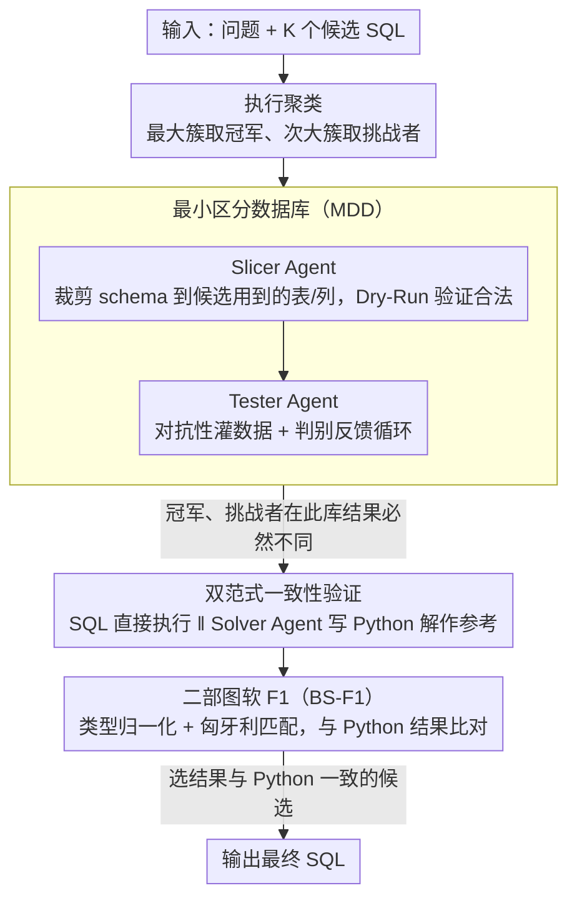

# DPC: Training-Free Text-to-SQL Candidate Selection via Dual-Paradigm Consistency

**会议**: ACL 2026  
**arXiv**: [2604.15163](https://arxiv.org/abs/2604.15163)  
**代码**: [GitHub](https://github.com/HKUSTDial/DPC)  
**领域**: LLM推理  
**关键词**: SQL选择, 双范式一致性, 最小区分数据库, 训练免, 对抗环境合成

## 一句话总结
DPC 将 Text-to-SQL 的候选选择从"在隐藏数据上猜测"转化为"在可见数据上确定性验证"：构造最小区分数据库（MDD）使冲突 SQL 产生不同结果，再用 Python/Pandas 解作为参考锚点通过跨范式一致性选择正确候选，在 BIRD 和 Spider 上超越 Self-Consistency 最高 2.2%。

## 研究背景与动机

**领域现状**：Text-to-SQL 采用"生成再选择"范式——生成 K 个候选 SQL 再选最优。但存在显著的"生成-选择差距"：Pass@K 远高于 Pass@1（如 BIRD 上 58.8% vs ~50%），说明正确 SQL 已在候选中但选择失败。

**现有痛点**：（1）Self-Consistency（多数投票）在模型系统性偏差时失败——模型一致性地收敛于错误答案；（2）LLM-as-Judge 因"符号盲目性"无法心算复杂 SQL 的执行状态；（3）训练式验证器需昂贵标注且领域脆弱性差。

**核心矛盾**：SQL 验证的三重挑战——部分可观察性（真实数据库太大放不进上下文）、符号盲目性（LLM 无法内部模拟 SQL 执行）、固有确认偏差（模型偏向自己生成的候选）。

**本文目标**：设计一个训练免的 SQL 选择框架，将验证从概率性猜测转化为确定性判断。

**切入角度**：构造一个精心设计的小数据库使冲突 SQL 必然产生不同结果，再用 Python 代码作为独立推理路径来交叉验证。

**核心 idea**：对抗性环境合成（MDD）+ 双范式执行（SQL vs Python）+ 一致性投票。

## 方法详解

### 整体框架

DPC 把"在隐藏的真实数据库上猜哪个候选 SQL 对"这个概率性难题，改造成"在一个可控小数据库上做确定性验证"。输入是问题加上 K 个候选 SQL，DPC 先按执行结果把候选聚成簇，挑出最大簇的冠军和次大簇的挑战者；再为这对冲突 SQL 现场合成一个能让二者必然产生不同结果的最小数据库；最后让 SQL 和 Python 两条独立推理路径在这个数据库上各自给出答案，谁的结果与 Python 参考一致就选谁，输出最终 SQL。

### 关键设计

**1. 最小区分数据库（MDD）：把"部分可观察"变成"完全可观察"**

真实数据库太大塞不进上下文，模型只能在看不全数据的情况下盲猜——这正是 SQL 选择失败的根源。DPC 用两个 agent 现场造一个小到能看全、又恰好能暴露候选差异的数据库。Slicer Agent 先迭代裁剪 schema，只保留候选 SQL 真正用到的表和列，并通过 Dry-Run 确认裁剪后结构仍然合法；Tester Agent 再对抗性地往里灌数据，靠一个判别反馈循环不断调整，直到冠军和挑战者在这个库上跑出不同结果为止。关键在于这种构造是"对症下药"的：要区分 INNER JOIN 和 LEFT JOIN，就必须造出特定的无匹配键记录——随机采样几乎不可能撞上这种区分性数据，所以必须针对候选间的具体差异来定向合成。

**2. 双范式一致性验证：用第二种语言打破确认偏差**

让同一个模型去评判自己生成的 SQL，天然带着确认偏差，且 LLM 对声明式 SQL 存在"符号盲目性"、无法在脑内模拟其执行。DPC 借用一个能力差异：LLM 写命令式的 Python/Pandas 比写声明式 SQL 更可靠——Python 在预训练语料里覆盖更广，且命令式代码逼着模型把数据操作一步步显式规划出来。于是 Solver Agent 在 MDD 上独立写一份 Python 解，其执行结果充当代理真值（proxy ground truth）。两条范式的答案一致就大概率正确，不一致时则以更可靠的 Python 路径作为仲裁锚点，相当于科学实验里的独立复现。

**3. 二部图软 F1（BS-F1）：跨范式结果的鲁棒比对**

直接拿标准执行准确率（EX）去比 SQL 结果和 Python 结果会大量误判，因为跨范式比较有两个坑：类型不兼容（SQL 的 DECIMAL 对 Python 的 float、SQL 的 NULL 对 Python 的 NaN）和排序歧义（没有 ORDER BY 的 SQL 结果本质是无序集）。BS-F1 先做类型归一化，再用匈牙利算法在两组结果的行之间求最优匹配，最后按匹配行的列重叠率算出一个软 F1 分数。这样既容忍了表示层面的差异，又保留了对语义等价性的敏感度，比"必须逐字节相等"的严格 EX 稳健得多。

### 损失函数 / 训练策略

DPC 是纯推理时框架，不涉及任何训练。Slicer、Tester、Solver 等 agent 全部通过提示工程实现，共享同一个 LLM 骨干。

## 实验关键数据

### 主实验

| 数据集 | 方法 | 执行准确率 | vs Self-Consistency |
|--------|------|-----------|-------------------|
| BIRD | DPC | 最优 | +2.2% |
| Spider | DPC | 最优 | +1-2% |

### 消融实验

| 配置 | 关键指标 | 说明 |
|------|---------|------|
| 无 MDD（直接用样本数据） | 显著下降 | 对抗性数据构造是关键 |
| 无 Python 范式 | 下降 | 单范式验证不如双范式 |
| 无 BS-F1（用严格 EX） | 下降 | 跨范式比较需要软匹配 |

### 关键发现
- MDD 的判别反馈循环是核心——随机数据采样在大部分情况下无法区分冲突 SQL
- Python 范式作为验证锚点比 SQL 本身更可靠，印证了 LLM 在命令式语言上能力更强的假设
- BS-F1 比严格 EX 在跨范式验证中显著减少误判
- DPC 在多个 LLM 骨干上一致优于 Self-Consistency

## 亮点与洞察
- **将选择问题转化为构造性验证问题**的思路非常优雅——与其猜哪个 SQL 对，不如构造一个能揭示差异的"实验"
- **跨范式一致性**利用了 LLM 在不同编程语言上的能力差异——Python 作为"第二意见"来交叉验证 SQL，类似于科学中的独立复现
- MDD 的对抗性构造思想可以推广到任何需要区分相似候选的选择任务

## 局限与展望
- MDD 构造需要多轮 LLM 调用，增加了推理延迟和成本
- 仅聚焦冠军-挑战者二选一，可能错过排名更低的正确候选
- Python 解的质量依赖 LLM 的 Python 编程能力，并非总是可靠
- 对于非常复杂的 SQL（如多层嵌套子查询），MDD 构造的成功率可能下降

## 相关工作与启发
- **vs Self-Consistency**: SC 靠多数投票在系统性偏差下失效，DPC 用确定性执行证据替代概率性投票
- **vs LLM-as-Judge**: Judge 模式受符号盲目性限制无法模拟执行，DPC 通过实际执行获取确定性证据
- **vs 训练式验证器**: 训练需要标注且领域脆弱，DPC 完全训练免

## 评分
- 新颖性: ⭐⭐⭐⭐⭐ 对抗性环境合成+双范式一致性的组合是全新思路
- 实验充分度: ⭐⭐⭐⭐ BIRD+Spider 两个标准 benchmark，多 LLM 骨干
- 写作质量: ⭐⭐⭐⭐⭐ 问题形式化清晰，pipeline 描述逻辑流畅

<!-- RELATED:START -->

## 相关论文

- [\[ACL 2026\] R$^3$-SQL: Ranking Reward and Resampling for Text-to-SQL](r3-sql_ranking_reward_and_resampling_for_text-to-sql.md)
- [\[ACL 2026\] PV-SQL: Synergizing Database Probing and Rule-based Verification for Text-to-SQL Agents](pv-sql_synergizing_database_probing_and_rule-based_verification_for_text-to-sql_.md)
- [\[ACL 2026\] ReFEree: Reference-Free and Fine-Grained Method for Evaluating Factual Consistency in Real-World Code Summarization](referee_reference-free_and_fine-grained_method_for_evaluating_factual_consistenc.md)
- [\[ACL 2026\] PExA: Parallel Exploration Agent for Complex Text-to-SQL](pexa_parallel_exploration_agent_for_complex_text-to-sql.md)
- [\[ACL 2025\] STaR-SQL: Self-Taught Reasoner for Text-to-SQL](../../ACL2025/code_intelligence/star-sql_self-taught_reasoner_for_text-to-sql.md)

<!-- RELATED:END -->
