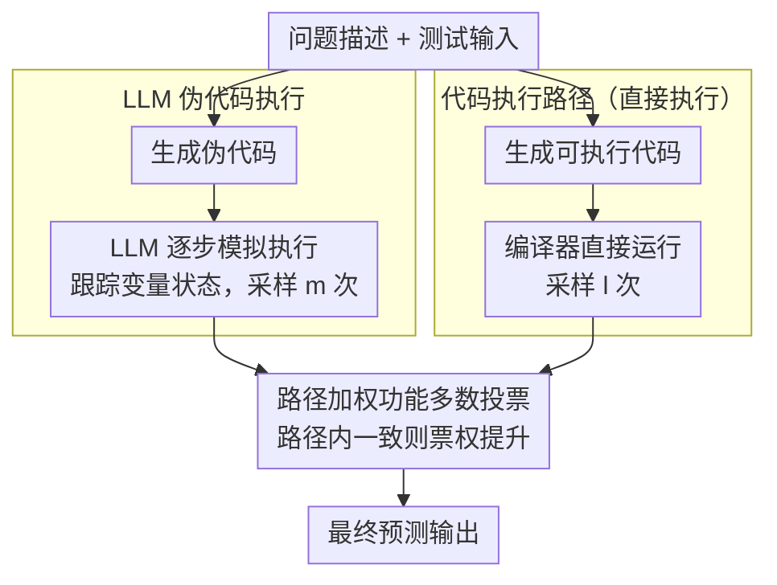

# DUET: Dual Execution for Test Output Prediction with Generated Code and Pseudocode

**会议**: ACL 2026  
**arXiv**: [2604.11514](https://arxiv.org/abs/2604.11514)  
**代码**: [GitHub](https://github.com/ldilab/DuET)  
**领域**: LLM安全  
**关键词**: 测试输出预测, 伪代码执行, 双路执行, 代码生成, 功能多数投票

## 一句话总结

本文提出 DUET，一个结合直接代码执行和 LLM 伪代码执行的双路框架，通过功能多数投票融合两种互补的执行路径——前者在代码正确时可靠但受实现错误影响，后者绕过实现细节但可能产生执行幻觉——在 LiveCodeBench 测试输出预测上提升 Pass@1 13.6 个百分点。

## 研究背景与动机

**领域现状**：测试用例生成是代码生成管道的关键环节，其中测试输出预测（给定问题描述和测试输入，预测正确输出）是一个需要精确程序推理的难题。TestChain 等方法通过先生成代码再直接执行来进行预测。

**现有痛点**：(1) 直接代码执行的致命问题——模型可能理解了正确的算法逻辑（能生成正确的伪代码）但在实现为可执行代码时引入了细微错误（如用 `len(nums)` 而非 `i+1` 来计算累积平均），导致执行失败或输出错误；(2) 在端到端代码生成中，用生成代码的执行结果来过滤候选程序存在"零优势问题"——如果生成的测试代码也有错，过滤就失效。

**核心矛盾**：直接代码执行依赖代码正确性（确定性但脆弱），LLM 推理不依赖代码但可能产生执行幻觉（灵活但不确定）——两者的失败模式互补。

**本文目标**：(1) 提出 LLM 伪代码执行来解耦正确逻辑和实现错误；(2) 设计双路框架 DUET 融合两种执行路径的互补优势。

**切入角度**：将"代码生成中的逻辑正确性"和"代码实现的正确性"解耦——伪代码捕获算法意图而不受语法细节约束，LLM 在伪代码上的模拟执行可以绕过实现错误。

**核心 idea**：测试输出预测的两种路径——直接执行（代码正确时可靠）和伪代码模拟执行（绕过实现错误但可能幻觉）——是天然互补的，通过功能多数投票可以利用两者的优势。

## 方法详解

### 整体框架

DUET 解决的是测试输出预测：给定问题描述和测试输入，预测程序应当输出什么。它的核心观察是，预测输出有两条失败模式互补的路径——一条是生成可执行代码再直接跑出结果，在代码写对时精确可靠，但常被细微实现错误带偏；另一条是生成伪代码再让 LLM 逐步模拟执行，绕开了实现细节却可能在复杂控制流上产生执行幻觉。DUET 让两条路径各采样多次，再用路径加权功能多数投票（path-weighted functional majority voting）把两批输出汇总成最终预测，从而吃到两边的长处。

### 关键设计

**1. LLM 伪代码执行（LLM-based pseudocode execution）：把"逻辑对不对"和"实现对不对"解耦**

直接执行最致命的问题是，模型其实懂正确的算法，却在落地成可运行代码时引入细微 bug——比如算累积平均时用了 `len(nums)` 而不是 `i+1`，逻辑没错但结果全错。论文把代码生成 $g$ 拆成两步 $g = t \circ p$：$p$ 先把问题描述写成高层伪代码、$t$ 再把伪代码翻译成可执行代码。直接执行走的是完整的 $g(d)=t\circ p(d)$，翻译步 $t$ 正是细微 bug 的来源；DUET 的伪代码路径则**跳过翻译步 $t$**，直接拿 $p(d)$ 让 LLM 做逐步模拟执行、跟踪变量状态一路推到输出。伪代码比自然语言精确、又比可执行代码宽容：它停留在更高的抽象层次，自然绕过了循环边界、变量名混淆这类专门坑直接执行的实现细节。这一路径还有个关键副产物——它的预测信号与生成代码的正确性**正交**：在 CODET 这类端到端管道里用预测输出过滤候选程序时，即便候选代码与测试代码一起出错（即"零优势问题"，TestChain 接入 CODET 后性能反降 5.6pp 的根源），伪代码路径仍能独立给出有效过滤信号，从而绕开这个陷阱。

**2. 双路执行 + 路径加权功能多数投票（path-weighted functional majority voting）：让互补的失败模式互相兜底**

两条路径的失败分布是错开的——代码执行栽在实现错误上，伪代码执行栽在深层嵌套循环的推理幻觉上。DUET 对代码执行和伪代码执行各采样 $l$、$m$ 次（实验中取 $l=m=5$），把全部输出收集起来，按功能等价性（而非字面相同）做多数投票：一个输出若在两条路径中都出现、或在总票数里占多数，就更可能是正确答案。普通多数投票之上，DUET 进一步引入**路径加权**——每条路径按其匹配输出数投票，若某条路径内所有有效输出**一致同意**同一结果，则该路径的票权从 $w_{base}$ 提升到 $w_{high}$，让"内部高度自洽"的那条路径在汇总时更有发言权。这样一来，某条路径在自己的弱项问题上即使集体跑偏，另一条路径的票仍能把结果拉回正轨，可靠性显著高于任何单路方法。

### 损失函数 / 训练策略

DUET 不涉及任何模型训练，直接用现成 LLM（如 Llama-3.1-8B-Instruct）推理。代码执行与伪代码执行各采样 5 次（合计 10 次调用），最终通过功能多数投票选出预测输出。

## 实验关键数据

### 主实验

**LiveCodeBench 测试输出预测**

| 方法 | Pass@1 | 相对提升 |
|------|--------|---------|
| Direct（仅代码执行） | 基线 | - |
| TestChain | +5.6pp | - |
| Pseudocode Exec | 竞争 | - |
| **DUET** | **+13.6pp** | **SOTA** |

**端到端代码生成（CODET 管道 + Llama-3.1-8B-Instruct）**

| 预测方法 | Pass@1 变化 |
|---------|-----------|
| 无过滤 | 基线 |
| TestChain | -5.6pp（零优势问题） |
| **DUET** | **+3.2pp** |

### 消融实验

**在 LiveCodeBench-Easy/BigCodeBench-Hard/DevEval/HumanEval(+) 上的端到端代码生成**

| 方法 | LCB-Easy | BCB-Hard | DevEval | HumanEval(+) |
|------|----------|----------|---------|---------------|
| DUET | **最佳** | **最佳** | **最佳** | **最佳** |

### 关键发现

- DUET 在测试输出预测上 +13.6pp，远超单路方法——两种路径的互补性得到充分验证
- TestChain 在 CODET 管道中反而降低性能 5.6pp，而 DUET 提升 3.2pp——零优势问题是实际部署中的关键障碍
- 实现错误和执行幻觉的分布互补：功能逻辑复杂的问题更易出现实现错误（伪代码路径更可靠），深层嵌套循环更易出现执行幻觉（代码执行更可靠）
- 伪代码的抽象层次使其天然比可执行代码更容错——即使逻辑相同，伪代码的"实现"更不容易出错

## 亮点与洞察

- 将"正确逻辑"和"正确实现"解耦是优雅的问题分析——伪代码执行正是这种解耦的自然产物
- 零优势问题的发现和解决对代码生成管道的实际部署有重要意义
- 功能多数投票是一种通用的融合策略，可扩展到更多执行路径

## 局限与展望

- 伪代码执行需要额外的 LLM 调用（2N 次 vs N 次），计算成本翻倍
- 在极复杂的算法问题上，伪代码和代码可能同时出错
- 伪代码的生成质量依赖 LLM 的元语言能力
- 未探索对伪代码执行进行专门训练以减少执行幻觉

## 相关工作与启发

- **vs TestChain**: TestChain 仅用直接代码执行，受零优势问题影响；DUET 的双路设计解决了这个问题
- **vs AlphaCode**: AlphaCode 仅关注测试输入生成，DUET 同时解决输出预测
- **vs CODET**: CODET 框架依赖准确的测试输出过滤，DUET 提供了更可靠的测试输出

## 评分

- 新颖性: ⭐⭐⭐⭐ 伪代码执行和双路融合的思路新颖，零优势问题的发现有价值
- 实验充分度: ⭐⭐⭐⭐⭐ 多个基准上的测试输出预测和端到端评估全面
- 写作质量: ⭐⭐⭐⭐⭐ 问题分析深入清晰，示例图解直观易懂
- 价值: ⭐⭐⭐⭐ 对代码生成管道中的测试预测有直接实用价值

<!-- RELATED:START -->

## 相关论文

- [\[ACL 2026\] CodeRL+: Improving Code Generation via Reinforcement with Execution Semantics Alignment](coderl_improving_code_generation_via_reinforcement_with_execution_semantics_alig.md)
- [\[ACL 2026\] PaT: Planning-after-Trial for Efficient Test-Time Code Generation](pat_planning-after-trial_for_efficient_test-time_code_generation.md)
- [\[ACL 2026\] SolidCoder: Bridging the Mental-Reality Gap in LLM Code Generation through Concrete Execution](solidcoder_bridging_the_mental-reality_gap_in_llm_code_generation_through_concre.md)
- [\[ICML 2026\] BoostAPR: Boosting Automated Program Repair via Execution-Grounded Reinforcement Learning with Dual Reward Models](../../ICML2026/code_intelligence/boostapr_boosting_automated_program_repair_via_execution-grounded_reinforcement_.md)
- [\[ACL 2026\] To Diff or Not to Diff? Structure-Aware and Adaptive Output Formats for Efficient LLM-based Code Editing](to_diff_or_not_to_diff_structure-aware_and_adaptive_output_formats_for_efficient.md)

<!-- RELATED:END -->
