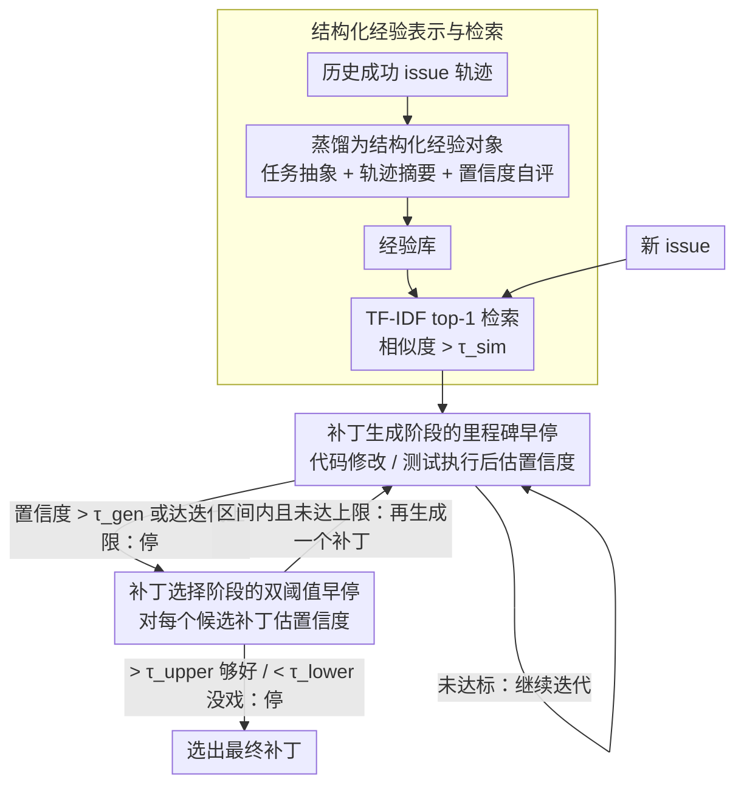

# EET: Experience-Driven Early Termination for Cost-Efficient Software Engineering Agents

**会议**: ACL 2026  
**arXiv**: [2601.05777](https://arxiv.org/abs/2601.05777)  
**代码**: [GitHub](https://github.com/IanWalls/EET)  
**领域**: 代码智能  
**关键词**: 软件工程Agent, 成本优化, 经验驱动, 早停策略, SWE-bench

## 一句话总结

提出 EET——一种基于历史经验驱动的早停方法，在补丁生成和补丁选择阶段识别无效迭代并提前终止，将 SE Agent 总成本降低 19%-55%（平均 32%），同时几乎不损失任务性能（最多 0.2%）。

## 研究背景与动机

**领域现状**：基于 LLM 的软件工程 (SE) Agent 在自动化 issue 修复方面取得了显著进展，如 Agentless、Mini-SWE-Agent、Trae Agent 等在 SWE-bench 上表现出色。

**现有痛点**：SE Agent 的高昂货币成本是实际部署的主要障碍（53% 的开发者认为成本是使用障碍）。由于"token 雪球"效应，对话历史越来越长导致成本超线性增长；对难题或不可解问题的无效迭代进一步放大浪费。

**核心矛盾**：现有成本优化方法（如 turn-control）虽能降低成本，但会显著损害任务性能（平均下降 10.7%）。如何在大幅降成本的同时保持性能是核心挑战。

**本文目标**：提出一种通用的早停优化方法，可无缝集成到各类 SE Agent 中，在保持任务性能的前提下显著降低成本。

**切入角度**：借鉴经验丰富的开发者能直接定位解决方案而无需大量试错的直觉，用结构化历史经验指导 Agent 跳过冗余迭代。

**核心 idea**：将历史 issue 解决经验提炼为结构化知识（任务抽象 + 轨迹摘要 + 置信度评估），在新任务的补丁生成和选择阶段用于判断是否可提前终止。

## 方法详解

### 整体框架

EET 想解决的是 SE Agent 在难题或不可解问题上反复无效迭代、把成本越烧越高的问题。它的灵感来自资深开发者——见多了就能直接定位解法、不必大量试错。EET 把历史 issue 的成功解决记录提炼成结构化经验存入经验库（离线侧），新任务到来时检索相关经验，在补丁生成和补丁选择两个阶段判断"是否已经够好、或已经没希望"，一旦满足条件就提前终止，从而在几乎不掉性能的前提下砍掉冗余迭代。

### 关键设计

**1. 结构化经验表示与检索：把噪声轨迹蒸成可复用的知识**

原始执行轨迹又长又吵、token 开销巨大，但简单粗暴地压缩又会丢掉有用信号。EET 为每条成功解决的 issue 构造一个结构化经验对象，包含 task_description（issue 抽象）、execution_summary（轨迹摘要）、evaluation_result（一律为 pass）、以及 confidence 和 confidence_reason（质量自评），只保留解对了的经验入库。新任务到来时用 TF-IDF 相似度（阈值 $\tau_{sim}$）检索相关经验。这种表示在信息密度和实用性之间取得平衡：既比原始轨迹紧凑得多，又保留了足以指导早停决策的关键线索。

**2. 补丁生成阶段的里程碑早停：在单次生成里及时收手**

单个补丁的生成过程中，质量信号可能在两个时刻冒出来——代码刚改完时（结构是否对齐）或测试刚跑完时（动态反馈是否通过）。EET 把"代码修改"和"测试执行"都定义为里程碑检查点，在每个里程碑后结合检索到的经验评估一个置信度分数，一旦超过阈值 $\tau^{gen}$ 就立刻终止本次生成。双里程碑设计同时覆盖了静态和动态两种信号来源，避免模型在已经成型的补丁上继续空转。

**3. 补丁选择阶段的双阈值早停：好就停、没戏也停**

固定生成 $k$ 个候选补丁再选最优是浪费的——简单问题一个就够，困难问题再多也无益。EET 每生成一个补丁，就结合补丁内容、执行轨迹和历史经验算一个置信度，并设上下两道闸：高于上阈值 $\tau^{sel}_{upper}$ 说明补丁已足够好，停；低于下阈值 $\tau^{sel}_{lower}$ 说明当前问题难以解决，也停。双阈值同时刻画了"够好了可以停"和"太难了该止损"两种场景，比只看一个阈值更贴合真实分布。

### 损失函数 / 训练策略

EET 为推理时优化方法，不涉及训练。关键超参数包括 TF-IDF 相似度阈值 $\tau_{sim}$、生成早停阈值 $\tau^{gen}$、选择上下阈值 $\tau^{sel}_{upper}$ / $\tau^{sel}_{lower}$，均在 SWE-bench 的 100 个独立验证样本上调优；经验库由 SWE-bench Lite（去重后 207 题）生成。

## 实验关键数据

### 主实验

| Agent + 后端 | 解决率变化 | API 调用 | 输入 Token | 输出 Token | 总成本变化 |
|-------------|-----------|---------|-----------|-----------|-----------|
| Agentless + GPT-5-mini | +7.8% | -26.4% | -51.8% | -51.0% | **-55.1%** |
| Agentless + DeepSeek-V3.2 | +7.2% | -25.5% | -31.9% | -35.0% | -32.2% |
| Mini-SWE + GPT-5-mini | +1.0% | -7.9% | -13.7% | -3.7% | -19.4% |
| Mini-SWE + DeepSeek-V3.2 | +0.6% | -8.4% | -13.6% | -4.4% | -19.3% |
| Trae + GPT-5-mini | 0.0% | -29.9% | -30.4% | -28.0% | -28.2% |
| Trae + DeepSeek-V3.2 | -0.2% | -26.5% | -37.7% | -28.2% | -36.7% |
| **平均** | **+2.7%** | **-20.8%** | **-29.9%** | **-25.1%** | **-31.8%** |

### 消融实验

| 变体 (Trae + GPT-5-mini) | 解决率变化 | 总成本变化 |
|--------------------------|-----------|-----------|
| 完整 EET | 0.0% | -28.2% |
| 去掉经验注入 | -10.4% | -58.9% |
| 去掉早停机制 | +0.4% | +3.1% |

### 关键发现

- EET 平均为 11.3% 的 issue 实现了早停（8.6%-14.0%），这部分 issue 的成本节约最为显著
- 对 Agentless 的提升最大（解决率反而提高 7.2-7.8%），因为经验指导弥补了其固定流程的不足
- 与 Turn-control 对比：Turn-control 虽成本降低更多（-41.4%），但解决率大幅下降（-10.7%）
- LLM 的置信度分数具有良好校准性：置信度 >90 的补丁通过率 63.6%-92.6%，<40 的仅 8.7%-13.8%
- 跨仓库迁移实验表明经验捕获的是通用调试模式而非仓库特异性线索

## 亮点与洞察

- 方法极其通用，可即插即用地集成到不同范式的 SE Agent 中（固定流程/自主规划/生成+选择）
- "经验"概念设计精妙：不是简单的 RAG 检索原始轨迹，而是提炼为含置信度评估的结构化知识
- 双阈值设计覆盖了"够好了可以停"和"太难了也该停"两种场景，比单阈值更合理
- 消融实验清晰揭示了经验注入和早停机制的互补关系

## 局限与展望

- 依赖历史数据构建经验库，对全新领域存在冷启动问题
- 仅在 SWE-bench Verified 上评估，工业场景的泛化性有待验证
- 早停决策依赖 LLM 的置信度输出，不同模型的校准质量可能差异较大
- 目前聚焦 SE Agent，但设计哲学（经验驱动早停）是领域无关的，可推广到通用多步推理 Agent

## 相关工作与启发

- 与 RAG-based agent memory（如 MetaGPT、MemoryBank）的区别：EET 的经验专门服务于成本优化，而非提升性能
- Fan et al. 的"token 雪球"分析揭示了成本问题的根源，EET 从经验复用角度提供了解决方案
- 对 Agent 系统设计的启示：成本优化应作为一等公民考虑，而非性能的附属品

## 评分

- 新颖性: ⭐⭐⭐⭐ 首次系统性地用经验驱动早停解决 SE Agent 成本问题，视角新颖实用
- 实验充分度: ⭐⭐⭐⭐⭐ 3 个 Agent × 2 个 LLM 后端，含基线对比、消融、跨仓库迁移分析
- 写作质量: ⭐⭐⭐⭐ 结构清晰，方法描述准确，实验设计全面

<!-- RELATED:START -->

## 相关论文

- [\[ICML 2025\] Training Software Engineering Agents and Verifiers with SWE-Gym](../../ICML2025/code_intelligence/training_software_engineering_agents_and_verifiers_with_swe-gym.md)
- [\[ICLR 2026\] Ambig-SWE: Interactive Agents to Overcome Underspecificity in Software Engineering](../../ICLR2026/code_intelligence/ambig-swe_interactive_agents_to_overcome_underspecificity_in_software_engineerin.md)
- [\[ACL 2026\] Taming System Complexity: Demystifying Software Engineering Agents in Diagnosing Linux Kernel Faults](taming_system_complexity_demystifying_software_engineering_agents_in_diagnosing_.md)
- [\[NeurIPS 2025\] SWE-rebench: An Automated Pipeline for Task Collection and Decontaminated Evaluation of Software Engineering Agents](../../NeurIPS2025/code_intelligence/swe-rebench_an_automated_pipeline_for_task_collection_and_decontaminated_evaluat.md)
- [\[ACL 2026\] CollabCoder: Plan-Code Co-Evolution via Collaborative Decision-Making for Efficient Code Generation](collabcoder_plan-code_co-evolution_via_collaborative_decision-making_for_efficie.md)

<!-- RELATED:END -->
